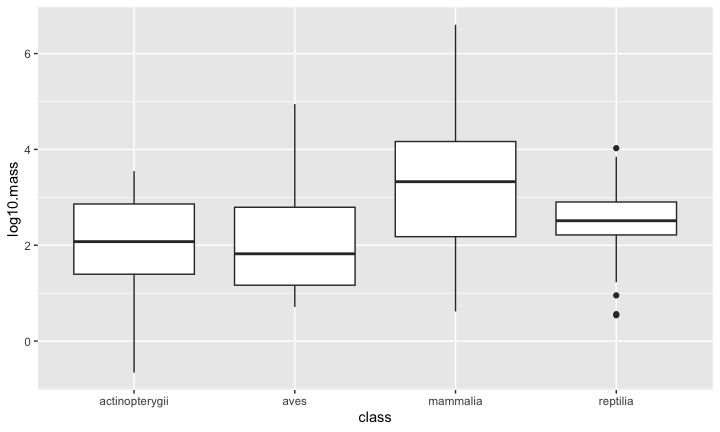

## Seating & Set-up
1. Please make sure that you sit next to your group members for the rest of the quarter.
2. Please set-up your computer as normal.

## Warm-up
1. Please load the homerange data `Tamburelloetal_HomeRangeDatabase.csv`

```
## ── Attaching packages ─────────────────────────────────────── tidyverse 1.3.2 ──
## ✔ ggplot2 3.4.0      ✔ purrr   1.0.0 
## ✔ tibble  3.1.8      ✔ dplyr   1.0.10
## ✔ tidyr   1.2.1      ✔ stringr 1.5.0 
## ✔ readr   2.1.3      ✔ forcats 0.5.2 
## ── Conflicts ────────────────────────────────────────── tidyverse_conflicts() ──
## ✖ dplyr::filter() masks stats::filter()
## ✖ dplyr::lag()    masks stats::lag()
```


```
##             taxon                      common.name          class
## 1     lake fishes                     american eel actinopterygii
## 2    river fishes               blacktail redhorse actinopterygii
## 3    river fishes              central stoneroller actinopterygii
## 4    river fishes                    rosyside dace actinopterygii
## 5    river fishes                    longnose dace actinopterygii
## 6    river fishes                     muskellunge  actinopterygii
## 7   marine fishes                          pollack actinopterygii
## 8   marine fishes                           saithe actinopterygii
## 9   marine fishes                lined surgeonfish actinopterygii
## 10  marine fishes          orangespine unicornfish actinopterygii
## 11  marine fishes            bluespine unicornfish actinopterygii
## 12  marine fishes                    redlip blenny actinopterygii
## 13  marine fishes                   giant trevally actinopterygii
## 14    lake fishes                        rock bass actinopterygii
## 15    lake fishes                     pumpkinseed  actinopterygii
## 16    lake fishes                        bluegill  actinopterygii
## 17   river fishes                  longear sunfish actinopterygii
## 18   river fishes                  smallmouth bass actinopterygii
## 19    lake fishes                  largemouth bass actinopterygii
## 20    lake fishes                    white crappie actinopterygii
## 21  marine fishes eastern triangular butterflyfish actinopterygii
## 22  marine fishes          Tahititan butterflyfish actinopterygii
## 23  marine fishes            chevron butterflyfish actinopterygii
## 24  marine fishes              melon butterflyfish actinopterygii
## 25  marine fishes           teardrop butterflyfish actinopterygii
## 26  marine fishes                         red moki actinopterygii
## 27  marine fishes              redspotted hawkfish actinopterygii
## 28  marine fishes                   dwarf hawkfish actinopterygii
## 29  marine fishes                          cabezon actinopterygii
## 30  marine fishes              japanese shrimpgoby actinopterygii
## 31  marine fishes                  bluebanded goby actinopterygii
## 32  marine fishes                       rusty goby actinopterygii
## 33  marine fishes                    blackeye goby actinopterygii
## 34  marine fishes                  longfinned goby actinopterygii
## 35  marine fishes                     bermuda chub actinopterygii
## 36  marine fishes                  spanish hogfish actinopterygii
## 37  marine fishes                  humphead wrasse actinopterygii
## 38  marine fishes     mediterranean rainbow wrasse actinopterygii
## 39  marine fishes                    slippery dick actinopterygii
## 40  marine fishes                yellowhead wrasse actinopterygii
## 41  marine fishes                     clown wrasse actinopterygii
## 42  marine fishes                  blackear wrasse actinopterygii
## 43  marine fishes        bluestreak cleaner wrasse actinopterygii
## 44  marine fishes                    ballan wrasse actinopterygii
## 45  marine fishes                     maori wrasse actinopterygii
## 46  marine fishes            california sheepshead actinopterygii
## 47  marine fishes                           cunner actinopterygii
## 48  marine fishes                  bluehead wrasse actinopterygii
## 49  marine fishes                      moon wrasse actinopterygii
## 50  marine fishes               thumbprint emperor actinopterygii
## 51  marine fishes                   mutton snapper actinopterygii
## 52  marine fishes             schoolmaster snapper actinopterygii
## 53  marine fishes                checkered snapper actinopterygii
## 54  marine fishes                     gray snapper actinopterygii
## 55  marine fishes               yellowtail snapper actinopterygii
## 56  marine fishes                  ocean whitefish actinopterygii
## 57  marine fishes                 european seabass actinopterygii
## 58  marine fishes                   white goatfish actinopterygii
## 59  marine fishes             whitesaddle goatfish actinopterygii
## 60    lake fishes                     yellow perch actinopterygii
## 61  marine fishes                    canary damsel actinopterygii
## 62  marine fishes                       cherubfish actinopterygii
## 63  marine fishes                       damselfish actinopterygii
## 64  marine fishes              twinspot damselfish actinopterygii
## 65  marine fishes              whitetail dascyllus actinopterygii
## 66  marine fishes                     wards damsel actinopterygii
## 67  marine fishes               australian gregory actinopterygii
## 68  marine fishes               bicolor damselfish actinopterygii
## 69  marine fishes                 cocoa damselfish actinopterygii
## 70  marine fishes             steephead parrotfish actinopterygii
## 71  marine fishes               striped parrotfish actinopterygii
## 72  marine fishes             rivulated parrotfish actinopterygii
## 73  marine fishes               redband parrotfish actinopterygii
## 74  marine fishes               redtail parrotfish actinopterygii
## 75  marine fishes                redfin parrotfish actinopterygii
## 76  marine fishes             stoplight parrotfish actinopterygii
## 77  marine fishes                     peacock hind actinopterygii
## 78  marine fishes                          graysby actinopterygii
## 79  marine fishes                   yellowfin hind actinopterygii
## 80  marine fishes                       coral hind actinopterygii
## 81  marine fishes                         red hind actinopterygii
## 82  marine fishes                    dusky grouper actinopterygii
## 83  marine fishes                      red grouper actinopterygii
## 84  marine fishes                   nassau grouper actinopterygii
## 85  marine fishes                   greasy grouper actinopterygii
## 86  marine fishes                  redbanded perch actinopterygii
## 87  marine fishes             half-banded seaperch actinopterygii
## 88  marine fishes                    black grouper actinopterygii
## 89  marine fishes                        kelp bass actinopterygii
## 90  marine fishes                 barred sand bass actinopterygii
## 91  marine fishes                    coral grouper actinopterygii
## 92  marine fishes                      coral trout actinopterygii
## 93  marine fishes                           comber actinopterygii
## 94  marine fishes                   painted comber actinopterygii
## 95  marine fishes                           salema actinopterygii
## 96  marine fishes                gilthead seabream actinopterygii
## 97   river fishes                  cutthroat trout actinopterygii
## 98   river fishes                       gila trout actinopterygii
## 99   river fishes                    rainbow trout actinopterygii
## 100  river fishes                  atlantic salmon actinopterygii
## 101   lake fishes                      brown trout actinopterygii
## 102  river fishes                  mottled sculpin actinopterygii
## 103  river fishes                   banded sculpin actinopterygii
## 104  river fishes                         sculpin  actinopterygii
## 105 marine fishes                  copper rockfish actinopterygii
## 106 marine fishes          japanese black rockfish actinopterygii
## 107 marine fishes               quillback rockfish actinopterygii
## 108 marine fishes                   black rockfish actinopterygii
## 109 marine fishes                    blue rockfish actinopterygii
## 110   lake fishes                  yellow bullhead actinopterygii
## 111 marine fishes            long-snouted seahorse actinopterygii
## 112 marine fishes                    worm pipefish actinopterygii
## 113 marine fishes        atlantic sharpnose puffer actinopterygii
## 114         birds                     golden eagle           aves
## 115         birds                   common buzzard           aves
## 116         birds           short-toed snake eagle           aves
## 117         birds                  Bonelli's eagle           aves
## 118         birds                     booted eagle           aves
## 119         birds                 Egyptian vulture           aves
## 120         birds                          gadwall           aves
## 121         birds              northern brown kiwi           aves
## 122         birds                European nightjar           aves
## 123         birds                    oystercatcher           aves
## 124         birds                        inca dove           aves
## 125         birds               common wood pigeon           aves
## 126         birds             European turtle dove           aves
## 127         birds                  European roller           aves
## 128         birds                           hoopoe           aves
## 129         birds             great spotted cuckoo           aves
## 130         birds                    common cuckoo           aves
## 131         birds               greater roadrunner           aves
## 132         birds             banded ground-cuckoo           aves
## 133         birds                    Cooper's hawk           aves
## 134         birds                 Northern goshawk           aves
## 135         birds             Eurasian sparrowhawk           aves
## 136         birds               sharp-shinned hawk           aves
## 137         birds                  red-tailed hawk           aves
## 138         birds              red-shouldered hawk           aves
## 139         birds                  Swainson's hawk           aves
## 140         birds                      hen harrier           aves
## 141         birds                Montagu's harrier           aves
## 142         birds                         red kite           aves
## 143         birds                         caracara           aves
## 144         birds            red-throated caracara           aves
## 145         birds                    lanner falcon           aves
## 146         birds                   prairie falcon           aves
## 147         birds                 peregrine falcon           aves
## 148         birds                 American kestrel           aves
## 149         birds                 European kestrel           aves
## 150         birds                     hazel grouse           aves
## 151         birds                      sage grouse           aves
## 152         birds                     dusky grouse           aves
## 153         birds                 willow ptarmigan           aves
## 154         birds                   grey partridge           aves
## 155         birds                     black grouse           aves
## 156         birds             western capercaillie           aves
## 157         birds          greater prairie-chicken           aves
## 158         birds                  brown wood rail           aves
## 159         birds                        corncrake           aves
## 160         birds                        king rail           aves
## 161         birds                melodious warbler           aves
## 162         birds                  long-tailed tit           aves
## 163         birds                         woodlark           aves
## 164         birds         red-throated ant tanager           aves
## 165         birds          red-crowned ant tanager           aves
## 166         birds             Eurasian treecreeper           aves
## 167         birds         streaked fantail warbler           aves
## 168         birds                     common raven           aves
## 169         birds               spotted nutcracker           aves
## 170         birds             Peruvian plantcutter           aves
## 171         birds              grasshopper sparrow           aves
## 172         birds                   indigo bunting           aves
## 173         birds                   Abert's towhee           aves
## 174         birds                    canyon towhee           aves
## 175         birds            American tree sparrow           aves
## 176         birds                 chipping sparrow           aves
## 177         birds                    common linnet           aves
## 178         birds                 common chaffinch           aves
## 179         birds                   European serin           aves
## 180         birds               eastern meadowlark           aves
## 181         birds               western meadowlard           aves
## 182         birds             yellow-breasted chat           aves
## 183         birds                red-backed shrike           aves
## 184         birds                loggerhead shrike           aves
## 185         birds               lesser grey shrike           aves
## 186         birds                  woodchat shrike           aves
## 187         birds             northern mockingbird           aves
## 188         birds                    white wagtail           aves
## 189         birds           western yellow wagtail           aves
## 190         birds               spotted flycatcher           aves
## 191         birds                northern wheatear           aves
## 192         birds                  common redstart           aves
## 193         birds                         whinchat           aves
## 194         birds           black-capped chickadee           aves
## 195         birds               Carolina chickadee           aves
## 196         birds                     Oak titmouse           aves
## 197         birds                        marsh tit           aves
## 198         birds                 mourning warbler           aves
## 199         birds              common yellowthroat           aves
## 200         birds             prothonotary warbler           aves
## 201         birds                         ovenbird           aves
## 202         birds             Blackburnian warbler           aves
## 203         birds               Kirtland's warbler           aves
## 204         birds                 magnolia warbler           aves
## 205         birds           chestnut-sided warbler           aves
## 206         birds          American yellow warbler           aves
## 207         birds                American redstart           aves
## 208         birds     black-throated green warbler           aves
## 209         birds                   Canada warbler           aves
## 210         birds        Western Bonelli's warbler           aves
## 211         birds           tooth-billed bowerbird           aves
## 212         birds                 common firecrest           aves
## 213         birds                        goldcrest           aves
## 214         birds                European nuthatch           aves
## 215         birds                          wrentit           aves
## 216         birds                Marmora's warbler           aves
## 217         birds                 Dartford warbler           aves
## 218         birds                   Berwick's wren           aves
## 219         birds                    Carolina wren           aves
## 220         birds                       house wren           aves
## 221         birds                    Eurasian wren           aves
## 222         birds                 eastern bluebird           aves
## 223         birds               eastern wood pewee           aves
## 224         birds                 least flycatcher           aves
## 225         birds         American gray flycatcher           aves
## 226         birds                 eastern kingbird           aves
## 227         birds               black-capped vireo           aves
## 228         birds                     Bell's vireo           aves
## 229         birds                 white-eyed vireo           aves
## 230         birds                   red-eyed vireo           aves
## 231         birds                    great bittern           aves
## 232         birds                    least bittern           aves
## 233         birds                 black woodpecker           aves
## 234         birds                 Eurasian wryneck           aves
## 235         birds          white-backed woodpecker           aves
## 236         birds       middle spotted woodpeckers           aves
## 237         birds   Eurasian three-toed woodpecker           aves
## 238         birds           grey-headed woodpecker           aves
## 239         birds        European green woodpecker           aves
## 240         birds                           kakapo           aves
## 241         birds                     greater rhea           aves
## 242         birds                      lesser rhea           aves
## 243         birds                       boreal owl           aves
## 244         birds                   long-eared owl           aves
## 245         birds                       little owl           aves
## 246         birds               Eurasian eagle-owl           aves
## 247         birds                 great horned owl           aves
## 248         birds               Eurasian pygmy owl           aves
## 249         birds                        snowy owl           aves
## 250         birds                        tawny owl           aves
## 251         birds                         barn owl           aves
## 252         birds                          ostrich           aves
## 253         birds                   ornate tinamou           aves
## 254       mammals                giant golden mole       mammalia
## 255       mammals              Grant's golden mole       mammalia
## 256       mammals                        pronghorn       mammalia
## 257       mammals                           impala       mammalia
## 258       mammals                       hartebeest       mammalia
## 259       mammals                    barbary sheep       mammalia
## 260       mammals                   American bison       mammalia
## 261       mammals                   European bison       mammalia
## 262       mammals                             goat       mammalia
## 263       mammals                     Spanish ibex       mammalia
## 264       mammals                   Peter's dukier       mammalia
## 265       mammals                       bay dikier       mammalia
## 266       mammals                 mountain gazelle       mammalia
## 267       mammals             G\xfcnther's dik-dik       mammalia
## 268       mammals                    mountain goat       mammalia
## 269       mammals                           argali       mammalia
## 270       mammals                    bighorn sheep       mammalia
## 271       mammals                         steenbok       mammalia
## 272       mammals                          chamois       mammalia
## 273       mammals                     common eland       mammalia
## 274       mammals                         bushbuck       mammalia
## 275       mammals                     greater kudu       mammalia
## 276       mammals                            moose       mammalia
## 277       mammals                           chital       mammalia
## 278       mammals                         roe deer       mammalia
## 279       mammals                         red deer       mammalia
## 280       mammals                        sika deer       mammalia
## 281       mammals                      fallow deer       mammalia
## 282       mammals                 Reeves's muntjac       mammalia
## 283       mammals                        mule deer       mammalia
## 284       mammals                white-tailed deer       mammalia
## 285       mammals                      pampas deer       mammalia
## 286       mammals                             pudu       mammalia
## 287       mammals                         reindeer       mammalia
## 288       mammals                          giraffe       mammalia
## 289       mammals                            okapi       mammalia
## 290       mammals                   desert warthog       mammalia
## 291       mammals                  Chacoan peccary       mammalia
## 292       mammals                 collared peccary       mammalia
## 293       mammals             white-lipped peccary       mammalia
## 294       mammals                 water chevrotain       mammalia
## 295       mammals                        red panda       mammalia
## 296       mammals                       arctic fox       mammalia
## 297       mammals                   Ethiopian wolf       mammalia
## 298       mammals                           culpeo       mammalia
## 299       mammals          South American gray fox       mammalia
## 300       mammals                          kit fox       mammalia
## 301       mammals                     Ruppel's fox       mammalia
## 302       mammals                        swift fox       mammalia
## 303       mammals   thick-tailed three-toed jerboa       mammalia
## 304       mammals                            fossa       mammalia
## 305       mammals                          cheetah       mammalia
## 306       mammals                          caracal       mammalia
## 307       mammals                              cat       mammalia
## 308       mammals                          wildcat       mammalia
## 309       mammals                       jaguarundi       mammalia
## 310       mammals                           ocelot       mammalia
## 311       mammals                           margay       mammalia
## 312       mammals                           serval       mammalia
## 313       mammals                      Canada lynx       mammalia
## 314       mammals                    Eurasian lynx       mammalia
## 315       mammals                     Iberian lynx       mammalia
## 316       mammals                           bobcat       mammalia
## 317       mammals                   Geoffroy's cat       mammalia
## 318       mammals                           jaguar       mammalia
## 319       mammals                          leopard       mammalia
## 320       mammals                            tiger       mammalia
## 321       mammals                      leopard cat       mammalia
## 322       mammals                           cougar       mammalia
## 323       mammals                     snow leopard       mammalia
## 324       mammals                   marsh mongoose       mammalia
## 325       mammals                  yellow mongoose       mammalia
## 326       mammals            common dwarf mongoose       mammalia
## 327       mammals                Egyptian mongoose       mammalia
## 328       mammals            white-tailed mongoose       mammalia
## 329       mammals                         aardwolf       mammalia
## 330       mammals                            tayra       mammalia
## 331       mammals                   greater grison       mammalia
## 332       mammals                        wolverine       mammalia
## 333       mammals                  American marten       mammalia
## 334       mammals                     beech marten       mammalia
## 335       mammals             European pine marten       mammalia
## 336       mammals                           fisher       mammalia
## 337       mammals                            stoat       mammalia
## 338       mammals               long-tailed weasel       mammalia
## 339       mammals                           ferret       mammalia
## 340       mammals                    European mink       mammalia
## 341       mammals              black-footed ferret       mammalia
## 342       mammals                     least weasel       mammalia
## 343       mammals                  Siberian weasel       mammalia
## 344       mammals                  American badger       mammalia
## 345       mammals                         kinkajou       mammalia
## 346       mammals                      giant panda       mammalia
## 347       mammals                       sloth bear       mammalia
## 348       mammals                     common genet       mammalia
## 349       mammals                       cape genet       mammalia
## 350       mammals               large indian civet       mammalia
## 351       mammals                    Western quoll       mammalia
## 352       mammals                      tiger quoll       mammalia
## 353       mammals             white-footed dunnart       mammalia
## 354       mammals                 brown antechinus       mammalia
## 355       mammals   Northern three-striped opossum       mammalia
## 356       mammals       elegant fat-tailed opossum       mammalia
## 357       mammals         Lumholtz's tree-kangaroo       mammalia
## 358       mammals              antilopine kangaroo       mammalia
## 359       mammals            black-striped wallaby       mammalia
## 360       mammals            Western grey kangaroo       mammalia
## 361       mammals            Eastern grey kangaroo       mammalia
## 362       mammals                  common wallaroo       mammalia
## 363       mammals               red-necked wallaby       mammalia
## 364       mammals                     red kangaroo       mammalia
## 365       mammals              allied rock-wallaby       mammalia
## 366       mammals                  eastern bettong       mammalia
## 367       mammals              long-footed potoroo       mammalia
## 368       mammals                   greater glider       mammalia
## 369       mammals        bridled nail-tail wallaby       mammalia
## 370       mammals             red-legged pademelon       mammalia
## 371       mammals             red-necked pademelon       mammalia
## 372       mammals                    swamp wallaby       mammalia
## 373       mammals          common brushtail possum       mammalia
## 374       mammals      northern hairy-nosed wombat       mammalia
## 375       mammals                    common wombat       mammalia
## 376       mammals                European hedgehog       mammalia
## 377       mammals              long-eared hedgehog       mammalia
## 378       mammals                     pygmy rabbit       mammalia
## 379       mammals                    snowshoe hare       mammalia
## 380       mammals                      Arctic hare       mammalia
## 381       mammals          black-tailed jackrabbit       mammalia
## 382       mammals                        cape hare       mammalia
## 383       mammals                    European hare       mammalia
## 384       mammals                      Indian hare       mammalia
## 385       mammals                    mountain hare       mammalia
## 386       mammals                  European rabbit       mammalia
## 387       mammals                     swamp rabbit       mammalia
## 388       mammals               eastern cottontail       mammalia
## 389       mammals                     marsh rabbit       mammalia
## 390       mammals                     plateau pika       mammalia
## 391       mammals                    American pika       mammalia
## 392       mammals            rufous elephant shrew       mammalia
## 393       mammals         four-toed elephant shrew       mammalia
## 394       mammals     golden-rumped elephant shrew       mammalia
## 395       mammals            east African mole rat       mammalia
## 396       mammals                 golden bandicoot       mammalia
## 397       mammals         Southern brown bandicoot       mammalia
## 398       mammals                            horse       mammalia
## 399       mammals                 white rhinoceros       mammalia
## 400       mammals                 black rhinoceros       mammalia
## 401       mammals                      maned sloth       mammalia
## 402       mammals                   Asian elephant       mammalia
## 403       mammals            African bush elephant       mammalia
## 404       mammals       southern grasshopper mouse       mammalia
## 405       mammals                  mountain beaver       mammalia
## 406       mammals               cape dune mole rat       mammalia
## 407       mammals              Damaraland mole rat       mammalia
## 408       mammals                  common mole rat       mammalia
## 409       mammals                    cape mole rat       mammalia
## 410       mammals                 silvery mole rat       mammalia
## 411       mammals                   naked mole rat       mammalia
## 412       mammals                  Patagonian mara       mammalia
## 413       mammals                  plains viscacha       mammalia
## 414       mammals          western red-backed vole       mammalia
## 415       mammals            large-headed rice rat       mammalia
## 416       mammals           Siberian brown lemming       mammalia
## 417       mammals                       field vole       mammalia
## 418       mammals                  California vole       mammalia
## 419       mammals                     montane vole       mammalia
## 420       mammals                     prairie vole       mammalia
## 421       mammals                      meadow vole       mammalia
## 422       mammals                    woodland vole       mammalia
## 423       mammals                       water vole       mammalia
## 424       mammals                     wood lemming       mammalia
## 425       mammals             bushy-tailed woodrat       mammalia
## 426       mammals             dusky-footed woodrat       mammalia
## 427       mammals                   desert woodrat       mammalia
## 428       mammals          Southern plains woodrat       mammalia
## 429       mammals                          muskrat       mammalia
## 430       mammals                     cotton mouse       mammalia
## 431       mammals         salt marsh harvest mouse       mammalia
## 432       mammals             southern bog lemming       mammalia
## 433       mammals          dwarf fat-tailed jerboa       mammalia
## 434       mammals               Cuvier's spiny rat       mammalia
## 435       mammals                 Tome's spiny rat       mammalia
## 436       mammals              Brazilian porcupine       mammalia
## 437       mammals         North American porcupine       mammalia
## 438       mammals            Botta's pocket gopher       mammalia
## 439       mammals              spectacled dormouse       mammalia
## 440       mammals                   hazel dormouse       mammalia
## 441       mammals               giant kangaroo rat       mammalia
## 442       mammals           Merriam's kangaroo rat       mammalia
## 443       mammals               Ord's kangaroo rat       mammalia
## 444       mammals       banner-tailed kangaroo rat       mammalia
## 445       mammals           Stephen's kangaroo rat       mammalia
## 446       mammals                   cape porcupine       mammalia
## 447       mammals         Indian crested porcupine       mammalia
## 448       mammals   African brush-tailed porcupine       mammalia
## 449       mammals              yellow-necked mouse       mammalia
## 450       mammals                       wood mouse       mammalia
## 451       mammals               Indian desert jird       mammalia
## 452       mammals              broad-toothed mouse       mammalia
## 453       mammals               Malagasy giant rat       mammalia
## 454       mammals         White-bellied\xa0nesomys       mammalia
## 455       mammals                     island mouse       mammalia
## 456       mammals                           coruro       mammalia
## 457       mammals                Siberian chipmunk       mammalia
## 458       mammals           Northern parl squirrel       mammalia
## 459       mammals         Northern flying squirrel       mammalia
## 460       mammals         Southern flying squirrel       mammalia
## 461       mammals            yellow-bellied marmot       mammalia
## 462       mammals                        groundhog       mammalia
## 463       mammals                red bush squirrel       mammalia
## 464       mammals                 Abert's squirrel       mammalia
## 465       mammals            eastern gray squirrel       mammalia
## 466       mammals                Japanese squirrel       mammalia
## 467       mammals                     fox squirrel       mammalia
## 468       mammals                     red squirrel       mammalia
## 469       mammals       California ground squirrel       mammalia
## 470       mammals        Columbian ground squirrel       mammalia
## 471       mammals       Franklin's ground squirrel       mammalia
## 472       mammals           arctic ground squirrel       mammalia
## 473       mammals          spotted ground squirrel       mammalia
## 474       mammals   thirteen-lined ground squirrel       mammalia
## 475       mammals                    rock squirrel       mammalia
## 476       mammals             yellow-pine chipmunk       mammalia
## 477       mammals                   least chipmunk       mammalia
## 478       mammals                Colorado chipmunk       mammalia
## 479       mammals                   Uinta chipmunk       mammalia
## 480       mammals            American red squirrel       mammalia
## 481       mammals          striped ground squirrel       mammalia
## 482       mammals       greater white-footed shrew       mammalia
## 483       mammals                     arctic shrew       mammalia
## 484       mammals                   cinereus shrew       mammalia
## 485       mammals                    crowned shrew       mammalia
## 486       mammals                    slender shrew       mammalia
## 487       mammals                long-clawed shrew       mammalia
## 488       mammals                  star-nosed mole       mammalia
## 489       mammals                     eastern mole       mammalia
## 490       mammals                    European mole       mammalia
## 491       mammals                       Roman mole       mammalia
## 492       lizards                spiny tail lizard       reptilia
## 493        snakes               western worm snake       reptilia
## 494        snakes               eastern worm snake       reptilia
## 495        snakes                            racer       reptilia
## 496        snakes             yellow bellied racer       reptilia
## 497        snakes                   ringneck snake       reptilia
## 498        snakes             eastern indigo snake       reptilia
## 499        snakes            great plains ratsnake       reptilia
## 500        snakes                 western ratsnake       reptilia
## 501        snakes                    hognose snake       reptilia
## 502        snakes               European whipsnake       reptilia
## 503        snakes                Eastern kingsnake       reptilia
## 504        snakes                        milksnake       reptilia
## 505        snakes                        coachwhip       reptilia
## 506        snakes                      grass snake       reptilia
## 507        snakes           copperbelly watersnake       reptilia
## 508        snakes              Northern watersnake       reptilia
## 509        snakes               redbacked ratsnake       reptilia
## 510        snakes                     gopher snake       reptilia
## 511        snakes                       pine snake       reptilia
## 512        snakes             butlers garter snake       reptilia
## 513        snakes              giant garter snakes       reptilia
## 514        snakes                Aesculapian snake       reptilia
## 515        snakes                broadheaded snake       reptilia
## 516        snakes                      tiger snake       reptilia
## 517        snakes                       blacksnake       reptilia
## 518       lizards            Galapagos land iguana       reptilia
## 519       lizards           Bahamian Andros iguana       reptilia
## 520       lizards                      blue iguana       reptilia
## 521       lizards            Anegada ground iguana       reptilia
## 522       lizards          Angel island chuckwalla       reptilia
## 523       lizards                common chuckwalla       reptilia
## 524       lizards                    desert iguana       reptilia
## 525       lizards                  Tenerife lizard       reptilia
## 526       lizards             High Mountain Lizard       reptilia
## 527        snakes       southwestern carpet python       reptilia
## 528       lizards                      land mullet       reptilia
## 529        snakes                       copperhead       reptilia
## 530        snakes                      cottonmouth       reptilia
## 531        snakes              namaqua dwarf adder       reptilia
## 532        snakes                     fer-de-lance       reptilia
## 533        snakes              western diamondback       reptilia
## 534        snakes                       sidewinder       reptilia
## 535        snakes               timber rattlesnake       reptilia
## 536        snakes          blacktailed rattlesnake       reptilia
## 537        snakes         midget faded rattlesnake       reptilia
## 538        snakes         twin-spotted rattlesnake       reptilia
## 539        snakes               Mojave rattlesnake       reptilia
## 540        snakes                tiger rattlesnake       reptilia
## 541        snakes                chinese pit viper       reptilia
## 542        snakes                   Armenian viper       reptilia
## 543        snakes                  snubnosed viper       reptilia
## 544       turtles       Eastern long-necked turtle       reptilia
## 545       turtles      Dalh's toad-headed tortoise       reptilia
## 546       turtles           common snapping turtle       reptilia
## 547       turtles           midland painted turtle       reptilia
## 548       turtles                   chicken turtle       reptilia
## 549       turtles                Blanding's turtle       reptilia
## 550       turtles             European pond turtle       reptilia
## 551       turtles       yellow-blotched map turtle       reptilia
## 552       turtles                ornate box turtle       reptilia
## 553       turtles              Spanish pond turtle       reptilia
## 554       turtles               Eastern mud turtle       reptilia
## 555       turtles        stripe-necked musk turtle       reptilia
## 556       turtles                  stinkpot turtle       reptilia
## 557     tortoises              red-footed tortoise       reptilia
## 558     tortoises                  desert tortoise       reptilia
## 559     tortoises                  gopher tortoise       reptilia
## 560     tortoises              travancore tortoise       reptilia
## 561     tortoises    Speke's hinge-backed tortoise       reptilia
## 562     tortoises               impressed tortoise       reptilia
## 563     tortoises        bushmanland tent tortoise       reptilia
## 564     tortoises                 leopard tortoise       reptilia
## 565     tortoises            spur-thighed tortoise       reptilia
## 566     tortoises           mediterranean tortoise       reptilia
## 567     tortoises          Russian steppe tortoise       reptilia
## 568     tortoises                Egyptian tortoise       reptilia
## 569       turtles   Eastern spiny softshell turtle       reptilia
##                     order            family           genus
## 1          anguilliformes       anguillidae        anguilla
## 2           cypriniformes      catostomidae       moxostoma
## 3           cypriniformes        cyprinidae      campostoma
## 4           cypriniformes        cyprinidae     clinostomus
## 5           cypriniformes        cyprinidae     rhinichthys
## 6             esociformes          esocidae            esox
## 7              gadiformes           gadidae      pollachius
## 8              gadiformes           gadidae      pollachius
## 9             perciformes      acanthuridae      acanthurus
## 10            perciformes      acanthuridae            naso
## 11            perciformes      acanthuridae            naso
## 12            perciformes         blennidae   ophioblennius
## 13            perciformes        carangidae          caranx
## 14            perciformes     centrarchidae     ambloplites
## 15            perciformes     centrarchidae         lepomis
## 16            perciformes     centrarchidae         lepomis
## 17            perciformes     centrarchidae         lepomis
## 18            perciformes     centrarchidae     micropterus
## 19            perciformes     centrarchidae     micropterus
## 20            perciformes     centrarchidae         pomoxis
## 21            perciformes    chaetodontidae       chaetodon
## 22            perciformes    chaetodontidae       chaetodon
## 23            perciformes    chaetodontidae       chaetodon
## 24            perciformes    chaetodontidae       chaetodon
## 25            perciformes    chaetodontidae       chaetodon
## 26            perciformes  cheilodactylidae  cheilodactylus
## 27            perciformes       cirrhitidae  amblycirrhitus
## 28            perciformes       cirrhitidae  cirrhitichthys
## 29            perciformes          cottidae scorpaenichthys
## 30            perciformes          gobiidae   amblyeleotris
## 31            perciformes          gobiidae      lythrypnus
## 32            perciformes          gobiidae       priolepis
## 33            perciformes          gobiidae    rhinogobiops
## 34            perciformes          gobiidae    valenciennea
## 35            perciformes        kyphosidae        kyphosus
## 36            perciformes          labridae        bodianus
## 37            perciformes          labridae        chelinus
## 38            perciformes          labridae           coris
## 39            perciformes          labridae     halichoeres
## 40            perciformes          labridae     halichoeres
## 41            perciformes          labridae     halichoeres
## 42            perciformes          labridae     halichoeres
## 43            perciformes          labridae       labroides
## 44            perciformes          labridae          labrus
## 45            perciformes          labridae   opthalmolepis
## 46            perciformes          labridae   semicossyphus
## 47            perciformes          labridae   tautogolabrus
## 48            perciformes          labridae      thalassoma
## 49            perciformes          labridae      thalassoma
## 50            perciformes       lethrinidae       lethrinus
## 51            perciformes        lutjanidae        lutjanus
## 52            perciformes        lutjanidae        lutjanus
## 53            perciformes        lutjanidae        lutjanus
## 54            perciformes        lutjanidae        lutjanus
## 55            perciformes        lutjanidae         ocyurus
## 56            perciformes     malacanthidae    caulolatilus
## 57            perciformes         moronidae   dicentrarchus
## 58            perciformes          mullidae  mulloidichthys
## 59            perciformes          mullidae      parupeneus
## 60            perciformes          percidae           perca
## 61            perciformes     pomacanthidae       abudefduf
## 62            perciformes     pomacanthidae      centropyge
## 63            perciformes     pomacentridae         chromis
## 64            perciformes     pomacentridae     chrysiptera
## 65            perciformes     pomacentridae       dascyllus
## 66            perciformes     pomacentridae     pomacentrus
## 67            perciformes     pomacentridae       stegastes
## 68            perciformes     pomacentridae       stegastes
## 69            perciformes     pomacentridae       stegastes
## 70            perciformes          scaridae       chlorurus
## 71            perciformes          scaridae          scarus
## 72            perciformes          scaridae          scarus
## 73            perciformes          scaridae       sparisoma
## 74            perciformes          scaridae       sparisoma
## 75            perciformes          scaridae       sparisoma
## 76            perciformes          scaridae       sparisoma
## 77            perciformes        serranidae   cephalopholis
## 78            perciformes        serranidae   cephalopholis
## 79            perciformes        serranidae   cephalopholis
## 80            perciformes        serranidae   cephalopholis
## 81            perciformes        serranidae     epinephelus
## 82            perciformes        serranidae     epinephelus
## 83            perciformes        serranidae     epinephelus
## 84            perciformes        serranidae     epinephelus
## 85            perciformes        serranidae     epinephelus
## 86            perciformes        serranidae  hypoplectrodes
## 87            perciformes        serranidae  hypoplectrodes
## 88            perciformes        serranidae    mycteroperca
## 89            perciformes        serranidae      paralabrax
## 90            perciformes        serranidae      paralabrax
## 91            perciformes        serranidae    plectropomus
## 92            perciformes        serranidae    plectropomus
## 93            perciformes        serranidae        serranus
## 94            perciformes        serranidae        serranus
## 95            perciformes          sparidae           sarpa
## 96            perciformes          sparidae          sparus
## 97          salmoniformes        salmonidae    oncorhynchus
## 98          salmoniformes        salmonidae    oncorhynchus
## 99          salmoniformes        salmonidae    oncorhynchus
## 100         salmoniformes        salmonidae           salmo
## 101         salmoniformes        salmonidae           salmo
## 102       scorpaeniformes          cottidae          cottus
## 103       scorpaeniformes          cottidae          cottus
## 104       scorpaeniformes          cottidae          cottus
## 105       scorpaeniformes        sebastidae        sebastes
## 106       scorpaeniformes        sebastidae        sebastes
## 107       scorpaeniformes        sebastidae        sebastes
## 108       scorpaeniformes        sebastidae        sebastes
## 109       scorpaeniformes        sebastidae        sebastes
## 110          siluriformes       ictaluridae       ictalurus
## 111       syngnathiformes      syngnathidae     hippocampus
## 112       syngnathiformes      syngnathidae        nerophis
## 113 tetraodontiformes\xa0    tetraodontidae    canthigaster
## 114       accipitriformes      accipitridae          aquila
## 115       accipitriformes      accipitridae           buteo
## 116       accipitriformes      accipitridae       circaetus
## 117       accipitriformes      accipitridae      hieraaetus
## 118       accipitriformes      accipitridae      hieraaetus
## 119       accipitriformes      accipitridae        neophron
## 120          anseriformes          anatidae            anas
## 121        apterygiformes       apterygidae         apteryx
## 122      caprimulgiformes     caprimulgidae     caprimulgus
## 123       charadriiformes    haematopodidae      haematopus
## 124         columbidormes        columbidae     scardafella
## 125         columbiformes        columbidae         columba
## 126         columbiformes        columbidae    streptopelia
## 127         coraciiformes        coraciidae        coracias
## 128         coraciiformes          upupidae           upupa
## 129          cuculiformes         cuculidae        clamator
## 130          cuculiformes         cuculidae         cuculus
## 131          cuculiformes         cuculidae       geococcyx
## 132          cuculiformes         cuculidae     neopmorphus
## 133         falconiformes      accipitridae       accipiter
## 134         falconiformes      accipitridae       accipiter
## 135         falconiformes      accipitridae       accipiter
## 136         falconiformes      accipitridae       accipiter
## 137         falconiformes      accipitridae           buteo
## 138         falconiformes      accipitridae           buteo
## 139         falconiformes      accipitridae           buteo
## 140         falconiformes      accipitridae          circus
## 141         falconiformes      accipitridae          circus
## 142         falconiformes      accipitridae          milvus
## 143         falconiformes        falconidae        caracara
## 144         falconiformes        falconidae        daptrius
## 145         falconiformes        falconidae           falco
## 146         falconiformes        falconidae           falco
## 147         falconiformes        falconidae           falco
## 148         falconiformes        falconidae           falco
## 149         falconiformes        falconidae           falco
## 150           galliformes       phasianidae          bonasa
## 151           galliformes       phasianidae    centrocercus
## 152           galliformes       phasianidae     dendragapus
## 153           galliformes       phasianidae         lagopus
## 154           galliformes       phasianidae          perdix
## 155           galliformes       phasianidae          tetrao
## 156           galliformes       phasianidae          tetrao
## 157           galliformes       phasianidae     typmanuchus
## 158            gruiformes          rallidae        aramides
## 159            gruiformes          rallidae            crex
## 160            gruiformes          rallidae          rallus
## 161         passeriformes    acrocephalisae       hippolais
## 162         passeriformes      aegithalidae      aegithalos
## 163         passeriformes         alaudidae         lululla
## 164         passeriformes      cardinalidae           habia
## 165         passeriformes      cardinalidae           habia
## 166         passeriformes         certhidae         certhia
## 167         passeriformes      cisticolidae       cisticola
## 168         passeriformes          corvidae          corvus
## 169         passeriformes          corvidae       nucifraga
## 170         passeriformes        cotingidae       phytotoma
## 171         passeriformes       emberizidae      ammodramus
## 172         passeriformes       emberizidae       passerina
## 173         passeriformes       emberizidae          pipilo
## 174         passeriformes       emberizidae          pipilo
## 175         passeriformes       emberizidae        spizella
## 176         passeriformes       emberizidae        spizella
## 177         passeriformes      fringillidae       carduelis
## 178         passeriformes      fringillidae       fringilla
## 179         passeriformes      fringillidae         serinus
## 180         passeriformes         icteridae       sturnella
## 181         passeriformes         icteridae       sturnella
## 182         passeriformes          incertae         icteria
## 183         passeriformes          laniidae         laniuis
## 184         passeriformes          laniidae         laniuis
## 185         passeriformes          laniidae          lanius
## 186         passeriformes          laniidae          lanius
## 187         passeriformes           mimidae           mimus
## 188         passeriformes      motacillidae       motacilla
## 189         passeriformes      motacillidae       motacilla
## 190         passeriformes      muscicapidae       muscicapa
## 191         passeriformes      muscicapidae        oenanthe
## 192         passeriformes      muscicapidae     phoenicurus
## 193         passeriformes      muscicapidae        saxicola
## 194         passeriformes           paridae           parus
## 195         passeriformes           paridae           parus
## 196         passeriformes           paridae           parus
## 197         passeriformes           paridae           parus
## 198         passeriformes         parulidae  geothlypis\xa0
## 199         passeriformes         parulidae      geothylpis
## 200         passeriformes         parulidae    protonotaria
## 201         passeriformes         parulidae         seiurus
## 202         passeriformes         parulidae       setophaga
## 203         passeriformes         parulidae       setophaga
## 204         passeriformes         parulidae       setophaga
## 205         passeriformes         parulidae       setophaga
## 206         passeriformes         parulidae       setophaga
## 207         passeriformes         parulidae       setophaga
## 208         passeriformes         parulidae       setophaga
## 209         passeriformes         parulidae        wilsonia
## 210         passeriformes    phylloscopidae    phylloscopus
## 211         passeriformes ptilonorhynchidae    scenopoeetes
## 212         passeriformes         regulidae         regulus
## 213         passeriformes         regulidae         regulus
## 214         passeriformes         stittidae           sitta
## 215         passeriformes          sylvidae         chamaea
## 216         passeriformes         sylviidae          sylvia
## 217         passeriformes         sylviidae          sylvia
## 218         passeriformes     troglodytidae      thryomanes
## 219         passeriformes     troglodytidae     thryothorus
## 220         passeriformes     troglodytidae     troglodytes
## 221         passeriformes     troglodytidae     troglodytes
## 222         passeriformes          turdidae          sialia
## 223         passeriformes        tyrannidae        contopus
## 224         passeriformes        tyrannidae       empidonax
## 225         passeriformes        tyrannidae       empidonax
## 226         passeriformes        tyrannidae        tyrannus
## 227         passeriformes        vireonidae           vireo
## 228         passeriformes        vireonidae           vireo
## 229         passeriformes        vireonidae           vireo
## 230         passeriformes        vireonidae           vireo
## 231        pelecaniformes          ardeidae        botaurus
## 232        pelecaniformes          ardeidae      ixobrychus
## 233            piciformes           picidae       dryocopus
## 234            piciformes           picidae            jynx
## 235            piciformes           picidae        picoides
## 236            piciformes           picidae        picoides
## 237            piciformes           picidae        picoides
## 238            piciformes           picidae           picus
## 239            piciformes           picidae           picus
## 240        psittaciformes       strigopidae        strigops
## 241            rheiformes           rheidae            rhea
## 242            rheiformes           rheidae            rhea
## 243          strigiformes         strigidae        aegolius
## 244          strigiformes         strigidae            asio
## 245          strigiformes         strigidae          athene
## 246          strigiformes         strigidae            bubo
## 247          strigiformes         strigidae            bubo
## 248          strigiformes         strigidae      glaucidium
## 249          strigiformes         strigidae          nyctea
## 250          strigiformes         strigidae           strix
## 251          strigiformes         tytonidae            tyto
## 252      struthioniformes     struthionidae        struthio
## 253          tinamiformes         tinamidae     nothoprocta
## 254          afrosoricida   chrysochloridae    chrysospalax
## 255          afrosoricida   chrysochloridae      eremitalpa
## 256          artiodactyla    antilocapridae     antilocapra
## 257          artiodactyla           bovidae       aepyceros
## 258          artiodactyla           bovidae      alcelaphus
## 259          artiodactyla           bovidae      ammotragus
## 260          artiodactyla           bovidae           bison
## 261          artiodactyla           bovidae           bison
## 262          artiodactyla           bovidae           capra
## 263          artiodactyla           bovidae           capra
## 264          artiodactyla           bovidae     cephalophus
## 265          artiodactyla           bovidae     cephalophus
## 266          artiodactyla           bovidae         gazella
## 267          artiodactyla           bovidae         madoqua
## 268          artiodactyla           bovidae        oreamnos
## 269          artiodactyla           bovidae            ovis
## 270          artiodactyla           bovidae            ovis
## 271          artiodactyla           bovidae      raphicerus
## 272          artiodactyla           bovidae       rupicapra
## 273          artiodactyla           bovidae     taurotragus
## 274          artiodactyla           bovidae     tragelaphus
## 275          artiodactyla           bovidae     tragelaphus
## 276          artiodactyla          cervidae           alces
## 277          artiodactyla          cervidae            axis
## 278          artiodactyla          cervidae       capreolus
## 279          artiodactyla          cervidae          cervus
## 280          artiodactyla          cervidae          cervus
## 281          artiodactyla          cervidae            dama
## 282          artiodactyla          cervidae       muntiacus
## 283          artiodactyla          cervidae      odocoileus
## 284          artiodactyla          cervidae      odocoileus
## 285          artiodactyla          cervidae      ozotoceros
## 286          artiodactyla          cervidae            pudu
## 287          artiodactyla          cervidae        rangifer
## 288          artiodactyla        giraffidae         giraffa
## 289          artiodactyla        giraffidae          okapia
## 290          artiodactyla            suidae    phacochoerus
## 291          artiodactyla       tayassuidae       catagonus
## 292          artiodactyla       tayassuidae          pecari
## 293          artiodactyla       tayassuidae         tayassu
## 294          artiodactyla        tragulidae      hyemoschus
## 295             carnivora         ailuridae         ailurus
## 296             carnivora           canidae          alopex
## 297             carnivora           canidae           canis
## 298             carnivora           canidae     pseudalopex
## 299             carnivora           canidae     pseudalopex
## 300             carnivora           canidae          vulpes
## 301             carnivora           canidae          vulpes
## 302             carnivora           canidae          vulpes
## 303             carnivora         dipodidae      stylodipus
## 304             carnivora        eupleridae    cryptoprocta
## 305             carnivora           felidae        acinonyx
## 306             carnivora           felidae         caracal
## 307             carnivora           felidae           felis
## 308             carnivora           felidae           felis
## 309             carnivora           felidae     herpailurus
## 310             carnivora           felidae       leopardus
## 311             carnivora           felidae       leopardus
## 312             carnivora           felidae     leptailurus
## 313             carnivora           felidae            lynx
## 314             carnivora           felidae            lynx
## 315             carnivora           felidae            lynx
## 316             carnivora           felidae            lynx
## 317             carnivora           felidae       oncifelis
## 318             carnivora           felidae        panthera
## 319             carnivora           felidae        panthera
## 320             carnivora           felidae        panthera
## 321             carnivora           felidae    prionailurus
## 322             carnivora           felidae            puma
## 323             carnivora           felidae           uncia
## 324             carnivora       herpestidae          atilax
## 325             carnivora       herpestidae        cynictis
## 326             carnivora       herpestidae        helogale
## 327             carnivora       herpestidae       herpestes
## 328             carnivora       herpestidae       ichneumia
## 329             carnivora          hyanidae        proteles
## 330             carnivora        mustelidae            eira
## 331             carnivora        mustelidae        galictis
## 332             carnivora        mustelidae            gulo
## 333             carnivora        mustelidae          martes
## 334             carnivora        mustelidae          martes
## 335             carnivora        mustelidae          martes
## 336             carnivora        mustelidae          martes
## 337             carnivora        mustelidae         mustela
## 338             carnivora        mustelidae         mustela
## 339             carnivora        mustelidae         mustela
## 340             carnivora        mustelidae         mustela
## 341             carnivora        mustelidae         mustela
## 342             carnivora        mustelidae         mustela
## 343             carnivora        mustelidae         mustela
## 344             carnivora        mustelidae         taxidea
## 345             carnivora       procyonidae           potos
## 346             carnivora           ursidae      ailuropoda
## 347             carnivora           ursidae        melursus
## 348             carnivora        viverridae         genetta
## 349             carnivora        viverridae         genetta
## 350             carnivora        viverridae         viverra
## 351         dasyuromorpha        dasyuridae        dasyurus
## 352         dasyuromorpha        dasyuridae        dasyurus
## 353         dasyuromorpha        dasyuridae     sminthopsis
## 354         dasyuromorpia        dasyuridae      antechinus
## 355       didelphimorphia       didelphidae     monodelphis
## 356       didelphimorphia       didelphidae        thylamys
## 357           diprodontia      macropodidae     dendrolagus
## 358           diprodontia      macropodidae        macropus
## 359           diprodontia      macropodidae        macropus
## 360           diprodontia      macropodidae        macropus
## 361           diprodontia      macropodidae        macropus
## 362           diprodontia      macropodidae        macropus
## 363           diprodontia      macropodidae        macropus
## 364           diprodontia      macropodidae        macropus
## 365           diprodontia      macropodidae       petrogale
## 366           diprodontia        potoroidae       bettongia
## 367           diprodontia        potoroidae        potorous
## 368           diprodontia   pseudocheiridae     petauroides
## 369         diprotodontia      macropodidae     onychogalea
## 370         diprotodontia      macropodidae       thylogale
## 371         diprotodontia      macropodidae       thylogale
## 372         diprotodontia      macropodidae        wallabia
## 373         diprotodontia     phalangeridae     trichosurus
## 374         diprotodontia        vombatidae     lasiorhinus
## 375         diprotodontia        vombatidae        vombatus
## 376        erinaceomorpha       erinaceidae       erinaceus
## 377        erinaceomorpha       erinaceidae     hemiechinus
## 378            lagomorpha         leporidae     brachylagus
## 379            lagomorpha         leporidae           lepus
## 380            lagomorpha         leporidae           lepus
## 381            lagomorpha         leporidae           lepus
## 382            lagomorpha         leporidae           lepus
## 383            lagomorpha         leporidae           lepus
## 384            lagomorpha         leporidae           lepus
## 385            lagomorpha         leporidae           lepus
## 386            lagomorpha         leporidae     oryctolagus
## 387            lagomorpha         leporidae      sylvilagus
## 388            lagomorpha         leporidae      sylvilagus
## 389            lagomorpha         leporidae      sylvilagus
## 390            lagomorpha       ochotonidae        ochotona
## 391            lagomorpha       ochotonidae        ochotona
## 392         macroscelidea   macroscelididae    elephantulus
## 393         macroscelidea   macroscelididae     petrodromus
## 394         macroscelidea   macroscelididae     rhynchocyon
## 395          monotrematae    tachyglossidae    tachyoryctes
## 396       peramelemorphia       peramelidae         isoodon
## 397       peramelemorphia       peramelidae         isoodon
## 398        perissodactyla           equidae           equus
## 399        perissodactyla    rhinocerotidae   ceratotherium
## 400        perissodactyla    rhinocerotidae         diceros
## 401                pilosa      bradypodidae        bradypus
## 402           proboscidea      elephantidae         elephas
## 403           proboscidea      elephantidae       loxodonta
## 404                 roden        cricetidae       onychomys
## 405              rodentia     aplodontiidae      aplodontia
## 406              rodentia      bathyergidae      bathyergus
## 407              rodentia      bathyergidae       cryptomys
## 408              rodentia      bathyergidae       cryptomys
## 409              rodentia      bathyergidae       georychus
## 410              rodentia      bathyergidae    heliophobius
## 411              rodentia      bathyergidae  heterocephalus
## 412              rodentia          caviidae      dolichotus
## 413              rodentia     chinchillidae      lagostomus
## 414              rodentia        cricetidae   clethrionomys
## 415              rodentia        cricetidae       hylaeamys
## 416              rodentia        cricetidae          lemmus
## 417              rodentia        cricetidae        microtus
## 418              rodentia        cricetidae        microtus
## 419              rodentia        cricetidae        microtus
## 420              rodentia        cricetidae        microtus
## 421              rodentia        cricetidae        microtus
## 422              rodentia        cricetidae        microtus
## 423              rodentia        cricetidae        microtus
## 424              rodentia        cricetidae          myopus
## 425              rodentia        cricetidae         neotoma
## 426              rodentia        cricetidae         neotoma
## 427              rodentia        cricetidae         neotoma
## 428              rodentia        cricetidae         neotoma
## 429              rodentia        cricetidae         ondatra
## 430              rodentia        cricetidae      peromyscus
## 431              rodentia        cricetidae reithrodontomys
## 432              rodentia        cricetidae      synaptomys
## 433              rodentia         dipodidae      pygeretmus
## 434              rodentia        echimyidae      proechimys
## 435              rodentia        echimyidae      proechimys
## 436              rodentia    erethizontidae         coendou
## 437              rodentia    erethizontidae       erethizon
## 438              rodentia         geomyidae        thomomys
## 439              rodentia          gliridae      graphiurus
## 440              rodentia          gliridae     muscardinus
## 441              rodentia      heteromyidae       dipodomys
## 442              rodentia      heteromyidae       dipodomys
## 443              rodentia      heteromyidae       dipodomys
## 444              rodentia      heteromyidae       dipodomys
## 445              rodentia      heteromyidae       dipodomys
## 446              rodentia       hystricidae         hystrix
## 447              rodentia       hystricidae         hystrix
## 448              rodentia       hystridicae       atherurus
## 449              rodentia           muridae        apodemus
## 450              rodentia           muridae        apodemus
## 451              rodentia           muridae        meriones
## 452              rodentia           muridae       pseudomys
## 453              rodentia        nesomyidae      hypogeomys
## 454              rodentia        nesomyidae         nesomys
## 455              rodentia        nesomyidae         nesomys
## 456              rodentia      octodontidae      spalacopus
## 457              rodentia         sciuridae        eutamias
## 458              rodentia         sciuridae      funambulus
## 459              rodentia         sciuridae       glaucomys
## 460              rodentia         sciuridae       glaucomys
## 461              rodentia         sciuridae         marmota
## 462              rodentia         sciuridae         marmota
## 463              rodentia         sciuridae       paraxerus
## 464              rodentia         sciuridae         sciurus
## 465              rodentia         sciuridae         sciurus
## 466              rodentia         sciuridae         sciurus
## 467              rodentia         sciuridae         sciurus
## 468              rodentia         sciuridae         sciurus
## 469              rodentia         sciuridae    spermophilus
## 470              rodentia         sciuridae    spermophilus
## 471              rodentia         sciuridae    spermophilus
## 472              rodentia         sciuridae    spermophilus
## 473              rodentia         sciuridae    spermophilus
## 474              rodentia         sciuridae    spermophilus
## 475              rodentia         sciuridae    spermophilus
## 476              rodentia         sciuridae          tamias
## 477              rodentia         sciuridae          tamias
## 478              rodentia         sciuridae          tamias
## 479              rodentia         sciuridae          tamias
## 480              rodentia         sciuridae    tamiasciurus
## 481              rodentia         sciuridae           xerus
## 482          soricomorpha         soricidae       crocidura
## 483          soricomorpha         soricidae           sorex
## 484          soricomorpha         soricidae           sorex
## 485          soricomorpha         soricidae           sorex
## 486          soricomorpha         soricidae           sorex
## 487          soricomorpha         soricidae           sorex
## 488          soricomorpha          talpidae       condylura
## 489          soricomorpha          talpidae        scalopus
## 490          soricomorpha          talpidae           talpa
## 491          soricomorpha          talpidae           talpa
## 492              squamata          agamidae       uromastyx
## 493              squamata        colubridae       carphopis
## 494              squamata        colubridae       carphopis
## 495              squamata        colubridae         coluber
## 496              squamata        colubridae         coluber
## 497              squamata        colubridae       diadophis
## 498              squamata        colubridae      drymarchon
## 499              squamata        colubridae          elaphe
## 500              squamata        colubridae          elaphe
## 501              squamata        colubridae       heterodon
## 502              squamata        colubridae       hierophis
## 503              squamata        colubridae    lampropeltis
## 504              squamata        colubridae    lampropeltis
## 505              squamata        colubridae     masticophis
## 506              squamata        colubridae          natrix
## 507              squamata        colubridae         nerodia
## 508              squamata        colubridae         nerodia
## 509              squamata        colubridae      oocatochus
## 510              squamata        colubridae       pituophis
## 511              squamata        colubridae       pituophis
## 512              squamata        colubridae      thamnophis
## 513              squamata        colubridae      thamnophis
## 514              squamata        colubridae         zamenis
## 515              squamata          elapidae   hoplocephalus
## 516              squamata          elapidae        notechis
## 517              squamata          elapidae      pseudechis
## 518              squamata         iguanidae      conolophus
## 519              squamata         iguanidae         cyclura
## 520              squamata         iguanidae         cyclura
## 521              squamata         iguanidae         cyclura
## 522              squamata         iguanidae      sauromalus
## 523              squamata         iguanidae      sauromalus
## 524              squamata        lacertilia     dipsosaurus
## 525              squamata        lacertilia        gallotia
## 526              squamata       liolaemidae      phymaturus
## 527              squamata        pythonidae         morelia
## 528              squamata         scincidae         egernia
## 529              squamata         viperidae     agkistrodon
## 530              squamata         viperidae     agkistrodon
## 531              squamata         viperidae           bitis
## 532              squamata         viperidae        bothrops
## 533              squamata         viperidae        crotalus
## 534              squamata         viperidae        crotalus
## 535              squamata         viperidae        crotalus
## 536              squamata         viperidae        crotalus
## 537              squamata         viperidae        crotalus
## 538              squamata         viperidae        crotalus
## 539              squamata         viperidae        crotalus
## 540              squamata         viperidae        crotalus
## 541              squamata         viperidae        gloydius
## 542              squamata         viperidae     montivipera
## 543              squamata         viperidae          vipera
## 544            testudines          chelidae       chelodina
## 545            testudines          chelidae     mesoclemmys
## 546            testudines       chelydridae        chelydra
## 547            testudines          emydidae       chrysemys
## 548            testudines          emydidae     deirochelys
## 549            testudines          emydidae       emydoidea
## 550            testudines          emydidae            emys
## 551            testudines          emydidae       graptemys
## 552            testudines          emydidae       terrapene
## 553            testudines       geoemydidae        mauremys
## 554            testudines     kinosternidae     kinosternon
## 555            testudines     kinosternidae    sternotherus
## 556            testudines     kinosternidae    sternotherus
## 557            testudines      testudinidae      geochelone
## 558            testudines      testudinidae        gopherus
## 559            testudines      testudinidae        gopherus
## 560            testudines      testudinidae     indotestudo
## 561            testudines      testudinidae         kinixys
## 562            testudines      testudinidae        manouria
## 563            testudines      testudinidae     psammobates
## 564            testudines      testudinidae    stigmochelys
## 565            testudines      testudinidae         testudo
## 566            testudines      testudinidae         testudo
## 567            testudines      testudinidae         testudo
## 568            testudines      testudinidae         testudo
## 569            testudines      trionychidae         apalone
##                      species      primarymethod    N mean.mass.g  log10.mass
## 1                   rostrata          telemetry   16      887.00  2.94792362
## 2                  poecilura     mark-recapture <NA>      562.00  2.74973632
## 3                   anomalum     mark-recapture   20       34.00  1.53147892
## 4                funduloides     mark-recapture   26        4.00  0.60205999
## 5                 cataractae     mark-recapture   17        4.00  0.60205999
## 6                masquinongy          telemetry    5     3525.00  3.54715912
## 7                 pollachius          telemetry    2      737.36  2.86767957
## 8                     virens          telemetry    2      448.61  2.65186895
## 9                   lineatus direct observation <NA>      109.04  2.03758584
## 10                 lituratus          telemetry    8      772.16  2.88770730
## 11                 unicornis          telemetry    7      151.84  2.18138619
## 12                atlanticus direct observation   20        6.20  0.79239169
## 13                 ignobilis          telemetry    4      726.18  2.86104428
## 14                 rupestris     mark-recapture   16      196.00  2.29225607
## 15                  gibbosus          telemetry    4       82.00  1.91381385
## 16               macrochirus          telemetry    9       79.00  1.89762709
## 17                 megalotis     mark-recapture <NA>       16.00  1.20411998
## 18                  dolomieu          telemetry <NA>     1134.00  3.05461305
## 19                 salmoides          telemetry    9     2125.00  3.32735893
## 20                 annularis          telemetry   37      423.00  2.62634037
## 21                 baronessa direct observation <NA>       27.63  1.44138089
## 22                 trichrous direct observation   28       31.88  1.50351831
## 23              trifascialis direct observation <NA>       60.54  1.78204242
## 24              trifasciatus direct observation <NA>       70.45  1.84788100
## 25              unimaculatus direct observation <NA>       78.12  1.89276223
## 26              spectrabilis          telemetry    3     1551.13  3.19064820
## 27                     pinos direct observation <NA>        0.45 -0.34678749
## 28                     falco     mark-recapture   16       10.45  1.01911629
## 29                marmoratus     mark-recapture   27     1450.23  3.16143689
## 30                  japonica direct observation   34        2.70  0.43136376
## 31                     dalli     mark-recapture   48        0.31 -0.50863831
## 32                  hipoliti direct observation <NA>        0.22 -0.65757732
## 33                 nicholsii     mark-recapture  104        4.00  0.60205999
## 34               longipinnis     mark-recapture   14       71.23  1.85266294
## 35                 sectatrix          telemetry   11     1086.71  3.03611366
## 36                     rufus direct observation   47      133.38  2.12509071
## 37                 undulatus     mark-recapture    1     1644.90  3.21613950
## 38                     julis     mark-recapture <NA>      119.16  2.07613050
## 39                bivittatus     mark-recapture    4        7.17  0.85551916
## 40                   garnoti     mark-recapture    2        6.57  0.81756537
## 41               maculipinna     mark-recapture    2        9.55  0.98000337
## 42                     poeyi     mark-recapture    2        7.03  0.84695533
## 43                dimidiatus direct observation <NA>        3.49  0.54282543
## 44                  bergylta          telemetry    2      362.30  2.55906833
## 45                lineolatus     mark-recapture   14       95.54  1.98018524
## 46                   pulcher          telemetry   16     1484.14  3.17147487
## 47                 adspersus          telemetry    8      103.47  2.01481445
## 48               bifasciatum     mark-recapture    2        3.12  0.49415459
## 49                    lunare direct observation <NA>       84.06  1.92458939
## 50                     harak          telemetry   21      236.76  2.37430833
## 51                    analis          telemetry    4     2167.70  3.33599918
## 52                    apodus          telemetry   15       56.04  1.74849813
## 53                decussatus          telemetry   58       50.00  1.69897000
## 54                   griseus          telemetry   14       56.27  1.75027691
## 55                 chrysurus          telemetry    5     1176.86  3.07072480
## 56                  princeps          telemetry   17     1940.27  3.28786217
## 57                    labrax          telemetry    2       85.99  1.93444795
## 58             flavolineatus          telemetry    4      297.72  2.47380801
## 59                porphyreus          telemetry   16      191.55  2.28228216
## 60                flavescens          telemetry    4      134.00  2.12710480
## 61                   luridus direct observation <NA>       94.58  1.97579931
## 62                      argi direct observation <NA>        2.50  0.39794001
## 63                   chromis direct observation <NA>       28.41  1.45347123
## 64                biocellata direct observation   18        9.19  0.96331551
## 65                   aruanus     mark-recapture <NA>        3.96  0.59769519
## 66                     wardi direct observation <NA>       10.49  1.02077549
## 67                  apicalis direct observation <NA>       45.30  1.65609820
## 68                  partitus direct observation <NA>        6.64  0.82216808
## 69                variabilis direct observation   10       39.00  1.59106461
## 70               microrhinos          telemetry    7     1668.11  3.22222469
## 71                     iseri direct observation   25      171.42  2.23406149
## 72                 rivulatus          telemetry   18      289.40  2.46149853
## 73              aurofrenatum direct observation   25      250.64  2.39905038
## 74              chrysopterum direct observation   17      388.84  2.58977093
## 75                rubripinne direct observation   17      523.80  2.71916549
## 76                    viride direct observation   27      521.16  2.71697108
## 77                     argus     mark-recapture   16      697.00  2.84323278
## 78                 cruentata          telemetry   10      436.24  2.63972549
## 79               hemistiktos     mark-recapture    9      119.00  2.07554696
## 80                   miniata     mark-recapture   19      476.00  2.67760695
## 81                  guttatus     mark-recapture <NA>      312.30  2.49457198
## 82                marginatus          telemetry    7      398.51  2.60043922
## 83                     morio          telemetry   45     2181.15  3.33868553
## 84                  striatus          telemetry   22     2362.06  3.37329093
## 85                   tauvina          telemetry   14     3081.08  3.48870297
## 86                    huntii direct observation    6      119.00  2.07554696
## 87               maccullochi     mark-recapture   13       24.87  1.39567578
## 88                    bonaci          telemetry    3     3247.34  3.51152776
## 89                clathratus          telemetry   12      378.42  2.57797408
## 90                 nebulifer          telemetry    8     1527.64  3.18402102
## 91                 areolatus          telemetry   15     1992.23  3.29933948
## 92                 leopardus          telemetry   39     1753.40  3.24388100
## 93                  cabrilla          telemetry   15       41.11  1.61394748
## 94                    scriba          telemetry   15       75.93  1.88041340
## 95                     salpa          telemetry <NA>      731.58  2.86426182
## 96                   auratus          telemetry <NA>      934.20  2.97043986
## 97                    clarki     mark-recapture   58       99.20  1.99651167
## 98                     gilae     mark-recapture  129       47.00  1.67209786
## 99                    mykiss     mark-recapture  125      109.00  2.03742650
## 100                    salar     mark-recapture  MCP        2.00  0.30103000
## 101                   trutta          telemetry <NA>      402.00  2.60422605
## 102                   bairdi     mark-recapture   51        5.00  0.69897000
## 103                carolinae     mark-recapture   32        3.00  0.47712126
## 104                    gobio     mark-recapture <NA>        5.00  0.69897000
## 105                 caurinus          telemetry    4     1100.33  3.04152295
## 106                  inermis          telemetry    3       99.25  1.99673052
## 107                  maliger          telemetry    5     1341.25  3.12750973
## 108                 melanops          telemetry   23      737.78  2.86792688
## 109                 mustinus          telemetry   10      780.54  2.89239516
## 110                  natalis     mark-recapture   27      202.00  2.30535137
## 111               guttulatus     mark-recapture <NA>        9.55  0.98000337
## 112           lumbriciformis direct observation <NA>        1.22  0.08635983
## 113                 rostrata     mark-recapture <NA>        8.96  0.95230801
## 114               chrysaetos         telemetry* <NA>     3000.00  3.47712126
## 115                    buteo         telemetry* <NA>      846.00  2.92737036
## 116                 gallicus         telemetry* <NA>     1699.00  3.23019338
## 117                fasciatus         telemetry* <NA>     2049.00  3.31154196
## 118                 pennatus          telemetry    4      975.00  2.98900462
## 119             percnopterus         telemetry* <NA>     2203.00  3.34301450
## 120                 strepera          telemetry    3      719.00  2.85672889
## 121                australis          telemetry    6     2320.00  3.36548799
## 122                europaeus         telemetry* <NA>       48.00  1.68124124
## 123               ostralegus          telemetry    8      521.00  2.71683772
## 124                     inca direct observation <NA>       47.70  1.67851838
## 125                 palumbus         telemetry* <NA>      150.00  2.17609126
## 126                   turtur         telemetry* <NA>      140.33  2.14715052
## 127                 garrulus         telemetry* <NA>      103.00  2.01283723
## 128                    epops         telemetry* <NA>       67.00  1.82607480
## 129               glandarius         telemetry* <NA>      151.50  2.18041263
## 130                  canorus         telemetry* <NA>      128.00  2.10720997
## 131            californianus          telemetry    9      300.00  2.47712126
## 132               radiolosus          telemetry    1      433.00  2.63648790
## 133                 cooperii direct observation <NA>      469.00  2.67117284
## 134                 gentilis direct observation <NA>      978.00  2.99033886
## 135                    nisus         telemetry* <NA>      807.00  2.90687353
## 136                 striatus direct observation <NA>      141.00  2.14921911
## 137              jamaicensis direct observation <NA>     1126.00  3.05153839
## 138                 lineatus direct observation <NA>      626.00  2.79657433
## 139                swainsoni direct observation <NA>      971.00  2.98721923
## 140                  cyaneus direct observation <NA>      521.00  2.71683772
## 141                 pygargus         telemetry* <NA>      315.50  2.49899936
## 142                   milvus         telemetry* <NA>     1033.70  3.01439452
## 143                 cheriway          telemetry   26     1125.00  3.05115252
## 144               americanus direct observation    6      625.00  2.79588002
## 145                biarmicus         telemetry* <NA>      675.00  2.82930377
## 146                mexicanus direct observation <NA>      721.00  2.85793527
## 147               peregrinus         telemetry* <NA>      781.50  2.89292898
## 148               sparverius direct observation <NA>      112.00  2.04921802
## 149              tinnunculus               <NA> <NA>      200.00  2.30103000
## 150                  bonasia         telemetry* <NA>      410.00  2.61278386
## 151             urophasianus          telemetry    5     1750.00  3.24303805
## 152                 obscurus direct observation    3     1050.00  3.02118930
## 153                  lagopus direct observation <NA>      620.00  2.79239169
## 154                   perdix         telemetry* <NA>      381.50  2.58149454
## 155                   tetrix         telemetry* <NA>     1139.00  3.05652372
## 156                urogallus         telemetry* <NA>     2936.00  3.46775605
## 157          cupido pinnatus          telemetry   71      900.00  2.95424251
## 158                    wolfi          telemetry    1      506.00  2.70415052
## 159                     crex          telemetry   20      165.00  2.21748394
## 160                  elegans          telemetry   18      266.00  2.42488164
## 161               polyglotta         telemetry* <NA>       11.00  1.04139268
## 162                 caudatus         telemetry* <NA>        8.00  0.90308999
## 163                  arborea direct observation <NA>       30.00  1.47712125
## 164               fuscicauda direct observation <NA>       37.70  1.57634135
## 165                   rubica direct observation <NA>       32.80  1.51587384
## 166               familiaris         telemetry* <NA>        8.77  0.94299959
## 167                 juncidis         telemetry* <NA>        9.80  0.99122608
## 168                    corax         telemetry* <NA>     1410.00  3.14921911
## 169            caryocatactes direct observation <NA>      130.00  2.11394335
## 170                raimondii     mark-recapture    6       42.00  1.62324929
## 171               savannarum direct observation   54       16.70  1.22271647
## 172                   cyanea direct observation   10       14.30  1.15533604
## 173                   aberti direct observation <NA>       46.30  1.66558099
## 174                   fuscus direct observation   34       44.70  1.65030752
## 175                  arborea direct observation   30       18.10  1.25767857
## 176                passerina direct observation <NA>       12.20  1.08635983
## 177                cannabina         telemetry* <NA>     1550.00  3.19033170
## 178                  coelebs         telemetry* <NA>       23.25  1.36642296
## 179                  serinus         telemetry* <NA>       10.70  1.02938378
## 180                    magna direct observation <NA>       89.00  1.94939001
## 181                 neglecta direct observation <NA>       89.00  1.94939001
## 182                   virens direct observation    8       27.00  1.43136376
## 183                 collurio direct observation <NA>       30.00  1.47712125
## 184             ludovicianus direct observation <NA>       48.10  1.68214508
## 185                    minor         telemetry* <NA>       44.22  1.64561874
## 186                  senator         telemetry* <NA>       35.00  1.54406804
## 187              polyglottos direct observation <NA>       50.10  1.69983773
## 188                     alba         telemetry* <NA>       21.22  1.32674538
## 189                    flava direct observation <NA>       17.50  1.24303805
## 190                  striata         telemetry* <NA>       12.80  1.10720997
## 191                 oenanthe direct observation <NA>       25.20  1.40140054
## 192              phoenicurus         telemetry* <NA>       15.21  1.18212921
## 193                  rubetra         telemetry* <NA>       16.48  1.21695721
## 194             atricapillus direct observation <NA>       11.00  1.04139268
## 195             carolinensis direct observation <NA>       10.10  1.00432137
## 196                inornatus direct observation <NA>       16.60  1.22010809
## 197                palustris direct observation <NA>       11.00  1.04139268
## 198             philadelphia direct observation <NA>       11.30  1.05307844
## 199                  trichas direct observation <NA>        9.80  0.99122608
## 200                   citrea direct observation <NA>       16.10  1.20682588
## 201             aurocapillus direct observation <NA>       18.90  1.27646180
## 202                    fusca direct observation <NA>        9.70  0.98677173
## 203                kirtlandi direct observation <NA>       14.00  1.14612804
## 204                 magnolia direct observation <NA>        8.60  0.93449845
## 205             pensylvanica direct observation <NA>        9.60  0.98227123
## 206                 petechia direct observation    8        9.50  0.97772360
## 207                ruticilla direct observation <NA>        9.00  0.95424251
## 208                   virens direct observation <NA>        9.00  0.95424251
## 209               canadensis direct observation <NA>        9.30  0.96848295
## 210                  bonelli         telemetry* <NA>        7.50  0.87506126
## 211             dentirostris          telemetry    4      158.00  2.19865709
## 212             ignicapillus         telemetry* <NA>        5.30  0.72427587
## 213                  regulus         telemetry* <NA>        5.15  0.71180723
## 214                 europaea         telemetry* <NA>       18.30  1.26245109
## 215                 fasciata direct observation <NA>       14.80  1.17026172
## 216                    sarda         telemetry* <NA>       10.50  1.02118930
## 217                   undata         telemetry* <NA>        8.80  0.94448267
## 218                 bewickiI direct observation <NA>       11.00  1.04139268
## 219             ludovicianus direct observation    6       18.50  1.26717173
## 220                    aedon direct observation <NA>       11.20  1.04921802
## 221              troglodytes direct observation <NA>        9.50  0.97772360
## 222                   sialis direct observation <NA>       30.80  1.48855072
## 223                   virens direct observation <NA>       13.80  1.13987909
## 224                  minimus direct observation <NA>        9.90  0.99563519
## 225                 wrightii direct observation <NA>       12.30  1.08990511
## 226                 tyrannus direct observation <NA>       40.40  1.60638137
## 227             atricapillus direct observation <NA>        8.50  0.92941893
## 228                    belli direct observation <NA>       10.00  1.00000000
## 229                  griseus direct observation    2       11.40  1.05690485
## 230                olivaceus direct observation <NA>       17.60  1.24551267
## 231                stellaris          telemetry    8      900.00  2.95424251
## 232                   exilis          telemetry   33       67.00  1.82607480
## 233                  martius         telemetry* <NA>      277.37  2.44305949
## 234                torquilla         telemetry* <NA>       38.00  1.57978360
## 235                 leucotos         telemetry* <NA>      109.25  2.03842145
## 236                   medius         telemetry* <NA>       59.00  1.77085201
## 237              tridactylus         telemetry* <NA>       65.65  1.81723473
## 238                    canus         telemetry* <NA>      124.50  2.09516935
## 239                  viridis         telemetry* <NA>      186.67  2.27107453
## 240              habroptilus          telemetry   13     1941.00  3.28802554
## 241                americana          telemetry   10    25000.00  4.39794001
## 242                  pennata          telemetry    7    15000.00  4.17609126
## 243                 funereus         telemetry* <NA>      119.00  2.07554696
## 244                     otus         telemetry* <NA>      252.00  2.40140054
## 245                   noctua         telemetry* <NA>      156.50  2.19451434
## 246                     bubo         telemetry* <NA>     2191.00  3.34064238
## 247              virginianus direct observation <NA>     1510.00  3.17897695
## 248               passerinum         telemetry* <NA>       61.32  1.78760215
## 249                scandiaca direct observation <NA>     1920.00  3.28330123
## 250                    aluco direct observation   55      519.00  2.71516736
## 251                     alba         telemetry* <NA>      285.00  2.45484486
## 252                  camelus          telemetry    1    88250.00  4.94571471
## 253                   ornata direct observation   14      622.00  2.79379038
## 254               trevelyani         telemetry* <NA>      436.52  2.64000415
## 255                   granti         telemetry* <NA>       23.00  1.36172784
## 256                americana         telemetry* <NA>    46099.90  4.66369998
## 257                 melampus         telemetry* <NA>    63503.84  4.80279999
## 258               buselaphus         telemetry* <NA>   136000.34  5.13353999
## 259                   lervia         telemetry* <NA>   167498.14  5.22400999
## 260                    bison         telemetry* <NA>   629999.20  5.79934000
## 261                  bonasus         telemetry* <NA>   628000.52  5.79796000
## 262                   hircus         telemetry* <NA>    50999.98  4.70757001
## 263                pyrenaica         telemetry* <NA>    69499.23  4.84197999
## 264               callipygus         telemetry* <NA>    18143.87  4.25872993
## 265                 dorsalis         telemetry* <NA>    20411.74  4.30988003
## 266                  gazella         telemetry* <NA>    21474.84  4.33192994
## 267                guentheri         telemetry* <NA>     4600.02  3.66275972
## 268               americanus         telemetry* <NA>   629999.20  5.79934000
## 269                    ammon         telemetry* <NA>   113998.73  5.05690001
## 270               canadensis         telemetry* <NA>    90719.36  4.95769998
## 271               campestris         telemetry* <NA>    11300.04  4.05307998
## 272                rupicapra         telemetry* <NA>    30999.88  4.49136001
## 273                     oryx         telemetry* <NA>   635038.42  5.80280000
## 274                 scriptus         telemetry* <NA>    54431.46  4.73584998
## 275             strepsiceros         telemetry* <NA>   197314.95  5.29515999
## 276                    alces         telemetry* <NA>   307227.44  5.48746000
## 277                     axis         telemetry* <NA>    62823.19  4.79811998
## 278                capreolus         telemetry* <NA>    24050.27  4.38111996
## 279                  elaphus         telemetry* <NA>   234757.78  5.37061999
## 280                   nippon         telemetry* <NA>    29450.32  4.46909002
## 281                     dama         telemetry* <NA>    71449.63  4.85399998
## 282                  reevesi         telemetry* <NA>    13499.88  4.13032991
## 283                 hemionus         telemetry* <NA>    53864.17  4.73129997
## 284              virginianus         telemetry* <NA>    87884.04  4.94391001
## 285              bezoarticus         telemetry* <NA>    35000.16  4.54407003
## 286                     puda         telemetry* <NA>     7499.98  3.87506011
## 287                 tarandus         telemetry* <NA>   102058.69  5.00884999
## 288           camelopardalis         telemetry* <NA>  1339985.19  6.12710000
## 289                johnstoni         telemetry* <NA>   230001.15  5.36173001
## 290              aethiopicus         telemetry* <NA>    80513.74  4.90587000
## 291                  wagneri         telemetry* <NA>    34700.04  4.54032997
## 292                   tajacu         telemetry* <NA>    23205.98  4.36559991
## 293                   pecari         telemetry* <NA>    20250.23  4.30642996
## 294                aquaticus         telemetry* <NA>    10850.01  4.03543014
## 295                  fulgens         telemetry* <NA>     5399.95  3.73238974
## 296                  lagopus         telemetry* <NA>     4989.53  3.69805964
## 297                 simensis         telemetry* <NA>    27749.81  4.44326001
## 298                 culpaeus         telemetry* <NA>     7370.04  3.86746985
## 299                  griseus         telemetry* <NA>     3989.97  3.60096963
## 300                  macroti         telemetry* <NA>     4499.97  3.65320962
## 301                 ruppelli         telemetry* <NA>     3249.97  3.51187935
## 302                    velox         telemetry* <NA>     2089.30  3.32000080
## 303                    telum         telemetry* <NA>       60.00  1.77815125
## 304                    ferox         telemetry* <NA>     9549.93  3.98000019
## 305                  jubatus         telemetry* <NA>    50000.00  4.69897000
## 306                  caracal         telemetry* <NA>    12999.90  4.11394001
## 307                    catus         telemetry* <NA>     3394.53  3.53077965
## 308               sylvestris         telemetry* <NA>     4825.03  3.68350002
## 309             yagouaroundi         telemetry* <NA>     6803.93  3.83275984
## 310                 pardalis         telemetry* <NA>     9989.64  3.99954984
## 311                   wiedii         telemetry* <NA>     3628.77  3.55975944
## 312                   serval         telemetry* <NA>    11999.97  4.07918016
## 313               canadensis         telemetry* <NA>    10205.87  4.00885003
## 314                     lynx         telemetry* <NA>    29999.91  4.47711995
## 315                 pardinus         telemetry* <NA>    11049.94  4.04335992
## 316                    rufus         telemetry* <NA>    11339.92  4.05460999
## 317                geoffroyi         telemetry* <NA>     3589.96  3.55508961
## 318                     onca         telemetry* <NA>    84040.77  4.92449002
## 319                   pardus         telemetry* <NA>    48374.89  4.68461999
## 320                   tigris         telemetry* <NA>   112000.51  5.04922000
## 321              bengalensis         telemetry* <NA>     2500.00  3.39794001
## 322                 concolor         telemetry* <NA>    89999.48  4.95424000
## 323                    uncia         telemetry* <NA>    30500.01  4.48429998
## 324              paludinosus         telemetry* <NA>     3599.98  3.55630009
## 325              penicillata         telemetry* <NA>      620.00  2.79239169
## 326                  parvula                 \\ <NA>      281.84  2.45000263
## 327               inchneumon          telemetry   20     2810.00  3.44870632
## 328                albicauda         telemetry* <NA>     3599.98  3.55630009
## 329                cristatus         telemetry* <NA>    10000.00  4.00000000
## 330                  barbata         telemetry* <NA>     4466.22  3.64994011
## 331                  vittata         telemetry* <NA>     1750.01  3.24304053
## 332                     gulo         telemetry* <NA>    21545.67  4.33336000
## 333                americana         telemetry* <NA>      883.49  2.94620164
## 334                    foina         telemetry* <NA>     1799.99  3.25527009
## 335                   martes         telemetry* <NA>     2475.03  3.39358047
## 336                 pennanti         telemetry* <NA>     3175.19  3.50176972
## 337                  erminea         telemetry* <NA>      270.54  2.43223149
## 338                  frenata         telemetry* <NA>      150.19  2.17664102
## 339                     furo         telemetry* <NA>      808.74  2.90780892
## 340                 lutreola         telemetry* <NA>      562.34  2.74999898
## 341                 nigripes         telemetry* <NA>      912.01  2.95999960
## 342                  nivalis         telemetry* <NA>       88.10  1.94497591
## 343                 sibirica         telemetry* <NA>      524.81  2.72000210
## 344                    taxus         telemetry* <NA>     8618.27  3.93542010
## 345                   flavus         telemetry* <NA>     2887.62  3.46054004
## 346              melanoleuca         telemetry* <NA>    87500.39  4.94200999
## 347                  ursinus         telemetry* <NA>    97750.73  4.99012001
## 348                  genetta         telemetry* <NA>     1750.01  3.24304053
## 349                  tigrina         telemetry* <NA>     2150.01  3.33244048
## 350                  zibetha         telemetry* <NA>     8000.00  3.90308999
## 351                geoffroii         telemetry* <NA>     1096.48  3.04000071
## 352                maculatus          telemetry   19     2810.00  3.44870632
## 353                 leucopus         telemetry* <NA>       23.00  1.36172784
## 354                 stuartii         telemetry* <NA>       27.50  1.43933269
## 355                americana         telemetry* <NA>       19.50  1.29003461
## 356                  elegans         telemetry* <NA>       29.00  1.46239800
## 357                lumholtzi         telemetry* <NA>     6649.97  3.82281969
## 358              antilopinus         telemetry* <NA>    27250.22  4.43537001
## 359                 dorsalis         telemetry* <NA>    11249.93  4.05114982
## 360              fuliginosus         telemetry* <NA>    22124.83  4.34487994
## 361                giganteus         telemetry* <NA>    10375.05  4.01599020
## 362                 robustus         telemetry* <NA>    21250.05  4.32735996
## 363              rufogriseus         telemetry* <NA>    16850.00  4.22659990
## 364                    rufus         telemetry* <NA>    46249.82  4.66511005
## 365                assimilis         telemetry* <NA>     4646.01  3.66708014
## 366                 gaimardi         telemetry* <NA>     1660.01  3.22011070
## 367                 longipes         telemetry* <NA>     1899.98  3.27874903
## 368                   volans         telemetry* <NA>     1299.99  3.11394001
## 369                 fraenata         telemetry* <NA>     5000.00  3.69897000
## 370               stigmatica         telemetry* <NA>     4649.97  3.66745015
## 371                   thetis         telemetry* <NA>     5399.95  3.73238974
## 372                  bicolor         telemetry* <NA>    14999.96  4.17609010
## 373                vulpecula         telemetry* <NA>     2875.01  3.45863936
## 374                 krefftii         telemetry* <NA>    25499.99  4.40654001
## 375                  ursinus         telemetry* <NA>    25999.80  4.41497001
## 376                europaeus         telemetry* <NA>      800.00  2.90308999
## 377                  auritus         telemetry* <NA>      296.00  2.47129171
## 378               idahoensis         telemetry* <NA>      340.20  2.53173431
## 379               americanus         telemetry* <NA>     1360.79  3.13379111
## 380                 arcticus         telemetry* <NA>     4050.05  3.60746038
## 381             californicus         telemetry* <NA>     2267.98  3.35563922
## 382                 capensis         telemetry* <NA>     3549.11  3.55011946
## 383                europaeus         telemetry* <NA>     5250.01  3.72016013
## 384              nigricollis         telemetry* <NA>     3129.97  3.49554017
## 385                  timidus         telemetry* <NA>     2825.01  3.45101999
## 386                cuniculus         telemetry* <NA>     1600.00  3.20411998
## 387                aquaticus         telemetry* <NA>     2150.01  3.33244048
## 388               floridanus         telemetry* <NA>     1360.79  3.13379111
## 389                palustris         telemetry* <NA>     1349.99  3.13033055
## 390                curzoniae         telemetry* <NA>      155.30  2.19117146
## 391                 princeps         telemetry* <NA>      146.50  2.16583762
## 392                rufescens         telemetry* <NA>       58.00  1.76342799
## 393            tetradactylus         telemetry* <NA>      201.00  2.30319606
## 394              chrysopygus         telemetry* <NA>      535.20  2.72851611
## 395                splendens         telemetry* <NA>      257.00  2.40993312
## 396                  auratus         telemetry* <NA>      390.50  2.59162104
## 397                 obesulus         telemetry* <NA>      775.00  2.88930170
## 398                 caballus         telemetry* <NA>   427996.29  5.63144000
## 399                    simum         telemetry* <NA>  2249986.95  6.35218000
## 400                 bicornis         telemetry* <NA>  1050001.69  6.02119000
## 401                torquatus         telemetry* <NA>     3899.96  3.59106015
## 402                  maximus         telemetry* <NA>  4000000.08  6.60206000
## 403                 africana         telemetry* <NA>  4000000.08  6.60206000
## 404                 torridus         telemetry* <NA>       22.00  1.34242268
## 405                     rufa         telemetry* <NA>     1133.99  3.05460923
## 406                  suillus         telemetry* <NA>      625.00  2.79588002
## 407               damarensis         telemetry* <NA>      148.00  2.17026172
## 408              hottentotus         telemetry* <NA>       65.00  1.81291336
## 409                 capensis         telemetry* <NA>      242.00  2.38381537
## 410         argenteocinereus         telemetry* <NA>      155.00  2.19033170
## 411                   glaber         telemetry* <NA>       39.00  1.59106461
## 412                patagonus         telemetry* <NA>     8000.00  3.90308999
## 413                  maximus         telemetry* <NA>     5190.03  3.71516987
## 414             californicus         telemetry* <NA>       22.57  1.35353156
## 415             megacephalus         telemetry* <NA>       66.30  1.82151353
## 416                sibiricus         telemetry* <NA>       92.14  1.96444821
## 417                 agrestis         telemetry* <NA>       38.00  1.57978360
## 418             californicus         telemetry* <NA>       70.87  1.85046243
## 419                 montanus         telemetry* <NA>       56.70  1.75358306
## 420              ochrogaster         telemetry* <NA>       35.44  1.54949371
## 421           pennsylvanicus         telemetry* <NA>       49.61  1.69556923
## 422                pinetorum         telemetry* <NA>       29.50  1.46982202
## 423              richardsoni         telemetry* <NA>       85.50  1.93196612
## 424             schisticolor         telemetry* <NA>       30.00  1.47712125
## 425                  cinerea         telemetry* <NA>      395.48  2.59712452
## 426                 fuscipes         telemetry* <NA>      308.30  2.48897353
## 427                   lepida         telemetry* <NA>      132.29  2.12152702
## 428                 micropus         telemetry* <NA>      255.15  2.40679557
## 429                zibethica         telemetry* <NA>     1360.79  3.13379111
## 430               gossypinus         telemetry* <NA>       27.54  1.43996394
## 431              raviventris         telemetry* <NA>       11.05  1.04336228
## 432                  cooperi         telemetry* <NA>       38.27  1.58285846
## 433                  pumilio         telemetry* <NA>       52.50  1.72015930
## 434                  cuvieri         telemetry* <NA>      350.00  2.54406804
## 435             semispinosus         telemetry* <NA>      428.00  2.63144377
## 436              prehensilis         telemetry* <NA>     4250.01  3.62838995
## 437                 dorsatum         telemetry* <NA>     8618.27  3.93542010
## 438                   bottae         telemetry* <NA>      160.18  2.20460829
## 439                 ocularis         telemetry* <NA>       68.80  1.83758844
## 440             avellanarius         telemetry* <NA>       31.00  1.49136169
## 441                   ingens         telemetry* <NA>      153.56  2.18627810
## 442                 merriami         telemetry* <NA>       41.82  1.62138403
## 443                    ordii         telemetry* <NA>       56.70  1.75358306
## 444              spectabilis         telemetry* <NA>      144.58  2.16010822
## 445                stephensi         telemetry* <NA>       76.20  1.88195497
## 446         africaeaustralis         telemetry* <NA>    17000.04  4.23044994
## 447                   indica         telemetry* <NA>    14999.96  4.17609010
## 448                africanus         telemetry* <NA>     2749.98  3.43932954
## 449              flavicollis         telemetry* <NA>       31.60  1.49968708
## 450               sylvaticus         telemetry* <NA>       21.20  1.32633586
## 451                hurrianae         telemetry* <NA>       88.30  1.94596070
## 452                   fuscus         telemetry* <NA>      122.00  2.08635983
## 453                 antimena         telemetry* <NA>     1185.00  3.07371835
## 454                audeberti         telemetry* <NA>      215.60  2.33364876
## 455                    rufus         telemetry* <NA>      165.45  2.21866677
## 456                   cyanus         telemetry* <NA>      100.86  2.00371896
## 457                sibiricus         telemetry* <NA>       95.80  1.98136551
## 458                 pennanti         telemetry* <NA>      102.50  2.01072387
## 459                 sabrinus         telemetry* <NA>      148.84  2.17271966
## 460                   volans         telemetry* <NA>       64.50  1.80955972
## 461             flaviventris         telemetry* <NA>     3401.97  3.53173048
## 462                    monax         telemetry* <NA>     3401.97  3.53173048
## 463                palliatus         telemetry* <NA>      375.00  2.57403127
## 464                   aberti         telemetry* <NA>      793.80  2.89971109
## 465             carolinensis         telemetry* <NA>      532.98  2.72671091
## 466                      lis         telemetry* <NA>      264.30  2.42209716
## 467                    niger         telemetry* <NA>      952.99  2.97908834
## 468                 vulgaris          telemetry <NA>      327.50  2.51521130
## 469                 beecheyi         telemetry* <NA>      725.75  2.86078704
## 470              columbianus         telemetry* <NA>      578.34  2.76218323
## 471               franklinii         telemetry* <NA>      637.87  2.80473218
## 472                  parryii         telemetry* <NA>      794.49  2.90008843
## 473                spilosoma         telemetry* <NA>      106.00  2.02530586
## 474         tridecemlineatus         telemetry* <NA>      198.45  2.29765110
## 475               variegatus         telemetry* <NA>      748.43  2.87415119
## 476                  amoenus         telemetry* <NA>       26.93  1.43023635
## 477                  minimus         telemetry* <NA>       42.52  1.62859326
## 478           quadrivittatus         telemetry* <NA>       42.52  1.62859326
## 479                 umbrinus         telemetry* <NA>       42.52  1.62859326
## 480               hudsonicus         telemetry* <NA>      223.96  2.35017046
## 481               erythropus         telemetry* <NA>      502.00  2.70070372
## 482                  russula         telemetry* <NA>       10.00  1.00000000
## 483                 arcticus         telemetry* <NA>        8.13  0.91009055
## 484                 cinereus         telemetry* <NA>        4.17  0.62013606
## 485                coronatus         telemetry* <NA>        9.33  0.96988164
## 486              gracillimus         telemetry* <NA>        4.37  0.64048144
## 487             unguiculatus         telemetry* <NA>       14.13  1.15014216
## 488                 cristata         telemetry* <NA>       47.86  1.67997269
## 489                aquaticus         telemetry* <NA>      103.50  2.01494035
## 490                 europaea         telemetry* <NA>       96.50  1.98452731
## 491                   romana         telemetry* <NA>       81.42  1.91073110
## 492                aegyptius     mark-recapture   20     2500.00  3.39794001
## 493                   vermis           radiotag    1        3.46  0.53907610
## 494                  viridis           radiotag   10        3.65  0.56229286
## 495              constrictor          telemetry   15      556.15  2.74519194
## 496 constrictor flaviventris          telemetry   12      144.50  2.15986785
## 497                punctatus     mark-recapture <NA>        9.00  0.95424251
## 498                  couperi          telemetry    1      450.00  2.65321251
## 499           guttata emoryi          telemetry   12      256.70  2.40942587
## 500                 obsoleta          telemetry   18      642.80  2.80807587
## 501              platirhinos          telemetry    8      147.32  2.16826171
## 502             viridiflavus          telemetry   32      234.10  2.36940141
## 503            getula getula          telemetry   12      315.72  2.49930209
## 504               triangulum          telemetry   10      165.00  2.21748394
## 505                flagellum          telemetry    4      534.50  2.72794771
## 506                   natrix          telemetry    4       78.50  1.89486966
## 507            erythrogaster          telemetry   15      313.24  2.49587722
## 508                 sipeodon          telemetry   13      190.55  2.28000895
## 509             rufodorsatus          telemetry   21       62.50  1.79588002
## 510                catenifer          telemetry    4      375.00  2.57403127
## 511             melanoleucus          telemetry   12     1004.00  3.00173371
## 512                  butleri     mark-recapture    1       21.51  1.33264041
## 513                    gigal          telemetry   11      306.00  2.48572143
## 514              longissimus          telemetry   32      249.30  2.39672228
## 515              bungaroides          telemetry   24       48.79  1.68833082
## 516                 scutatus          telemetry    5      330.00  2.51851394
## 517             porphyriacus          telemetry   44      479.00  2.68033551
## 518                 pallidus     mark-recapture <NA>     7000.00  3.84509804
## 519                  cyclura          telemetry   15     3780.00  3.57749180
## 520                   lewisi          telemetry    5     3200.00  3.50514998
## 521                  pinguis          telemetry    9     4223.33  3.62565502
## 522                 hispidua     mark-recapture    6      927.00  2.96707973
## 523                   obesus     mark-recapture <NA>      210.00  2.32221930
## 524                 dorsalis     mark-recapture   51       59.00  1.77085201
## 525                  galloti     mark-recapture   10       40.00  1.60205999
## 526              flagellifer     mark-recapture   12       28.00  1.44715803
## 527        spilota imbricata          telemetry   33     1226.85  3.08879147
## 528                    major          telemetry    7      638.00  2.80482068
## 529               contortrix          telemetry   18      231.12  2.36383753
## 530              piscivorous          telemetry   15      188.00  2.27415785
## 531               schneideri          telemetry   11       16.95  1.22916970
## 532                    asper          telemetry    6      826.23  2.91710096
## 533                    atrox          telemetry   14      319.90  2.50501424
## 534                 cerastes          telemetry   25      106.70  2.02816442
## 535                 horridus          telemetry    6     1020.00  3.00860017
## 536                 molossus          telemetry    3      414.00  2.61700034
## 537        oreganus concolor          telemetry   21      138.70  2.14207646
## 538                   pricei          telemetry    5       67.20  1.82736927
## 539               scutulatus          telemetry   19      280.30  2.44762310
## 540                   tigris          telemetry    3      234.70  2.37051309
## 541              shedaoensis          telemetry   16      196.81  2.29404716
## 542                   raddei          telemetry   14      162.14  2.20989017
## 543                 latastei          telemetry    7       97.40  1.98855896
## 544              longicollis          telemetry   32      691.00  2.83947805
## 545                    dahli          telemetry    8      595.00  2.77451697
## 546               serpentina          telemetry    6     4250.00  3.62838893
## 547          picta marginata          telemetry   18      354.50  2.54961624
## 548              reticularia          telemetry    7      588.00  2.76937733
## 549               blandingii          telemetry   10     1294.00  3.11193428
## 550              orbicularis          telemetry    3      462.00  2.66464198
## 551            flavimaculata          telemetry    7     1135.00  3.05499586
## 552                   ornata          telemetry   10      211.00  2.32428246
## 553                  leprosa          telemetry    6      720.60  2.85769426
## 554                rubrubrum          telemetry   10      154.70  2.18949031
## 555           minor peltifer          telemetry   14      164.00  2.21484385
## 556                 odoratus          telemetry   18      190.00  2.27875360
## 557               carbonaria          telemetry   13     6166.60  3.79004578
## 558                agassizii          telemetry   29     2000.00  3.30103000
## 559               polyphemus          telemetry   22      335.00  2.52504481
## 560             travancorica          telemetry    4      232.00  2.36548799
## 561                   spekii    thread-trailing    7      620.00  2.79239169
## 562                 impressa          telemetry   10     3000.00  3.47712126
## 563                tentorius          telemetry    4      500.00  2.69897000
## 564                 pardalis          telemetry   14    10600.00  4.02530586
## 565                   graeca          telemetry   10      400.00  2.60205999
## 566                 hermanii          telemetry   24     1522.00  3.18241465
## 567               horsfieldi          telemetry   29     1018.00  3.00774778
## 568               kleinmanni          telemetry    9      222.00  2.34635297
## 569                spinifera          telemetry   11     2982.33  3.47455570
##                                                                                                                                                                                       alternative.mass.reference
## 1                                                                                                                                                                                                           <NA>
## 2                                                                                                                                                                                                           <NA>
## 3                                                                                                                                                                                                           <NA>
## 4                                                                                                                                                                                                           <NA>
## 5                                                                                                                                                                                                           <NA>
## 6                                                                                                                                                                                                           <NA>
## 7                                                                                                                                                                                                           <NA>
## 8                                                                                                                                                                                                           <NA>
## 9                                                                                                                                                                                                           <NA>
## 10                                                                                                                                                                                                          <NA>
## 11                                                                                                                                                                                                          <NA>
## 12                                                                                                                                                                                                          <NA>
## 13                                                                                                                                                                                                          <NA>
## 14                                                                                                                                                                                                          <NA>
## 15                                                                                                                                                                                                          <NA>
## 16                                                                                                                                                                                                          <NA>
## 17                                                                                                                                                                                                          <NA>
## 18                                                                                                                                                                                                          <NA>
## 19                                                                                                                                                                                                          <NA>
## 20                                                                                                                                                                                                          <NA>
## 21                                                                                                                                                                                                          <NA>
## 22                                                                                                                                                                                                          <NA>
## 23                                                                                                                                                                                                          <NA>
## 24                                                                                                                                                                                                          <NA>
## 25                                                                                                                                                                                                          <NA>
## 26                                                                                                                                                                                                          <NA>
## 27                                                                                                                                                                                                          <NA>
## 28                                                                                                                                                                                                          <NA>
## 29                                                                                                                                                                                                          <NA>
## 30                                                                                                                                                                                                          <NA>
## 31                                                                                                                                                                                                          <NA>
## 32                                                                                                                                                                                                          <NA>
## 33                                                                                                                                                                                                          <NA>
## 34                                                                                                                                                                                                          <NA>
## 35                                                                                                                                                                                                          <NA>
## 36                                                                                                                                                                                                          <NA>
## 37                                                                                                                                                                                                          <NA>
## 38                                                                                                                                                                                                          <NA>
## 39                                                                                                                                                                                                          <NA>
## 40                                                                                                                                                                                                          <NA>
## 41                                                                                                                                                                                                          <NA>
## 42                                                                                                                                                                                                          <NA>
## 43                                                                                                                                                                                                          <NA>
## 44                                                                                                                                                                                                          <NA>
## 45                                                                                                                                                                                                          <NA>
## 46                                                                                                                                                                                                          <NA>
## 47                                                                                                                                                                                                          <NA>
## 48                                                                                                                                                                                                          <NA>
## 49                                                                                                                                                                                                          <NA>
## 50                                                                                                                                                                                                          <NA>
## 51                                                                                                                                                                                                          <NA>
## 52                                                                                                                                                                                                          <NA>
## 53                                                                                                                                                                                                          <NA>
## 54                                                                                                                                                                                                          <NA>
## 55                                                                                                                                                                                                          <NA>
## 56                                                                                                                                                                                                          <NA>
## 57                                                                                                                                                                                                          <NA>
## 58                                                                                                                                                                                                          <NA>
## 59                                                                                                                                                                                                          <NA>
## 60                                                                                                                                                                                                          <NA>
## 61                                                                                                                                                                                                          <NA>
## 62                                                                                                                                                                                                          <NA>
## 63                                                                                                                                                                                                          <NA>
## 64                                                                                                                                                                                                          <NA>
## 65                                                                                                                                                                                                          <NA>
## 66                                                                                                                                                                                                          <NA>
## 67                                                                                                                                                                                                          <NA>
## 68                                                                                                                                                                                                          <NA>
## 69                                                                                                                                                                                                          <NA>
## 70                                                                                                                                                                                                          <NA>
## 71                                                                                                                                                                                                          <NA>
## 72                                                                                                                                                                                                          <NA>
## 73                                                                                                                                                                                                          <NA>
## 74                                                                                                                                                                                                          <NA>
## 75                                                                                                                                                                                                          <NA>
## 76                                                                                                                                                                                                          <NA>
## 77                                                                                                                                                                                                          <NA>
## 78                                                                                                                                                                                                          <NA>
## 79                                                                                                                                                                                                          <NA>
## 80                                                                                                                                                                                                          <NA>
## 81                                                                                                                                                                                                          <NA>
## 82                                                                                                                                                                                                          <NA>
## 83                                                                                                                                                                                                          <NA>
## 84                                                                                                                                                                                                          <NA>
## 85                                                                                                                                                                                                          <NA>
## 86                                                                                                                                                                                                          <NA>
## 87                                                                                                                                                                                                          <NA>
## 88                                                                                                                                                                                                          <NA>
## 89                                                                                                                                                                                                          <NA>
## 90                                                                                                                                                                                                          <NA>
## 91                                                                                                                                                                                                          <NA>
## 92                                                                                                                                                                                                          <NA>
## 93                                                                                                                                                                                                          <NA>
## 94                                                                                                                                                                                                          <NA>
## 95                                                                                                                                                                                                          <NA>
## 96                                                                                                                                                                                                          <NA>
## 97                                                                                                                                                                                                          <NA>
## 98                                                                                                                                                                                                          <NA>
## 99                                                                                                                                                                                                          <NA>
## 100                                                                                                                                                                                                         <NA>
## 101                                                                                                                                                                                                         <NA>
## 102                                                                                                                                                                                                         <NA>
## 103                                                                                                                                                                                                         <NA>
## 104                                                                                                                                                                                                         <NA>
## 105                                                                                                                                                                                                         <NA>
## 106                                                                                                                                                                                                         <NA>
## 107                                                                                                                                                                                                         <NA>
## 108                                                                                                                                                                                                         <NA>
## 109                                                                                                                                                                                                         <NA>
## 110                                                                                                                                                                                                         <NA>
## 111                                                                                                                                                                                                         <NA>
## 112                                                                                                                                                                                                         <NA>
## 113                                                                                                                                                                                                         <NA>
## 114                                                                                                                                                                                                         <NA>
## 115                                                                                                                                                                                                         <NA>
## 116                                                                                                                                                                                                         <NA>
## 117                                                                                                                                                                                                         <NA>
## 118                                                                                                                                                                                                         <NA>
## 119                                                                                                                                                                                                         <NA>
## 120                                                                                                                                                                                                         <NA>
## 121                                                                                                                                                                                                         <NA>
## 122                                                                                                                                                                                                         <NA>
## 123                                                                                                                                                                                                         <NA>
## 124                                                                                                                                                                                                         <NA>
## 125                                                                                                                                                                                                         <NA>
## 126                                                                                                                                                                                                         <NA>
## 127                                                                                                                                                                                                         <NA>
## 128                                                                                                                                                                                                         <NA>
## 129                                                                                                                                                                                                         <NA>
## 130                                                                                                                                                                                                         <NA>
## 131                                                                                                                                               Weight calculated from telemetry backpack (10g = 3% body mass)
## 132                                                                                                                                                                                                         <NA>
## 133                                                                                                                                                                                                         <NA>
## 134                                                                                                                                                                                                         <NA>
## 135                                                                                                                                                                                                         <NA>
## 136                                                                                                                                                                                                         <NA>
## 137                                                                                                                                                                                                         <NA>
## 138                                                                                                                                                                                                         <NA>
## 139                                                                                                                                                                                                         <NA>
## 140                                                                                                                                                                                                         <NA>
## 141                                                                                                                                                                                                         <NA>
## 142                                                                                                                                                                                                         <NA>
## 143                                                                                                                                                                                                         <NA>
## 144                                                                                                                                                                                                         <NA>
## 145                                                                                                                                                                                                         <NA>
## 146                                                                                                                                                                                                         <NA>
## 147                                                                                                                                                                                                         <NA>
## 148                                                                                                                                                                                                         <NA>
## 149                                                                                                                                                                                                         <NA>
## 150                                                                                                                                                                                                         <NA>
## 151                                                                                                                        Beck TDI, Brain CE. 1978. Weights of Colorado Sage Grouse. The Condor 80(2), 241-243.
## 152                                                                                                                                                                                                         <NA>
## 153                                                                                                                                                                                                         <NA>
## 154                                                                                                                                                                                                         <NA>
## 155                                                                                                                                                                                                         <NA>
## 156                                                                                                                                                                                                         <NA>
## 157                                                                                                                                                                                                         <NA>
## 158                                                                                                                                                                                                         <NA>
## 159                                       Keiss O, Granats J, Mednis A. 2004. Use of biometrical data to study Corncrake Crex crex population in Latvia. Acta Universitatis Latviensis, Biology 676, 119\x96126.
## 160                                                                                                                                                                                                         <NA>
## 161                                                                                                                                                                                                         <NA>
## 162                                                                                                                                                                                                         <NA>
## 163                                                                                                                                                                                                         <NA>
## 164                                                                                                                                                                                                         <NA>
## 165                                                                                                                                                                                                         <NA>
## 166                                                                                                                                                                                                         <NA>
## 167                                                                                                                                                                                                         <NA>
## 168                                                                                                                                                                                                         <NA>
## 169                                                                                                                                                                                                         <NA>
## 170 Sabat P, Ramirez-Otatola , Barcelo G, Salinas J, Bozinovic F. Comparative basal metabolic rate among passerines and the food habit hypothesis. Comparative Biochemistry and Physiology Part A 157, 35\x9640.
## 171                                                                                                                                                                                                         <NA>
## 172                                                                                                                                                                                                         <NA>
## 173                                                                                                                                                                                                         <NA>
## 174                                                                                                                                                                                                         <NA>
## 175                                                                                                                                                                                                         <NA>
## 176                                                                                                                                                                                                         <NA>
## 177                                                                                                                                                                                                         <NA>
## 178                                                                                                                                                                                                         <NA>
## 179                                                                                                                                                                                                         <NA>
## 180                                                                                                                                                                                                         <NA>
## 181                                                                                                                                                                                                         <NA>
## 182                                                                                                                                                                                                         <NA>
## 183                                                                                                                                                                                                         <NA>
## 184                                                                                                                                                                                                         <NA>
## 185                                                                                                                                                                                                         <NA>
## 186                                                                                                                                                                                                         <NA>
## 187                                                                                                                                                                                                         <NA>
## 188                                                                                                                                                                                                         <NA>
## 189                                                                                                                                                                                                         <NA>
## 190                                                                                                                                                                                                         <NA>
## 191                                                                                                                                                                                                         <NA>
## 192                                                                                                                                                                                                         <NA>
## 193                                                                                                                                                                                                         <NA>
## 194                                                                                                                                                                                                         <NA>
## 195                                                                                                                                                                                                         <NA>
## 196                                                                                                                                                                                                         <NA>
## 197                                                                                                                                                                                                         <NA>
## 198                                                                                                                                                                                                         <NA>
## 199                                                                                                                                                                                                         <NA>
## 200                                                                                                                                                                                                         <NA>
## 201                                                                                                                                                                                                         <NA>
## 202                                                                                                                                                                                                         <NA>
## 203                                                                                                                                                                                                         <NA>
## 204                                                                                                                                                                                                         <NA>
## 205                                                                                                                                                                                                         <NA>
## 206                                                                                                                                                                                                         <NA>
## 207                                                                                                                                                                                                         <NA>
## 208                                                                                                                                                                                                         <NA>
## 209                                                                                                                                                                                                         <NA>
## 210                                                                                                                                                                                                         <NA>
## 211                                                    Frith CB, Frith DW. 2001. Morphology, Moult and Survival in Three Sympatric Bowerbirds in Australian Wet Tropics Upland Rainforest. Corella 25(3): 41-60.
## 212                                                                                                                                                                                                         <NA>
## 213                                                                                                                                                                                                         <NA>
## 214                                                                                                                                                                                                         <NA>
## 215                                                                                                                                                                                                         <NA>
## 216                                                                                                                                                                                                         <NA>
## 217                                                                                                                                                                                                         <NA>
## 218                                                                                                                                                                                                         <NA>
## 219                                                                                                                                                                                                         <NA>
## 220                                                                                                                                                                                                         <NA>
## 221                                                                                                                                                                                                         <NA>
## 222                                                                                                                                                                                                         <NA>
## 223                                                                                                                                                                                                         <NA>
## 224                                                                                                                                                                                                         <NA>
## 225                                                                                                                                                                                                         <NA>
## 226                                                                                                                                                                                                         <NA>
## 227                                                                                                                                                                                                         <NA>
## 228                                                                                                                                                                                                         <NA>
## 229                                                                                                                                                                                                         <NA>
## 230                                                                                                                                                                                                         <NA>
## 231                                                                                                                                                                                                         <NA>
## 232                                                                                                                                                                                                         <NA>
## 233                                                                                                                                                                                                         <NA>
## 234                                                                                                                                                                                                         <NA>
## 235                                                                                                                                                                                                         <NA>
## 236                                                                                                                                                                                                         <NA>
## 237                                                                                                                                                                                                         <NA>
## 238                                                                                                                                                                                                         <NA>
## 239                                                                                                                                                                                                         <NA>
## 240                                                                                                                                                                                                         <NA>
## 241                                            Forsyth DM, Wilmhurst JM, Allen RB, Coomes DA. Impacts of introduced deer and extinct moa on New Zealand ecosystems. New Zealand Journal of Ecology 34(1), 48-65.
## 242                                            Forsyth DM, Wilmhurst JM, Allen RB, Coomes DA. Impacts of introduced deer and extinct moa on New Zealand ecosystems. New Zealand Journal of Ecology 34(1), 48-65.
## 243                                                                                                                                                                                                         <NA>
## 244                                                                                                                                                                                                         <NA>
## 245                                                                                                                                                                                                         <NA>
## 246                                                                                                                                                                                                         <NA>
## 247                                                                                                                                                                                                         <NA>
## 248                                                                                                                                                                                                         <NA>
## 249                                                                                                                                                                                                         <NA>
## 250                                                                                                                                                                                                         <NA>
## 251                                                                                                                                                                                                         <NA>
## 252                                                                                                                                                                                                         <NA>
## 253                                                                                                                                                                                                         <NA>
## 254                                                                                                                                                                                                         <NA>
## 255                                                                                                                                                                                                         <NA>
## 256                                                                                                                                                                                                         <NA>
## 257                                                                                                                                                                                                         <NA>
## 258                                                                                                                                                                                                         <NA>
## 259                                                                                                                                                                                                         <NA>
## 260                                                                                                                                                                                                         <NA>
## 261                                                                                                                                                                                                         <NA>
## 262                                                                                                                                                                                                         <NA>
## 263                                                                                                                                                                                                         <NA>
## 264                                                                                                                                                                                                         <NA>
## 265                                                                                                                                                                                                         <NA>
## 266                                                                                                                                                                                                         <NA>
## 267                                                                                                                                                                                                         <NA>
## 268                                                                                                                                                                                                         <NA>
## 269                                                                                                                                                                                                         <NA>
## 270                                                                                                                                                                                                         <NA>
## 271                                                                                                                                                                                                         <NA>
## 272                                                                                                                                                                                                         <NA>
## 273                                                                                                                                                                                                         <NA>
## 274                                                                                                                                                                                                         <NA>
## 275                                                                                                                                                                                                         <NA>
## 276                                                                                                                                                                                                         <NA>
## 277                                                                                                                                                                                                         <NA>
## 278                                                                                                                                                                                                         <NA>
## 279                                                                                                                                                                                                         <NA>
## 280                                                                                                                                                                                                         <NA>
## 281                                                                                                                                                                                                         <NA>
## 282                                                                                                                                                                                                         <NA>
## 283                                                                                                                                                                                                         <NA>
## 284                                                                                                                                                                                                         <NA>
## 285                                                                                                                                                                                                         <NA>
## 286                                                                                                                                                                                                         <NA>
## 287                                                                                                                                                                                                         <NA>
## 288                                                                                                                                                                                                         <NA>
## 289                                                                                                                                                                                                         <NA>
## 290                                                                                                                                                                                                         <NA>
## 291                                                                                                                                                                                                         <NA>
## 292                                                                                                                                                                                                         <NA>
## 293                                                                                                                                                                                                         <NA>
## 294                                                                                                                                                                                                         <NA>
## 295                                                                                                                                                                                                         <NA>
## 296                                                                                                                                                                                                         <NA>
## 297                                                                                                                                                                                                         <NA>
## 298                                                                                                                                                                                                         <NA>
## 299                                                                                                                                                                                                         <NA>
## 300                                                                                                                                                                                                         <NA>
## 301                                                                                                                                                                                                         <NA>
## 302                                                                                                                                                                                                         <NA>
## 303                                                                                                                                                                                                         <NA>
## 304                                                                                                                                                                                                         <NA>
## 305                                                                                                                                                                                                         <NA>
## 306                                                                                                                                                                                                         <NA>
## 307                                                                                                                                                                                                         <NA>
## 308                                                                                                                                                                                                         <NA>
## 309                                                                                                                                                                                                         <NA>
## 310                                                                                                                                                                                                         <NA>
## 311                                                                                                                                                                                                         <NA>
## 312                                                                                                                                                                                                         <NA>
## 313                                                                                                                                                                                                         <NA>
## 314                                                                                                                                                                                                         <NA>
## 315                                                                                                                                                                                                         <NA>
## 316                                                                                                                                                                                                         <NA>
## 317                                                                                                                                                                                                         <NA>
## 318                                                                                                                                                                                                         <NA>
## 319                                                                                                                                                                                                         <NA>
## 320                                                                                                                                                                                                         <NA>
## 321                                                                                                                                                                                                         <NA>
## 322                                                                                                                                                                                                         <NA>
## 323                                                                                                                                                                                                         <NA>
## 324                                                                                                                                                                                                         <NA>
## 325                                                                                                                                                                                                         <NA>
## 326                                                                                                                                                                                                         <NA>
## 327                                                                                                                                                                                                         <NA>
## 328                                                                                                                                                                                                         <NA>
## 329                                                                                                                                                                                                         <NA>
## 330                                                                                                                                                                                                         <NA>
## 331                                                                                                                                                                                                         <NA>
## 332                                                                                                                                                                                                         <NA>
## 333                                                                                                                                                                                                         <NA>
## 334                                                                                                                                                                                                         <NA>
## 335                                                                                                                                                                                                         <NA>
## 336                                                                                                                                                                                                         <NA>
## 337                                                                                                                                                                                                         <NA>
## 338                                                                                                                                                                                                         <NA>
## 339                                                                                                                                                                                                         <NA>
## 340                                                                                                                                                                                                         <NA>
## 341                                                                                                                                                                                                         <NA>
## 342                                                                                                                                                                                                         <NA>
## 343                                                                                                                                                                                                         <NA>
## 344                                                                                                                                                                                                         <NA>
## 345                                                                                                                                                                                                         <NA>
## 346                                                                                                                                                                                                         <NA>
## 347                                                                                                                                                                                                         <NA>
## 348                                                                                                                                                                                                         <NA>
## 349                                                                                                                                                                                                         <NA>
## 350                                                                                                                                                                                                         <NA>
## 351                                                                                                                                                                                                         <NA>
## 352                                                                                                                                                                                                         <NA>
## 353                                                                                                                                                                                                         <NA>
## 354                                                                                                                                                                                                         <NA>
## 355                                                                                                                                                                                                         <NA>
## 356                                                                                                                                                                                                         <NA>
## 357                                                                                                                                                                                                         <NA>
## 358                                                                                                                                                                                                         <NA>
## 359                                                                                                                                                                                                         <NA>
## 360                                                                                                                                                                                                         <NA>
## 361                                                                                                                                                                                                         <NA>
## 362                                                                                                                                                                                                         <NA>
## 363                                                                                                                                                                                                         <NA>
## 364                                                                                                                                                                                                         <NA>
## 365                                                                                                                                                                                                         <NA>
## 366                                                                                                                                                                                                         <NA>
## 367                                                                                                                                                                                                         <NA>
## 368                                                                                                                                                                                                         <NA>
## 369                                                                                                                                                                                                         <NA>
## 370                                                                                                                                                                                                         <NA>
## 371                                                                                                                                                                                                         <NA>
## 372                                                                                                                                                                                                         <NA>
## 373                                                                                                                                                                                                         <NA>
## 374                                                                                                                                                                                                         <NA>
## 375                                                                                                                                                                                                         <NA>
## 376                                                                                                                                                                                                         <NA>
## 377                                                                                                                                                                                                         <NA>
## 378                                                                                                                                                                                                         <NA>
## 379                                                                                                                                                                                                         <NA>
## 380                                                                                                                                                                                                         <NA>
## 381                                                                                                                                                                                                         <NA>
## 382                                                                                                                                                                                                         <NA>
## 383                                                                                                                                                                                                         <NA>
## 384                                                                                                                                                                                                         <NA>
## 385                                                                                                                                                                                                         <NA>
## 386                                                                                                                                                                                                         <NA>
## 387                                                                                                                                                                                                         <NA>
## 388                                                                                                                                                                                                         <NA>
## 389                                                                                                                                                                                                         <NA>
## 390                                                                                                                                                                                                         <NA>
## 391                                                                                                                                                                                                         <NA>
## 392                                                                                                                                                                                                         <NA>
## 393                                                                                                                                                                                                         <NA>
## 394                                                                                                                                                                                                         <NA>
## 395                                                                                                                                                                                                         <NA>
## 396                                                                                                                                                                                                         <NA>
## 397                                                                                                                                                                                                         <NA>
## 398                                                                                                                                                                                                         <NA>
## 399                                                                                                                                                                                                         <NA>
## 400                                                                                                                                                                                                         <NA>
## 401                                                                                                                                                                                                         <NA>
## 402                                                                                                                                                                                                         <NA>
## 403                                                                                                                                                                                                         <NA>
## 404                                                                                                                                                                                                         <NA>
## 405                                                                                                                                                                                                         <NA>
## 406                                                                                                                                                                                                         <NA>
## 407                                                                                                                                                                                                         <NA>
## 408                                                                                                                                                                                                         <NA>
## 409                                                                                                                                                                                                         <NA>
## 410                                                                                                                                                                                                         <NA>
## 411                                                                                                                                                                                                         <NA>
## 412                                                                                                                                                                                                         <NA>
## 413                                                                                                                                                                                                         <NA>
## 414                                                                                                                                                                                                         <NA>
## 415                                                                                                                                                                                                         <NA>
## 416                                                                                                                                                                                                         <NA>
## 417                                                                                                                                                                                                         <NA>
## 418                                                                                                                                                                                                         <NA>
## 419                                                                                                                                                                                                         <NA>
## 420                                                                                                                                                                                                         <NA>
## 421                                                                                                                                                                                                         <NA>
## 422                                                                                                                                                                                                         <NA>
## 423                                                                                                                                                                                                         <NA>
## 424                                                                                                                                                                                                         <NA>
## 425                                                                                                                                                                                                         <NA>
## 426                                                                                                                                                                                                         <NA>
## 427                                                                                                                                                                                                         <NA>
## 428                                                                                                                                                                                                         <NA>
## 429                                                                                                                                                                                                         <NA>
## 430                                                                                                                                                                                                         <NA>
## 431                                                                                                                                                                                                         <NA>
## 432                                                                                                                                                                                                         <NA>
## 433                                                                                                                                                                                                         <NA>
## 434                                                                                                                                                                                                         <NA>
## 435                                                                                                                                                                                                         <NA>
## 436                                                                                                                                                                                                         <NA>
## 437                                                                                                                                                                                                         <NA>
## 438                                                                                                                                                                                                         <NA>
## 439                                                                                                                                                                                                         <NA>
## 440                                                                                                                                                                                                         <NA>
## 441                                                                                                                                                                                                         <NA>
## 442                                                                                                                                                                                                         <NA>
## 443                                                                                                                                                                                                         <NA>
## 444                                                                                                                                                                                                         <NA>
## 445                                                                                                                                                                                                         <NA>
## 446                                                                                                                                                                                                         <NA>
## 447                                                                                                                                                                                                         <NA>
## 448                                                                                                                                                                                                         <NA>
## 449                                                                                                                                                                                                         <NA>
## 450                                                                                                                                                                                                         <NA>
## 451                                                                                                                                                                                                         <NA>
## 452                                                                                                                                                                                                         <NA>
## 453                                                                                                                                                                                                         <NA>
## 454                                                                                                                                                                                                         <NA>
## 455                                                                                                                                                                                                         <NA>
## 456                                                                                                                                                                                                         <NA>
## 457                                                                                                                                                                                                         <NA>
## 458                                                                                                                                                                                                         <NA>
## 459                                                                                                                                                                                                         <NA>
## 460                                                                                                                                                                                                         <NA>
## 461                                                                                                                                                                                                         <NA>
## 462                                                                                                                                                                                                         <NA>
## 463                                                                                                                                                                                                         <NA>
## 464                                                                                                                                                                                                         <NA>
## 465                                                                                                                                                                                                         <NA>
## 466                                                                                                                                                                                                         <NA>
## 467                                                                                                                                                                                                         <NA>
## 468                                                                                                                                                                                                         <NA>
## 469                                                                                                                                                                                                         <NA>
## 470                                                                                                                                                                                                         <NA>
## 471                                                                                                                                                                                                         <NA>
## 472                                                                                                                                                                                                         <NA>
## 473                                                                                                                                                                                                         <NA>
## 474                                                                                                                                                                                                         <NA>
## 475                                                                                                                                                                                                         <NA>
## 476                                                                                                                                                                                                         <NA>
## 477                                                                                                                                                                                                         <NA>
## 478                                                                                                                                                                                                         <NA>
## 479                                                                                                                                                                                                         <NA>
## 480                                                                                                                                                                                                         <NA>
## 481                                                                                                                                                                                                         <NA>
## 482                                                                                                                                                                                                         <NA>
## 483                                                                                                                                                                                                         <NA>
## 484                                                                                                                                                                                                         <NA>
## 485                                                                                                                                                                                                         <NA>
## 486                                                                                                                                                                                                         <NA>
## 487                                                                                                                                                                                                         <NA>
## 488                                                                                                                                                                                                         <NA>
## 489                                                                                                                                                                                                         <NA>
## 490                                                                                                                                                                                                         <NA>
## 491                                                                                                                                                                                                         <NA>
## 492                                                                                                                                                                                                         <NA>
## 493                                                                                                                                                                                                         <NA>
## 494                                                                                                                                                                                                         <NA>
## 495                                                                                                                                                                                                         <NA>
## 496                                                                                                                                                                                                         <NA>
## 497                                                                                                                                                                                                         <NA>
## 498                                                                                                                                                                                                         <NA>
## 499                                                                                                                                                                                                         <NA>
## 500                                                                                                                                                                                                         <NA>
## 501                                                                                                                                                                                                         <NA>
## 502                                                                                                                                                                                                         <NA>
## 503                                                                                                                                                                                                         <NA>
## 504                                                                                                                                                                                                         <NA>
## 505                                                                                                                                                                                                         <NA>
## 506                                                                                                                                                                                                         <NA>
## 507                                                                                                                                                                                                         <NA>
## 508                                                                                                                                                                                                         <NA>
## 509                                                                                                                                                                                                         <NA>
## 510                                                                                                                                                                                                         <NA>
## 511                                                                                                                                                                                                         <NA>
## 512                                                                                                                                                                                                         <NA>
## 513                                                                                                                                                                                                         <NA>
## 514                                                                                                                                                                                                         <NA>
## 515                                                                                                                                                                                                         <NA>
## 516                                                                                                                                                                                                         <NA>
## 517                                                                                                                                                                                                         <NA>
## 518                                                                                                                                                                                                         <NA>
## 519                                                                                                                                                                                                         <NA>
## 520                                                                                                                                                                                                         <NA>
## 521                                                                                                                                                                                                         <NA>
## 522                                                                                                                                                                                                         <NA>
## 523                                                                                                                                                                                                         <NA>
## 524                                                                                                                                                                                                         <NA>
## 525                                                                                                                                                                                                         <NA>
## 526                                                                                                                                                                                                         <NA>
## 527                                                                                                                                                                                                         <NA>
## 528                                                                                                                                                                                                         <NA>
## 529                                                                                                                                                                                                         <NA>
## 530                                                                                                                                                                                                         <NA>
## 531                                                                                                                                                                                                         <NA>
## 532                                                                                                                                                                                                         <NA>
## 533                                                                                                                                                                                                         <NA>
## 534                                                                                                                                                                                                         <NA>
## 535                                                                                                                                                                                                         <NA>
## 536                                                                                                                                                                                                         <NA>
## 537                                                                                                                                                                                                         <NA>
## 538                                                                                                                                                                                                         <NA>
## 539                                                                                                                                                                                                         <NA>
## 540                                                                                                                                                                                                         <NA>
## 541                                                                                                                                                                                                         <NA>
## 542                                                                                                                                                                                                         <NA>
## 543                                                                                                                                                                                                         <NA>
## 544                                                                                                                                                                                                         <NA>
## 545                                                                                                                                                                                                         <NA>
## 546                                                                                                                                                                                                         <NA>
## 547                                                                            Snow JE. 1984. Feeding Ecology of Juvenile Turtles (Chrysemys) under experimental conditions. PhD Thesis, University of Oklahoma.
## 548                                                                                                                                                                                                         <NA>
## 549                                                                                                                                                                                                         <NA>
## 550                                                                                                                                                                                                         <NA>
## 551                                                                                                                                                                                                         <NA>
## 552                                                                                                                                                                                                         <NA>
## 553                                                                                                                                                                                                         <NA>
## 554                                                                                                                                                                                                         <NA>
## 555                                                                                                                                                                                                         <NA>
## 556                                                                                                                                                                                                         <NA>
## 557                                                                                                                                                                                                         <NA>
## 558                                                                                                                                                                                                         <NA>
## 559                                                                                                                                                                                                         <NA>
## 560                                                                                                                                                                                                         <NA>
## 561                                                                                                                                                                                                         <NA>
## 562                                                                                                                                                                                                         <NA>
## 563                                                                                                                                                                                                         <NA>
## 564                                                                                                                                                                                                         <NA>
## 565                                                                                                                                                                                                         <NA>
## 566                                                                                                                                                                                                         <NA>
## 567                                                                                                                                                                                                         <NA>
## 568                                                                                                                                                                                                         <NA>
## 569                                                                                                                                                                                                         <NA>
##      mean.hra.m2   log10.hra
## 1   2.827500e+05  5.45140261
## 2   2.821000e+02  2.45040309
## 3   1.161100e+02  2.06486963
## 4   1.255000e+02  2.09864373
## 5   8.710000e+01  1.94001815
## 6   3.934350e+04  4.59487299
## 7   9.056410e+03  3.95695608
## 8   4.451615e+04  4.64851760
## 9   1.113000e+01  1.04649516
## 10  3.209286e+04  4.50640842
## 11  1.790000e+04  4.25285303
## 12  5.200000e-01 -0.28399666
## 13  5.277300e+04  4.72241178
## 14  1.040690e+04  4.01732138
## 15  4.950000e+03  3.69460520
## 16  4.420000e+03  3.64542227
## 17  9.750000e+01  1.98900462
## 18  1.936500e+03  3.28701750
## 19  3.440333e+04  4.53660048
## 20  1.580000e+05  5.19865709
## 21  6.324000e+01  1.80099186
## 22  5.950000e+01  1.77451697
## 23  6.491000e+01  1.81231161
## 24  2.209300e+02  2.34425469
## 25  2.749400e+02  2.43923793
## 26  2.046670e+03  3.31104782
## 27  2.540000e+00  0.40483372
## 28  4.620000e+01  1.66464198
## 29  3.303110e+03  3.51892304
## 30  2.827000e+01  1.45132581
## 31  5.000000e-01 -0.30103000
## 32  3.000000e-02 -1.52287875
## 33  3.200000e-01 -0.49485002
## 34  6.150000e+01  1.78887512
## 35  3.442300e+04  4.53684872
## 36  5.178000e+02  2.71416205
## 37  5.000000e+04  4.69897000
## 38  2.276000e+02  2.35717226
## 39  1.425000e+02  2.15381486
## 40  1.285000e+02  2.10890313
## 41  1.584000e+02  2.19975518
## 42  1.637000e+02  2.21404868
## 43  3.316000e+01  1.52061452
## 44  4.028590e+03  3.60515307
## 45  8.560000e+02  2.93247377
## 46  1.513400e+04  4.17995373
## 47  1.368110e+03  3.13612102
## 48  1.033000e+02  2.01410032
## 49  1.187000e+01  1.07445072
## 50  1.988100e+03  3.29843822
## 51  7.640000e+06  6.88309336
## 52  6.660000e+03  3.82347423
## 53  1.340600e+03  3.12729921
## 54  3.538400e+04  4.54880693
## 55  4.172000e+06  6.62034430
## 56  3.547400e+04  4.54991016
## 57  1.771235e+04  4.24827618
## 58  5.400000e+03  3.73239376
## 59  1.920000e+04  4.28330123
## 60  1.140000e+04  4.05690485
## 61  2.700000e+01  1.43136376
## 62  1.130000e+00  0.05307844
## 63  1.850000e+01  1.26717173
## 64  2.580000e+00  0.41161971
## 65  1.100000e+00  0.04139268
## 66  5.400000e-01 -0.26760624
## 67  2.250000e+00  0.35218252
## 68  5.000000e-02 -1.30103000
## 69  7.400000e+00  0.86923172
## 70  7.830000e+03  3.89376176
## 71  1.720000e+02  2.23552845
## 72  2.444278e+04  4.38815060
## 73  2.870000e+02  2.45788190
## 74  1.650000e+02  2.21748394
## 75  1.750000e+02  2.24303805
## 76  7.200000e+01  1.85733250
## 77  1.300000e+03  3.11394335
## 78  2.120000e+03  3.32633586
## 79  1.200000e+01  1.07918125
## 80  2.170000e+02  2.33645973
## 81  1.243400e+03  3.09461086
## 82  5.312000e+03  3.72525807
## 83  2.087500e+06  6.31962648
## 84  1.830500e+04  4.26256973
## 85  2.990000e+05  5.47567119
## 86  2.190000e+00  0.34044411
## 87  6.830000e+00  0.83442070
## 88  1.435000e+06  6.15685190
## 89  3.760250e+03  3.57521672
## 90  1.000271e+04  4.00011768
## 91  1.680000e+05  5.22530928
## 92  1.879600e+04  4.27406544
## 93  7.616667e+05  5.88176495
## 94  1.107500e+06  6.04434373
## 95  4.948214e+04  4.69444847
## 96  2.975481e+04  4.47355718
## 97  1.012500e+02  2.00539503
## 98  3.437000e+02  2.53617953
## 99  1.740000e+02  2.24054925
## 100 4.500000e+01  1.65321251
## 101 1.528840e+04  4.18436204
## 102 8.390000e+01  1.92376196
## 103 4.700000e+01  1.67209786
## 104 4.813000e+01  1.68241586
## 105 2.157750e+03  3.33400112
## 106 8.154000e+02  2.91137071
## 107 1.571000e+03  3.19617619
## 108 2.500000e+05  5.39794001
## 109 3.469240e+04  4.54023435
## 110 6.145740e+03  3.78857418
## 111 1.990000e+01  1.29885308
## 112 1.260000e+01  1.10037055
## 113 1.515000e+02  2.18041263
## 114 2.755000e+07  7.44012160
## 115 5.024000e+07  7.70104963
## 116 7.850000e+07  7.89486966
## 117 1.962000e+07  7.29269900
## 118 1.173000e+08  8.06929801
## 119 6.357000e+07  7.80325221
## 120 4.591200e+07  7.66192621
## 121 4.639000e+05  5.66642437
## 122 7.850000e+05  5.89486966
## 123 2.460000e+06  6.39093511
## 124 2.589980e+03  3.41329641
## 125 2.540000e+06  6.40483372
## 126 6.358500e+07  7.80335468
## 127 1.000000e+06  6.00000000
## 128 1.256000e+07  7.09898964
## 129 1.256000e+07  7.09898964
## 130 3.846000e+07  7.58500928
## 131 5.500000e+05  5.74036269
## 132 4.990000e+05  5.69810055
## 133 2.254095e+06  6.35297230
## 134 4.000000e+07  7.60205999
## 135 7.100000e+06  6.85125835
## 136 9.955251e+05  5.99805221
## 137 4.249192e+06  6.62830641
## 138 6.394023e+05  5.80577419
## 139 2.464532e+06  6.39173440
## 140 2.521188e+06  6.40160515
## 141 2.009800e+08  8.30315284
## 142 1.962500e+07  7.29280967
## 143 2.410000e+08  8.38201704
## 144 6.660000e+05  5.82347423
## 145 5.000000e+07  7.69897000
## 146 2.577843e+07  7.41125654
## 147 1.538600e+08  8.18712573
## 148 1.416398e+06  6.15118515
## 149 3.000000e+06  6.47712126
## 150 1.030000e+05  5.01283723
## 151 1.815822e+07  7.25907318
## 152 1.699677e+04  4.23036640
## 153 2.589984e+04  4.41329708
## 154 6.200000e+04  4.79239169
## 155 1.975000e+06  6.29556710
## 156 5.500000e+06  6.74036269
## 157 1.203000e+07  7.08026563
## 158 9.000000e+04  4.95424251
## 159 4.300000e+04  4.63346846
## 160 4.400000e+04  4.64345268
## 161 3.000000e+04  4.47712126
## 162 4.200000e+04  4.62324929
## 163 8.296043e+04  4.91887099
## 164 6.070275e+04  4.78320837
## 165 4.856220e+04  4.68629835
## 166 4.700000e+04  4.67209786
## 167 1.440000e+04  4.15836249
## 168 2.800000e+07  7.44715803
## 169 1.323320e+05  5.12166488
## 170 3.090000e+04  4.48995848
## 171 1.092650e+04  4.03848107
## 172 1.052180e+03  3.02209004
## 173 1.618740e+04  4.20917710
## 174 2.589984e+04  4.41329708
## 175 1.699677e+04  4.23036640
## 176 3.075606e+04  4.48793070
## 177 3.140000e+06  6.49692965
## 178 4.200000e+04  4.62324929
## 179 1.000000e+04  4.00000000
## 180 3.035138e+04  4.48217844
## 181 3.035138e+04  4.48217844
## 182 1.335460e+03  3.12563088
## 183 1.578272e+04  4.19818185
## 184 7.567610e+04  4.87895874
## 185 6.358000e+05  5.80332052
## 186 8.000000e+04  4.90308999
## 187 4.046850e+03  3.60711711
## 188 7.850000e+05  5.89486966
## 189 1.011713e+04  4.00505733
## 190 1.000000e+04  4.00000000
## 191 1.537803e+04  4.18690070
## 192 4.500000e+03  3.65321251
## 193 7.300000e+03  3.86332286
## 194 1.456866e+04  4.16341961
## 195 1.497335e+04  4.17531898
## 196 2.428110e+04  4.38526836
## 197 2.266236e+04  4.35530513
## 198 7.689020e+03  3.88587099
## 199 5.260910e+03  3.72106087
## 200 1.497335e+04  4.17531898
## 201 1.011713e+04  4.00505733
## 202 5.260910e+03  3.72106087
## 203 3.399354e+04  4.53139639
## 204 7.284330e+03  3.86238961
## 205 6.070280e+03  3.78320872
## 206 1.699680e+03  3.23036716
## 207 1.942490e+03  3.28835879
## 208 6.474960e+03  3.81123709
## 209 1.011713e+04  4.00505733
## 210 3.500000e+04  4.54406804
## 211 9.500000e+04  4.97772361
## 212 1.650000e+04  4.21748394
## 213 1.990000e+04  4.29885308
## 214 2.100000e+04  4.32221930
## 215 3.237480e+03  3.51020709
## 216 3.300000e+03  3.51851394
## 217 2.800000e+03  3.44715803
## 218 4.856220e+03  3.68629835
## 219 1.214060e+03  3.08424015
## 220 4.046850e+03  3.60711711
## 221 1.011713e+04  4.00505733
## 222 1.011713e+04  4.00505733
## 223 4.402973e+04  4.64374602
## 224 1.780610e+03  3.25056881
## 225 1.578272e+04  4.19818185
## 226 8.376980e+04  4.92308748
## 227 1.497335e+04  4.17531898
## 228 1.173587e+04  4.06951529
## 229 1.335460e+03  3.12563088
## 230 7.284330e+03  3.86238961
## 231 1.930000e+05  5.28555731
## 232 9.700000e+04  4.98677173
## 233 3.500000e+06  6.54406804
## 234 1.038100e+06  6.01623919
## 235 5.306600e+06  6.72481635
## 236 1.415000e+05  5.15075644
## 237 3.500000e+05  5.54406804
## 238 4.521600e+06  6.65529214
## 239 1.850000e+06  6.26717173
## 240 1.950000e+05  5.29003461
## 241 2.450000e+06  6.38916608
## 242 2.388000e+07  7.37803432
## 243 3.140000e+06  6.49692965
## 244 1.962000e+07  7.29269900
## 245 5.000000e+05  5.69897000
## 246 1.600000e+07  7.20411998
## 247 2.124596e+06  6.32727641
## 248 1.250000e+06  6.09691001
## 249 4.937157e+06  6.69347694
## 250 3.569322e+05  5.55258569
## 251 1.500000e+06  6.17609126
## 252 8.430000e+07  7.92582757
## 253 2.428110e+04  4.38526836
## 254 6.166000e+02  2.79000352
## 255 4.629989e+04  4.66557996
## 256 1.012535e+07  7.00541000
## 257 3.224482e+06  6.50846000
## 258 2.176858e+06  6.33783000
## 259 9.050030e+06  6.95665000
## 260 2.657786e+08  8.42452000
## 261 1.014051e+07  7.00606000
## 262 6.452827e+07  7.80975000
## 263 7.000032e+05  5.84510000
## 264 4.161693e+05  5.61927000
## 265 3.570015e+05  5.55267000
## 266 1.872837e+06  6.27250000
## 267 2.733317e+04  4.43669000
## 268 2.328574e+07  7.36709000
## 269 5.882474e+06  6.76956000
## 270 2.754482e+07  7.44004000
## 271 6.199976e+05  5.79239000
## 272 3.408003e+06  6.53250000
## 273 5.239984e+07  7.71933000
## 274 3.710906e+04  4.56947995
## 275 1.070040e+09  9.02940000
## 276 9.382531e+07  7.97232000
## 277 3.647707e+06  6.56202000
## 278 6.746368e+05  5.82907000
## 279 7.486520e+07  7.87428000
## 280 8.514909e+05  5.93018000
## 281 9.850086e+05  5.99344000
## 282 1.620541e+05  5.20966000
## 283 3.507276e+07  7.54497000
## 284 2.488342e+06  6.39591000
## 285 7.900053e+06  6.89763000
## 286 1.976651e+05  5.29593000
## 287 3.550831e+09  9.55033000
## 288 1.365369e+08  8.13525000
## 289 5.899973e+06  6.77085000
## 290 1.742007e+06  6.24105000
## 291 1.097994e+07  7.04060000
## 292 2.486223e+06  6.39554000
## 293 1.459990e+07  7.16435000
## 294 1.919995e+05  5.28330001
## 295 1.024991e+06  6.01072000
## 296 2.849902e+07  7.45483000
## 297 5.393740e+06  6.73189000
## 298 4.928673e+06  6.69273000
## 299 2.000000e+06  6.30103000
## 300 8.772836e+06  6.94314000
## 301 3.039975e+07  7.48287000
## 302 5.495409e+06  6.74000000
## 303 4.487040e+03  3.65195994
## 304 8.912509e+05  5.95000000
## 305 8.150608e+08  8.91119000
## 306 3.766344e+08  8.57592000
## 307 1.472448e+06  6.16804000
## 308 2.794988e+06  6.44638000
## 309 6.707953e+07  7.82659000
## 310 6.849360e+06  6.83565000
## 311 1.094990e+07  7.03941000
## 312 2.390012e+06  6.37840000
## 313 8.274848e+07  7.91776000
## 314 1.810423e+08  8.25778000
## 315 9.499921e+06  6.97772000
## 316 3.987769e+07  7.60073000
## 317 7.126725e+06  6.85289000
## 318 8.273514e+07  7.91769000
## 319 5.049403e+08  8.70324000
## 320 5.358337e+07  7.72903000
## 321 2.406855e+06  6.38145000
## 322 3.120039e+08  8.49416000
## 323 1.735322e+07  7.23938000
## 324 2.219985e+06  6.34635000
## 325 5.925705e+05  5.77274000
## 326 2.818383e+05  5.44999999
## 327 3.100000e+06  6.49136169
## 328 3.872666e+05  5.58801000
## 329 3.799969e+06  6.57978000
## 330 1.461740e+07  7.16487000
## 331 4.150018e+06  6.61805000
## 332 3.619178e+08  8.55861000
## 333 7.066104e+06  6.84918000
## 334 4.356523e+06  6.63914000
## 335 9.093478e+06  6.95873000
## 336 1.675560e+07  7.22416000
## 337 1.323244e+06  6.12164000
## 338 1.767502e+05  5.24736001
## 339 8.999948e+05  5.95424000
## 340 2.089296e+05  5.31999999
## 341 1.000000e+06  6.00000000
## 342 6.488585e+05  5.81215000
## 343 4.073803e+06  6.61000000
## 344 3.808816e+06  6.58079000
## 345 2.792480e+05  5.44598999
## 346 4.135043e+06  6.61648000
## 347 1.000000e+07  7.00000000
## 348 7.809981e+06  6.89265000
## 349 5.750029e+04  4.75967004
## 350 1.199997e+07  7.07918000
## 351 2.290868e+06  6.36000000
## 352 1.159500e+07  7.06427075
## 353 1.141011e+04  4.05728983
## 354 3.500016e+04  4.54407003
## 355 4.677400e+02  2.67000451
## 356 7.079400e+02  2.84999645
## 357 1.930012e+04  4.28556001
## 358 6.413277e+05  5.80708000
## 359 9.149977e+05  5.96142000
## 360 3.236533e+06  6.51008000
## 361 6.133382e+06  6.78770000
## 362 9.709123e+05  5.98718000
## 363 1.630009e+05  5.21219000
## 364 7.739983e+06  6.88874000
## 365 1.190008e+05  5.07554999
## 366 4.566674e+05  5.65960000
## 367 3.732759e+05  5.57203000
## 368 1.545468e+04  4.18906002
## 369 4.250010e+05  5.62839000
## 370 3.566646e+04  4.55226001
## 371 1.385639e+05  5.14165000
## 372 1.527601e+05  5.18400999
## 373 5.013488e+04  4.70013998
## 374 2.500000e+05  5.39794001
## 375 1.079991e+05  5.03342002
## 376 1.942361e+05  5.28832999
## 377 4.037755e+04  4.60613996
## 378 4.858810e+03  3.68652992
## 379 3.271674e+04  4.51477002
## 380 2.900013e+06  6.46240000
## 381 1.592759e+06  6.20215000
## 382 5.300050e+05  5.72428000
## 383 2.866157e+05  5.45730001
## 384 1.389985e+04  4.14301011
## 385 4.532418e+05  5.65633000
## 386 6.299992e+04  4.79934000
## 387 1.829995e+04  4.26244990
## 388 2.892011e+04  4.46119994
## 389 3.960044e+04  4.59770001
## 390 1.376000e+03  3.13861843
## 391 1.866340e+03  3.27099076
## 392 3.393130e+03  3.53060050
## 393 1.199997e+04  4.07918016
## 394 2.900013e+04  4.46239994
## 395 1.000000e+02  2.00000000
## 396 1.168342e+05  5.06756999
## 397 2.113343e+04  4.32496999
## 398 2.229513e+07  7.34821000
## 399 1.591256e+07  7.20174000
## 400 4.206588e+07  7.62393000
## 401 4.499974e+04  4.65321001
## 402 1.099993e+08  8.04139000
## 403 1.753759e+09  9.24397000
## 404 2.594538e+04  4.41406004
## 405 1.037410e+03  3.01595043
## 406 2.685840e+03  3.42908014
## 407 1.299990e+04  4.11394001
## 408 1.582010e+03  3.19920922
## 409 2.720000e+02  2.43456890
## 410 1.720000e+02  2.23552845
## 411 5.400950e+03  3.73247016
## 412 9.769897e+05  5.98989000
## 413 1.000000e+04  4.00000000
## 414 1.596980e+03  3.20329948
## 415 7.738910e+03  3.88867980
## 416 8.322040e+03  3.92022980
## 417 7.004200e+02  2.84535854
## 418 8.550000e+01  1.93196612
## 419 1.516000e+02  2.18069920
## 420 6.744700e+02  2.82896264
## 421 4.117400e+02  2.61462306
## 422 3.667000e+01  1.56431091
## 423 4.192000e+02  2.62242127
## 424 9.821300e+02  2.99216898
## 425 4.761678e+04  4.67776002
## 426 2.537000e+03  3.40432047
## 427 5.330000e+02  2.72672721
## 428 5.805500e+02  2.76383963
## 429 5.995010e+03  3.77778991
## 430 5.011870e+03  3.69999980
## 431 2.132900e+03  3.32897049
## 432 4.549990e+03  3.65801044
## 433 3.127810e+03  3.49524036
## 434 5.788150e+03  3.76253978
## 435 1.038510e+03  3.01641068
## 436 1.866680e+05  5.27106999
## 437 3.615014e+05  5.55811000
## 438 7.114000e+01  1.85211386
## 439 1.093000e+05  5.03862000
## 440 4.369990e+03  3.64048044
## 441 4.317000e+02  2.63518205
## 442 7.374800e+03  3.86775025
## 443 1.769987e+04  4.24797008
## 444 3.008500e+03  3.47835002
## 445 1.480440e+03  3.17039081
## 446 1.689779e+06  6.22783000
## 447 1.411985e+06  6.14983000
## 448 1.511785e+05  5.17949000
## 449 7.574950e+03  3.87937977
## 450 1.305209e+04  4.11568006
## 451 1.327000e+02  2.12287092
## 452 6.300000e+02  2.79934055
## 453 3.500016e+04  4.54407003
## 454 9.499920e+03  3.97771995
## 455 5.000000e+03  3.69897000
## 456 4.030000e+01  1.60530505
## 457 1.932810e+03  3.28618916
## 458 1.799990e+03  3.25527009
## 459 7.900053e+04  4.89763000
## 460 2.919577e+04  4.46531993
## 461 5.696394e+04  4.75560002
## 462 1.653903e+05  5.21851001
## 463 2.749983e+04  4.43933001
## 464 1.308881e+05  5.11690000
## 465 4.900040e+03  3.69019962
## 466 1.708205e+05  5.23253999
## 467 1.282655e+05  5.10810999
## 468 7.490831e+04  4.87453000
## 469 5.188400e+02  2.71503345
## 470 5.355000e+02  2.72875947
## 471 1.684380e+05  5.22644000
## 472 3.010925e+04  4.47869994
## 473 1.504181e+04  4.17730010
## 474 1.559983e+04  4.19311987
## 475 4.250500e+04  4.62844002
## 476 8.163190e+03  3.91185991
## 477 1.490219e+04  4.17325010
## 478 5.325005e+04  4.72632002
## 479 3.246011e+04  4.51134999
## 480 4.753350e+03  3.67699979
## 481 1.239995e+05  5.09342000
## 482 2.344200e+02  2.36999466
## 483 4.786300e+03  3.67999992
## 484 5.011870e+03  3.69999980
## 485 3.715400e+02  2.57000558
## 486 2.754200e+02  2.43999547
## 487 7.762000e+01  1.88997364
## 488 3.630780e+03  3.55999993
## 489 7.428650e+03  3.87090990
## 490 3.004350e+03  3.47775053
## 491 2.828590e+03  3.45157000
## 492 1.176068e+04  4.07043243
## 493 7.000000e+02  2.84509804
## 494 2.530000e+02  2.40312052
## 495 1.510000e+05  5.17897695
## 496 1.145000e+05  5.05880549
## 497 6.476000e+03  3.81130684
## 498 1.853000e+06  6.26787542
## 499 1.506000e+05  5.17782497
## 500 4.600000e+04  4.66275783
## 501 5.163750e+05  5.71296521
## 502 1.109000e+05  5.04493155
## 503 4.950000e+05  5.69460520
## 504 2.404000e+05  5.38093446
## 505 4.293000e+05  5.63276089
## 506 9.900000e+04  4.99563520
## 507 1.310000e+05  5.11727130
## 508 4.000000e+04  4.60205999
## 509 1.540000e+04  4.18752072
## 510 1.740000e+04  4.24054925
## 511 7.010000e+05  5.84571802
## 512 6.000000e+02  2.77815125
## 513 3.748000e+05  5.57379958
## 514 7.740000e+04  4.88874096
## 515 2.737900e+04  4.43741758
## 516 3.880000e+04  4.58883173
## 517 9.600000e+04  4.98227123
## 518 8.594300e+03  3.93421051
## 519 7.066000e+04  4.84917363
## 520 1.280000e+05  5.10720997
## 521 3.477778e+04  4.54130186
## 522 2.350000e+03  3.37106786
## 523 5.656000e+03  3.75250940
## 524 5.850000e+02  2.76715587
## 525 5.750000e+01  1.75966785
## 526 1.350000e+02  2.13033377
## 527 1.716000e+05  5.23451728
## 528 1.464800e+04  4.16577833
## 529 1.192889e+05  5.07660000
## 530 1.065500e+04  4.02755345
## 531 2.000000e+02  2.30103000
## 532 6.070000e+04  4.78318869
## 533 5.420000e+04  4.73399929
## 534 2.800000e+04  4.44715803
## 535 2.579600e+06  6.41155237
## 536 3.490000e+04  4.54282543
## 537 1.178000e+06  6.07114529
## 538 2.290000e+04  4.35983548
## 539 3.160000e+05  5.49968708
## 540 3.480000e+04  4.54157924
## 541 2.613690e+03  3.41725408
## 542 2.459286e+05  5.39080898
## 543 2.400000e+03  3.38021124
## 544 1.420000e+05  5.15228834
## 545 1.155000e+05  5.06258198
## 546 6.530000e+04  4.81491318
## 547 3.150000e+04  4.49831055
## 548 2.380000e+04  4.37657696
## 549 3.300000e+04  4.51851394
## 550 3.516000e+04  4.54604887
## 551 5.750000e+04  4.75966785
## 552 8.727000e+03  3.94086498
## 553 3.418000e+04  4.53377206
## 554 1.860000e+05  5.26951294
## 555 5.180000e+03  3.71432976
## 556 2.800000e+04  4.44715803
## 557 1.384160e+06  6.14118629
## 558 1.685000e+05  5.22659990
## 559 5.200000e+03  3.71600334
## 560 7.200000e+04  4.85733250
## 561 1.900000e+04  4.27875360
## 562 9.640000e+04  4.98407703
## 563 3.197000e+05  5.50474264
## 564 2.050000e+06  6.31175386
## 565 1.710000e+04  4.23299611
## 566 3.790000e+04  4.57863921
## 567 5.700000e+05  5.75587486
## 568 1.417000e+05  5.15136985
## 569 1.800000e+06  6.25527250
##                                                                                                                                                                                                                                                                                                                   hra.reference
## 1                                                                                                                                                                                    Minns, C. K. 1995. Allometry of home range size in lake and river fishes. Canadian Journal of Fisheries and Aquatic Sciences 52:1499-1508.
## 2                                                                                                                                                                                    Minns, C. K. 1995. Allometry of home range size in lake and river fishes. Canadian Journal of Fisheries and Aquatic Sciences 52:1499-1508.
## 3                                                                                                                                                                                    Minns, C. K. 1995. Allometry of home range size in lake and river fishes. Canadian Journal of Fisheries and Aquatic Sciences 52:1499-1508.
## 4                                                                                                                                                                                    Minns, C. K. 1995. Allometry of home range size in lake and river fishes. Canadian Journal of Fisheries and Aquatic Sciences 52:1499-1508.
## 5                                                                                                                                                                                    Minns, C. K. 1995. Allometry of home range size in lake and river fishes. Canadian Journal of Fisheries and Aquatic Sciences 52:1499-1508.
## 6                                                                                                                                                                                    Minns, C. K. 1995. Allometry of home range size in lake and river fishes. Canadian Journal of Fisheries and Aquatic Sciences 52:1499-1508.
## 7                                                                                                                                             Sarno B, Glass CW, Smith GW, et al. 1994. A comparison of the movements of two species of gadoid in the vicinity of an underwater reef. Journal of Fisheries Biology 45, 811-817.
## 8                                                                                                                                             Sarno B, Glass CW, Smith GW, et al. 1994. A comparison of the movements of two species of gadoid in the vicinity of an underwater reef. Journal of Fisheries Biology 45, 811-817.
## 9                                                                                                                                                                                  Nursall JR. 1974. Some Territorial Behavioral Attributes of the Surgeonfish Acanthurus lineatus at Heron Island, Queensland. Copeia 950-959.
## 10                                                                                                                        Marshell A, Mills JS, Rhodes KL, et al. 2011. Passive acoustic telemetry reveals highly variable home range and movement patterns among unicornfish within a marine reserve. Coral Reefs 30, 631-642.
## 11                                                                                                                        Marshell A, Mills JS, Rhodes KL, et al. 2011. Passive acoustic telemetry reveals highly variable home range and movement patterns among unicornfish within a marine reserve. Coral Reefs 30, 631-642.
## 12                                                                                                                                                                               Nursall JR. 1977. Territoriality in Redlip blennies (Ophioblennius atlanticus - Pisces : Blenniidae). Journal of Zoology, London 182, 205-223.
## 13                                                                                                                 Wetherbee BM, Holland KN, Meyer CG, et al. 2004. Use of a marine reserve in Kaneohe Bay, Hawaii by the giant trevally, Caranx ignobilis. Fisheries Research 67, 253-263. (doi:10.1016/j.fishres.2003.11.004)
## 14                                                                                                                                                                                   Minns, C. K. 1995. Allometry of home range size in lake and river fishes. Canadian Journal of Fisheries and Aquatic Sciences 52:1499-1508.
## 15                                                                                                                                                                                   Minns, C. K. 1995. Allometry of home range size in lake and river fishes. Canadian Journal of Fisheries and Aquatic Sciences 52:1499-1508.
## 16                                                                                                                                                                                   Minns, C. K. 1995. Allometry of home range size in lake and river fishes. Canadian Journal of Fisheries and Aquatic Sciences 52:1499-1508.
## 17                                                                                                                                                                                   Minns, C. K. 1995. Allometry of home range size in lake and river fishes. Canadian Journal of Fisheries and Aquatic Sciences 52:1499-1508.
## 18                                                                                                                                                                                   Minns, C. K. 1995. Allometry of home range size in lake and river fishes. Canadian Journal of Fisheries and Aquatic Sciences 52:1499-1508.
## 19                                                                                                                                                                                   Minns, C. K. 1995. Allometry of home range size in lake and river fishes. Canadian Journal of Fisheries and Aquatic Sciences 52:1499-1508.
## 20                                                                                                                                                                                   Minns, C. K. 1995. Allometry of home range size in lake and river fishes. Canadian Journal of Fisheries and Aquatic Sciences 52:1499-1508.
## 21                                                                                                                                                                                                                              Reese ES. 1973. Duration of Residence by Coral Reef Fishes on "Home" Reefs. Copeia, 1, 145-149.
## 22                                                                                                                                                           Reavis RH, Copus JM. 2011. Monogamy in a feeding generalist, Chaetodon trichrous, the endemic Tahitian Butterflyfish. Environmental Biology of Fishes 92, 167-179.
## 23                                                                                                                                                                                                                              Reese ES. 1973. Duration of Residence by Coral Reef Fishes on "Home" Reefs. Copeia, 1, 145-149.
## 24                                                                                                                                                                                           Sutton M. 1985. Patterns of spacing in a coral reef fish in two habitats on the Great Barrier Reef. Animal Behavior 33, 1332-1337.
## 25                                                                                                                                                                                                                              Reese ES. 1973. Duration of Residence by Coral Reef Fishes on "Home" Reefs. Copeia, 1, 145-149.
## 26                                                                                                                                           Buxton CD, Semmens JM, Forbes E, et al. 2010. Spatial Management of Reef Fisheries And Ecosystems: Understanding The Importance of Movement. FRDC Final Report - Project 2004/002.
## 27                                                                                                                                                                                                       Luckhurst BE, Luckhurst K. 1978. Diurnal Space Utilization in Coral Reef Fish Communities. Marine Biology 49, 325-332.
## 28                                                                                                                                  Kadota T, Osato J, Hashimoto H, et al. 2011. Harem structure and female territoriality in the dwarf hawkfish Cirrhitichthys falco (Cirrhitidae). Environmental Biology of Fishes 92, 79-88.
## 29                                                                                                                      Mireles C, Nakamura R, Wendt DE. 2012. A collaborative approach to investigate site fidelity, home range, and homing behavior of cabezon (Scorpaenichthys marmoratus). Fisheries Research 113, 133-142.
## 30                                                                                                                                                                               Yanagisawa Y. 1982. Social Behaviour and Mating System of the Gobiid Fish Amblyeleotris japonica. Japanese Journal of Ichthyology 28: 401-422.
## 31                                                                                             St. Mary CM. 1994. Sex allocation in a simultaneous hermaphrodite, the blue-banded goby (Lythrypnus dalli): the effects of body size and behavioral gender and the consequences for reproduction. Behavioral Ecology 5, 304-313.
## 32                                                                                                                                                                                                       Luckhurst BE, Luckhurst K. 1978. Diurnal Space Utilization in Coral Reef Fish Communities. Marine Biology 49, 325-332.
## 33                                                                                                  Kroon FJ, de Graff M, Liley NR. 2000. Social organisation and competition for refuges and nest sites in Coryphopterus nicholsii (Gobiidae), a temperate protogynous reef fish. Environmental Biology of Fishes 57, 401-411.
## 34                                                                                                                                   Takegaki T. 2001. Environmental factors affecting the spawning burrow selection by the gobiid Valenciennea longipinnis. Journal of Fish Biology. 58, 222-229. (doi:10.1006/jfbi.2000.1438)
## 35                                                                                  Eristhee N, Oxenford HA. 2001. Home range size and use of space by Bermuda chub Kyphosus sectatrix (L.) in two marine reserves in the Soufri\xe8re Marine Management Area, St Lucia, West Indies. Journal of Fisheries Biology 59, 129-151.
## 36                                                                                                                                                                                               Hoffman SG. 1983. Sex-Related Foraging Behavior in Sequentially Hermaphroditic Hogfishes (Bodianus Spp.). Ecology 64, 798-808.
## 37                                                                                                                     Chateau O, Wantiez L. 2007. Site fidelity and activity patterns of a humphead wrasse, Cheilinus undulatus (Labridae), as determined by acoustic telemetry. Environmental Biology of Fishes 808, 503-508.
## 38                                                                                   Palmer M, Balle S, March D, et al. 2011. Size estimation of circular home range from fish mark-release-(single)-recapture data: case study of a small labrid targeted by recreational fishing. Marine Ecology Progress Series 430, 87-97. 
## 39                                                                                                                                                                             Jones KMM. 2005. Home range areas and activity centres in six species of Caribbean wrasses (Labridae). Journal of Fisheries Biology 66, 150-166.
## 40                                                                                                                                                                             Jones KMM. 2005. Home range areas and activity centres in six species of Caribbean wrasses (Labridae). Journal of Fisheries Biology 66, 150-166.
## 41                                                                                                                                                                             Jones KMM. 2005. Home range areas and activity centres in six species of Caribbean wrasses (Labridae). Journal of Fisheries Biology 66, 150-166.
## 42                                                                                                                                                                             Jones KMM. 2005. Home range areas and activity centres in six species of Caribbean wrasses (Labridae). Journal of Fisheries Biology 66, 150-166.
## 43                                                                                                                                  Robertson DR. 1974. A Study of the Ethology and Reproductive Biology of the Labrid Fish, Labroides dimidiatus, at Heron Island, Great Barrier Reef. Ph.D. thesis. University of Queensland.
## 44                                                                                                                                                             Pita P, Freire J. 2011. Movements of three large coastal predatory fishes in the northeast Atlantic: a preliminary telemetry study. Scientia Marina 75, 759-770.
## 45                                                Kingsford MJ, Carlson IJ. 2010. Patterns of distribution and movement of fishes, Ophthalmolepis lineolatus and Hypoplectrodes maccullochi, on temperate rocky reefs of south eastern Australia. Environmental Biology of Fishes 88, 105-118. (doi: 10.1007/s10641-010-9621-1)
## 46                                                                                                               Topping DT, Lowe CG, Caselle JE. 2005. Home range and habitat utilization of adult California sheephead, Semicossyphus pulcher (Labridae), in a temperate no-take marine reserve. Marine Biology 147, 301-311.
## 47                                                                                                                              Bradbury C, Green JM, Bruce-Lockhart. 1995. Home ranges of female cunner, Tautogolabrus adspersus (Labridae), as determined by ultrasonic telemetry. Canadian Journal of Zoology 73, 1268-1279.
## 48                                                                                                                                                                             Jones KMM. 2005. Home range areas and activity centres in six species of Caribbean wrasses (Labridae). Journal of Fisheries Biology 66, 150-166.
## 49                                                               Robertson DR, Choat JH. 1974. Protogynous Hermaphroditism and Social Systems in Labrid Fish. In: Proc. Int. Coral Reef Symp., 2nd ed. (Cameron, A.M., B.M. Cambell, A.B. Cribb, R.Endean, J.S. Jell, O.A. Jones, P. Mather and F.H. Talbot, eds.), 1, 217-226.
## 50                                                                                                                                           Nanami A, Yamada H. 2009. Site fidelity, size, and spatial arrangement of daytime home range of thumbprint emperor Lethrinus harak (Lethrinidae). Fisheries Science 75, 1109-1116.
## 51                                                                                                                                                                               Farmer NA, Ault JS. 2011. Grouper and snapper movements and habitat use in Dry Tortugas, Florida. Marine Ecology Progress Series 433, 169-184.
## 52                                                                                                                                                          Hammerschlag-Peyer CM, Layman CA. 2010. Intrapopulation variation in habitat use by two abundant coastal fish species. Marine Ecology Progress Series 415, 211-220.
## 53                                                                                                Nanami A, Yamada H. 2008. Size and spatial arrangement of home range of checkered snapper Lutjanus decussatus (Lutjanidae) in an Okinawan coral reef determined using a portable GPS receiver. Marine Biology 153, 1103-1111.
## 54                                                                                                                                                          Hammerschlag-Peyer CM, Layman CA. 2010. Intrapopulation variation in habitat use by two abundant coastal fish species. Marine Ecology Progress Series 415, 211-220.
## 55                                                                                                                                                                               Farmer NA, Ault JS. 2011. Grouper and snapper movements and habitat use in Dry Tortugas, Florida. Marine Ecology Progress Series 433, 169-184.
## 56                                                                                                                                      Bellquist LF, Lowe CG, Caselle JE. 2008. Fine-scale movement patterns, site fidelity, and habitat selection of ocean whitefish (Caulolatilus princeps). Fisheries Research 91, 325-335.
## 57                                                                                                                                                             Pita P, Freire J. 2011. Movements of three large coastal predatory fishes in the northeast Atlantic: a preliminary telemetry study. Scientia Marina 75, 759-770.
## 58                                                                                                              Holland KN, Peterson JD, Lowe CG, et al. 1993. Movements, Distribution and Growth Rates of The White Goatfish Mulloides flavolineatus in a Fisheries Conservation Zone. Bulletin of Marine Science 52: 982-992.
## 59                                                                                 Meyer CG, Holland KN, Wetherbee BM, et al. 2000. Movement patterns, habitat utilization, home range size and site fidelity of whitesaddle goatfish, Parupeneus porphyreus, in a marine reserve. Environmental Biology of Fishes 59, 235-242.
## 60                                                                                                                                                                                   Minns, C. K. 1995. Allometry of home range size in lake and river fishes. Canadian Journal of Fisheries and Aquatic Sciences 52:1499-1508.
## 61                                                                                                                                                          Mapstone GM, Wood EM. 1975. The ethology of Abudefduf luridus and Chromis chromis (Pisces: Pomacentridae) from the Azores. Journal of Zoology, London 175, 179-199.
## 62                                                                                                                                                                                                       Luckhurst BE, Luckhurst K. 1978. Diurnal Space Utilization in Coral Reef Fish Communities. Marine Biology 49, 325-332.
## 63                                                                                                                                                          Mapstone GM, Wood EM. 1975. The ethology of Abudefduf luridus and Chromis chromis (Pisces: Pomacentridae) from the Azores. Journal of Zoology, London 175, 179-199.
## 64                                                                                                                                                                          Keenleyside MHA. 1972. The Behaviour of Abudefduf zonatus (Pisces, Pomacentridae) at Heron Island, Great Barrier Reef. Animal Behavior 20, 763-774.
## 65                                                                                                                                                                                                Sale PF. 1971. Extremely Limited Home Range in a Coral Reef Fish, Dascyllus aruanus (Pisces; Pomacentridae). Copeia, 324-327.
## 66                                                                                                                         Sale PF. 1974. Mechanisms of co-existence in a guild of territorial fishes at Heron Island. pp. 193-206. In: Proc. Second Intern. Symp. Coral Reefs, Vol. 1, Great Barrier Reef Committee. Brisbane.
## 67                                                                                                                                                                                                  Sale PF. 1978. Coexistence of coral reef fishes - a lottery for living space. Environmental Biology of Fishes 3(1), 85-102.
## 68                                                                                                                                                                                                       Luckhurst BE, Luckhurst K. 1978. Diurnal Space Utilization in Coral Reef Fish Communities. Marine Biology 49, 325-332.
## 69                                                                                                                                                                         Gronell A. 1980. Space utilization by the cocoa damselfish Eupomacentrus variabilis (Pisces: Pomacentridae). Bulletin of Marine Science 30, 237-251.
## 70                                                                                                                            Welsh JQ, Bellwood DR. 2011. Spatial ecology of the steephead parrotfish (Chlorurus microrhinos): an evaluation using acoustic telemetry. Coral Reefs 31, 55-65. (doi: 10.1007/s00338-011-0813-8)
## 71                                                                                                                                     Mumby PJ, Wabnitz CCC. 2002. Spatial patterns of aggression, territory size, and harem size in five sympatric Caribbean parrotfish species. Environmental Biology of Fishes 63, 265-279.
## 72                                                                                                                                                  Welsh JQ, Bellwood DR. .2012. How far do schools of roving herbivores rove? A case study using Scarus rivulatus. Coral Reefs 31, 991-1003. (doi: 10.1007/s00338-012-0922-z)
## 73                                                                                                                                     Mumby PJ, Wabnitz CCC. 2002. Spatial patterns of aggression, territory size, and harem size in five sympatric Caribbean parrotfish species. Environmental Biology of Fishes 63, 265-279.
## 74                                                                                                                                     Mumby PJ, Wabnitz CCC. 2002. Spatial patterns of aggression, territory size, and harem size in five sympatric Caribbean parrotfish species. Environmental Biology of Fishes 63, 265-279.
## 75                                                                                                                                     Mumby PJ, Wabnitz CCC. 2002. Spatial patterns of aggression, territory size, and harem size in five sympatric Caribbean parrotfish species. Environmental Biology of Fishes 63, 265-279.
## 76                                                                                                                                     Mumby PJ, Wabnitz CCC. 2002. Spatial patterns of aggression, territory size, and harem size in five sympatric Caribbean parrotfish species. Environmental Biology of Fishes 63, 265-279.
## 77                                                                                                              Shpigel M, Fishelson L. 1991. Territoriality and associated behaviour in three species of the genus Cephalopholis (Pisces: Serranidae) in the Gulf of Aqaba, Red Sea. Journal of Fisheries Biology 38, 887-896.
## 78                                                                                                                                       Popple ID, Hunte W. 2005. Movement patterns of Cephalopholis cruentata in a marine reserve in St Lucia, W.I., obtained from ultrasonic telemetry. Journal of Fish Biology 67, 981-992.
## 79                                                                                                              Shpigel M, Fishelson L. 1991. Territoriality and associated behaviour in three species of the genus Cephalopholis (Pisces: Serranidae) in the Gulf of Aqaba, Red Sea. Journal of Fisheries Biology 38, 887-896.
## 80                                                                                                              Shpigel M, Fishelson L. 1991. Territoriality and associated behaviour in three species of the genus Cephalopholis (Pisces: Serranidae) in the Gulf of Aqaba, Red Sea. Journal of Fisheries Biology 38, 887-896.
## 81                                                                                                                             Shapiro DY, Garcia-Moliner G, Sadovy Y. 1994. Social system of an inshore stock of the red hind grouper, Ephephelus guttatus (Pisces : Serranidae). Environmental Biology of Fishes 41, 415-422.
## 82                                                                                 Lembo G, Spedicato MT, \xd8kland F, et al. 2002. A wireless communication system for determining site fidelity of juvenile dusky groupers Epinephelus marginatus (Lowe, 1834) using coded acoustic transmitters. Hydrobiologia 483, 249-257.
## 83                                                                                                                                                                               Farmer NA, Ault JS. 2011. Grouper and snapper movements and habitat use in Dry Tortugas, Florida. Marine Ecology Progress Series 433, 169-184.
## 84                                                                                                                  Bolden SK. 2001. Using Ultrasonic Telemetry to Determine Home Range of a Coral-Reef Fish. In: Sibert JR, Nielsen JL, eds. Electronic Tagging and Tracking in Marine Fisheries New York, NY: Springer. 484p.
## 85                                                                                                                 Kaunda-Arara B, Rose GA. 2004. Homing and site fidelity in the greasy grouper Epinephelus tauvina (Serranidae) within a marine protected area in coastal Kenya. Marine Ecology Progress Series 277, 245-251.
## 86                                                                                                                                             Jones GP. 1980. Contribution to the biology of the redbanded perch, Ellerkeidia huntii (Hector), with a discussion on hermaphroditism. Journal of Fisheries Biology 17, 197-207.
## 87                                                Kingsford MJ, Carlson IJ. 2010. Patterns of distribution and movement of fishes, Ophthalmolepis lineolatus and Hypoplectrodes maccullochi, on temperate rocky reefs of south eastern Australia. Environmental Biology of Fishes 88, 105-118. (doi: 10.1007/s10641-010-9621-1)
## 88                                                                                                                                                                               Farmer NA, Ault JS. 2011. Grouper and snapper movements and habitat use in Dry Tortugas, Florida. Marine Ecology Progress Series 433, 169-184.
## 89                                                                                           Lowe CG, Topping DT, Cartamil DP, et al. 2003. Movement patterns, home range, and habitat utilization of adult kelp bass Paralabrax clathratus in a temperate no-take marine reserve. Marine Ecology Progress Series 256, 205-216.
## 90                                                                                                                                                  Mason TJ, Lowe CG. 2010. Home range, habitat use, and site fidelity of barred sand bass within a southern California marine protected area. Fisheries Research 106, 93-101.
## 91                                                                                                                                                                          Hutchinson N, Rhodes KL. 2010. Home range estimates for squaretail coralgrouper, Plectropomus areolatus (R\xfcppell 1830). Coral Reefs 29: 511-519.
## 92                                                                                                                                                                        Zeller DC. 1997. Home range and activity patterns of the coral trout Plectropomus leopardus (Serranidae). Marine Ecology Progress Series. 154, 65-77.
## 93                                                                                               Al\xf3s J, March D, Palmer M, Grau A, Morales-Nin. 2011. Spatial and temporal patterns in Serranus cabrilla habitat use in the NW Mediterranean revealed by acoustic telemetry. Marine Ecology Progress Series 427, 173 - 186.
## 94                                                                                                         March D, Palmer M, Al\xf3s J, et al. 2010. Short-term residence, home range size and diel patterns of the painted comber Serranus scriba in a temperate marine reserve. Marine Ecology Progress Series 400, 195-206.
## 95                                                                                                            Jadot C, Donnay A, Acolas ML, et al. 2006. Activity patterns, home-range size, and habitat utilization of Sarpa salpa (Teleostei: Sparidae) in the Mediterranean Sea. ICES Journal of Marine Science 63, 128-139.
## 96                                                                                                                           Parsons DM, Babcock RC, Hankin RKS, et al. 2003. Snapper Pagrus auratus (Sparidae) home range dynamics: acoustic tagging studies in a marine reserve. Marine Ecology Progress Series 262, 253-265.
## 97                                                                                                                                                                                   Minns, C. K. 1995. Allometry of home range size in lake and river fishes. Canadian Journal of Fisheries and Aquatic Sciences 52:1499-1508.
## 98                                                                                                                                                                                   Minns, C. K. 1995. Allometry of home range size in lake and river fishes. Canadian Journal of Fisheries and Aquatic Sciences 52:1499-1508.
## 99                                                                                                                                                                                   Minns, C. K. 1995. Allometry of home range size in lake and river fishes. Canadian Journal of Fisheries and Aquatic Sciences 52:1499-1508.
## 100                                                                                                                                                                                  Minns, C. K. 1995. Allometry of home range size in lake and river fishes. Canadian Journal of Fisheries and Aquatic Sciences 52:1499-1508.
## 101                                                                                                                                                                                  Minns, C. K. 1995. Allometry of home range size in lake and river fishes. Canadian Journal of Fisheries and Aquatic Sciences 52:1499-1508.
## 102                                                                                                                                                                                  Minns, C. K. 1995. Allometry of home range size in lake and river fishes. Canadian Journal of Fisheries and Aquatic Sciences 52:1499-1508.
## 103                                                                                                                                                                                  Minns, C. K. 1995. Allometry of home range size in lake and river fishes. Canadian Journal of Fisheries and Aquatic Sciences 52:1499-1508.
## 104                                                                                                                                                                                  Minns, C. K. 1995. Allometry of home range size in lake and river fishes. Canadian Journal of Fisheries and Aquatic Sciences 52:1499-1508.
## 105                                                                  Tolimieri N, Andrews K, Williams G, et al. 2009. Home range size and patterns of space use by lingcod, copper rockfish and quillback rockfish in relation to diel and tidal cycles. Marine Ecology Progress Series. 380, 229-243. (doi: 10.3354/meps07930)
## 106                                                                                                             Mitamura H, Uchida K, Miyamoto Y, et al. 2009. Preliminary study on homing, site fidelity, and diel movement of black rockfish Sebastes inermis measured by acoustic telemetry. Fisheries Science 75, 113-1140.
## 107                                                                  Tolimieri N, Andrews K, Williams G, et al. 2009. Home range size and patterns of space use by lingcod, copper rockfish and quillback rockfish in relation to diel and tidal cycles. Marine Ecology Progress Series. 380, 229-243. (doi: 10.3354/meps07930)
## 108                                                                                                                                                                         Green KM, Starr RM. 2011. Movements of small adult black rockfish: implications for the design of MPAs. Marine Ecology Progress Series 14, 219-230.
## 109                                                                                                                                       Jorgensen SJ, Kaplan DM, Klimley AP, et al. 2006. Limited movement in blue rockfish Sebastes mystinus: internal structure of home range. Marine Ecology Progress Series 327, 157-170.
## 110                                                                                                                                                                                  Minns, C. K. 1995. Allometry of home range size in lake and river fishes. Canadian Journal of Fisheries and Aquatic Sciences 52:1499-1508.
## 111                                                                                                                               Curtis JMR, Vincent CJ. 2006. Life history of an unusual marine fish: survival, growth and movement patterns of Hippocampus guttulatus Cuvier 1829. Journal of Fisheries Biology 68, 707-733.
## 112                                                                               Monteiro NM, da Natividade Viera M, Almada V. 2005. Homing behaviour and individual identification of the pipefish Nerophis lumbriciformis (Pisces; Syngnathidae): a true intertidal resident? Estuarine and Coastal Shelf Science 63, 93-99.
## 113                                                                                                                                                    Sikkel PC. 1990. Social organization and spawning in the Atlantic sharpnose puffer, Canthigaster rostrata (Tetraodontidae). Environmental Biology of Fishes 27, 243-254.
## 114                                                                                                                                      Ottaviani, D., S. C. Cairns, M. Oliverio, and L. Boitani. 2006. Body mass as a predictive variable of home-range size among Italian mammals and birds. Journal of Zoology 269:317-330.
## 115                                                                                                                                      Ottaviani, D., S. C. Cairns, M. Oliverio, and L. Boitani. 2006. Body mass as a predictive variable of home-range size among Italian mammals and birds. Journal of Zoology 269:317-330.
## 116                                                                                                                                      Ottaviani, D., S. C. Cairns, M. Oliverio, and L. Boitani. 2006. Body mass as a predictive variable of home-range size among Italian mammals and birds. Journal of Zoology 269:317-330.
## 117                                                                                                                                      Ottaviani, D., S. C. Cairns, M. Oliverio, and L. Boitani. 2006. Body mass as a predictive variable of home-range size among Italian mammals and birds. Journal of Zoology 269:317-330.
## 118                                                                                                                  Martinez JE, Pagan I, Palazon JA, Calvo JF. 2007. Habitat use of booted eagles (Hieraaetus pennatus) in a Special Protection Area: implications for conservation. Biodiversity Conservation 16, 3481-3488.
## 119                                                                                                                                      Ottaviani, D., S. C. Cairns, M. Oliverio, and L. Boitani. 2006. Body mass as a predictive variable of home-range size among Italian mammals and birds. Journal of Zoology 269:317-330.
## 120                                                                                                           Namgail T, Takekawa JY, Balachandran S, Sathiyaselvam P, Mundkur T, Newman SH. 2014. Space use of wintering waterbirds in India: Influence of trophic ecology on home-range size. Current Zoology 60(5), 616-621.
## 121                                                                                                                 Miles JRG Miles, Potter MA, Fordham RA. 1997. Northern brown kiwi (Apteryx australis mantelli) in Tongariro National Park and Tongariro Forest \x97 ecology and threats. Science for Conservation 51, 1-23.
## 122                                                                                                                                      Ottaviani, D., S. C. Cairns, M. Oliverio, and L. Boitani. 2006. Body mass as a predictive variable of home-range size among Italian mammals and birds. Journal of Zoology 269:317-330.
## 123                                                                                                        Schwemmer P, Garthe S. 2011. Spatial and temporal patterns of habitat use by Eurasian oystercatchers (Haematopus ostralegus) in the eastern Wadden Sea revealed using GPS data loggers. Marine Biology 158, 541-550.
## 124                                                                                                                                                                                                                                         Schoener, T. W. 1968. Sizes of feeding territories among birds. Ecology 49:123-141.
## 125                                                                                                                                      Ottaviani, D., S. C. Cairns, M. Oliverio, and L. Boitani. 2006. Body mass as a predictive variable of home-range size among Italian mammals and birds. Journal of Zoology 269:317-330.
## 126                                                                                                                                      Ottaviani, D., S. C. Cairns, M. Oliverio, and L. Boitani. 2006. Body mass as a predictive variable of home-range size among Italian mammals and birds. Journal of Zoology 269:317-330.
## 127                                                                                                                                      Ottaviani, D., S. C. Cairns, M. Oliverio, and L. Boitani. 2006. Body mass as a predictive variable of home-range size among Italian mammals and birds. Journal of Zoology 269:317-330.
## 128                                                                                                                                      Ottaviani, D., S. C. Cairns, M. Oliverio, and L. Boitani. 2006. Body mass as a predictive variable of home-range size among Italian mammals and birds. Journal of Zoology 269:317-330.
## 129                                                                                                                                      Ottaviani, D., S. C. Cairns, M. Oliverio, and L. Boitani. 2006. Body mass as a predictive variable of home-range size among Italian mammals and birds. Journal of Zoology 269:317-330.
## 130                                                                                                                                      Ottaviani, D., S. C. Cairns, M. Oliverio, and L. Boitani. 2006. Body mass as a predictive variable of home-range size among Italian mammals and birds. Journal of Zoology 269:317-330.
## 131                                                                                               Kelley SW, Ransom D, Butcher JA, Schulz GG, Surber BW, Punchak WE, Santamaria CA, Hurtado LA. 2011. Home range dynamics, habitat selection, and survival of Greater Roadrunners. Journal of Field Ornithology 82(2), 165-174.
## 132                                                                                                                                                                             Karubuan J, Carrasco L. 2008. Home Range and Habitat Preferences of the Banded Ground-cuckoo. The Wilson Journal of Ornithology 120(1):205-209.
## 133                                                                                                                                                                                                                                         Schoener, T. W. 1968. Sizes of feeding territories among birds. Ecology 49:123-141.
## 134                                                                                                                                                                                                                                         Schoener, T. W. 1968. Sizes of feeding territories among birds. Ecology 49:123-141.
## 135                                                                                                                                      Ottaviani, D., S. C. Cairns, M. Oliverio, and L. Boitani. 2006. Body mass as a predictive variable of home-range size among Italian mammals and birds. Journal of Zoology 269:317-330.
## 136                                                                                                                                                                                                                                         Schoener, T. W. 1968. Sizes of feeding territories among birds. Ecology 49:123-141.
## 137                                                                                                                                                                                                                                         Schoener, T. W. 1968. Sizes of feeding territories among birds. Ecology 49:123-141.
## 138                                                                                                                                                                                                                                         Schoener, T. W. 1968. Sizes of feeding territories among birds. Ecology 49:123-141.
## 139                                                                                                                                                                                                                                         Schoener, T. W. 1968. Sizes of feeding territories among birds. Ecology 49:123-141.
## 140                                                                                                                                                                                                                                         Schoener, T. W. 1968. Sizes of feeding territories among birds. Ecology 49:123-141.
## 141                                                                                                                                      Ottaviani, D., S. C. Cairns, M. Oliverio, and L. Boitani. 2006. Body mass as a predictive variable of home-range size among Italian mammals and birds. Journal of Zoology 269:317-330.
## 142                                                                                                                                      Ottaviani, D., S. C. Cairns, M. Oliverio, and L. Boitani. 2006. Body mass as a predictive variable of home-range size among Italian mammals and birds. Journal of Zoology 269:317-330.
## 143                                                                                                                                                              Dwyer JF, Fraser JD, Morrison JL. 2013. Range sizes and habitat use of non-breeding Crested Caracaras in Florida. Journal of Field Ornithology 84(3), 223-233.
## 144                                                                                                                                                 Thiollay J-M. 2008. Foraging, home range use and social behaviour of a group-living rainforest raptor, the Red-throated Caracara Daptrius americanus. Ibis 133(4), 382-393.
## 145                                                                                                                                      Ottaviani, D., S. C. Cairns, M. Oliverio, and L. Boitani. 2006. Body mass as a predictive variable of home-range size among Italian mammals and birds. Journal of Zoology 269:317-330.
## 146                                                                                                                                                                                                                                         Schoener, T. W. 1968. Sizes of feeding territories among birds. Ecology 49:123-141.
## 147                                                                                                                                      Ottaviani, D., S. C. Cairns, M. Oliverio, and L. Boitani. 2006. Body mass as a predictive variable of home-range size among Italian mammals and birds. Journal of Zoology 269:317-330.
## 148                                                                                                                                                                                                                                         Schoener, T. W. 1968. Sizes of feeding territories among birds. Ecology 49:123-141.
## 149                                                                                                                                      Ottaviani, D., S. C. Cairns, M. Oliverio, and L. Boitani. 2006. Body mass as a predictive variable of home-range size among Italian mammals and birds. Journal of Zoology 269:317-330.
## 150                                                                                                                                      Ottaviani, D., S. C. Cairns, M. Oliverio, and L. Boitani. 2006. Body mass as a predictive variable of home-range size among Italian mammals and birds. Journal of Zoology 269:317-330.
## 151                                                                                                                                                                           Eng RL, Schladweiler P. 1972. Sage Grouse Winter Movements and Habitat Use in Central Montana. The Journal of Wildlife Management 36(1), 141-146.
## 152                                                                                                                                                                                                                                         Schoener, T. W. 1968. Sizes of feeding territories among birds. Ecology 49:123-141.
## 153                                                                                                                                                                                                                                         Schoener, T. W. 1968. Sizes of feeding territories among birds. Ecology 49:123-141.
## 154                                                                                                                                      Ottaviani, D., S. C. Cairns, M. Oliverio, and L. Boitani. 2006. Body mass as a predictive variable of home-range size among Italian mammals and birds. Journal of Zoology 269:317-330.
## 155                                                                                                                                      Ottaviani, D., S. C. Cairns, M. Oliverio, and L. Boitani. 2006. Body mass as a predictive variable of home-range size among Italian mammals and birds. Journal of Zoology 269:317-330.
## 156                                                                                                                                      Ottaviani, D., S. C. Cairns, M. Oliverio, and L. Boitani. 2006. Body mass as a predictive variable of home-range size among Italian mammals and birds. Journal of Zoology 269:317-330.
## 157 Patten, M. A., C. L. Pruett, and D. H. Wolfe. 2011. Home range size and movements of Greater Prairie-Chickens. Pp. 51\x9662 in B. K. Sandercock, K. Martin, and G. Segelbacher (editors). Ecology, conservation, and management of grouse. Studies in Avian Biology (no. 39), University of California Press, Berkeley, CA.
## 158                                                                  Karubian J, Carrasco L, Mena P, Olivio J, Cabrera D, Castillo F, Duraes R, El Ksabi N. 2011. nesting Biology, Home Range, and Habitat Use of the Brown Wood Rail (Aramides wolfi) in Northwest Ecuador. The Wilson Journal or Ornithology 123(1), 137-141.
## 159                                                                                                                                                                     Grabovsky VI. 1993.Spatial Distribution and Spacing Behaviour of Males in a Russion Corncrake (Crex crex) Population. Gibier Faune Sauvage 10, 259-279.
## 160                                                                                                                                                              Pickens BA, King SL. 2013. Microhabitat Selection, Demography and Correlates of Home Range Size for the King Rail (Rallus elegans). Waterbirds 36(3), 319-329.
## 161                                                                                                                                      Ottaviani, D., S. C. Cairns, M. Oliverio, and L. Boitani. 2006. Body mass as a predictive variable of home-range size among Italian mammals and birds. Journal of Zoology 269:317-330.
## 162                                                                                                                                      Ottaviani, D., S. C. Cairns, M. Oliverio, and L. Boitani. 2006. Body mass as a predictive variable of home-range size among Italian mammals and birds. Journal of Zoology 269:317-330.
## 163                                                                                                                                                                                                                                         Schoener, T. W. 1968. Sizes of feeding territories among birds. Ecology 49:123-141.
## 164                                                                                                                                                                                                                                         Schoener, T. W. 1968. Sizes of feeding territories among birds. Ecology 49:123-141.
## 165                                                                                                                                                                                                                                         Schoener, T. W. 1968. Sizes of feeding territories among birds. Ecology 49:123-141.
## 166                                                                                                                                      Ottaviani, D., S. C. Cairns, M. Oliverio, and L. Boitani. 2006. Body mass as a predictive variable of home-range size among Italian mammals and birds. Journal of Zoology 269:317-330.
## 167                                                                                                                                      Ottaviani, D., S. C. Cairns, M. Oliverio, and L. Boitani. 2006. Body mass as a predictive variable of home-range size among Italian mammals and birds. Journal of Zoology 269:317-330.
## 168                                                                                                                                      Ottaviani, D., S. C. Cairns, M. Oliverio, and L. Boitani. 2006. Body mass as a predictive variable of home-range size among Italian mammals and birds. Journal of Zoology 269:317-330.
## 169                                                                                                                                                                                                                                         Schoener, T. W. 1968. Sizes of feeding territories among birds. Ecology 49:123-141.
## 170                       Nolazco S, Sanchez AM, Roper JJ. 2014. Tama\xf1o poblacional, distribuci\xf3n y \xe1mbito de hogar de la Cortarrama Peruana (Phytotoma raimondii) en el Santuario Hist\xf3rico Bosque de P\xf3mac, Lambayeque, Per\xfa. Bolet\xedn de la Uni\xf3n de Ornit\xf3logos del Per\xfa (UNOP), 9 (2): 5-19 .
## 171                                                                                                                                                                                                                                         Schoener, T. W. 1968. Sizes of feeding territories among birds. Ecology 49:123-141.
## 172                                                                                                                                                                                                                                         Schoener, T. W. 1968. Sizes of feeding territories among birds. Ecology 49:123-141.
## 173                                                                                                                                                                                                                                         Schoener, T. W. 1968. Sizes of feeding territories among birds. Ecology 49:123-141.
## 174                                                                                                                                                                                                                                         Schoener, T. W. 1968. Sizes of feeding territories among birds. Ecology 49:123-141.
## 175                                                                                                                                                                                                                                         Schoener, T. W. 1968. Sizes of feeding territories among birds. Ecology 49:123-141.
## 176                                                                                                                                                                                                                                         Schoener, T. W. 1968. Sizes of feeding territories among birds. Ecology 49:123-141.
## 177                                                                                                                                      Ottaviani, D., S. C. Cairns, M. Oliverio, and L. Boitani. 2006. Body mass as a predictive variable of home-range size among Italian mammals and birds. Journal of Zoology 269:317-330.
## 178                                                                                                                                      Ottaviani, D., S. C. Cairns, M. Oliverio, and L. Boitani. 2006. Body mass as a predictive variable of home-range size among Italian mammals and birds. Journal of Zoology 269:317-330.
## 179                                                                                                                                      Ottaviani, D., S. C. Cairns, M. Oliverio, and L. Boitani. 2006. Body mass as a predictive variable of home-range size among Italian mammals and birds. Journal of Zoology 269:317-330.
## 180                                                                                                                                                                                                                                         Schoener, T. W. 1968. Sizes of feeding territories among birds. Ecology 49:123-141.
## 181                                                                                                                                                                                                                                         Schoener, T. W. 1968. Sizes of feeding territories among birds. Ecology 49:123-141.
## 182                                                                                                                                                                                                                                         Schoener, T. W. 1968. Sizes of feeding territories among birds. Ecology 49:123-141.
## 183                                                                                                                                                                                                                                         Schoener, T. W. 1968. Sizes of feeding territories among birds. Ecology 49:123-141.
## 184                                                                                                                                                                                                                                         Schoener, T. W. 1968. Sizes of feeding territories among birds. Ecology 49:123-141.
## 185                                                                                                                                      Ottaviani, D., S. C. Cairns, M. Oliverio, and L. Boitani. 2006. Body mass as a predictive variable of home-range size among Italian mammals and birds. Journal of Zoology 269:317-330.
## 186                                                                                                                                      Ottaviani, D., S. C. Cairns, M. Oliverio, and L. Boitani. 2006. Body mass as a predictive variable of home-range size among Italian mammals and birds. Journal of Zoology 269:317-330.
## 187                                                                                                                                                                                                                                         Schoener, T. W. 1968. Sizes of feeding territories among birds. Ecology 49:123-141.
## 188                                                                                                                                      Ottaviani, D., S. C. Cairns, M. Oliverio, and L. Boitani. 2006. Body mass as a predictive variable of home-range size among Italian mammals and birds. Journal of Zoology 269:317-330.
## 189                                                                                                                                                                                                                                         Schoener, T. W. 1968. Sizes of feeding territories among birds. Ecology 49:123-141.
## 190                                                                                                                                      Ottaviani, D., S. C. Cairns, M. Oliverio, and L. Boitani. 2006. Body mass as a predictive variable of home-range size among Italian mammals and birds. Journal of Zoology 269:317-330.
## 191                                                                                                                                                                                                                                         Schoener, T. W. 1968. Sizes of feeding territories among birds. Ecology 49:123-141.
## 192                                                                                                                                      Ottaviani, D., S. C. Cairns, M. Oliverio, and L. Boitani. 2006. Body mass as a predictive variable of home-range size among Italian mammals and birds. Journal of Zoology 269:317-330.
## 193                                                                                                                                      Ottaviani, D., S. C. Cairns, M. Oliverio, and L. Boitani. 2006. Body mass as a predictive variable of home-range size among Italian mammals and birds. Journal of Zoology 269:317-330.
## 194                                                                                                                                                                                                                                         Schoener, T. W. 1968. Sizes of feeding territories among birds. Ecology 49:123-141.
## 195                                                                                                                                                                                                                                         Schoener, T. W. 1968. Sizes of feeding territories among birds. Ecology 49:123-141.
## 196                                                                                                                                                                                                                                         Schoener, T. W. 1968. Sizes of feeding territories among birds. Ecology 49:123-141.
## 197                                                                                                                                                                                                                                         Schoener, T. W. 1968. Sizes of feeding territories among birds. Ecology 49:123-141.
## 198                                                                                                                                                                                                                                         Schoener, T. W. 1968. Sizes of feeding territories among birds. Ecology 49:123-141.
## 199                                                                                                                                                                                                                                         Schoener, T. W. 1968. Sizes of feeding territories among birds. Ecology 49:123-141.
## 200                                                                                                                                                                                                                                         Schoener, T. W. 1968. Sizes of feeding territories among birds. Ecology 49:123-141.
## 201                                                                                                                                                                                                                                         Schoener, T. W. 1968. Sizes of feeding territories among birds. Ecology 49:123-141.
## 202                                                                                                                                                                                                                                         Schoener, T. W. 1968. Sizes of feeding territories among birds. Ecology 49:123-141.
## 203                                                                                                                                                                                                                                         Schoener, T. W. 1968. Sizes of feeding territories among birds. Ecology 49:123-141.
## 204                                                                                                                                                                                                                                         Schoener, T. W. 1968. Sizes of feeding territories among birds. Ecology 49:123-141.
## 205                                                                                                                                                                                                                                         Schoener, T. W. 1968. Sizes of feeding territories among birds. Ecology 49:123-141.
## 206                                                                                                                                                                                                                                         Schoener, T. W. 1968. Sizes of feeding territories among birds. Ecology 49:123-141.
## 207                                                                                                                                                                                                                                         Schoener, T. W. 1968. Sizes of feeding territories among birds. Ecology 49:123-141.
## 208                                                                                                                                                                                                                                         Schoener, T. W. 1968. Sizes of feeding territories among birds. Ecology 49:123-141.
## 209                                                                                                                                                                                                                                         Schoener, T. W. 1968. Sizes of feeding territories among birds. Ecology 49:123-141.
## 210                                                                                                                                      Ottaviani, D., S. C. Cairns, M. Oliverio, and L. Boitani. 2006. Body mass as a predictive variable of home-range size among Italian mammals and birds. Journal of Zoology 269:317-330.
## 211                                                                                                                                                                   Frith CB, Frith DW. 2001. Morphology, Moult, and Survival in Three Sympatric Bowerirds in Australian Wet Tropics Upland Rainforest. Corella 25(3), 41-60.
## 212                                                                                                                                      Ottaviani, D., S. C. Cairns, M. Oliverio, and L. Boitani. 2006. Body mass as a predictive variable of home-range size among Italian mammals and birds. Journal of Zoology 269:317-330.
## 213                                                                                                                                      Ottaviani, D., S. C. Cairns, M. Oliverio, and L. Boitani. 2006. Body mass as a predictive variable of home-range size among Italian mammals and birds. Journal of Zoology 269:317-330.
## 214                                                                                                                                      Ottaviani, D., S. C. Cairns, M. Oliverio, and L. Boitani. 2006. Body mass as a predictive variable of home-range size among Italian mammals and birds. Journal of Zoology 269:317-330.
## 215                                                                                                                                                                                                                                         Schoener, T. W. 1968. Sizes of feeding territories among birds. Ecology 49:123-141.
## 216                                                                                                                                      Ottaviani, D., S. C. Cairns, M. Oliverio, and L. Boitani. 2006. Body mass as a predictive variable of home-range size among Italian mammals and birds. Journal of Zoology 269:317-330.
## 217                                                                                                                                      Ottaviani, D., S. C. Cairns, M. Oliverio, and L. Boitani. 2006. Body mass as a predictive variable of home-range size among Italian mammals and birds. Journal of Zoology 269:317-330.
## 218                                                                                                                                                                                                                                         Schoener, T. W. 1968. Sizes of feeding territories among birds. Ecology 49:123-141.
## 219                                                                                                                                                                                                                                         Schoener, T. W. 1968. Sizes of feeding territories among birds. Ecology 49:123-141.
## 220                                                                                                                                                                                                                                         Schoener, T. W. 1968. Sizes of feeding territories among birds. Ecology 49:123-141.
## 221                                                                                                                                                                                                                                         Schoener, T. W. 1968. Sizes of feeding territories among birds. Ecology 49:123-141.
## 222                                                                                                                                                                                                                                         Schoener, T. W. 1968. Sizes of feeding territories among birds. Ecology 49:123-141.
## 223                                                                                                                                                                                                                                         Schoener, T. W. 1968. Sizes of feeding territories among birds. Ecology 49:123-141.
## 224                                                                                                                                                                                                                                         Schoener, T. W. 1968. Sizes of feeding territories among birds. Ecology 49:123-141.
## 225                                                                                                                                                                                                                                         Schoener, T. W. 1968. Sizes of feeding territories among birds. Ecology 49:123-141.
## 226                                                                                                                                                                                                                                         Schoener, T. W. 1968. Sizes of feeding territories among birds. Ecology 49:123-141.
## 227                                                                                                                                                                                                                                         Schoener, T. W. 1968. Sizes of feeding territories among birds. Ecology 49:123-141.
## 228                                                                                                                                                                                                                                         Schoener, T. W. 1968. Sizes of feeding territories among birds. Ecology 49:123-141.
## 229                                                                                                                                                                                                                                         Schoener, T. W. 1968. Sizes of feeding territories among birds. Ecology 49:123-141.
## 230                                                                                                                                                                                                                                         Schoener, T. W. 1968. Sizes of feeding territories among birds. Ecology 49:123-141.
## 231                                                                                                                                                                      Gilbert G, Tyler G, Smith KW. 2005. Behaviour, home-range size and habitat use by male Great Bittern Botaurus stellaris in Britain. Ibis 147, 533-543.
## 232                                                                                                                                                                              Bogner HE, Baldassarre GA. 2002. Home Range, Movement, and Nesting of Least Bitterns in Western New York. The Wilson Bulletin 114(3), 297-308.
## 233                                                                                                                                      Ottaviani, D., S. C. Cairns, M. Oliverio, and L. Boitani. 2006. Body mass as a predictive variable of home-range size among Italian mammals and birds. Journal of Zoology 269:317-330.
## 234                                                                                                                                      Ottaviani, D., S. C. Cairns, M. Oliverio, and L. Boitani. 2006. Body mass as a predictive variable of home-range size among Italian mammals and birds. Journal of Zoology 269:317-330.
## 235                                                                                                                                      Ottaviani, D., S. C. Cairns, M. Oliverio, and L. Boitani. 2006. Body mass as a predictive variable of home-range size among Italian mammals and birds. Journal of Zoology 269:317-330.
## 236                                                                                                                                      Ottaviani, D., S. C. Cairns, M. Oliverio, and L. Boitani. 2006. Body mass as a predictive variable of home-range size among Italian mammals and birds. Journal of Zoology 269:317-330.
## 237                                                                                                                                      Ottaviani, D., S. C. Cairns, M. Oliverio, and L. Boitani. 2006. Body mass as a predictive variable of home-range size among Italian mammals and birds. Journal of Zoology 269:317-330.
## 238                                                                                                                                      Ottaviani, D., S. C. Cairns, M. Oliverio, and L. Boitani. 2006. Body mass as a predictive variable of home-range size among Italian mammals and birds. Journal of Zoology 269:317-330.
## 239                                                                                                                                      Ottaviani, D., S. C. Cairns, M. Oliverio, and L. Boitani. 2006. Body mass as a predictive variable of home-range size among Italian mammals and birds. Journal of Zoology 269:317-330.
## 240                                                                                                                                                                                                      Farrimond M, Clout MN. 2006. Home range size of kakapo (Strigops habroptilus) on Codfish Island. Notornis 53, 150-152.
## 241                                                                                                                                           Bellis LM, Martella MB, Navarro JL, Vignolo PE. 2004. Home range of greater and lesser rhea in Argentina: relevance to conservation. Biodiversity and Conservation 13, 2589-2598.
## 242                                                                                                                                           Bellis LM, Martella MB, Navarro JL, Vignolo PE. 2004. Home range of greater and lesser rhea in Argentina: relevance to conservation. Biodiversity and Conservation 13, 2589-2598.
## 243                                                                                                                                      Ottaviani, D., S. C. Cairns, M. Oliverio, and L. Boitani. 2006. Body mass as a predictive variable of home-range size among Italian mammals and birds. Journal of Zoology 269:317-330.
## 244                                                                                                                                      Ottaviani, D., S. C. Cairns, M. Oliverio, and L. Boitani. 2006. Body mass as a predictive variable of home-range size among Italian mammals and birds. Journal of Zoology 269:317-330.
## 245                                                                                                                                      Ottaviani, D., S. C. Cairns, M. Oliverio, and L. Boitani. 2006. Body mass as a predictive variable of home-range size among Italian mammals and birds. Journal of Zoology 269:317-330.
## 246                                                                                                                                      Ottaviani, D., S. C. Cairns, M. Oliverio, and L. Boitani. 2006. Body mass as a predictive variable of home-range size among Italian mammals and birds. Journal of Zoology 269:317-330.
## 247                                                                                                                                                                                                                                         Schoener, T. W. 1968. Sizes of feeding territories among birds. Ecology 49:123-141.
## 248                                                                                                                                      Ottaviani, D., S. C. Cairns, M. Oliverio, and L. Boitani. 2006. Body mass as a predictive variable of home-range size among Italian mammals and birds. Journal of Zoology 269:317-330.
## 249                                                                                                                                                                                                                                         Schoener, T. W. 1968. Sizes of feeding territories among birds. Ecology 49:123-141.
## 250                                                                                                                                                                                                                                         Schoener, T. W. 1968. Sizes of feeding territories among birds. Ecology 49:123-141.
## 251                                                                                                                                      Ottaviani, D., S. C. Cairns, M. Oliverio, and L. Boitani. 2006. Body mass as a predictive variable of home-range size among Italian mammals and birds. Journal of Zoology 269:317-330.
## 252                                                                                                               Williams JB, Siegfried WR, Milton SJ, Adams NJ, Dean WRT, du Plessis MA, Jackson S. 1993. Field Metabolism, Water Requirements, and Foraging Behavior of Wild Ostriches in the Namib. Ecology 74(2), 390-404.
## 253                                                                                                                                                                                                                                         Schoener, T. W. 1968. Sizes of feeding territories among birds. Ecology 49:123-141.
## 254                                                                                                                                  Tucker, M. A., T. J. Ord, and T. L. Rogers. 2014. Evolutionary predictors of mammalian home range size: body mass, diet and the environment. Global Ecology and Biogeography 23:1105-1114.
## 255                                                                                      Kelt, D. A., and D. Van Vuren. 1999. Energetic constraints and the relationship between body size and home range area in mammals. Ecology 80:337-340; Kelt, D. A., and D. Van Vuren. In press. Home ranges of recent mammals. Ecology.
## 256                                                                                      Kelt, D. A., and D. Van Vuren. 1999. Energetic constraints and the relationship between body size and home range area in mammals. Ecology 80:337-340; Kelt, D. A., and D. Van Vuren. In press. Home ranges of recent mammals. Ecology.
## 257                                                                                      Kelt, D. A., and D. Van Vuren. 1999. Energetic constraints and the relationship between body size and home range area in mammals. Ecology 80:337-340; Kelt, D. A., and D. Van Vuren. In press. Home ranges of recent mammals. Ecology.
## 258                                                                                      Kelt, D. A., and D. Van Vuren. 1999. Energetic constraints and the relationship between body size and home range area in mammals. Ecology 80:337-340; Kelt, D. A., and D. Van Vuren. In press. Home ranges of recent mammals. Ecology.
## 259                                                                                      Kelt, D. A., and D. Van Vuren. 1999. Energetic constraints and the relationship between body size and home range area in mammals. Ecology 80:337-340; Kelt, D. A., and D. Van Vuren. In press. Home ranges of recent mammals. Ecology.
## 260                                                                                      Kelt, D. A., and D. Van Vuren. 1999. Energetic constraints and the relationship between body size and home range area in mammals. Ecology 80:337-340; Kelt, D. A., and D. Van Vuren. In press. Home ranges of recent mammals. Ecology.
## 261                                                                                      Kelt, D. A., and D. Van Vuren. 1999. Energetic constraints and the relationship between body size and home range area in mammals. Ecology 80:337-340; Kelt, D. A., and D. Van Vuren. In press. Home ranges of recent mammals. Ecology.
## 262                                                                                      Kelt, D. A., and D. Van Vuren. 1999. Energetic constraints and the relationship between body size and home range area in mammals. Ecology 80:337-340; Kelt, D. A., and D. Van Vuren. In press. Home ranges of recent mammals. Ecology.
## 263                                                                                      Kelt, D. A., and D. Van Vuren. 1999. Energetic constraints and the relationship between body size and home range area in mammals. Ecology 80:337-340; Kelt, D. A., and D. Van Vuren. In press. Home ranges of recent mammals. Ecology.
## 264                                                                                      Kelt, D. A., and D. Van Vuren. 1999. Energetic constraints and the relationship between body size and home range area in mammals. Ecology 80:337-340; Kelt, D. A., and D. Van Vuren. In press. Home ranges of recent mammals. Ecology.
## 265                                                                                      Kelt, D. A., and D. Van Vuren. 1999. Energetic constraints and the relationship between body size and home range area in mammals. Ecology 80:337-340; Kelt, D. A., and D. Van Vuren. In press. Home ranges of recent mammals. Ecology.
## 266                                                                                      Kelt, D. A., and D. Van Vuren. 1999. Energetic constraints and the relationship between body size and home range area in mammals. Ecology 80:337-340; Kelt, D. A., and D. Van Vuren. In press. Home ranges of recent mammals. Ecology.
## 267                                                                                      Kelt, D. A., and D. Van Vuren. 1999. Energetic constraints and the relationship between body size and home range area in mammals. Ecology 80:337-340; Kelt, D. A., and D. Van Vuren. In press. Home ranges of recent mammals. Ecology.
## 268                                                                                      Kelt, D. A., and D. Van Vuren. 1999. Energetic constraints and the relationship between body size and home range area in mammals. Ecology 80:337-340; Kelt, D. A., and D. Van Vuren. In press. Home ranges of recent mammals. Ecology.
## 269                                                                                      Kelt, D. A., and D. Van Vuren. 1999. Energetic constraints and the relationship between body size and home range area in mammals. Ecology 80:337-340; Kelt, D. A., and D. Van Vuren. In press. Home ranges of recent mammals. Ecology.
## 270                                                                                      Kelt, D. A., and D. Van Vuren. 1999. Energetic constraints and the relationship between body size and home range area in mammals. Ecology 80:337-340; Kelt, D. A., and D. Van Vuren. In press. Home ranges of recent mammals. Ecology.
## 271                                                                                      Kelt, D. A., and D. Van Vuren. 1999. Energetic constraints and the relationship between body size and home range area in mammals. Ecology 80:337-340; Kelt, D. A., and D. Van Vuren. In press. Home ranges of recent mammals. Ecology.
## 272                                                                                      Kelt, D. A., and D. Van Vuren. 1999. Energetic constraints and the relationship between body size and home range area in mammals. Ecology 80:337-340; Kelt, D. A., and D. Van Vuren. In press. Home ranges of recent mammals. Ecology.
## 273                                                                                      Kelt, D. A., and D. Van Vuren. 1999. Energetic constraints and the relationship between body size and home range area in mammals. Ecology 80:337-340; Kelt, D. A., and D. Van Vuren. In press. Home ranges of recent mammals. Ecology.
## 274                                                                                      Kelt, D. A., and D. Van Vuren. 1999. Energetic constraints and the relationship between body size and home range area in mammals. Ecology 80:337-340; Kelt, D. A., and D. Van Vuren. In press. Home ranges of recent mammals. Ecology.
## 275                                                                                      Kelt, D. A., and D. Van Vuren. 1999. Energetic constraints and the relationship between body size and home range area in mammals. Ecology 80:337-340; Kelt, D. A., and D. Van Vuren. In press. Home ranges of recent mammals. Ecology.
## 276                                                                                      Kelt, D. A., and D. Van Vuren. 1999. Energetic constraints and the relationship between body size and home range area in mammals. Ecology 80:337-340; Kelt, D. A., and D. Van Vuren. In press. Home ranges of recent mammals. Ecology.
## 277                                                                                      Kelt, D. A., and D. Van Vuren. 1999. Energetic constraints and the relationship between body size and home range area in mammals. Ecology 80:337-340; Kelt, D. A., and D. Van Vuren. In press. Home ranges of recent mammals. Ecology.
## 278                                                                                      Kelt, D. A., and D. Van Vuren. 1999. Energetic constraints and the relationship between body size and home range area in mammals. Ecology 80:337-340; Kelt, D. A., and D. Van Vuren. In press. Home ranges of recent mammals. Ecology.
## 279                                                                                      Kelt, D. A., and D. Van Vuren. 1999. Energetic constraints and the relationship between body size and home range area in mammals. Ecology 80:337-340; Kelt, D. A., and D. Van Vuren. In press. Home ranges of recent mammals. Ecology.
## 280                                                                                      Kelt, D. A., and D. Van Vuren. 1999. Energetic constraints and the relationship between body size and home range area in mammals. Ecology 80:337-340; Kelt, D. A., and D. Van Vuren. In press. Home ranges of recent mammals. Ecology.
## 281                                                                                      Kelt, D. A., and D. Van Vuren. 1999. Energetic constraints and the relationship between body size and home range area in mammals. Ecology 80:337-340; Kelt, D. A., and D. Van Vuren. In press. Home ranges of recent mammals. Ecology.
## 282                                                                                      Kelt, D. A., and D. Van Vuren. 1999. Energetic constraints and the relationship between body size and home range area in mammals. Ecology 80:337-340; Kelt, D. A., and D. Van Vuren. In press. Home ranges of recent mammals. Ecology.
## 283                                                                                      Kelt, D. A., and D. Van Vuren. 1999. Energetic constraints and the relationship between body size and home range area in mammals. Ecology 80:337-340; Kelt, D. A., and D. Van Vuren. In press. Home ranges of recent mammals. Ecology.
## 284                                                                                      Kelt, D. A., and D. Van Vuren. 1999. Energetic constraints and the relationship between body size and home range area in mammals. Ecology 80:337-340; Kelt, D. A., and D. Van Vuren. In press. Home ranges of recent mammals. Ecology.
## 285                                                                                      Kelt, D. A., and D. Van Vuren. 1999. Energetic constraints and the relationship between body size and home range area in mammals. Ecology 80:337-340; Kelt, D. A., and D. Van Vuren. In press. Home ranges of recent mammals. Ecology.
## 286                                                                                      Kelt, D. A., and D. Van Vuren. 1999. Energetic constraints and the relationship between body size and home range area in mammals. Ecology 80:337-340; Kelt, D. A., and D. Van Vuren. In press. Home ranges of recent mammals. Ecology.
## 287                                                                                      Kelt, D. A., and D. Van Vuren. 1999. Energetic constraints and the relationship between body size and home range area in mammals. Ecology 80:337-340; Kelt, D. A., and D. Van Vuren. In press. Home ranges of recent mammals. Ecology.
## 288                                                                                      Kelt, D. A., and D. Van Vuren. 1999. Energetic constraints and the relationship between body size and home range area in mammals. Ecology 80:337-340; Kelt, D. A., and D. Van Vuren. In press. Home ranges of recent mammals. Ecology.
## 289                                                                                      Kelt, D. A., and D. Van Vuren. 1999. Energetic constraints and the relationship between body size and home range area in mammals. Ecology 80:337-340; Kelt, D. A., and D. Van Vuren. In press. Home ranges of recent mammals. Ecology.
## 290                                                                                      Kelt, D. A., and D. Van Vuren. 1999. Energetic constraints and the relationship between body size and home range area in mammals. Ecology 80:337-340; Kelt, D. A., and D. Van Vuren. In press. Home ranges of recent mammals. Ecology.
## 291                                                                                      Kelt, D. A., and D. Van Vuren. 1999. Energetic constraints and the relationship between body size and home range area in mammals. Ecology 80:337-340; Kelt, D. A., and D. Van Vuren. In press. Home ranges of recent mammals. Ecology.
## 292                                                                                      Kelt, D. A., and D. Van Vuren. 1999. Energetic constraints and the relationship between body size and home range area in mammals. Ecology 80:337-340; Kelt, D. A., and D. Van Vuren. In press. Home ranges of recent mammals. Ecology.
## 293                                                                                      Kelt, D. A., and D. Van Vuren. 1999. Energetic constraints and the relationship between body size and home range area in mammals. Ecology 80:337-340; Kelt, D. A., and D. Van Vuren. In press. Home ranges of recent mammals. Ecology.
## 294                                                                                      Kelt, D. A., and D. Van Vuren. 1999. Energetic constraints and the relationship between body size and home range area in mammals. Ecology 80:337-340; Kelt, D. A., and D. Van Vuren. In press. Home ranges of recent mammals. Ecology.
## 295                                                                                      Kelt, D. A., and D. Van Vuren. 1999. Energetic constraints and the relationship between body size and home range area in mammals. Ecology 80:337-340; Kelt, D. A., and D. Van Vuren. In press. Home ranges of recent mammals. Ecology.
## 296                                                                                      Kelt, D. A., and D. Van Vuren. 1999. Energetic constraints and the relationship between body size and home range area in mammals. Ecology 80:337-340; Kelt, D. A., and D. Van Vuren. In press. Home ranges of recent mammals. Ecology.
## 297                                                                                      Kelt, D. A., and D. Van Vuren. 1999. Energetic constraints and the relationship between body size and home range area in mammals. Ecology 80:337-340; Kelt, D. A., and D. Van Vuren. In press. Home ranges of recent mammals. Ecology.
## 298                                                                                      Kelt, D. A., and D. Van Vuren. 1999. Energetic constraints and the relationship between body size and home range area in mammals. Ecology 80:337-340; Kelt, D. A., and D. Van Vuren. In press. Home ranges of recent mammals. Ecology.
## 299                                                                                      Kelt, D. A., and D. Van Vuren. 1999. Energetic constraints and the relationship between body size and home range area in mammals. Ecology 80:337-340; Kelt, D. A., and D. Van Vuren. In press. Home ranges of recent mammals. Ecology.
## 300                                                                                      Kelt, D. A., and D. Van Vuren. 1999. Energetic constraints and the relationship between body size and home range area in mammals. Ecology 80:337-340; Kelt, D. A., and D. Van Vuren. In press. Home ranges of recent mammals. Ecology.
## 301                                                                                      Kelt, D. A., and D. Van Vuren. 1999. Energetic constraints and the relationship between body size and home range area in mammals. Ecology 80:337-340; Kelt, D. A., and D. Van Vuren. In press. Home ranges of recent mammals. Ecology.
## 302                                                                                                                                  Tucker, M. A., T. J. Ord, and T. L. Rogers. 2014. Evolutionary predictors of mammalian home range size: body mass, diet and the environment. Global Ecology and Biogeography 23:1105-1114.
## 303                                                                                      Kelt, D. A., and D. Van Vuren. 1999. Energetic constraints and the relationship between body size and home range area in mammals. Ecology 80:337-340; Kelt, D. A., and D. Van Vuren. In press. Home ranges of recent mammals. Ecology.
## 304                                                                                                                                  Tucker, M. A., T. J. Ord, and T. L. Rogers. 2014. Evolutionary predictors of mammalian home range size: body mass, diet and the environment. Global Ecology and Biogeography 23:1105-1114.
## 305                                                                                      Kelt, D. A., and D. Van Vuren. 1999. Energetic constraints and the relationship between body size and home range area in mammals. Ecology 80:337-340; Kelt, D. A., and D. Van Vuren. In press. Home ranges of recent mammals. Ecology.
## 306                                                                                      Kelt, D. A., and D. Van Vuren. 1999. Energetic constraints and the relationship between body size and home range area in mammals. Ecology 80:337-340; Kelt, D. A., and D. Van Vuren. In press. Home ranges of recent mammals. Ecology.
## 307                                                                                      Kelt, D. A., and D. Van Vuren. 1999. Energetic constraints and the relationship between body size and home range area in mammals. Ecology 80:337-340; Kelt, D. A., and D. Van Vuren. In press. Home ranges of recent mammals. Ecology.
## 308                                                                                      Kelt, D. A., and D. Van Vuren. 1999. Energetic constraints and the relationship between body size and home range area in mammals. Ecology 80:337-340; Kelt, D. A., and D. Van Vuren. In press. Home ranges of recent mammals. Ecology.
## 309                                                                                      Kelt, D. A., and D. Van Vuren. 1999. Energetic constraints and the relationship between body size and home range area in mammals. Ecology 80:337-340; Kelt, D. A., and D. Van Vuren. In press. Home ranges of recent mammals. Ecology.
## 310                                                                                      Kelt, D. A., and D. Van Vuren. 1999. Energetic constraints and the relationship between body size and home range area in mammals. Ecology 80:337-340; Kelt, D. A., and D. Van Vuren. In press. Home ranges of recent mammals. Ecology.
## 311                                                                                      Kelt, D. A., and D. Van Vuren. 1999. Energetic constraints and the relationship between body size and home range area in mammals. Ecology 80:337-340; Kelt, D. A., and D. Van Vuren. In press. Home ranges of recent mammals. Ecology.
## 312                                                                                      Kelt, D. A., and D. Van Vuren. 1999. Energetic constraints and the relationship between body size and home range area in mammals. Ecology 80:337-340; Kelt, D. A., and D. Van Vuren. In press. Home ranges of recent mammals. Ecology.
## 313                                                                                      Kelt, D. A., and D. Van Vuren. 1999. Energetic constraints and the relationship between body size and home range area in mammals. Ecology 80:337-340; Kelt, D. A., and D. Van Vuren. In press. Home ranges of recent mammals. Ecology.
## 314                                                                                      Kelt, D. A., and D. Van Vuren. 1999. Energetic constraints and the relationship between body size and home range area in mammals. Ecology 80:337-340; Kelt, D. A., and D. Van Vuren. In press. Home ranges of recent mammals. Ecology.
## 315                                                                                      Kelt, D. A., and D. Van Vuren. 1999. Energetic constraints and the relationship between body size and home range area in mammals. Ecology 80:337-340; Kelt, D. A., and D. Van Vuren. In press. Home ranges of recent mammals. Ecology.
## 316                                                                                      Kelt, D. A., and D. Van Vuren. 1999. Energetic constraints and the relationship between body size and home range area in mammals. Ecology 80:337-340; Kelt, D. A., and D. Van Vuren. In press. Home ranges of recent mammals. Ecology.
## 317                                                                                      Kelt, D. A., and D. Van Vuren. 1999. Energetic constraints and the relationship between body size and home range area in mammals. Ecology 80:337-340; Kelt, D. A., and D. Van Vuren. In press. Home ranges of recent mammals. Ecology.
## 318                                                                                      Kelt, D. A., and D. Van Vuren. 1999. Energetic constraints and the relationship between body size and home range area in mammals. Ecology 80:337-340; Kelt, D. A., and D. Van Vuren. In press. Home ranges of recent mammals. Ecology.
## 319                                                                                      Kelt, D. A., and D. Van Vuren. 1999. Energetic constraints and the relationship between body size and home range area in mammals. Ecology 80:337-340; Kelt, D. A., and D. Van Vuren. In press. Home ranges of recent mammals. Ecology.
## 320                                                                                      Kelt, D. A., and D. Van Vuren. 1999. Energetic constraints and the relationship between body size and home range area in mammals. Ecology 80:337-340; Kelt, D. A., and D. Van Vuren. In press. Home ranges of recent mammals. Ecology.
## 321                                                                                      Kelt, D. A., and D. Van Vuren. 1999. Energetic constraints and the relationship between body size and home range area in mammals. Ecology 80:337-340; Kelt, D. A., and D. Van Vuren. In press. Home ranges of recent mammals. Ecology.
## 322                                                                                      Kelt, D. A., and D. Van Vuren. 1999. Energetic constraints and the relationship between body size and home range area in mammals. Ecology 80:337-340; Kelt, D. A., and D. Van Vuren. In press. Home ranges of recent mammals. Ecology.
## 323                                                                                      Kelt, D. A., and D. Van Vuren. 1999. Energetic constraints and the relationship between body size and home range area in mammals. Ecology 80:337-340; Kelt, D. A., and D. Van Vuren. In press. Home ranges of recent mammals. Ecology.
## 324                                                                                      Kelt, D. A., and D. Van Vuren. 1999. Energetic constraints and the relationship between body size and home range area in mammals. Ecology 80:337-340; Kelt, D. A., and D. Van Vuren. In press. Home ranges of recent mammals. Ecology.
## 325                                                                                      Kelt, D. A., and D. Van Vuren. 1999. Energetic constraints and the relationship between body size and home range area in mammals. Ecology 80:337-340; Kelt, D. A., and D. Van Vuren. In press. Home ranges of recent mammals. Ecology.
## 326                                                                                                                                  Tucker, M. A., T. J. Ord, and T. L. Rogers. 2014. Evolutionary predictors of mammalian home range size: body mass, diet and the environment. Global Ecology and Biogeography 23:1105-1114.
## 327                                                                                                                                                                              Palomares F. 1994. Site fidelity and effects of body mass on home-range size of Egyptian mongooses. Canadian Journal of Zoology 72, 465 - 469.
## 328                                                                                      Kelt, D. A., and D. Van Vuren. 1999. Energetic constraints and the relationship between body size and home range area in mammals. Ecology 80:337-340; Kelt, D. A., and D. Van Vuren. In press. Home ranges of recent mammals. Ecology.
## 329                                                                                      Kelt, D. A., and D. Van Vuren. 1999. Energetic constraints and the relationship between body size and home range area in mammals. Ecology 80:337-340; Kelt, D. A., and D. Van Vuren. In press. Home ranges of recent mammals. Ecology.
## 330                                                                                      Kelt, D. A., and D. Van Vuren. 1999. Energetic constraints and the relationship between body size and home range area in mammals. Ecology 80:337-340; Kelt, D. A., and D. Van Vuren. In press. Home ranges of recent mammals. Ecology.
## 331                                                                                      Kelt, D. A., and D. Van Vuren. 1999. Energetic constraints and the relationship between body size and home range area in mammals. Ecology 80:337-340; Kelt, D. A., and D. Van Vuren. In press. Home ranges of recent mammals. Ecology.
## 332                                                                                      Kelt, D. A., and D. Van Vuren. 1999. Energetic constraints and the relationship between body size and home range area in mammals. Ecology 80:337-340; Kelt, D. A., and D. Van Vuren. In press. Home ranges of recent mammals. Ecology.
## 333                                                                                      Kelt, D. A., and D. Van Vuren. 1999. Energetic constraints and the relationship between body size and home range area in mammals. Ecology 80:337-340; Kelt, D. A., and D. Van Vuren. In press. Home ranges of recent mammals. Ecology.
## 334                                                                                      Kelt, D. A., and D. Van Vuren. 1999. Energetic constraints and the relationship between body size and home range area in mammals. Ecology 80:337-340; Kelt, D. A., and D. Van Vuren. In press. Home ranges of recent mammals. Ecology.
## 335                                                                                      Kelt, D. A., and D. Van Vuren. 1999. Energetic constraints and the relationship between body size and home range area in mammals. Ecology 80:337-340; Kelt, D. A., and D. Van Vuren. In press. Home ranges of recent mammals. Ecology.
## 336                                                                                      Kelt, D. A., and D. Van Vuren. 1999. Energetic constraints and the relationship between body size and home range area in mammals. Ecology 80:337-340; Kelt, D. A., and D. Van Vuren. In press. Home ranges of recent mammals. Ecology.
## 337                                                                                      Kelt, D. A., and D. Van Vuren. 1999. Energetic constraints and the relationship between body size and home range area in mammals. Ecology 80:337-340; Kelt, D. A., and D. Van Vuren. In press. Home ranges of recent mammals. Ecology.
## 338                                                                                      Kelt, D. A., and D. Van Vuren. 1999. Energetic constraints and the relationship between body size and home range area in mammals. Ecology 80:337-340; Kelt, D. A., and D. Van Vuren. In press. Home ranges of recent mammals. Ecology.
## 339                                                                                      Kelt, D. A., and D. Van Vuren. 1999. Energetic constraints and the relationship between body size and home range area in mammals. Ecology 80:337-340; Kelt, D. A., and D. Van Vuren. In press. Home ranges of recent mammals. Ecology.
## 340                                                                                                                                  Tucker, M. A., T. J. Ord, and T. L. Rogers. 2014. Evolutionary predictors of mammalian home range size: body mass, diet and the environment. Global Ecology and Biogeography 23:1105-1114.
## 341                                                                                                                                  Tucker, M. A., T. J. Ord, and T. L. Rogers. 2014. Evolutionary predictors of mammalian home range size: body mass, diet and the environment. Global Ecology and Biogeography 23:1105-1114.
## 342                                                                                      Kelt, D. A., and D. Van Vuren. 1999. Energetic constraints and the relationship between body size and home range area in mammals. Ecology 80:337-340; Kelt, D. A., and D. Van Vuren. In press. Home ranges of recent mammals. Ecology.
## 343                                                                                                                                  Tucker, M. A., T. J. Ord, and T. L. Rogers. 2014. Evolutionary predictors of mammalian home range size: body mass, diet and the environment. Global Ecology and Biogeography 23:1105-1114.
## 344                                                                                      Kelt, D. A., and D. Van Vuren. 1999. Energetic constraints and the relationship between body size and home range area in mammals. Ecology 80:337-340; Kelt, D. A., and D. Van Vuren. In press. Home ranges of recent mammals. Ecology.
## 345                                                                                      Kelt, D. A., and D. Van Vuren. 1999. Energetic constraints and the relationship between body size and home range area in mammals. Ecology 80:337-340; Kelt, D. A., and D. Van Vuren. In press. Home ranges of recent mammals. Ecology.
## 346                                                                                      Kelt, D. A., and D. Van Vuren. 1999. Energetic constraints and the relationship between body size and home range area in mammals. Ecology 80:337-340; Kelt, D. A., and D. Van Vuren. In press. Home ranges of recent mammals. Ecology.
## 347                                                                                      Kelt, D. A., and D. Van Vuren. 1999. Energetic constraints and the relationship between body size and home range area in mammals. Ecology 80:337-340; Kelt, D. A., and D. Van Vuren. In press. Home ranges of recent mammals. Ecology.
## 348                                                                                      Kelt, D. A., and D. Van Vuren. 1999. Energetic constraints and the relationship between body size and home range area in mammals. Ecology 80:337-340; Kelt, D. A., and D. Van Vuren. In press. Home ranges of recent mammals. Ecology.
## 349                                                                                      Kelt, D. A., and D. Van Vuren. 1999. Energetic constraints and the relationship between body size and home range area in mammals. Ecology 80:337-340; Kelt, D. A., and D. Van Vuren. In press. Home ranges of recent mammals. Ecology.
## 350                                                                                      Kelt, D. A., and D. Van Vuren. 1999. Energetic constraints and the relationship between body size and home range area in mammals. Ecology 80:337-340; Kelt, D. A., and D. Van Vuren. In press. Home ranges of recent mammals. Ecology.
## 351                                                                                                                                  Tucker, M. A., T. J. Ord, and T. L. Rogers. 2014. Evolutionary predictors of mammalian home range size: body mass, diet and the environment. Global Ecology and Biogeography 23:1105-1114.
## 352                                                                                                  Belcher CA, Darrant JP. 2004. Home range and spatial organization of the marsupial carnivore, Dasyurus maculatus maculatus (Marsupialia: Dasyuridae) in south-eastern Australia. Journal of Zoology (London) 262, 271-280.
## 353                                                                                      Kelt, D. A., and D. Van Vuren. 1999. Energetic constraints and the relationship between body size and home range area in mammals. Ecology 80:337-340; Kelt, D. A., and D. Van Vuren. In press. Home ranges of recent mammals. Ecology.
## 354                                                                                      Kelt, D. A., and D. Van Vuren. 1999. Energetic constraints and the relationship between body size and home range area in mammals. Ecology 80:337-340; Kelt, D. A., and D. Van Vuren. In press. Home ranges of recent mammals. Ecology.
## 355                                                                                                                                  Tucker, M. A., T. J. Ord, and T. L. Rogers. 2014. Evolutionary predictors of mammalian home range size: body mass, diet and the environment. Global Ecology and Biogeography 23:1105-1114.
## 356                                                                                                                                  Tucker, M. A., T. J. Ord, and T. L. Rogers. 2014. Evolutionary predictors of mammalian home range size: body mass, diet and the environment. Global Ecology and Biogeography 23:1105-1114.
## 357                                                                                      Kelt, D. A., and D. Van Vuren. 1999. Energetic constraints and the relationship between body size and home range area in mammals. Ecology 80:337-340; Kelt, D. A., and D. Van Vuren. In press. Home ranges of recent mammals. Ecology.
## 358                                                                                      Kelt, D. A., and D. Van Vuren. 1999. Energetic constraints and the relationship between body size and home range area in mammals. Ecology 80:337-340; Kelt, D. A., and D. Van Vuren. In press. Home ranges of recent mammals. Ecology.
## 359                                                                                      Kelt, D. A., and D. Van Vuren. 1999. Energetic constraints and the relationship between body size and home range area in mammals. Ecology 80:337-340; Kelt, D. A., and D. Van Vuren. In press. Home ranges of recent mammals. Ecology.
## 360                                                                                      Kelt, D. A., and D. Van Vuren. 1999. Energetic constraints and the relationship between body size and home range area in mammals. Ecology 80:337-340; Kelt, D. A., and D. Van Vuren. In press. Home ranges of recent mammals. Ecology.
## 361                                                                                      Kelt, D. A., and D. Van Vuren. 1999. Energetic constraints and the relationship between body size and home range area in mammals. Ecology 80:337-340; Kelt, D. A., and D. Van Vuren. In press. Home ranges of recent mammals. Ecology.
## 362                                                                                      Kelt, D. A., and D. Van Vuren. 1999. Energetic constraints and the relationship between body size and home range area in mammals. Ecology 80:337-340; Kelt, D. A., and D. Van Vuren. In press. Home ranges of recent mammals. Ecology.
## 363                                                                                      Kelt, D. A., and D. Van Vuren. 1999. Energetic constraints and the relationship between body size and home range area in mammals. Ecology 80:337-340; Kelt, D. A., and D. Van Vuren. In press. Home ranges of recent mammals. Ecology.
## 364                                                                                      Kelt, D. A., and D. Van Vuren. 1999. Energetic constraints and the relationship between body size and home range area in mammals. Ecology 80:337-340; Kelt, D. A., and D. Van Vuren. In press. Home ranges of recent mammals. Ecology.
## 365                                                                                      Kelt, D. A., and D. Van Vuren. 1999. Energetic constraints and the relationship between body size and home range area in mammals. Ecology 80:337-340; Kelt, D. A., and D. Van Vuren. In press. Home ranges of recent mammals. Ecology.
## 366                                                                                      Kelt, D. A., and D. Van Vuren. 1999. Energetic constraints and the relationship between body size and home range area in mammals. Ecology 80:337-340; Kelt, D. A., and D. Van Vuren. In press. Home ranges of recent mammals. Ecology.
## 367                                                                                      Kelt, D. A., and D. Van Vuren. 1999. Energetic constraints and the relationship between body size and home range area in mammals. Ecology 80:337-340; Kelt, D. A., and D. Van Vuren. In press. Home ranges of recent mammals. Ecology.
## 368                                                                                      Kelt, D. A., and D. Van Vuren. 1999. Energetic constraints and the relationship between body size and home range area in mammals. Ecology 80:337-340; Kelt, D. A., and D. Van Vuren. In press. Home ranges of recent mammals. Ecology.
## 369                                                                                      Kelt, D. A., and D. Van Vuren. 1999. Energetic constraints and the relationship between body size and home range area in mammals. Ecology 80:337-340; Kelt, D. A., and D. Van Vuren. In press. Home ranges of recent mammals. Ecology.
## 370                                                                                      Kelt, D. A., and D. Van Vuren. 1999. Energetic constraints and the relationship between body size and home range area in mammals. Ecology 80:337-340; Kelt, D. A., and D. Van Vuren. In press. Home ranges of recent mammals. Ecology.
## 371                                                                                      Kelt, D. A., and D. Van Vuren. 1999. Energetic constraints and the relationship between body size and home range area in mammals. Ecology 80:337-340; Kelt, D. A., and D. Van Vuren. In press. Home ranges of recent mammals. Ecology.
## 372                                                                                      Kelt, D. A., and D. Van Vuren. 1999. Energetic constraints and the relationship between body size and home range area in mammals. Ecology 80:337-340; Kelt, D. A., and D. Van Vuren. In press. Home ranges of recent mammals. Ecology.
## 373                                                                                      Kelt, D. A., and D. Van Vuren. 1999. Energetic constraints and the relationship between body size and home range area in mammals. Ecology 80:337-340; Kelt, D. A., and D. Van Vuren. In press. Home ranges of recent mammals. Ecology.
## 374                                                                                      Kelt, D. A., and D. Van Vuren. 1999. Energetic constraints and the relationship between body size and home range area in mammals. Ecology 80:337-340; Kelt, D. A., and D. Van Vuren. In press. Home ranges of recent mammals. Ecology.
## 375                                                                                      Kelt, D. A., and D. Van Vuren. 1999. Energetic constraints and the relationship between body size and home range area in mammals. Ecology 80:337-340; Kelt, D. A., and D. Van Vuren. In press. Home ranges of recent mammals. Ecology.
## 376                                                                                      Kelt, D. A., and D. Van Vuren. 1999. Energetic constraints and the relationship between body size and home range area in mammals. Ecology 80:337-340; Kelt, D. A., and D. Van Vuren. In press. Home ranges of recent mammals. Ecology.
## 377                                                                                      Kelt, D. A., and D. Van Vuren. 1999. Energetic constraints and the relationship between body size and home range area in mammals. Ecology 80:337-340; Kelt, D. A., and D. Van Vuren. In press. Home ranges of recent mammals. Ecology.
## 378                                                                                      Kelt, D. A., and D. Van Vuren. 1999. Energetic constraints and the relationship between body size and home range area in mammals. Ecology 80:337-340; Kelt, D. A., and D. Van Vuren. In press. Home ranges of recent mammals. Ecology.
## 379                                                                                      Kelt, D. A., and D. Van Vuren. 1999. Energetic constraints and the relationship between body size and home range area in mammals. Ecology 80:337-340; Kelt, D. A., and D. Van Vuren. In press. Home ranges of recent mammals. Ecology.
## 380                                                                                      Kelt, D. A., and D. Van Vuren. 1999. Energetic constraints and the relationship between body size and home range area in mammals. Ecology 80:337-340; Kelt, D. A., and D. Van Vuren. In press. Home ranges of recent mammals. Ecology.
## 381                                                                                      Kelt, D. A., and D. Van Vuren. 1999. Energetic constraints and the relationship between body size and home range area in mammals. Ecology 80:337-340; Kelt, D. A., and D. Van Vuren. In press. Home ranges of recent mammals. Ecology.
## 382                                                                                      Kelt, D. A., and D. Van Vuren. 1999. Energetic constraints and the relationship between body size and home range area in mammals. Ecology 80:337-340; Kelt, D. A., and D. Van Vuren. In press. Home ranges of recent mammals. Ecology.
## 383                                                                                      Kelt, D. A., and D. Van Vuren. 1999. Energetic constraints and the relationship between body size and home range area in mammals. Ecology 80:337-340; Kelt, D. A., and D. Van Vuren. In press. Home ranges of recent mammals. Ecology.
## 384                                                                                      Kelt, D. A., and D. Van Vuren. 1999. Energetic constraints and the relationship between body size and home range area in mammals. Ecology 80:337-340; Kelt, D. A., and D. Van Vuren. In press. Home ranges of recent mammals. Ecology.
## 385                                                                                      Kelt, D. A., and D. Van Vuren. 1999. Energetic constraints and the relationship between body size and home range area in mammals. Ecology 80:337-340; Kelt, D. A., and D. Van Vuren. In press. Home ranges of recent mammals. Ecology.
## 386                                                                                      Kelt, D. A., and D. Van Vuren. 1999. Energetic constraints and the relationship between body size and home range area in mammals. Ecology 80:337-340; Kelt, D. A., and D. Van Vuren. In press. Home ranges of recent mammals. Ecology.
## 387                                                                                      Kelt, D. A., and D. Van Vuren. 1999. Energetic constraints and the relationship between body size and home range area in mammals. Ecology 80:337-340; Kelt, D. A., and D. Van Vuren. In press. Home ranges of recent mammals. Ecology.
## 388                                                                                      Kelt, D. A., and D. Van Vuren. 1999. Energetic constraints and the relationship between body size and home range area in mammals. Ecology 80:337-340; Kelt, D. A., and D. Van Vuren. In press. Home ranges of recent mammals. Ecology.
## 389                                                                                      Kelt, D. A., and D. Van Vuren. 1999. Energetic constraints and the relationship between body size and home range area in mammals. Ecology 80:337-340; Kelt, D. A., and D. Van Vuren. In press. Home ranges of recent mammals. Ecology.
## 390                                                                                      Kelt, D. A., and D. Van Vuren. 1999. Energetic constraints and the relationship between body size and home range area in mammals. Ecology 80:337-340; Kelt, D. A., and D. Van Vuren. In press. Home ranges of recent mammals. Ecology.
## 391                                                                                      Kelt, D. A., and D. Van Vuren. 1999. Energetic constraints and the relationship between body size and home range area in mammals. Ecology 80:337-340; Kelt, D. A., and D. Van Vuren. In press. Home ranges of recent mammals. Ecology.
## 392                                                                                      Kelt, D. A., and D. Van Vuren. 1999. Energetic constraints and the relationship between body size and home range area in mammals. Ecology 80:337-340; Kelt, D. A., and D. Van Vuren. In press. Home ranges of recent mammals. Ecology.
## 393                                                                                      Kelt, D. A., and D. Van Vuren. 1999. Energetic constraints and the relationship between body size and home range area in mammals. Ecology 80:337-340; Kelt, D. A., and D. Van Vuren. In press. Home ranges of recent mammals. Ecology.
## 394                                                                                      Kelt, D. A., and D. Van Vuren. 1999. Energetic constraints and the relationship between body size and home range area in mammals. Ecology 80:337-340; Kelt, D. A., and D. Van Vuren. In press. Home ranges of recent mammals. Ecology.
## 395                                                                                      Kelt, D. A., and D. Van Vuren. 1999. Energetic constraints and the relationship between body size and home range area in mammals. Ecology 80:337-340; Kelt, D. A., and D. Van Vuren. In press. Home ranges of recent mammals. Ecology.
## 396                                                                                      Kelt, D. A., and D. Van Vuren. 1999. Energetic constraints and the relationship between body size and home range area in mammals. Ecology 80:337-340; Kelt, D. A., and D. Van Vuren. In press. Home ranges of recent mammals. Ecology.
## 397                                                                                      Kelt, D. A., and D. Van Vuren. 1999. Energetic constraints and the relationship between body size and home range area in mammals. Ecology 80:337-340; Kelt, D. A., and D. Van Vuren. In press. Home ranges of recent mammals. Ecology.
## 398                                                                                      Kelt, D. A., and D. Van Vuren. 1999. Energetic constraints and the relationship between body size and home range area in mammals. Ecology 80:337-340; Kelt, D. A., and D. Van Vuren. In press. Home ranges of recent mammals. Ecology.
## 399                                                                                      Kelt, D. A., and D. Van Vuren. 1999. Energetic constraints and the relationship between body size and home range area in mammals. Ecology 80:337-340; Kelt, D. A., and D. Van Vuren. In press. Home ranges of recent mammals. Ecology.
## 400                                                                                      Kelt, D. A., and D. Van Vuren. 1999. Energetic constraints and the relationship between body size and home range area in mammals. Ecology 80:337-340; Kelt, D. A., and D. Van Vuren. In press. Home ranges of recent mammals. Ecology.
## 401                                                                                      Kelt, D. A., and D. Van Vuren. 1999. Energetic constraints and the relationship between body size and home range area in mammals. Ecology 80:337-340; Kelt, D. A., and D. Van Vuren. In press. Home ranges of recent mammals. Ecology.
## 402                                                                                      Kelt, D. A., and D. Van Vuren. 1999. Energetic constraints and the relationship between body size and home range area in mammals. Ecology 80:337-340; Kelt, D. A., and D. Van Vuren. In press. Home ranges of recent mammals. Ecology.
## 403                                                                                      Kelt, D. A., and D. Van Vuren. 1999. Energetic constraints and the relationship between body size and home range area in mammals. Ecology 80:337-340; Kelt, D. A., and D. Van Vuren. In press. Home ranges of recent mammals. Ecology.
## 404                                                                                      Kelt, D. A., and D. Van Vuren. 1999. Energetic constraints and the relationship between body size and home range area in mammals. Ecology 80:337-340; Kelt, D. A., and D. Van Vuren. In press. Home ranges of recent mammals. Ecology.
## 405                                                                                      Kelt, D. A., and D. Van Vuren. 1999. Energetic constraints and the relationship between body size and home range area in mammals. Ecology 80:337-340; Kelt, D. A., and D. Van Vuren. In press. Home ranges of recent mammals. Ecology.
## 406                                                                                      Kelt, D. A., and D. Van Vuren. 1999. Energetic constraints and the relationship between body size and home range area in mammals. Ecology 80:337-340; Kelt, D. A., and D. Van Vuren. In press. Home ranges of recent mammals. Ecology.
## 407                                                                                      Kelt, D. A., and D. Van Vuren. 1999. Energetic constraints and the relationship between body size and home range area in mammals. Ecology 80:337-340; Kelt, D. A., and D. Van Vuren. In press. Home ranges of recent mammals. Ecology.
## 408                                                                                      Kelt, D. A., and D. Van Vuren. 1999. Energetic constraints and the relationship between body size and home range area in mammals. Ecology 80:337-340; Kelt, D. A., and D. Van Vuren. In press. Home ranges of recent mammals. Ecology.
## 409                                                                                      Kelt, D. A., and D. Van Vuren. 1999. Energetic constraints and the relationship between body size and home range area in mammals. Ecology 80:337-340; Kelt, D. A., and D. Van Vuren. In press. Home ranges of recent mammals. Ecology.
## 410                                                                                      Kelt, D. A., and D. Van Vuren. 1999. Energetic constraints and the relationship between body size and home range area in mammals. Ecology 80:337-340; Kelt, D. A., and D. Van Vuren. In press. Home ranges of recent mammals. Ecology.
## 411                                                                                      Kelt, D. A., and D. Van Vuren. 1999. Energetic constraints and the relationship between body size and home range area in mammals. Ecology 80:337-340; Kelt, D. A., and D. Van Vuren. In press. Home ranges of recent mammals. Ecology.
## 412                                                                                      Kelt, D. A., and D. Van Vuren. 1999. Energetic constraints and the relationship between body size and home range area in mammals. Ecology 80:337-340; Kelt, D. A., and D. Van Vuren. In press. Home ranges of recent mammals. Ecology.
## 413                                                                                      Kelt, D. A., and D. Van Vuren. 1999. Energetic constraints and the relationship between body size and home range area in mammals. Ecology 80:337-340; Kelt, D. A., and D. Van Vuren. In press. Home ranges of recent mammals. Ecology.
## 414                                                                                      Kelt, D. A., and D. Van Vuren. 1999. Energetic constraints and the relationship between body size and home range area in mammals. Ecology 80:337-340; Kelt, D. A., and D. Van Vuren. In press. Home ranges of recent mammals. Ecology.
## 415                                                                                      Kelt, D. A., and D. Van Vuren. 1999. Energetic constraints and the relationship between body size and home range area in mammals. Ecology 80:337-340; Kelt, D. A., and D. Van Vuren. In press. Home ranges of recent mammals. Ecology.
## 416                                                                                      Kelt, D. A., and D. Van Vuren. 1999. Energetic constraints and the relationship between body size and home range area in mammals. Ecology 80:337-340; Kelt, D. A., and D. Van Vuren. In press. Home ranges of recent mammals. Ecology.
## 417                                                                                      Kelt, D. A., and D. Van Vuren. 1999. Energetic constraints and the relationship between body size and home range area in mammals. Ecology 80:337-340; Kelt, D. A., and D. Van Vuren. In press. Home ranges of recent mammals. Ecology.
## 418                                                                                      Kelt, D. A., and D. Van Vuren. 1999. Energetic constraints and the relationship between body size and home range area in mammals. Ecology 80:337-340; Kelt, D. A., and D. Van Vuren. In press. Home ranges of recent mammals. Ecology.
## 419                                                                                      Kelt, D. A., and D. Van Vuren. 1999. Energetic constraints and the relationship between body size and home range area in mammals. Ecology 80:337-340; Kelt, D. A., and D. Van Vuren. In press. Home ranges of recent mammals. Ecology.
## 420                                                                                      Kelt, D. A., and D. Van Vuren. 1999. Energetic constraints and the relationship between body size and home range area in mammals. Ecology 80:337-340; Kelt, D. A., and D. Van Vuren. In press. Home ranges of recent mammals. Ecology.
## 421                                                                                      Kelt, D. A., and D. Van Vuren. 1999. Energetic constraints and the relationship between body size and home range area in mammals. Ecology 80:337-340; Kelt, D. A., and D. Van Vuren. In press. Home ranges of recent mammals. Ecology.
## 422                                                                                      Kelt, D. A., and D. Van Vuren. 1999. Energetic constraints and the relationship between body size and home range area in mammals. Ecology 80:337-340; Kelt, D. A., and D. Van Vuren. In press. Home ranges of recent mammals. Ecology.
## 423                                                                                      Kelt, D. A., and D. Van Vuren. 1999. Energetic constraints and the relationship between body size and home range area in mammals. Ecology 80:337-340; Kelt, D. A., and D. Van Vuren. In press. Home ranges of recent mammals. Ecology.
## 424                                                                                      Kelt, D. A., and D. Van Vuren. 1999. Energetic constraints and the relationship between body size and home range area in mammals. Ecology 80:337-340; Kelt, D. A., and D. Van Vuren. In press. Home ranges of recent mammals. Ecology.
## 425                                                                                      Kelt, D. A., and D. Van Vuren. 1999. Energetic constraints and the relationship between body size and home range area in mammals. Ecology 80:337-340; Kelt, D. A., and D. Van Vuren. In press. Home ranges of recent mammals. Ecology.
## 426                                                                                      Kelt, D. A., and D. Van Vuren. 1999. Energetic constraints and the relationship between body size and home range area in mammals. Ecology 80:337-340; Kelt, D. A., and D. Van Vuren. In press. Home ranges of recent mammals. Ecology.
## 427                                                                                      Kelt, D. A., and D. Van Vuren. 1999. Energetic constraints and the relationship between body size and home range area in mammals. Ecology 80:337-340; Kelt, D. A., and D. Van Vuren. In press. Home ranges of recent mammals. Ecology.
## 428                                                                                      Kelt, D. A., and D. Van Vuren. 1999. Energetic constraints and the relationship between body size and home range area in mammals. Ecology 80:337-340; Kelt, D. A., and D. Van Vuren. In press. Home ranges of recent mammals. Ecology.
## 429                                                                                      Kelt, D. A., and D. Van Vuren. 1999. Energetic constraints and the relationship between body size and home range area in mammals. Ecology 80:337-340; Kelt, D. A., and D. Van Vuren. In press. Home ranges of recent mammals. Ecology.
## 430                                                                                                                                  Tucker, M. A., T. J. Ord, and T. L. Rogers. 2014. Evolutionary predictors of mammalian home range size: body mass, diet and the environment. Global Ecology and Biogeography 23:1105-1114.
## 431                                                                                      Kelt, D. A., and D. Van Vuren. 1999. Energetic constraints and the relationship between body size and home range area in mammals. Ecology 80:337-340; Kelt, D. A., and D. Van Vuren. In press. Home ranges of recent mammals. Ecology.
## 432                                                                                      Kelt, D. A., and D. Van Vuren. 1999. Energetic constraints and the relationship between body size and home range area in mammals. Ecology 80:337-340; Kelt, D. A., and D. Van Vuren. In press. Home ranges of recent mammals. Ecology.
## 433                                                                                      Kelt, D. A., and D. Van Vuren. 1999. Energetic constraints and the relationship between body size and home range area in mammals. Ecology 80:337-340; Kelt, D. A., and D. Van Vuren. In press. Home ranges of recent mammals. Ecology.
## 434                                                                                      Kelt, D. A., and D. Van Vuren. 1999. Energetic constraints and the relationship between body size and home range area in mammals. Ecology 80:337-340; Kelt, D. A., and D. Van Vuren. In press. Home ranges of recent mammals. Ecology.
## 435                                                                                      Kelt, D. A., and D. Van Vuren. 1999. Energetic constraints and the relationship between body size and home range area in mammals. Ecology 80:337-340; Kelt, D. A., and D. Van Vuren. In press. Home ranges of recent mammals. Ecology.
## 436                                                                                      Kelt, D. A., and D. Van Vuren. 1999. Energetic constraints and the relationship between body size and home range area in mammals. Ecology 80:337-340; Kelt, D. A., and D. Van Vuren. In press. Home ranges of recent mammals. Ecology.
## 437                                                                                      Kelt, D. A., and D. Van Vuren. 1999. Energetic constraints and the relationship between body size and home range area in mammals. Ecology 80:337-340; Kelt, D. A., and D. Van Vuren. In press. Home ranges of recent mammals. Ecology.
## 438                                                                                      Kelt, D. A., and D. Van Vuren. 1999. Energetic constraints and the relationship between body size and home range area in mammals. Ecology 80:337-340; Kelt, D. A., and D. Van Vuren. In press. Home ranges of recent mammals. Ecology.
## 439                                                                                      Kelt, D. A., and D. Van Vuren. 1999. Energetic constraints and the relationship between body size and home range area in mammals. Ecology 80:337-340; Kelt, D. A., and D. Van Vuren. In press. Home ranges of recent mammals. Ecology.
## 440                                                                                      Kelt, D. A., and D. Van Vuren. 1999. Energetic constraints and the relationship between body size and home range area in mammals. Ecology 80:337-340; Kelt, D. A., and D. Van Vuren. In press. Home ranges of recent mammals. Ecology.
## 441                                                                                      Kelt, D. A., and D. Van Vuren. 1999. Energetic constraints and the relationship between body size and home range area in mammals. Ecology 80:337-340; Kelt, D. A., and D. Van Vuren. In press. Home ranges of recent mammals. Ecology.
## 442                                                                                      Kelt, D. A., and D. Van Vuren. 1999. Energetic constraints and the relationship between body size and home range area in mammals. Ecology 80:337-340; Kelt, D. A., and D. Van Vuren. In press. Home ranges of recent mammals. Ecology.
## 443                                                                                      Kelt, D. A., and D. Van Vuren. 1999. Energetic constraints and the relationship between body size and home range area in mammals. Ecology 80:337-340; Kelt, D. A., and D. Van Vuren. In press. Home ranges of recent mammals. Ecology.
## 444                                                                                      Kelt, D. A., and D. Van Vuren. 1999. Energetic constraints and the relationship between body size and home range area in mammals. Ecology 80:337-340; Kelt, D. A., and D. Van Vuren. In press. Home ranges of recent mammals. Ecology.
## 445                                                                                      Kelt, D. A., and D. Van Vuren. 1999. Energetic constraints and the relationship between body size and home range area in mammals. Ecology 80:337-340; Kelt, D. A., and D. Van Vuren. In press. Home ranges of recent mammals. Ecology.
## 446                                                                                      Kelt, D. A., and D. Van Vuren. 1999. Energetic constraints and the relationship between body size and home range area in mammals. Ecology 80:337-340; Kelt, D. A., and D. Van Vuren. In press. Home ranges of recent mammals. Ecology.
## 447                                                                                      Kelt, D. A., and D. Van Vuren. 1999. Energetic constraints and the relationship between body size and home range area in mammals. Ecology 80:337-340; Kelt, D. A., and D. Van Vuren. In press. Home ranges of recent mammals. Ecology.
## 448                                                                                      Kelt, D. A., and D. Van Vuren. 1999. Energetic constraints and the relationship between body size and home range area in mammals. Ecology 80:337-340; Kelt, D. A., and D. Van Vuren. In press. Home ranges of recent mammals. Ecology.
## 449                                                                                      Kelt, D. A., and D. Van Vuren. 1999. Energetic constraints and the relationship between body size and home range area in mammals. Ecology 80:337-340; Kelt, D. A., and D. Van Vuren. In press. Home ranges of recent mammals. Ecology.
## 450                                                                                      Kelt, D. A., and D. Van Vuren. 1999. Energetic constraints and the relationship between body size and home range area in mammals. Ecology 80:337-340; Kelt, D. A., and D. Van Vuren. In press. Home ranges of recent mammals. Ecology.
## 451                                                                                      Kelt, D. A., and D. Van Vuren. 1999. Energetic constraints and the relationship between body size and home range area in mammals. Ecology 80:337-340; Kelt, D. A., and D. Van Vuren. In press. Home ranges of recent mammals. Ecology.
## 452                                                                                      Kelt, D. A., and D. Van Vuren. 1999. Energetic constraints and the relationship between body size and home range area in mammals. Ecology 80:337-340; Kelt, D. A., and D. Van Vuren. In press. Home ranges of recent mammals. Ecology.
## 453                                                                                      Kelt, D. A., and D. Van Vuren. 1999. Energetic constraints and the relationship between body size and home range area in mammals. Ecology 80:337-340; Kelt, D. A., and D. Van Vuren. In press. Home ranges of recent mammals. Ecology.
## 454                                                                                      Kelt, D. A., and D. Van Vuren. 1999. Energetic constraints and the relationship between body size and home range area in mammals. Ecology 80:337-340; Kelt, D. A., and D. Van Vuren. In press. Home ranges of recent mammals. Ecology.
## 455                                                                                      Kelt, D. A., and D. Van Vuren. 1999. Energetic constraints and the relationship between body size and home range area in mammals. Ecology 80:337-340; Kelt, D. A., and D. Van Vuren. In press. Home ranges of recent mammals. Ecology.
## 456                                                                                      Kelt, D. A., and D. Van Vuren. 1999. Energetic constraints and the relationship between body size and home range area in mammals. Ecology 80:337-340; Kelt, D. A., and D. Van Vuren. In press. Home ranges of recent mammals. Ecology.
## 457                                                                                      Kelt, D. A., and D. Van Vuren. 1999. Energetic constraints and the relationship between body size and home range area in mammals. Ecology 80:337-340; Kelt, D. A., and D. Van Vuren. In press. Home ranges of recent mammals. Ecology.
## 458                                                                                      Kelt, D. A., and D. Van Vuren. 1999. Energetic constraints and the relationship between body size and home range area in mammals. Ecology 80:337-340; Kelt, D. A., and D. Van Vuren. In press. Home ranges of recent mammals. Ecology.
## 459                                                                                      Kelt, D. A., and D. Van Vuren. 1999. Energetic constraints and the relationship between body size and home range area in mammals. Ecology 80:337-340; Kelt, D. A., and D. Van Vuren. In press. Home ranges of recent mammals. Ecology.
## 460                                                                                      Kelt, D. A., and D. Van Vuren. 1999. Energetic constraints and the relationship between body size and home range area in mammals. Ecology 80:337-340; Kelt, D. A., and D. Van Vuren. In press. Home ranges of recent mammals. Ecology.
## 461                                                                                      Kelt, D. A., and D. Van Vuren. 1999. Energetic constraints and the relationship between body size and home range area in mammals. Ecology 80:337-340; Kelt, D. A., and D. Van Vuren. In press. Home ranges of recent mammals. Ecology.
## 462                                                                                      Kelt, D. A., and D. Van Vuren. 1999. Energetic constraints and the relationship between body size and home range area in mammals. Ecology 80:337-340; Kelt, D. A., and D. Van Vuren. In press. Home ranges of recent mammals. Ecology.
## 463                                                                                      Kelt, D. A., and D. Van Vuren. 1999. Energetic constraints and the relationship between body size and home range area in mammals. Ecology 80:337-340; Kelt, D. A., and D. Van Vuren. In press. Home ranges of recent mammals. Ecology.
## 464                                                                                      Kelt, D. A., and D. Van Vuren. 1999. Energetic constraints and the relationship between body size and home range area in mammals. Ecology 80:337-340; Kelt, D. A., and D. Van Vuren. In press. Home ranges of recent mammals. Ecology.
## 465                                                                                      Kelt, D. A., and D. Van Vuren. 1999. Energetic constraints and the relationship between body size and home range area in mammals. Ecology 80:337-340; Kelt, D. A., and D. Van Vuren. In press. Home ranges of recent mammals. Ecology.
## 466                                                                                      Kelt, D. A., and D. Van Vuren. 1999. Energetic constraints and the relationship between body size and home range area in mammals. Ecology 80:337-340; Kelt, D. A., and D. Van Vuren. In press. Home ranges of recent mammals. Ecology.
## 467                                                                                      Kelt, D. A., and D. Van Vuren. 1999. Energetic constraints and the relationship between body size and home range area in mammals. Ecology 80:337-340; Kelt, D. A., and D. Van Vuren. In press. Home ranges of recent mammals. Ecology.
## 468                                                                                      Kelt, D. A., and D. Van Vuren. 1999. Energetic constraints and the relationship between body size and home range area in mammals. Ecology 80:337-340; Kelt, D. A., and D. Van Vuren. In press. Home ranges of recent mammals. Ecology.
## 469                                                                                      Kelt, D. A., and D. Van Vuren. 1999. Energetic constraints and the relationship between body size and home range area in mammals. Ecology 80:337-340; Kelt, D. A., and D. Van Vuren. In press. Home ranges of recent mammals. Ecology.
## 470                                                                                      Kelt, D. A., and D. Van Vuren. 1999. Energetic constraints and the relationship between body size and home range area in mammals. Ecology 80:337-340; Kelt, D. A., and D. Van Vuren. In press. Home ranges of recent mammals. Ecology.
## 471                                                                                      Kelt, D. A., and D. Van Vuren. 1999. Energetic constraints and the relationship between body size and home range area in mammals. Ecology 80:337-340; Kelt, D. A., and D. Van Vuren. In press. Home ranges of recent mammals. Ecology.
## 472                                                                                      Kelt, D. A., and D. Van Vuren. 1999. Energetic constraints and the relationship between body size and home range area in mammals. Ecology 80:337-340; Kelt, D. A., and D. Van Vuren. In press. Home ranges of recent mammals. Ecology.
## 473                                                                                      Kelt, D. A., and D. Van Vuren. 1999. Energetic constraints and the relationship between body size and home range area in mammals. Ecology 80:337-340; Kelt, D. A., and D. Van Vuren. In press. Home ranges of recent mammals. Ecology.
## 474                                                                                      Kelt, D. A., and D. Van Vuren. 1999. Energetic constraints and the relationship between body size and home range area in mammals. Ecology 80:337-340; Kelt, D. A., and D. Van Vuren. In press. Home ranges of recent mammals. Ecology.
## 475                                                                                      Kelt, D. A., and D. Van Vuren. 1999. Energetic constraints and the relationship between body size and home range area in mammals. Ecology 80:337-340; Kelt, D. A., and D. Van Vuren. In press. Home ranges of recent mammals. Ecology.
## 476                                                                                      Kelt, D. A., and D. Van Vuren. 1999. Energetic constraints and the relationship between body size and home range area in mammals. Ecology 80:337-340; Kelt, D. A., and D. Van Vuren. In press. Home ranges of recent mammals. Ecology.
## 477                                                                                      Kelt, D. A., and D. Van Vuren. 1999. Energetic constraints and the relationship between body size and home range area in mammals. Ecology 80:337-340; Kelt, D. A., and D. Van Vuren. In press. Home ranges of recent mammals. Ecology.
## 478                                                                                      Kelt, D. A., and D. Van Vuren. 1999. Energetic constraints and the relationship between body size and home range area in mammals. Ecology 80:337-340; Kelt, D. A., and D. Van Vuren. In press. Home ranges of recent mammals. Ecology.
## 479                                                                                      Kelt, D. A., and D. Van Vuren. 1999. Energetic constraints and the relationship between body size and home range area in mammals. Ecology 80:337-340; Kelt, D. A., and D. Van Vuren. In press. Home ranges of recent mammals. Ecology.
## 480                                                                                      Kelt, D. A., and D. Van Vuren. 1999. Energetic constraints and the relationship between body size and home range area in mammals. Ecology 80:337-340; Kelt, D. A., and D. Van Vuren. In press. Home ranges of recent mammals. Ecology.
## 481                                                                                      Kelt, D. A., and D. Van Vuren. 1999. Energetic constraints and the relationship between body size and home range area in mammals. Ecology 80:337-340; Kelt, D. A., and D. Van Vuren. In press. Home ranges of recent mammals. Ecology.
## 482                                                                                                                                  Tucker, M. A., T. J. Ord, and T. L. Rogers. 2014. Evolutionary predictors of mammalian home range size: body mass, diet and the environment. Global Ecology and Biogeography 23:1105-1114.
## 483                                                                                                                                  Tucker, M. A., T. J. Ord, and T. L. Rogers. 2014. Evolutionary predictors of mammalian home range size: body mass, diet and the environment. Global Ecology and Biogeography 23:1105-1114.
## 484                                                                                                                                  Tucker, M. A., T. J. Ord, and T. L. Rogers. 2014. Evolutionary predictors of mammalian home range size: body mass, diet and the environment. Global Ecology and Biogeography 23:1105-1114.
## 485                                                                                                                                  Tucker, M. A., T. J. Ord, and T. L. Rogers. 2014. Evolutionary predictors of mammalian home range size: body mass, diet and the environment. Global Ecology and Biogeography 23:1105-1114.
## 486                                                                                                                                  Tucker, M. A., T. J. Ord, and T. L. Rogers. 2014. Evolutionary predictors of mammalian home range size: body mass, diet and the environment. Global Ecology and Biogeography 23:1105-1114.
## 487                                                                                                                                  Tucker, M. A., T. J. Ord, and T. L. Rogers. 2014. Evolutionary predictors of mammalian home range size: body mass, diet and the environment. Global Ecology and Biogeography 23:1105-1114.
## 488                                                                                                                                  Tucker, M. A., T. J. Ord, and T. L. Rogers. 2014. Evolutionary predictors of mammalian home range size: body mass, diet and the environment. Global Ecology and Biogeography 23:1105-1114.
## 489                                                                                      Kelt, D. A., and D. Van Vuren. 1999. Energetic constraints and the relationship between body size and home range area in mammals. Ecology 80:337-340; Kelt, D. A., and D. Van Vuren. In press. Home ranges of recent mammals. Ecology.
## 490                                                                                      Kelt, D. A., and D. Van Vuren. 1999. Energetic constraints and the relationship between body size and home range area in mammals. Ecology 80:337-340; Kelt, D. A., and D. Van Vuren. In press. Home ranges of recent mammals. Ecology.
## 491                                                                                      Kelt, D. A., and D. Van Vuren. 1999. Energetic constraints and the relationship between body size and home range area in mammals. Ecology 80:337-340; Kelt, D. A., and D. Van Vuren. In press. Home ranges of recent mammals. Ecology.
## 492                                                                                                          Cunningham P. 2000. Daily activity pattern and diet of a population of the Spinytailed Lizard, Uromastyx aegyptius microlepis, during summer in the United Arab Emirates. Zoology in the Middle East 21(1), 37-46.
## 493                                                                                                                                                             Clark DR. 1970. Age-Specific "Reproductive Effort" in the Worm Snake Carphophis vermis (Kennicott). Transactions of the Kansas Academy of Science 73(1), 20-24.
## 494                                                                                                                                                              Barbour RW, Harvey MJ, and Hardin JW. 1969. Home Range, Movements, and Activity of the Eastern Worm Snake, Carphophis Amoenus Amoenus. Ecology 50(3), 470-476.
## 495                                                                                                                       Carfagno GLF, Weatherhead PJ. 2008. Energetics and space use: intraspecific and interspecific comparisons of movements and home ranges of two Colubrid snakes. Journal of Animal Ecology 77, 416-424.
## 496                                                                              Klug PE, Fill J, With KA. 2011. Spatial ecology of Eastern yellow-bellies racer (Coluber constrictor flaviventris) and great plains rat snake (Pantherophis emoryi) in a contiguous tallgrass-prairie landscape. Herpetologica 67(4), 428-439.
## 497                                                                                                                                                 Fitch HS. 1975. A Demographic Study of the Ringneck Snake (Diadophis punctatus) in Kansas. University of Kansas Museum of Natural History Miscellaneous Publication No. 62.
## 498                                                                                                                                                                                Dodd CK, Barichivich WJ. 2007. Movements of large snakes (Drymarchon, Masticophis_ in North-central Florida. Florida Scientist 70(1), 83-94.
## 499                                                                              Klug PE, Fill J, With KA. 2011. Spatial ecology of Eastern yellow-bellies racer (Coluber constrictor flaviventris) and great plains rat snake (Pantherophis emoryi) in a contiguous tallgrass-prairie landscape. Herpetologica 67(4), 428-439.
## 500                                                                                                                       Carfagno GLF, Weatherhead PJ. 2008. Energetics and space use: intraspecific and interspecific comparisons of movements and home ranges of two Colubrid snakes. Journal of Animal Ecology 77, 416-424.
## 501                                                                                                                                                     Plummer MV, Mills NE. 2000. Spatial Ecology and Survivorship of Resident and Translocated Hognose Snakes (Heterodonplatirhinos). Journal of Herpetology 34(4), 565-575.
## 502                                                                                                                                Herbe L, Moreau C, Blouin-Demers G, Bonnet X, Lourdais O. 2012. Two Syntopic Colubrid Snakes Differ In Their Energetic Requirements and In Their Use of Space. Herpetologica 68(3), 358-364.
## 503                                                                                                 Linehan JM, Smith LL, Steen DA. 2010. Ecology of the Eastern kingsnake (Lampropeltis getula getula) in a longleaf pine (Pinus palustris) forest in Southwestern Georgia. Herpetological Conservation Biology 5(1), 94-101. 
## 504                                                                                                                                                                                                  Row JR, Blouin-Demers G. 2006. Kernels are not Accurate Estimators of Home-Range Size For Herpetofauna. Copeia 4, 797-802.
## 505                                                                                                                                                                                Dodd CK, Barichivich WJ. 2007. Movements of large snakes (Drymarchon, Masticophis_ in North-central Florida. Florida Scientist 70(1), 83-94.
## 506                                                                                                                                                                             Madsen T. 1984. Movements, Home Range Size and Habitat Use of Radio-Tracked Grass Snakes (Natrix natrix) in Southern Sweden. Copeia 3, 707-713.
## 507                                                                                                                                          Roe JH, Kingsbury BA, Herbert NR. 2004. Comparative water snake ecology: conservation of mobile animals that use temporally dynamic resources. Biological Conservation 118, 79-89.
## 508                                                                                                                                          Roe JH, Kingsbury BA, Herbert NR. 2004. Comparative water snake ecology: conservation of mobile animals that use temporally dynamic resources. Biological Conservation 118, 79-89.
## 509                                                                                                                                            Lee H-J, Lee J-H, Park D. 2011. Habitat Use and Movement Patterns of the Viviparous Aquatic Snake, Oocatochus rufodorsatus, from Northeast Asia. Zoological Science 28, 593-599.
## 510                                                                                                                                                                                         Rodriguez-Robles JA. 2003. Home Ranges of Gopher Snakes (Pituophis catenifer, Colubridae) in Central California. Copeia 2, 391-396.
## 511                                                                                                                                                        Miller GJ, Smith LL, Johnson SA, Franz R. 2012. Home Range Size and Habitat Selection in the Florida Pine Snake (Pituophis melanoleucus mugitus). Copeia 4, 706-713.
## 512                                                                                                                                                                                   Freedman B, Catling PM. 1979. Movements of sympatric species of snakes at Amherstburg, Ontatio. Canadian Field-Naturalist 93(4): 399-404.
## 513                                                                         Wylie G, Amarello M. 2006.  For the Bank Protection Project on the Left Bank of the Colusa Basin Drainage Canal in Reclamation District. Progress report for the U.S. Army Corps of Engineers.\nSacramento River Bank Protection Project, Phase II.
## 514                                                                                                                                Herbe L, Moreau C, Blouin-Demers G, Bonnet X, Lourdais O. 2012. Two Syntopic Colubrid Snakes Differ In Their Energetic Requirements and In Their Use of Space. Herpetologica 68(3), 358-364.
## 515                                                                                                                                                       Webb JK, Shine R. 1997. A Field Study of Spatial Ecology and Movements of a Threatened Snake Species, Hoplocephalus bungaroides. Biological Conservation 82, 203-217.
## 516                                                                                                                                        Butler H, Malone B, Clemann N. 2005. The effects of translocation on the spatial ecology of tiger snakes (Notechis scutatus) in a suburban landscape. Wildlife Research 32, 165-171.
## 517                                                                                                                                 Shine R. 1987. Intraspecific Variation in Thermoregulation, Movements and Habitat Use by Australian Blacksnakes, Pseudechis porphyriacus (Elapidae). Journal of Herpetology 21(3), 165-177.
## 518                                                                                                                                                     Christian KA, Tracy CR. 1985. Physical and biotic determinants of space utilization by the Galapagos land iguana (Conolophus pallidus). Oecologia (Berlin) 66, 132-140.
## 519                                                                                                                                                                       Knapp CR, Owens AK. 2005. Home range and habitat associations of a Bahamian iguana: implications for conservation. Animal Conservation 8(3), 269-278.
## 520                                                                                                                                       Goodman RM, Echternact AC, Burton FJ. 2005. Spatial Ecology of the Endangered Iguana, Cyclura lewisi, in a Disturbed Setting on Grand Cayman. Journal of Herpetology 39(3), 402-408. 
## 521                                                                                                                                 Mitchell NC. 1999. Effect of Introduced Ungulates on Density, Dietary Preferences, Home Range, and PhysicalCondition of the Iguana (Cyclura pinguis) on Anegada. Herpetologica 55(1), 7-17.
## 522                                                                                                                                                                                  Smits AW. 1985. Behavioral and Dietary Responses to Aridity in the Chuckwalla, Sauromalus hispidus. Journal of Herpetology 19(4), 441-449.
## 523                                                                                                                                                                    Johnson SR. 1965. An Ecological Study of the Chuckwalla, Sauromalus obesus Baird, in the Western Mojave Desert. American Midland Naturalist 73(1), 1-29.
## 524                                                                                                                                                                                                   Alberts AC. 1993. Relationship of Space Use to Population Density in an Herbivorous Lizard. Herpetologica 49(4), 469-479.
## 525                                                                                                                                                                                Borja MM. 1985. Spatial and Temporal behaviour of Gallotia galloti in a Natural Population of Tenerife. Bonn. Zool. Beitr. 36(3/4), 541-552.
## 526                                                                                                               D\xedaz SA. 2007. Relevant autecological aspects for phymaturus flagellifer (reptilia, Tropiduridae) conservation in the altos de lircay national reserve, Maule region. Thesis, University of Chile, 41pp.\n
## 527                                                                                                                                      Pearson D, Shine R, Williams A. 2005. Spatial ecology of a threatened python (Morelia spilota imbricata) and the effects of anthropogenic habitat change. Austral Ecology 30, 261-274.
## 528                                                                                                                                       Osterwalder K, Klingenbock A, Shine R. 2004. Field studies on a social lizard: Home range and social organization in an Australian skink, Egernia major. Austral Ecology 29, 241-249.
## 529                                                                                                             Smith CF, Schuett GW, Early RL, Schwenk K. 2009. The Spatial and Resproductive Ecology of the Copperhead (Agkistrodon contortrix) at the Northeastern Extrme of its Range. Herpetological Monographs 23, 45-73.
## 530                                                                                                                                                                                  Roth ED. 2005. Spatial Ecology of a Cottonmouth (Agkistrodon piscivorus) Population in East Texas. Journal of Herpetology  39(2), 308-312.
## 531                                                                                                                                                                                       Maritz B, Alexander GJ. 2012. Dwarfs on the Move: Spatial Ecology of the World's Smallest Viper, Bitis schneideri. Copeia 1, 115-120.
## 532                                                                                                             Wasko DK, Sasa M. 2012. Food resources influence spatial ecology, habitat selection, and foraging behavior in an ambush-hunting snake (Viperidae: Bothrops asper): an experimental study. Zoology 115, 179-187.
## 533                                                                                                                                                                                  Beck DD. 1995. Ecology and Energetics of Three Sympatric Rattlesnake Species in the Sonoran Desert. Journal of Herpetology 29(2), 211-223.
## 534                                                                                                                                                                                           Secor SM. 1994. Ecological Significance of Movements and Activity Range for the Sidewinder, Crotalus cerastes. Copeia 3, 631-645.
## 535                                                                      Bauder JM, Blodgett D, Briggs KV, Jenkins CL. 2011. The Ecology of Timber Rattlesnakes (Crotalus horridus) in Vermont: A First Year Progress Report Submitted to the Vermont Department of Fish and Wildlife. Vermont Department of Fish and Wildlife.
## 536                                                                                                                                                                                  Beck DD. 1995. Ecology and Energetics of Three Sympatric Rattlesnake Species in the Sonoran Desert. Journal of Herpetology 29(2), 211-223.
## 537                                                                                                                                                                Parker JM, Anderson SH. 2007. Ecology and Behavior of the Midget Faded Rattlesnake (Crotalus Oreganus Concolor) in Wyoming. Journal of Herpetology 1, 41-51.
## 538                                                                                                                                Prival DB, Goode MJ, Swann DE, Schwalbe CR, Schroff MJ. 2002. Natural History of a Northern Population of Twin-Spotted Rattlesnakes, Crotalus pricei. Journal of Herpetology 36(4), 598-607.
## 539                                                                                                                                                                                                                          Cardwell MD. 2008. The reproductive ecology of Mohave rattlesnakes. Journal of Zoology 274, 65-76.
## 540                                                                                                                                                                                  Beck DD. 1995. Ecology and Energetics of Three Sympatric Rattlesnake Species in the Sonoran Desert. Journal of Herpetology 29(2), 211-223.
## 541                                                                                                                                                                Shine R, Sun L-X. 2003. Attack strategy of an ambush predator: which attributes of the prey trigger a pit-viper\x92s strike? Functional Ecology 17, 340-348.
## 542                                                                                                                                                              Ettling JA, Aghasyan LA, Aghasyan AL, Parker PG. 2013. Spatial Ecology of Armenian Vipers, Montivipera raddei, in a Human-Modified Landscape. Copeia 1, 64-71.
## 543                                                                                                                                                           Brito JC. 2003. Seasonal Variation in Movements, Home Range, and Habitat Use by Male Vipera latastei in Northern Portugal. Journal of Herpetology 37(1), 155-160.
## 544                                                                                                              Roe JH, Georges A. 2008. Terrestrial activity, movements and spatial ecology of an Australian freshwater turtle, Chelodina longicollis, in a temporally dynamic wetland system. Austral Ecology 33, 1045-1056.
## 545                                                                     Forero-Medina G, Cardenas-Arevalo G, Castano-Mora OV. 2011. Abundance, Home Range, and Movement Patterns of the Endemic Species Dahl\x92s Toad-Headed Turtle (Mesoclemmys dahli) in Cesar, Colombia. Chelonian Conservation and Biology 10(2), 228-236.
## 546                                                                                                                        Brown GP, Bishop CA, Brooka RJ. 1994. Growth Rate, Reproductive Output, and Temperature Selection of Snapping Turtles inHabitats of Different Productivities. Journal of Herpetology 28(4), 405-410.
## 547                                                                                           Rowe JW, Dalgarn SF. 2010. Home Range Size and Daily Movements of Midland Painted turtles (Cyrusemys picta marginata) in Relation to Bosy Size, Sex, and Weather Patterns. Herpetological Conservation and Biology 5(3), 461-473.
## 548                                                                                                                                                           Buhlmann KA. 1995. Habitat Use, Terrestrial Movements, and Conservation of the Turtle, Deirochelys reticulariain Virginia. Journal of Herpetology 29(2), 173-181.
## 549                                                                                                                                                       Innes RJ, Babbitt KJ, Kanter JJ. 2008. Home Range and Movement of Blanding's Turtles (Emydoidea blandingii) in New Hampshire. Northeastern Naturalist 15(3), 431-444.
## 550                                                                                              P\xe9rez-Santigosa N, Hidalgo-Vila J, D\xedaz-Paniagua C. 2013. Comparing Activity Patterns and Aquatic Home Range Areas Among Exotic and Native Turtles in Southern Spain. Chelonian Conservation and Biology 12(2), 313-319.
## 551                                                                                                                                                                                             Jones RL. 1996. Home Range and Seasonal Movements of the Turtle Graptemys flavimaculata. Journal of Herpetology 30(3), 376-385.
## 552                                                                                                                               Bernstein NP, Richtsmeier RJ., Black RW, Montgomery BJ. 2007. Home Range and Philopatry in the Ornate Box Turtle, Terrapene ornata ornata, in Iowa. American Midland Naturalist 157, 162-174.
## 553                                                                                              P\xe9rez-Santigosa N, Hidalgo-Vila J, D\xedaz-Paniagua C. 2013. Comparing Activity Patterns and Aquatic Home Range Areas Among Exotic and Native Turtles in Southern Spain. Chelonian Conservation and Biology 12(2), 313-319.
## 554                                                                                                      Cordero GA, Reeves R, Swarth CW. 2012. Home-Range Size of an Eastern Mud Turtle, Kinosternon subrubrum, Population in the Mid-Atlantic Region of the United States. Chelonian Conservation and Biology 11(1), 121-124.
## 555                                                                                                                   Ennen JR, Scott AF. 2013. Home-Range Size of an Eastern Mud Turtle, Kinosternon subrubrum, Population in the Mid-Atlantic Region of the United States. Chelonian Conservation and Biology 12(1), 199-203.
## 556                                                                                                        Rowe JW, Lehr GC, McCarthy PM, Converse PM. 2009. Activity, Movements and Activity Area Size in Stinkpot Turtles (Sternotherus odoratus) in Southwestern Michigan Lake. American Midland Naturalist 162(2), 266-275.
## 557                                                  Monta\xf1o RR, Cu\xe9llar E, Fitzgerald LA, Soria F, Mendoza F, Pe\xf1a R, Dosapey T, Deem SL, Noss AJ. 2013. Ranging patterns by the red-footed tortoise - Geochelone carbonaria (Testudines: Testudinidae) - in the Bolivian Chaco. Ecolog\xeda en Bolivia 48(1), 17-30.
## 558                                                                                                                                                                   Duda JJ, Krzysik AJ, Freilich JE. 1999. Effects of Drought on Desert Tortoise Movement and Activity. The Journal of Wildlife Management 63(4), 1181-1192.
## 559                                                                                                                                                                                   Diemer JE. 1992. Home Range and Movements of the Tortoise Gopherus polyphemus in Northern Florida. Journal of Herpetology 26(2), 158-165.
## 560                                                                                                                                                                    Vasudevan, K., Pandav, B & Deepak, V. 2010.Ecology of two endemic turtles in the Western Ghats. Final Technical Report, Wildlife Institute of India 74p.
## 561                                                                                                                                  Hailey A, Coulson IM. 1996. Home Range Use and Seasonal Movements of the Egyptian Tortoise (Testudo kleinmanni) in the Northwestern Negev, Israel. Canadian Journal of Zoology 74, 97-102.
## 562                                                                                      Wanchai P, Stanford CB, Thirakhupt K, Thankhikorn S. 2012. Home Range of the Impressed Tortoise, Manouria impressa (G\xfcnther,1882) at Phu Luang Wildlife Sanctuary, Loei Province, Thailand. Tropical Natural History 12(2), 165-174
## 563                                                                                                                                             Cunningham PL, Sumang A. 2008. Ecology of the Bushmanland Tent Tortoise (Psammobates tentorius verroxii) in Southern Namibia. Chelonian Conservation and biology 7(1), 119-124.
## 564                                                                                                                                             McMaster MK, Downs CT. 2009. Home Range and Daily Movement of Leopard Tortoises (Stigmochelys pardalis) in the Nama-Karoo, South Africa. Journal of Herpetology 43(4), 561-569.
## 565                                                                               Anadon JD, Gimenez A, Perez I, Martinez M, Esteve MA. 2006. Habitat selection by the spur-thighed tortoise Testudo graeca in a multisuccessional landscape: implications for habitat management. Biodiversity and Conservation 15, 2287-2299.
## 566                                                                                                                                   Rozylowicz L, Popescue VD. 2013. Habitat selection and movement ecology of eastern Hermann\x92s tortoises in a rural Romanian landscape. European Journal of Wildlife Research 59, 47-55.
## 567                                                                                                                      Lagarde F, Bonnet X, Henen B, Legrand A, Borbin J, Nagy K, Naulleau G. 2003. Sex divergence in space utilisation in the steppe tortoise (Testudo horsfieldi). Canadian Journal of Zoology 81, 380-387.
## 568                                                                                                                                         Geffen E, Mendelssohn H. 1988. Home Range Use and Seasonal Movements of the Egyptian Tortoise (Testudo kleinmanni) in the Northwestern Negev, Israel. Herpetologica 44(3), 354-359.
## 569                                                                 Galois P, Leveille M, Bouthillier L, Daigle C, Parren S. 2002. Movement Patterns, Activity, and Home Range of the Eastern Spiny Softshell Turtle (Apalone spinifers) in Northern Lake Champlain, Qu\xe9bec, Vermont. Journal of Herpetology 36(3), 402-411.
##           realm thermoregulation locomotion trophic.guild dimension  preymass
## 1       aquatic        ectotherm   swimming     carnivore        3D        NA
## 2       aquatic        ectotherm   swimming     carnivore        2D        NA
## 3       aquatic        ectotherm   swimming     carnivore        2D        NA
## 4       aquatic        ectotherm   swimming     carnivore        2D        NA
## 5       aquatic        ectotherm   swimming     carnivore        2D        NA
## 6       aquatic        ectotherm   swimming     carnivore        2D        NA
## 7       aquatic        ectotherm   swimming     carnivore        2D      1.39
## 8       aquatic        ectotherm   swimming     carnivore        2D        NA
## 9       aquatic        ectotherm   swimming     herbivore        2D        NA
## 10      aquatic        ectotherm   swimming     herbivore        2D        NA
## 11      aquatic        ectotherm   swimming     herbivore        2D        NA
## 12      aquatic        ectotherm   swimming     herbivore        2D        NA
## 13      aquatic        ectotherm   swimming     carnivore        2D        NA
## 14      aquatic        ectotherm   swimming     carnivore        3D        NA
## 15      aquatic        ectotherm   swimming     carnivore        3D        NA
## 16      aquatic        ectotherm   swimming     carnivore        3D        NA
## 17      aquatic        ectotherm   swimming     carnivore        2D        NA
## 18      aquatic        ectotherm   swimming     carnivore        2D        NA
## 19      aquatic        ectotherm   swimming     carnivore        3D        NA
## 20      aquatic        ectotherm   swimming     carnivore        3D        NA
## 21      aquatic        ectotherm   swimming     carnivore        2D        NA
## 22      aquatic        ectotherm   swimming     carnivore        2D        NA
## 23      aquatic        ectotherm   swimming     carnivore        2D        NA
## 24      aquatic        ectotherm   swimming     carnivore        2D        NA
## 25      aquatic        ectotherm   swimming     carnivore        2D        NA
## 26      aquatic        ectotherm   swimming     carnivore        2D        NA
## 27      aquatic        ectotherm   swimming     carnivore        2D        NA
## 28      aquatic        ectotherm   swimming     carnivore        2D        NA
## 29      aquatic        ectotherm   swimming     carnivore        2D        NA
## 30      aquatic        ectotherm   swimming     carnivore        2D        NA
## 31      aquatic        ectotherm   swimming     carnivore        2D        NA
## 32      aquatic        ectotherm   swimming     carnivore        2D        NA
## 33      aquatic        ectotherm   swimming     carnivore        2D        NA
## 34      aquatic        ectotherm   swimming     carnivore        2D        NA
## 35      aquatic        ectotherm   swimming     herbivore        2D        NA
## 36      aquatic        ectotherm   swimming     carnivore        2D        NA
## 37      aquatic        ectotherm   swimming     carnivore        2D        NA
## 38      aquatic        ectotherm   swimming     carnivore        2D        NA
## 39      aquatic        ectotherm   swimming     carnivore        2D        NA
## 40      aquatic        ectotherm   swimming     carnivore        2D        NA
## 41      aquatic        ectotherm   swimming     carnivore        2D        NA
## 42      aquatic        ectotherm   swimming     carnivore        2D        NA
## 43      aquatic        ectotherm   swimming     carnivore        2D        NA
## 44      aquatic        ectotherm   swimming     carnivore        2D        NA
## 45      aquatic        ectotherm   swimming     carnivore        2D        NA
## 46      aquatic        ectotherm   swimming     carnivore        2D        NA
## 47      aquatic        ectotherm   swimming     carnivore        2D        NA
## 48      aquatic        ectotherm   swimming     carnivore        2D        NA
## 49      aquatic        ectotherm   swimming     carnivore        2D        NA
## 50      aquatic        ectotherm   swimming     carnivore        2D        NA
## 51      aquatic        ectotherm   swimming     carnivore        2D        NA
## 52      aquatic        ectotherm   swimming     carnivore        2D      4.69
## 53      aquatic        ectotherm   swimming     carnivore        2D        NA
## 54      aquatic        ectotherm   swimming     carnivore        2D        NA
## 55      aquatic        ectotherm   swimming     carnivore        2D        NA
## 56      aquatic        ectotherm   swimming     carnivore        2D        NA
## 57      aquatic        ectotherm   swimming     carnivore        2D        NA
## 58      aquatic        ectotherm   swimming     carnivore        2D        NA
## 59      aquatic        ectotherm   swimming     carnivore        2D        NA
## 60      aquatic        ectotherm   swimming     carnivore        3D        NA
## 61      aquatic        ectotherm   swimming     carnivore        2D        NA
## 62      aquatic        ectotherm   swimming     herbivore        2D        NA
## 63      aquatic        ectotherm   swimming     herbivore        2D        NA
## 64      aquatic        ectotherm   swimming     herbivore        2D        NA
## 65      aquatic        ectotherm   swimming     carnivore        2D        NA
## 66      aquatic        ectotherm   swimming     herbivore        2D        NA
## 67      aquatic        ectotherm   swimming     herbivore        2D        NA
## 68      aquatic        ectotherm   swimming     herbivore        2D        NA
## 69      aquatic        ectotherm   swimming     herbivore        2D        NA
## 70      aquatic        ectotherm   swimming     herbivore        2D        NA
## 71      aquatic        ectotherm   swimming     herbivore        2D        NA
## 72      aquatic        ectotherm   swimming     herbivore        2D        NA
## 73      aquatic        ectotherm   swimming     herbivore        2D        NA
## 74      aquatic        ectotherm   swimming     herbivore        2D        NA
## 75      aquatic        ectotherm   swimming     herbivore        2D        NA
## 76      aquatic        ectotherm   swimming     herbivore        2D        NA
## 77      aquatic        ectotherm   swimming     carnivore        2D      6.50
## 78      aquatic        ectotherm   swimming     carnivore        2D        NA
## 79      aquatic        ectotherm   swimming     carnivore        2D        NA
## 80      aquatic        ectotherm   swimming     carnivore        2D        NA
## 81      aquatic        ectotherm   swimming     carnivore        2D        NA
## 82      aquatic        ectotherm   swimming     carnivore        2D      4.48
## 83      aquatic        ectotherm   swimming     carnivore        2D        NA
## 84      aquatic        ectotherm   swimming     carnivore        2D     13.26
## 85      aquatic        ectotherm   swimming     carnivore        2D        NA
## 86      aquatic        ectotherm   swimming     carnivore        2D        NA
## 87      aquatic        ectotherm   swimming     carnivore        2D        NA
## 88      aquatic        ectotherm   swimming     carnivore        2D        NA
## 89      aquatic        ectotherm   swimming     carnivore        2D        NA
## 90      aquatic        ectotherm   swimming     carnivore        2D        NA
## 91      aquatic        ectotherm   swimming     carnivore        2D        NA
## 92      aquatic        ectotherm   swimming     carnivore        2D     49.01
## 93      aquatic        ectotherm   swimming     carnivore        2D        NA
## 94      aquatic        ectotherm   swimming     carnivore        2D        NA
## 95      aquatic        ectotherm   swimming     herbivore        2D        NA
## 96      aquatic        ectotherm   swimming     carnivore        2D        NA
## 97      aquatic        ectotherm   swimming     carnivore        2D        NA
## 98      aquatic        ectotherm   swimming     carnivore        2D        NA
## 99      aquatic        ectotherm   swimming     carnivore        2D        NA
## 100     aquatic        ectotherm   swimming     carnivore        2D        NA
## 101     aquatic        ectotherm   swimming     carnivore        3D      1.96
## 102     aquatic        ectotherm   swimming     carnivore        2D        NA
## 103     aquatic        ectotherm   swimming     carnivore        2D        NA
## 104     aquatic        ectotherm   swimming     carnivore        2D        NA
## 105     aquatic        ectotherm   swimming     carnivore        2D      6.80
## 106     aquatic        ectotherm   swimming     carnivore        2D      0.67
## 107     aquatic        ectotherm   swimming     carnivore        2D      7.80
## 108     aquatic        ectotherm   swimming     carnivore        2D        NA
## 109     aquatic        ectotherm   swimming     carnivore        2D        NA
## 110     aquatic        ectotherm   swimming     carnivore        3D        NA
## 111     aquatic        ectotherm   swimming     carnivore        2D        NA
## 112     aquatic        ectotherm   swimming     carnivore        2D        NA
## 113     aquatic        ectotherm   swimming     carnivore        2D        NA
## 114 terrestrial        endotherm     flying     carnivore        3D    636.94
## 115 terrestrial        endotherm     flying     carnivore        3D    275.84
## 116 terrestrial        endotherm     flying     carnivore        3D    164.95
## 117 terrestrial        endotherm     flying     carnivore        3D        NA
## 118 terrestrial        endotherm     flying     carnivore        3D    365.17
## 119 terrestrial        endotherm     flying     carnivore        3D        NA
## 120 terrestrial        endotherm    walking     herbivore        2D        NA
## 121 terrestrial        endotherm    walking     carnivore        2D        NA
## 122 terrestrial        endotherm     flying     carnivore        3D        NA
## 123 terrestrial        endotherm    walking     carnivore        2D        NA
## 124 terrestrial        endotherm     flying     herbivore        3D        NA
## 125 terrestrial        endotherm     flying     herbivore        3D        NA
## 126 terrestrial        endotherm     flying     herbivore        3D        NA
## 127 terrestrial        endotherm     flying     carnivore        3D        NA
## 128 terrestrial        endotherm     flying     carnivore        3D        NA
## 129 terrestrial        endotherm     flying     carnivore        3D        NA
## 130 terrestrial        endotherm     flying     carnivore        3D        NA
## 131 terrestrial        endotherm    walking     carnivore        2D        NA
## 132 terrestrial        endotherm    walking     carnivore        2D        NA
## 133 terrestrial        endotherm     flying     carnivore        3D     88.99
## 134 terrestrial        endotherm     flying     carnivore        3D    327.00
## 135 terrestrial        endotherm     flying     carnivore        3D        NA
## 136 terrestrial        endotherm     flying     carnivore        3D     41.96
## 137 terrestrial        endotherm     flying     carnivore        3D    198.94
## 138 terrestrial        endotherm     flying     carnivore        3D     43.99
## 139 terrestrial        endotherm     flying     carnivore        3D    344.33
## 140 terrestrial        endotherm     flying     carnivore        3D     49.01
## 141 terrestrial        endotherm     flying     carnivore        3D        NA
## 142 terrestrial        endotherm     flying     carnivore        3D    527.40
## 143 terrestrial        endotherm    walking     carnivore        2D        NA
## 144 terrestrial        endotherm    walking     carnivore        2D        NA
## 145 terrestrial        endotherm     flying     carnivore        3D        NA
## 146 terrestrial        endotherm     flying     carnivore        3D     55.00
## 147 terrestrial        endotherm     flying     carnivore        3D    165.90
## 148 terrestrial        endotherm     flying     carnivore        3D     32.00
## 149 terrestrial        endotherm     flying     carnivore        3D     16.81
## 150 terrestrial        endotherm    walking     herbivore        2D        NA
## 151 terrestrial        endotherm    walking     herbivore        2D        NA
## 152 terrestrial        endotherm    walking     herbivore        2D        NA
## 153 terrestrial        endotherm    walking     herbivore        2D        NA
## 154 terrestrial        endotherm    walking     herbivore        2D        NA
## 155 terrestrial        endotherm    walking     herbivore        2D        NA
## 156 terrestrial        endotherm    walking     herbivore        2D        NA
## 157 terrestrial        endotherm    walking     herbivore        2D        NA
## 158 terrestrial        endotherm    walking     carnivore        2D        NA
## 159 terrestrial        endotherm    walking     herbivore        2D        NA
## 160 terrestrial        endotherm    walking     carnivore        2D        NA
## 161 terrestrial        endotherm     flying     carnivore        3D        NA
## 162 terrestrial        endotherm     flying     carnivore        3D        NA
## 163 terrestrial        endotherm     flying     carnivore        3D        NA
## 164 terrestrial        endotherm     flying     carnivore        3D        NA
## 165 terrestrial        endotherm     flying     carnivore        3D        NA
## 166 terrestrial        endotherm     flying     carnivore        3D        NA
## 167 terrestrial        endotherm     flying     carnivore        3D        NA
## 168 terrestrial        endotherm     flying     carnivore        3D        NA
## 169 terrestrial        endotherm     flying     herbivore        3D        NA
## 170 terrestrial        endotherm     flying     herbivore        3D        NA
## 171 terrestrial        endotherm     flying     carnivore        3D        NA
## 172 terrestrial        endotherm     flying     carnivore        3D        NA
## 173 terrestrial        endotherm     flying     herbivore        3D        NA
## 174 terrestrial        endotherm     flying     herbivore        3D        NA
## 175 terrestrial        endotherm     flying     carnivore        3D        NA
## 176 terrestrial        endotherm     flying     carnivore        3D        NA
## 177 terrestrial        endotherm     flying     herbivore        3D        NA
## 178 terrestrial        endotherm     flying     carnivore        3D        NA
## 179 terrestrial        endotherm     flying     carnivore        3D        NA
## 180 terrestrial        endotherm     flying     carnivore        3D        NA
## 181 terrestrial        endotherm     flying     carnivore        3D        NA
## 182 terrestrial        endotherm     flying     carnivore        3D        NA
## 183 terrestrial        endotherm     flying     carnivore        3D        NA
## 184 terrestrial        endotherm     flying     carnivore        3D        NA
## 185 terrestrial        endotherm     flying     carnivore        3D        NA
## 186 terrestrial        endotherm     flying     carnivore        3D        NA
## 187 terrestrial        endotherm     flying     carnivore        3D        NA
## 188 terrestrial        endotherm     flying     carnivore        3D        NA
## 189 terrestrial        endotherm     flying     carnivore        3D        NA
## 190 terrestrial        endotherm     flying     carnivore        3D        NA
## 191 terrestrial        endotherm     flying     carnivore        3D        NA
## 192 terrestrial        endotherm     flying     carnivore        3D        NA
## 193 terrestrial        endotherm     flying     carnivore        3D        NA
## 194 terrestrial        endotherm     flying     carnivore        3D        NA
## 195 terrestrial        endotherm     flying     carnivore        3D        NA
## 196 terrestrial        endotherm     flying     carnivore        3D        NA
## 197 terrestrial        endotherm     flying     carnivore        3D        NA
## 198 terrestrial        endotherm     flying     carnivore        3D        NA
## 199 terrestrial        endotherm     flying     carnivore        3D        NA
## 200 terrestrial        endotherm     flying     carnivore        3D        NA
## 201 terrestrial        endotherm     flying     carnivore        3D        NA
## 202 terrestrial        endotherm     flying     carnivore        3D        NA
## 203 terrestrial        endotherm     flying     carnivore        3D        NA
## 204 terrestrial        endotherm     flying     carnivore        3D        NA
## 205 terrestrial        endotherm     flying     carnivore        3D        NA
## 206 terrestrial        endotherm     flying     carnivore        3D        NA
## 207 terrestrial        endotherm     flying     carnivore        3D        NA
## 208 terrestrial        endotherm     flying     carnivore        3D        NA
## 209 terrestrial        endotherm     flying     carnivore        3D        NA
## 210 terrestrial        endotherm     flying     carnivore        3D        NA
## 211 terrestrial        endotherm    walking     herbivore        3D        NA
## 212 terrestrial        endotherm     flying     carnivore        3D        NA
## 213 terrestrial        endotherm     flying     carnivore        3D        NA
## 214 terrestrial        endotherm     flying     carnivore        3D        NA
## 215 terrestrial        endotherm     flying     carnivore        3D        NA
## 216 terrestrial        endotherm     flying     carnivore        3D        NA
## 217 terrestrial        endotherm     flying     carnivore        3D        NA
## 218 terrestrial        endotherm     flying     carnivore        3D        NA
## 219 terrestrial        endotherm     flying     carnivore        3D        NA
## 220 terrestrial        endotherm     flying     carnivore        3D        NA
## 221 terrestrial        endotherm     flying     carnivore        3D        NA
## 222 terrestrial        endotherm     flying     carnivore        3D        NA
## 223 terrestrial        endotherm     flying     carnivore        3D        NA
## 224 terrestrial        endotherm     flying     carnivore        3D        NA
## 225 terrestrial        endotherm     flying     carnivore        3D        NA
## 226 terrestrial        endotherm     flying     carnivore        3D        NA
## 227 terrestrial        endotherm     flying     carnivore        3D        NA
## 228 terrestrial        endotherm     flying     carnivore        3D        NA
## 229 terrestrial        endotherm     flying     carnivore        3D        NA
## 230 terrestrial        endotherm     flying     carnivore        3D        NA
## 231 terrestrial        endotherm    walking     carnivore        2D        NA
## 232 terrestrial        endotherm    walking     carnivore        2D        NA
## 233 terrestrial        endotherm     flying     carnivore        3D        NA
## 234 terrestrial        endotherm     flying     carnivore        3D        NA
## 235 terrestrial        endotherm     flying     carnivore        3D        NA
## 236 terrestrial        endotherm     flying     carnivore        3D        NA
## 237 terrestrial        endotherm     flying     carnivore        3D        NA
## 238 terrestrial        endotherm     flying     carnivore        3D        NA
## 239 terrestrial        endotherm     flying     carnivore        3D        NA
## 240 terrestrial        endotherm    walking     herbivore        2D        NA
## 241 terrestrial        endotherm    walking     herbivore        2D        NA
## 242 terrestrial        endotherm    walking     herbivore        2D        NA
## 243 terrestrial        endotherm     flying     carnivore        3D        NA
## 244 terrestrial        endotherm     flying     carnivore        3D     32.98
## 245 terrestrial        endotherm     flying     carnivore        3D     20.66
## 246 terrestrial        endotherm     flying     carnivore        3D    375.00
## 247 terrestrial        endotherm     flying     carnivore        3D    279.11
## 248 terrestrial        endotherm     flying     carnivore        3D     16.99
## 249 terrestrial        endotherm     flying     carnivore        3D        NA
## 250 terrestrial        endotherm     flying     carnivore        3D     29.61
## 251 terrestrial        endotherm     flying     carnivore        3D     19.39
## 252 terrestrial        endotherm    walking     herbivore        2D        NA
## 253 terrestrial        endotherm    walking     herbivore        2D        NA
## 254 terrestrial        endotherm    walking     carnivore        2D        NA
## 255 terrestrial        endotherm    walking     carnivore        2D        NA
## 256 terrestrial        endotherm    walking     herbivore        2D        NA
## 257 terrestrial        endotherm    walking     herbivore        2D        NA
## 258 terrestrial        endotherm    walking     herbivore        2D        NA
## 259 terrestrial        endotherm    walking     herbivore        2D        NA
## 260 terrestrial        endotherm    walking     herbivore        2D        NA
## 261 terrestrial        endotherm    walking     herbivore        2D        NA
## 262 terrestrial        endotherm    walking     herbivore        2D        NA
## 263 terrestrial        endotherm    walking     herbivore        2D        NA
## 264 terrestrial        endotherm    walking     herbivore        2D        NA
## 265 terrestrial        endotherm    walking     herbivore        2D        NA
## 266 terrestrial        endotherm    walking     herbivore        2D        NA
## 267 terrestrial        endotherm    walking     herbivore        2D        NA
## 268 terrestrial        endotherm    walking     herbivore        2D        NA
## 269 terrestrial        endotherm    walking     herbivore        2D        NA
## 270 terrestrial        endotherm    walking     herbivore        2D        NA
## 271 terrestrial        endotherm    walking     herbivore        2D        NA
## 272 terrestrial        endotherm    walking     herbivore        2D        NA
## 273 terrestrial        endotherm    walking     herbivore        2D        NA
## 274 terrestrial        endotherm    walking     herbivore        2D        NA
## 275 terrestrial        endotherm    walking     herbivore        2D        NA
## 276 terrestrial        endotherm    walking     herbivore        2D        NA
## 277 terrestrial        endotherm    walking     herbivore        2D        NA
## 278 terrestrial        endotherm    walking     herbivore        2D        NA
## 279 terrestrial        endotherm    walking     herbivore        2D        NA
## 280 terrestrial        endotherm    walking     herbivore        2D        NA
## 281 terrestrial        endotherm    walking     herbivore        2D        NA
## 282 terrestrial        endotherm    walking     herbivore        2D        NA
## 283 terrestrial        endotherm    walking     herbivore        2D        NA
## 284 terrestrial        endotherm    walking     herbivore        2D        NA
## 285 terrestrial        endotherm    walking     herbivore        2D        NA
## 286 terrestrial        endotherm    walking     herbivore        2D        NA
## 287 terrestrial        endotherm    walking     herbivore        2D        NA
## 288 terrestrial        endotherm    walking     herbivore        2D        NA
## 289 terrestrial        endotherm    walking     herbivore        2D        NA
## 290 terrestrial        endotherm    walking     herbivore        2D        NA
## 291 terrestrial        endotherm    walking     herbivore        2D        NA
## 292 terrestrial        endotherm    walking     herbivore        2D        NA
## 293 terrestrial        endotherm    walking     herbivore        2D        NA
## 294 terrestrial        endotherm    walking     herbivore        2D        NA
## 295 terrestrial        endotherm    walking     herbivore        2D        NA
## 296 terrestrial        endotherm    walking     carnivore        2D        NA
## 297 terrestrial        endotherm    walking     carnivore        2D        NA
## 298 terrestrial        endotherm    walking     carnivore        2D    427.68
## 299 terrestrial        endotherm    walking     carnivore        2D        NA
## 300 terrestrial        endotherm    walking     carnivore        2D        NA
## 301 terrestrial        endotherm    walking     carnivore        2D        NA
## 302 terrestrial        endotherm    walking     carnivore        2D        NA
## 303 terrestrial        endotherm    walking     herbivore        2D        NA
## 304 terrestrial        endotherm    walking     carnivore        2D        NA
## 305 terrestrial        endotherm    walking     carnivore        2D        NA
## 306 terrestrial        endotherm    walking     carnivore        2D  18055.42
## 307 terrestrial        endotherm    walking     carnivore        2D        NA
## 308 terrestrial        endotherm    walking     carnivore        2D        NA
## 309 terrestrial        endotherm    walking     carnivore        2D        NA
## 310 terrestrial        endotherm    walking     carnivore        2D   1527.47
## 311 terrestrial        endotherm    walking     carnivore        2D   1109.72
## 312 terrestrial        endotherm    walking     carnivore        2D        NA
## 313 terrestrial        endotherm    walking     carnivore        2D  10521.52
## 314 terrestrial        endotherm    walking     carnivore        2D   4065.03
## 315 terrestrial        endotherm    walking     carnivore        2D   3890.80
## 316 terrestrial        endotherm    walking     carnivore        2D        NA
## 317 terrestrial        endotherm    walking     carnivore        2D    361.53
## 318 terrestrial        endotherm    walking     carnivore        2D        NA
## 319 terrestrial        endotherm    walking     carnivore        2D  30234.31
## 320 terrestrial        endotherm    walking     carnivore        2D 130233.20
## 321 terrestrial        endotherm    walking     carnivore        2D        NA
## 322 terrestrial        endotherm    walking     carnivore        2D        NA
## 323 terrestrial        endotherm    walking     carnivore        2D  57547.19
## 324 terrestrial        endotherm    walking     carnivore        2D        NA
## 325 terrestrial        endotherm    walking     carnivore        2D        NA
## 326 terrestrial        endotherm    walking     carnivore        2D        NA
## 327 terrestrial        endotherm    walking     carnivore        2D    143.37
## 328 terrestrial        endotherm    walking     carnivore        2D        NA
## 329 terrestrial        endotherm    walking     carnivore        2D        NA
## 330 terrestrial        endotherm    walking     carnivore        2D        NA
## 331 terrestrial        endotherm    walking     carnivore        2D        NA
## 332 terrestrial        endotherm    walking     carnivore        2D        NA
## 333 terrestrial        endotherm    walking     carnivore        2D     23.15
## 334 terrestrial        endotherm    walking     carnivore        2D        NA
## 335 terrestrial        endotherm    walking     carnivore        2D     95.19
## 336 terrestrial        endotherm    walking     carnivore        2D    656.03
## 337 terrestrial        endotherm    walking     carnivore        2D     47.55
## 338 terrestrial        endotherm    walking     carnivore        2D     14.58
## 339 terrestrial        endotherm    walking     carnivore        2D        NA
## 340 terrestrial        endotherm    walking     carnivore        2D        NA
## 341 terrestrial        endotherm    walking     carnivore        2D        NA
## 342 terrestrial        endotherm    walking     carnivore        2D     30.59
## 343 terrestrial        endotherm    walking     carnivore        2D        NA
## 344 terrestrial        endotherm    walking     carnivore        2D        NA
## 345 terrestrial        endotherm    walking     herbivore        2D        NA
## 346 terrestrial        endotherm    walking     herbivore        2D        NA
## 347 terrestrial        endotherm    walking     carnivore        2D        NA
## 348 terrestrial        endotherm    walking     carnivore        2D     42.00
## 349 terrestrial        endotherm    walking     carnivore        2D        NA
## 350 terrestrial        endotherm    walking     carnivore        2D        NA
## 351 terrestrial        endotherm    walking     carnivore        2D        NA
## 352 terrestrial        endotherm    walking     carnivore        2D        NA
## 353 terrestrial        endotherm    walking     carnivore        2D        NA
## 354 terrestrial        endotherm    walking     carnivore        2D        NA
## 355 terrestrial        endotherm    walking     carnivore        2D        NA
## 356 terrestrial        endotherm    walking     carnivore        2D        NA
## 357 terrestrial        endotherm    walking     herbivore        2D        NA
## 358 terrestrial        endotherm    walking     herbivore        2D        NA
## 359 terrestrial        endotherm    walking     herbivore        2D        NA
## 360 terrestrial        endotherm    walking     herbivore        2D        NA
## 361 terrestrial        endotherm    walking     herbivore        2D        NA
## 362 terrestrial        endotherm    walking     herbivore        2D        NA
## 363 terrestrial        endotherm    walking     herbivore        2D        NA
## 364 terrestrial        endotherm    walking     herbivore        2D        NA
## 365 terrestrial        endotherm    walking     herbivore        2D        NA
## 366 terrestrial        endotherm    walking     herbivore        2D        NA
## 367 terrestrial        endotherm    walking     herbivore        2D        NA
## 368 terrestrial        endotherm    walking     herbivore        2D        NA
## 369 terrestrial        endotherm    walking     herbivore        2D        NA
## 370 terrestrial        endotherm    walking     herbivore        2D        NA
## 371 terrestrial        endotherm    walking     herbivore        2D        NA
## 372 terrestrial        endotherm    walking     herbivore        2D        NA
## 373 terrestrial        endotherm    walking     herbivore        2D        NA
## 374 terrestrial        endotherm    walking     herbivore        2D        NA
## 375 terrestrial        endotherm    walking     herbivore        2D        NA
## 376 terrestrial        endotherm    walking     carnivore        2D        NA
## 377 terrestrial        endotherm    walking     carnivore        2D        NA
## 378 terrestrial        endotherm    walking     herbivore        2D        NA
## 379 terrestrial        endotherm    walking     herbivore        2D        NA
## 380 terrestrial        endotherm    walking     herbivore        2D        NA
## 381 terrestrial        endotherm    walking     herbivore        2D        NA
## 382 terrestrial        endotherm    walking     herbivore        2D        NA
## 383 terrestrial        endotherm    walking     herbivore        2D        NA
## 384 terrestrial        endotherm    walking     herbivore        2D        NA
## 385 terrestrial        endotherm    walking     herbivore        2D        NA
## 386 terrestrial        endotherm    walking     herbivore        2D        NA
## 387 terrestrial        endotherm    walking     herbivore        2D        NA
## 388 terrestrial        endotherm    walking     herbivore        2D        NA
## 389 terrestrial        endotherm    walking     herbivore        2D        NA
## 390 terrestrial        endotherm    walking     herbivore        2D        NA
## 391 terrestrial        endotherm    walking     herbivore        2D        NA
## 392 terrestrial        endotherm    walking     carnivore        2D        NA
## 393 terrestrial        endotherm    walking     carnivore        2D        NA
## 394 terrestrial        endotherm    walking     carnivore        2D        NA
## 395 terrestrial        endotherm    walking     carnivore        2D        NA
## 396 terrestrial        endotherm    walking     carnivore        2D        NA
## 397 terrestrial        endotherm    walking     carnivore        2D        NA
## 398 terrestrial        endotherm    walking     herbivore        2D        NA
## 399 terrestrial        endotherm    walking     herbivore        2D        NA
## 400 terrestrial        endotherm    walking     herbivore        2D        NA
## 401 terrestrial        endotherm    walking     herbivore        2D        NA
## 402 terrestrial        endotherm    walking     herbivore        2D        NA
## 403 terrestrial        endotherm    walking     herbivore        2D        NA
## 404 terrestrial        endotherm    walking     carnivore        2D        NA
## 405 terrestrial        endotherm    walking     herbivore        2D        NA
## 406 terrestrial        endotherm    walking     herbivore        2D        NA
## 407 terrestrial        endotherm    walking     herbivore        2D        NA
## 408 terrestrial        endotherm    walking     herbivore        2D        NA
## 409 terrestrial        endotherm    walking     herbivore        2D        NA
## 410 terrestrial        endotherm    walking     herbivore        2D        NA
## 411 terrestrial        endotherm    walking     herbivore        2D        NA
## 412 terrestrial        endotherm    walking     herbivore        2D        NA
## 413 terrestrial        endotherm    walking     herbivore        2D        NA
## 414 terrestrial        endotherm    walking     herbivore        2D        NA
## 415 terrestrial        endotherm    walking     herbivore        2D        NA
## 416 terrestrial        endotherm    walking     herbivore        2D        NA
## 417 terrestrial        endotherm    walking     herbivore        2D        NA
## 418 terrestrial        endotherm    walking     herbivore        2D        NA
## 419 terrestrial        endotherm    walking     herbivore        2D        NA
## 420 terrestrial        endotherm    walking     herbivore        2D        NA
## 421 terrestrial        endotherm    walking     herbivore        2D        NA
## 422 terrestrial        endotherm    walking     herbivore        2D        NA
## 423 terrestrial        endotherm    walking     herbivore        2D        NA
## 424 terrestrial        endotherm    walking     herbivore        2D        NA
## 425 terrestrial        endotherm    walking     herbivore        2D        NA
## 426 terrestrial        endotherm    walking     herbivore        2D        NA
## 427 terrestrial        endotherm    walking     herbivore        2D        NA
## 428 terrestrial        endotherm    walking     herbivore        2D        NA
## 429 terrestrial        endotherm    walking     herbivore        2D        NA
## 430 terrestrial        endotherm    walking     carnivore        2D        NA
## 431 terrestrial        endotherm    walking     herbivore        2D        NA
## 432 terrestrial        endotherm    walking     herbivore        2D        NA
## 433 terrestrial        endotherm    walking     herbivore        2D        NA
## 434 terrestrial        endotherm    walking     herbivore        2D        NA
## 435 terrestrial        endotherm    walking     herbivore        2D        NA
## 436 terrestrial        endotherm    walking     herbivore        2D        NA
## 437 terrestrial        endotherm    walking     herbivore        2D        NA
## 438 terrestrial        endotherm    walking     herbivore        2D        NA
## 439 terrestrial        endotherm    walking     herbivore        2D        NA
## 440 terrestrial        endotherm    walking     herbivore        2D        NA
## 441 terrestrial        endotherm    walking     herbivore        2D        NA
## 442 terrestrial        endotherm    walking     herbivore        2D        NA
## 443 terrestrial        endotherm    walking     herbivore        2D        NA
## 444 terrestrial        endotherm    walking     herbivore        2D        NA
## 445 terrestrial        endotherm    walking     herbivore        2D        NA
## 446 terrestrial        endotherm    walking     herbivore        2D        NA
## 447 terrestrial        endotherm    walking     herbivore        2D        NA
## 448 terrestrial        endotherm    walking     herbivore        2D        NA
## 449 terrestrial        endotherm    walking     herbivore        2D        NA
## 450 terrestrial        endotherm    walking     herbivore        2D        NA
## 451 terrestrial        endotherm    walking     herbivore        2D        NA
## 452 terrestrial        endotherm    walking     herbivore        2D        NA
## 453 terrestrial        endotherm    walking     herbivore        2D        NA
## 454 terrestrial        endotherm    walking     herbivore        2D        NA
## 455 terrestrial        endotherm    walking     herbivore        2D        NA
## 456 terrestrial        endotherm    walking     herbivore        2D        NA
## 457 terrestrial        endotherm    walking     herbivore        2D        NA
## 458 terrestrial        endotherm    walking     herbivore        2D        NA
## 459 terrestrial        endotherm    walking     herbivore        2D        NA
## 460 terrestrial        endotherm    walking     herbivore        2D        NA
## 461 terrestrial        endotherm    walking     herbivore        2D        NA
## 462 terrestrial        endotherm    walking     herbivore        2D        NA
## 463 terrestrial        endotherm    walking     herbivore        2D        NA
## 464 terrestrial        endotherm    walking     herbivore        2D        NA
## 465 terrestrial        endotherm    walking     herbivore        2D        NA
## 466 terrestrial        endotherm    walking     herbivore        2D        NA
## 467 terrestrial        endotherm    walking     herbivore        2D        NA
## 468 terrestrial        endotherm    walking     herbivore        2D        NA
## 469 terrestrial        endotherm    walking     herbivore        2D        NA
## 470 terrestrial        endotherm    walking     herbivore        2D        NA
## 471 terrestrial        endotherm    walking     herbivore        2D        NA
## 472 terrestrial        endotherm    walking     herbivore        2D        NA
## 473 terrestrial        endotherm    walking     herbivore        2D        NA
## 474 terrestrial        endotherm    walking     herbivore        2D        NA
## 475 terrestrial        endotherm    walking     herbivore        2D        NA
## 476 terrestrial        endotherm    walking     herbivore        2D        NA
## 477 terrestrial        endotherm    walking     herbivore        2D        NA
## 478 terrestrial        endotherm    walking     herbivore        2D        NA
## 479 terrestrial        endotherm    walking     herbivore        2D        NA
## 480 terrestrial        endotherm    walking     herbivore        2D        NA
## 481 terrestrial        endotherm    walking     herbivore        2D        NA
## 482 terrestrial        endotherm    walking     carnivore        2D        NA
## 483 terrestrial        endotherm    walking     carnivore        2D        NA
## 484 terrestrial        endotherm    walking     carnivore        2D        NA
## 485 terrestrial        endotherm    walking     carnivore        2D        NA
## 486 terrestrial        endotherm    walking     carnivore        2D        NA
## 487 terrestrial        endotherm    walking     carnivore        2D        NA
## 488 terrestrial        endotherm    walking     carnivore        2D        NA
## 489 terrestrial        endotherm    walking     carnivore        2D        NA
## 490 terrestrial        endotherm    walking     carnivore        2D        NA
## 491 terrestrial        endotherm    walking     carnivore        2D        NA
## 492 terrestrial        ectotherm    walking     herbivore        2D        NA
## 493 terrestrial        ectotherm   crawling     carnivore        2D        NA
## 494 terrestrial        ectotherm   crawling     carnivore        2D        NA
## 495 terrestrial        ectotherm   crawling     carnivore        2D    617.94
## 496 terrestrial        ectotherm   crawling     carnivore        2D    160.56
## 497 terrestrial        ectotherm   crawling     carnivore        2D        NA
## 498 terrestrial        ectotherm   crawling     carnivore        2D        NA
## 499 terrestrial        ectotherm   crawling     carnivore        2D        NA
## 500 terrestrial        ectotherm   crawling     carnivore        2D     71.50
## 501 terrestrial        ectotherm   crawling     carnivore        2D        NA
## 502 terrestrial        ectotherm   crawling     carnivore        2D     40.78
## 503 terrestrial        ectotherm   crawling     carnivore        2D        NA
## 504 terrestrial        ectotherm   crawling     carnivore        2D        NA
## 505 terrestrial        ectotherm   crawling     carnivore        2D        NA
## 506 terrestrial        ectotherm   crawling     carnivore        2D     13.99
## 507 terrestrial        ectotherm   crawling     carnivore        2D        NA
## 508 terrestrial        ectotherm   crawling     carnivore        2D     97.72
## 509 terrestrial        ectotherm   crawling     carnivore        2D        NA
## 510 terrestrial        ectotherm   crawling     carnivore        2D        NA
## 511 terrestrial        ectotherm   crawling     carnivore        2D     53.75
## 512 terrestrial        ectotherm   crawling     carnivore        2D        NA
## 513 terrestrial        ectotherm   crawling     carnivore        2D        NA
## 514 terrestrial        ectotherm    walking     carnivore        2D        NA
## 515 terrestrial        ectotherm   crawling     carnivore        2D        NA
## 516 terrestrial        ectotherm   crawling     carnivore        2D     45.90
## 517 terrestrial        ectotherm   crawling     carnivore        2D        NA
## 518 terrestrial        ectotherm    walking     herbivore        2D        NA
## 519 terrestrial        ectotherm    walking     herbivore        2D        NA
## 520 terrestrial        ectotherm    walking     herbivore        2D        NA
## 521 terrestrial        ectotherm    walking     herbivore        2D        NA
## 522 terrestrial        ectotherm    walking     herbivore        2D        NA
## 523 terrestrial        ectotherm    walking     herbivore        2D        NA
## 524 terrestrial        ectotherm    walking     herbivore        2D        NA
## 525 terrestrial        ectotherm    walking     herbivore        2D        NA
## 526 terrestrial        ectotherm    walking     herbivore        2D        NA
## 527 terrestrial        ectotherm   crawling     carnivore        2D        NA
## 528 terrestrial        ectotherm    walking     herbivore        2D        NA
## 529 terrestrial        ectotherm   crawling     carnivore        2D        NA
## 530 terrestrial        ectotherm   crawling     carnivore        2D     51.93
## 531 terrestrial        ectotherm   crawling     carnivore        2D        NA
## 532 terrestrial        ectotherm   crawling     carnivore        2D    165.25
## 533 terrestrial        ectotherm   crawling     carnivore        2D     12.80
## 534 terrestrial        ectotherm   crawling     carnivore        2D        NA
## 535 terrestrial        ectotherm   crawling     carnivore        2D   2684.21
## 536 terrestrial        ectotherm   crawling     carnivore        2D        NA
## 537 terrestrial        ectotherm   crawling     carnivore        2D     51.56
## 538 terrestrial        ectotherm   crawling     carnivore        2D        NA
## 539 terrestrial        ectotherm   crawling     carnivore        2D        NA
## 540 terrestrial        ectotherm   crawling     carnivore        2D        NA
## 541 terrestrial        ectotherm   crawling     carnivore        2D     14.00
## 542 terrestrial        ectotherm   crawling     carnivore        2D        NA
## 543 terrestrial        ectotherm   crawling     carnivore        2D      8.97
## 544 terrestrial        ectotherm    walking     carnivore        2D        NA
## 545 terrestrial        ectotherm    walking     carnivore        2D        NA
## 546 terrestrial        ectotherm    walking     carnivore        2D        NA
## 547 terrestrial        ectotherm    walking     carnivore        2D        NA
## 548 terrestrial        ectotherm    walking     carnivore        2D        NA
## 549 terrestrial        ectotherm    walking     carnivore        2D        NA
## 550 terrestrial        ectotherm    walking     carnivore        2D        NA
## 551 terrestrial        ectotherm    walking     carnivore        2D        NA
## 552 terrestrial        ectotherm    walking     herbivore        2D        NA
## 553 terrestrial        ectotherm    walking     herbivore        2D        NA
## 554 terrestrial        ectotherm    walking     carnivore        2D        NA
## 555 terrestrial        ectotherm    walking     carnivore        2D        NA
## 556 terrestrial        ectotherm    walking     carnivore        2D        NA
## 557 terrestrial        ectotherm    walking     herbivore        2D        NA
## 558 terrestrial        ectotherm    walking     herbivore        2D        NA
## 559 terrestrial        ectotherm    walking     herbivore        2D        NA
## 560 terrestrial        ectotherm    walking     herbivore        2D        NA
## 561 terrestrial        ectotherm    walking     herbivore        2D        NA
## 562 terrestrial        ectotherm    walking     herbivore        2D        NA
## 563 terrestrial        ectotherm    walking     herbivore        2D        NA
## 564 terrestrial        ectotherm    walking     herbivore        2D        NA
## 565 terrestrial        ectotherm    walking     herbivore        2D        NA
## 566 terrestrial        ectotherm    walking     herbivore        2D        NA
## 567 terrestrial        ectotherm    walking     herbivore        2D        NA
## 568 terrestrial        ectotherm    walking     herbivore        2D        NA
## 569 terrestrial        ectotherm    walking     carnivore        2D        NA
##     log10.preymass       PPMR
## 1               NA         NA
## 2               NA         NA
## 3               NA         NA
## 4               NA         NA
## 5               NA         NA
## 6               NA         NA
## 7        0.1430148 530.000000
## 8               NA         NA
## 9               NA         NA
## 10              NA         NA
## 11              NA         NA
## 12              NA         NA
## 13              NA         NA
## 14              NA         NA
## 15              NA         NA
## 16              NA         NA
## 17              NA         NA
## 18              NA         NA
## 19              NA         NA
## 20              NA         NA
## 21              NA         NA
## 22              NA         NA
## 23              NA         NA
## 24              NA         NA
## 25              NA         NA
## 26              NA         NA
## 27              NA         NA
## 28              NA         NA
## 29              NA         NA
## 30              NA         NA
## 31              NA         NA
## 32              NA         NA
## 33              NA         NA
## 34              NA         NA
## 35              NA         NA
## 36              NA         NA
## 37              NA         NA
## 38              NA         NA
## 39              NA         NA
## 40              NA         NA
## 41              NA         NA
## 42              NA         NA
## 43              NA         NA
## 44              NA         NA
## 45              NA         NA
## 46              NA         NA
## 47              NA         NA
## 48              NA         NA
## 49              NA         NA
## 50              NA         NA
## 51              NA         NA
## 52       0.6711728  11.950000
## 53              NA         NA
## 54              NA         NA
## 55              NA         NA
## 56              NA         NA
## 57              NA         NA
## 58              NA         NA
## 59              NA         NA
## 60              NA         NA
## 61              NA         NA
## 62              NA         NA
## 63              NA         NA
## 64              NA         NA
## 65              NA         NA
## 66              NA         NA
## 67              NA         NA
## 68              NA         NA
## 69              NA         NA
## 70              NA         NA
## 71              NA         NA
## 72              NA         NA
## 73              NA         NA
## 74              NA         NA
## 75              NA         NA
## 76              NA         NA
## 77       0.8129134 107.230000
## 78              NA         NA
## 79              NA         NA
## 80              NA         NA
## 81              NA         NA
## 82       0.6512780  88.950000
## 83              NA         NA
## 84       1.1225435 178.134238
## 85              NA         NA
## 86              NA         NA
## 87              NA         NA
## 88              NA         NA
## 89              NA         NA
## 90              NA         NA
## 91              NA         NA
## 92       1.6902847  35.780000
## 93              NA         NA
## 94              NA         NA
## 95              NA         NA
## 96              NA         NA
## 97              NA         NA
## 98              NA         NA
## 99              NA         NA
## 100             NA         NA
## 101      0.2922561 205.100000
## 102             NA         NA
## 103             NA         NA
## 104             NA         NA
## 105      0.8325089 161.810000
## 106     -0.1739252 148.130000
## 107      0.8920946 171.960000
## 108             NA         NA
## 109             NA         NA
## 110             NA         NA
## 111             NA         NA
## 112             NA         NA
## 113             NA         NA
## 114      2.8040985   4.710000
## 115      2.4406572   3.067000
## 116      2.2173523  10.300000
## 117             NA         NA
## 118      2.5624951   2.560000
## 119             NA         NA
## 120             NA         NA
## 121             NA         NA
## 122             NA         NA
## 123             NA         NA
## 124             NA         NA
## 125             NA         NA
## 126             NA         NA
## 127             NA         NA
## 128             NA         NA
## 129             NA         NA
## 130             NA         NA
## 131             NA         NA
## 132             NA         NA
## 133      1.9493412   5.270000
## 134      2.5145478   2.990000
## 135             NA         NA
## 136      1.6228355   3.360000
## 137      2.2987221   5.660000
## 138      1.6433540  14.230000
## 139      2.5369749   2.820000
## 140      1.6902847  10.630000
## 141             NA         NA
## 142      2.7221401   1.960000
## 143             NA         NA
## 144             NA         NA
## 145             NA         NA
## 146      1.7403627  13.110000
## 147      2.2198464   4.710000
## 148      1.5051500   3.500000
## 149      1.2255677  11.900000
## 150             NA         NA
## 151             NA         NA
## 152             NA         NA
## 153             NA         NA
## 154             NA         NA
## 155             NA         NA
## 156             NA         NA
## 157             NA         NA
## 158             NA         NA
## 159             NA         NA
## 160             NA         NA
## 161             NA         NA
## 162             NA         NA
## 163             NA         NA
## 164             NA         NA
## 165             NA         NA
## 166             NA         NA
## 167             NA         NA
## 168             NA         NA
## 169             NA         NA
## 170             NA         NA
## 171             NA         NA
## 172             NA         NA
## 173             NA         NA
## 174             NA         NA
## 175             NA         NA
## 176             NA         NA
## 177             NA         NA
## 178             NA         NA
## 179             NA         NA
## 180             NA         NA
## 181             NA         NA
## 182             NA         NA
## 183             NA         NA
## 184             NA         NA
## 185             NA         NA
## 186             NA         NA
## 187             NA         NA
## 188             NA         NA
## 189             NA         NA
## 190             NA         NA
## 191             NA         NA
## 192             NA         NA
## 193             NA         NA
## 194             NA         NA
## 195             NA         NA
## 196             NA         NA
## 197             NA         NA
## 198             NA         NA
## 199             NA         NA
## 200             NA         NA
## 201             NA         NA
## 202             NA         NA
## 203             NA         NA
## 204             NA         NA
## 205             NA         NA
## 206             NA         NA
## 207             NA         NA
## 208             NA         NA
## 209             NA         NA
## 210             NA         NA
## 211             NA         NA
## 212             NA         NA
## 213             NA         NA
## 214             NA         NA
## 215             NA         NA
## 216             NA         NA
## 217             NA         NA
## 218             NA         NA
## 219             NA         NA
## 220             NA         NA
## 221             NA         NA
## 222             NA         NA
## 223             NA         NA
## 224             NA         NA
## 225             NA         NA
## 226             NA         NA
## 227             NA         NA
## 228             NA         NA
## 229             NA         NA
## 230             NA         NA
## 231             NA         NA
## 232             NA         NA
## 233             NA         NA
## 234             NA         NA
## 235             NA         NA
## 236             NA         NA
## 237             NA         NA
## 238             NA         NA
## 239             NA         NA
## 240             NA         NA
## 241             NA         NA
## 242             NA         NA
## 243             NA         NA
## 244      1.5182507   7.640000
## 245      1.3151303   7.575700
## 246      2.5740313   5.842667
## 247      2.4457754   5.410000
## 248      1.2301934   3.610000
## 249             NA         NA
## 250      1.4714384  17.530000
## 251      1.2875778  14.700000
## 252             NA         NA
## 253             NA         NA
## 254             NA         NA
## 255             NA         NA
## 256             NA         NA
## 257             NA         NA
## 258             NA         NA
## 259             NA         NA
## 260             NA         NA
## 261             NA         NA
## 262             NA         NA
## 263             NA         NA
## 264             NA         NA
## 265             NA         NA
## 266             NA         NA
## 267             NA         NA
## 268             NA         NA
## 269             NA         NA
## 270             NA         NA
## 271             NA         NA
## 272             NA         NA
## 273             NA         NA
## 274             NA         NA
## 275             NA         NA
## 276             NA         NA
## 277             NA         NA
## 278             NA         NA
## 279             NA         NA
## 280             NA         NA
## 281             NA         NA
## 282             NA         NA
## 283             NA         NA
## 284             NA         NA
## 285             NA         NA
## 286             NA         NA
## 287             NA         NA
## 288             NA         NA
## 289             NA         NA
## 290             NA         NA
## 291             NA         NA
## 292             NA         NA
## 293             NA         NA
## 294             NA         NA
## 295             NA         NA
## 296             NA         NA
## 297             NA         NA
## 298      2.6311189  17.232480
## 299             NA         NA
## 300             NA         NA
## 301             NA         NA
## 302             NA         NA
## 303             NA         NA
## 304             NA         NA
## 305             NA         NA
## 306      4.2566076   0.720000
## 307             NA         NA
## 308             NA         NA
## 309             NA         NA
## 310      3.1839727   6.540000
## 311      3.0452134   3.270000
## 312             NA         NA
## 313      4.0220785   0.970000
## 314      3.6090638   7.380000
## 315      3.5900389   2.840000
## 316             NA         NA
## 317      2.5581443   9.930000
## 318             NA         NA
## 319      4.4805001   1.600000
## 320      5.1147217   0.860000
## 321             NA         NA
## 322             NA         NA
## 323      4.7600241   0.530000
## 324             NA         NA
## 325             NA         NA
## 326             NA         NA
## 327      2.1564583  19.600000
## 328             NA         NA
## 329             NA         NA
## 330             NA         NA
## 331             NA         NA
## 332             NA         NA
## 333      1.3645510  38.170000
## 334             NA         NA
## 335      1.9785913  26.000000
## 336      2.8169237   4.840000
## 337      1.6771505   5.690000
## 338      1.1637575  10.300000
## 339             NA         NA
## 340             NA         NA
## 341             NA         NA
## 342      1.4855795   2.880000
## 343             NA         NA
## 344             NA         NA
## 345             NA         NA
## 346             NA         NA
## 347             NA         NA
## 348      1.6232493  41.670000
## 349             NA         NA
## 350             NA         NA
## 351             NA         NA
## 352             NA         NA
## 353             NA         NA
## 354             NA         NA
## 355             NA         NA
## 356             NA         NA
## 357             NA         NA
## 358             NA         NA
## 359             NA         NA
## 360             NA         NA
## 361             NA         NA
## 362             NA         NA
## 363             NA         NA
## 364             NA         NA
## 365             NA         NA
## 366             NA         NA
## 367             NA         NA
## 368             NA         NA
## 369             NA         NA
## 370             NA         NA
## 371             NA         NA
## 372             NA         NA
## 373             NA         NA
## 374             NA         NA
## 375             NA         NA
## 376             NA         NA
## 377             NA         NA
## 378             NA         NA
## 379             NA         NA
## 380             NA         NA
## 381             NA         NA
## 382             NA         NA
## 383             NA         NA
## 384             NA         NA
## 385             NA         NA
## 386             NA         NA
## 387             NA         NA
## 388             NA         NA
## 389             NA         NA
## 390             NA         NA
## 391             NA         NA
## 392             NA         NA
## 393             NA         NA
## 394             NA         NA
## 395             NA         NA
## 396             NA         NA
## 397             NA         NA
## 398             NA         NA
## 399             NA         NA
## 400             NA         NA
## 401             NA         NA
## 402             NA         NA
## 403             NA         NA
## 404             NA         NA
## 405             NA         NA
## 406             NA         NA
## 407             NA         NA
## 408             NA         NA
## 409             NA         NA
## 410             NA         NA
## 411             NA         NA
## 412             NA         NA
## 413             NA         NA
## 414             NA         NA
## 415             NA         NA
## 416             NA         NA
## 417             NA         NA
## 418             NA         NA
## 419             NA         NA
## 420             NA         NA
## 421             NA         NA
## 422             NA         NA
## 423             NA         NA
## 424             NA         NA
## 425             NA         NA
## 426             NA         NA
## 427             NA         NA
## 428             NA         NA
## 429             NA         NA
## 430             NA         NA
## 431             NA         NA
## 432             NA         NA
## 433             NA         NA
## 434             NA         NA
## 435             NA         NA
## 436             NA         NA
## 437             NA         NA
## 438             NA         NA
## 439             NA         NA
## 440             NA         NA
## 441             NA         NA
## 442             NA         NA
## 443             NA         NA
## 444             NA         NA
## 445             NA         NA
## 446             NA         NA
## 447             NA         NA
## 448             NA         NA
## 449             NA         NA
## 450             NA         NA
## 451             NA         NA
## 452             NA         NA
## 453             NA         NA
## 454             NA         NA
## 455             NA         NA
## 456             NA         NA
## 457             NA         NA
## 458             NA         NA
## 459             NA         NA
## 460             NA         NA
## 461             NA         NA
## 462             NA         NA
## 463             NA         NA
## 464             NA         NA
## 465             NA         NA
## 466             NA         NA
## 467             NA         NA
## 468             NA         NA
## 469             NA         NA
## 470             NA         NA
## 471             NA         NA
## 472             NA         NA
## 473             NA         NA
## 474             NA         NA
## 475             NA         NA
## 476             NA         NA
## 477             NA         NA
## 478             NA         NA
## 479             NA         NA
## 480             NA         NA
## 481             NA         NA
## 482             NA         NA
## 483             NA         NA
## 484             NA         NA
## 485             NA         NA
## 486             NA         NA
## 487             NA         NA
## 488             NA         NA
## 489             NA         NA
## 490             NA         NA
## 491             NA         NA
## 492             NA         NA
## 493             NA         NA
## 494             NA         NA
## 495      2.7909463   0.900000
## 496      2.2056374   0.900000
## 497             NA         NA
## 498             NA         NA
## 499             NA         NA
## 500      1.8543060   8.990000
## 501             NA         NA
## 502      1.6104472   5.740000
## 503             NA         NA
## 504             NA         NA
## 505             NA         NA
## 506      1.1458177   5.610000
## 507             NA         NA
## 508      1.9899835  14.630000
## 509             NA         NA
## 510             NA         NA
## 511      1.7303785  18.680000
## 512             NA         NA
## 513             NA         NA
## 514             NA         NA
## 515             NA         NA
## 516      1.6618127   7.190000
## 517             NA         NA
## 518             NA         NA
## 519             NA         NA
## 520             NA         NA
## 521             NA         NA
## 522             NA         NA
## 523             NA         NA
## 524             NA         NA
## 525             NA         NA
## 526             NA         NA
## 527             NA         NA
## 528             NA         NA
## 529             NA         NA
## 530      1.7154183   3.620000
## 531             NA         NA
## 532      2.2181415   5.000000
## 533      1.1072100  25.000000
## 534             NA         NA
## 535      3.4288165   0.380000
## 536             NA         NA
## 537      1.7123129   2.690000
## 538             NA         NA
## 539             NA         NA
## 540             NA         NA
## 541      1.1461280  14.060000
## 542             NA         NA
## 543      0.9527924  10.860000
## 544             NA         NA
## 545             NA         NA
## 546             NA         NA
## 547             NA         NA
## 548             NA         NA
## 549             NA         NA
## 550             NA         NA
## 551             NA         NA
## 552             NA         NA
## 553             NA         NA
## 554             NA         NA
## 555             NA         NA
## 556             NA         NA
## 557             NA         NA
## 558             NA         NA
## 559             NA         NA
## 560             NA         NA
## 561             NA         NA
## 562             NA         NA
## 563             NA         NA
## 564             NA         NA
## 565             NA         NA
## 566             NA         NA
## 567             NA         NA
## 568             NA         NA
## 569             NA         NA
##                                                                                                                                                                                                                                                                                prey.size.reference
## 1                                                                                                                                                                                                                                                                                             <NA>
## 2                                                                                                                                                                                                                                                                                             <NA>
## 3                                                                                                                                                                                                                                                                                             <NA>
## 4                                                                                                                                                                                                                                                                                             <NA>
## 5                                                                                                                                                                                                                                                                                             <NA>
## 6                                                                                                                                                                                                                                                                                             <NA>
## 7                                                                                                                                                                                                            Brose U, et al. 2005b. Body sizes of consumers and their resources. Ecology 86, 2545.
## 8                                                                                                                                                                                                                                                                                             <NA>
## 9                                                                                                                                                                                                                                                                                             <NA>
## 10                                                                                                                                                                                                                                                                                            <NA>
## 11                                                                                                                                                                                                                                                                                            <NA>
## 12                                                                                                                                                                                                                                                                                            <NA>
## 13                                                                                                                                                                                                                                                                                            <NA>
## 14                                                                                                                                                                                                                                                                                            <NA>
## 15                                                                                                                                                                                                                                                                                            <NA>
## 16                                                                                                                                                                                                                                                                                            <NA>
## 17                                                                                                                                                                                                                                                                                            <NA>
## 18                                                                                                                                                                                                                                                                                            <NA>
## 19                                                                                                                                                                                                                                                                                            <NA>
## 20                                                                                                                                                                                                                                                                                            <NA>
## 21                                                                                                                                                                                                                                                                                            <NA>
## 22                                                                                                                                                                                                                                                                                            <NA>
## 23                                                                                                                                                                                                                                                                                            <NA>
## 24                                                                                                                                                                                                                                                                                            <NA>
## 25                                                                                                                                                                                                                                                                                            <NA>
## 26                                                                                                                                                                                                                                                                                            <NA>
## 27                                                                                                                                                                                                                                                                                            <NA>
## 28                                                                                                                                                                                                                                                                                            <NA>
## 29                                                                                                                                                                                                                                                                                            <NA>
## 30                                                                                                                                                                                                                                                                                            <NA>
## 31                                                                                                                                                                                                                                                                                            <NA>
## 32                                                                                                                                                                                                                                                                                            <NA>
## 33                                                                                                                                                                                                                                                                                            <NA>
## 34                                                                                                                                                                                                                                                                                            <NA>
## 35                                                                                                                                                                                                                                                                                            <NA>
## 36                                                                                                                                                                                                                                                                                            <NA>
## 37                                                                                                                                                                                                                                                                                            <NA>
## 38                                                                                                                                                                                                                                                                                            <NA>
## 39                                                                                                                                                                                                                                                                                            <NA>
## 40                                                                                                                                                                                                                                                                                            <NA>
## 41                                                                                                                                                                                                                                                                                            <NA>
## 42                                                                                                                                                                                                                                                                                            <NA>
## 43                                                                                                                                                                                                                                                                                            <NA>
## 44                                                                                                                                                                                                                                                                                            <NA>
## 45                                                                                                                                                                                                                                                                                            <NA>
## 46                                                                                                                                                                                                                                                                                            <NA>
## 47                                                                                                                                                                                                                                                                                            <NA>
## 48                                                                                                                                                                                                                                                                                            <NA>
## 49                                                                                                                                                                                                                                                                                            <NA>
## 50                                                                                                                                                                                                                                                                                            <NA>
## 51                                                                                                                                                                                                                                                                                            <NA>
## 52                                                                                                                               Rooker JR. 1995. Feeding Ecology of the Schoolmaster Snapper Lutjanus apodus (Walbaum), From Southwestern Puerto Rico. Bulletin of Marine Science 56(3), 881-894.
## 53                                                                                                                                                                                                                                                                                            <NA>
## 54                                                                                                                                                                                                                                                                                            <NA>
## 55                                                                                                                                                                                                                                                                                            <NA>
## 56                                                                                                                                                                                                                                                                                            <NA>
## 57                                                                                                                                                                                                                                                                                            <NA>
## 58                                                                                                                                                                                                                                                                                            <NA>
## 59                                                                                                                                                                                                                                                                                            <NA>
## 60                                                                                                                                                                                                                                                                                            <NA>
## 61                                                                                                                                                                                                                                                                                            <NA>
## 62                                                                                                                                                                                                                                                                                            <NA>
## 63                                                                                                                                                                                                                                                                                            <NA>
## 64                                                                                                                                                                                                                                                                                            <NA>
## 65                                                                                                                                                                                                                                                                                            <NA>
## 66                                                                                                                                                                                                                                                                                            <NA>
## 67                                                                                                                                                                                                                                                                                            <NA>
## 68                                                                                                                                                                                                                                                                                            <NA>
## 69                                                                                                                                                                                                                                                                                            <NA>
## 70                                                                                                                                                                                                                                                                                            <NA>
## 71                                                                                                                                                                                                                                                                                            <NA>
## 72                                                                                                                                                                                                                                                                                            <NA>
## 73                                                                                                                                                                                                                                                                                            <NA>
## 74                                                                                                                                                                                                                                                                                            <NA>
## 75                                                                                                                                                                                                                                                                                            <NA>
## 76                                                                                                                                                                                                                                                                                            <NA>
## 77                                                                                                         Dierking J, Williams ID, Walsh W. 2009. Diet composition and prey selection of the introduced grouper species peacock hind (Cephalopholis argus) in Hawaii. Fish. Bull. 107:464\x96476.
## 78                                                                                                                                                                                                                                                                                            <NA>
## 79                                                                                                                                                                                                                                                                                            <NA>
## 80                                                                                                                                                                                                                                                                                            <NA>
## 81                                                                                                                                                                                                                                                                                            <NA>
## 82                                                                                                                                                   Linde M, Grau AM, Riera F, Massuti-Pascual E. 2004. Analysis of Trophic Ontogeny in Epinephelus Marginatus (Serranidae). Cybium 28(1): 27-35.
## 83                                                                                                                                                                                                                                                                                            <NA>
## 84                                                                                             Sadovy Y, Eklund A-M. 1999. Synopsis of Biological Data on the Nassau Grouper, Epinephelus striatus (Bloch, 1792), and the Jewfish, E. itajara (Lichtenstein 1822). NOAA Technical Report NMFS 146.
## 85                                                                                                                                                                                                                                                                                            <NA>
## 86                                                                                                                                                                                                                                                                                            <NA>
## 87                                                                                                                                                                                                                                                                                            <NA>
## 88                                                                                                                                                                                                                                                                                            <NA>
## 89                                                                                                                                                                                                                                                                                            <NA>
## 90                                                                                                                                                                                                                                                                                            <NA>
## 91                                                                                                                                                                                                                                                                                            <NA>
## 92                                                                                        St John J. 1999. Ontogenetic changes in the diet of the coral reef grouper Plectropomus leopardus (Serranidae): patterns in taxa, size and habitat of prey. Marine Ecology Progress Series 180, 233-246.
## 93                                                                                                                                                                                                                                                                                            <NA>
## 94                                                                                                                                                                                                                                                                                            <NA>
## 95                                                                                                                                                                                                                                                                                            <NA>
## 96                                                                                                                                                                                                                                                                                            <NA>
## 97                                                                                                                                                                                                                                                                                            <NA>
## 98                                                                                                                                                                                                                                                                                            <NA>
## 99                                                                                                                                                                                                                                                                                            <NA>
## 100                                                                                                                                                                                                                                                                                           <NA>
## 101                                                                                                                                    Hyvarinen P, Huusko A. 2006. Diet of brown trout in relation to variation in abundance and size of pelagic fish prey. Journal of Fish Biology 68, 87\x9698.
## 102                                                                                                                                                                                                                                                                                           <NA>
## 103                                                                                                                                                                                                                                                                                           <NA>
## 104                                                                                                                                                                                                                                                                                           <NA>
## 105                                                                                                         Murie DJ. 1995. Comparative feeding ecology of two sympatric rockfish congeners, Sebastes caurinus (copper rockfish) and S. maliger (quillback rockfish). Marine Biology 124: 341-353.
## 106                                                             Honda H, Masatoshi K. 1997. Size selective feeding and its limitations for the black rockfish, Sebastes inermis, in a demersal fish assemblage of Onagawa Bay, northeastern Japan. Environmental Biology of Fishes 50: 183\x96193.
## 107                                                                                                         Murie DJ. 1995. Comparative feeding ecology of two sympatric rockfish congeners, Sebastes caurinus (copper rockfish) and S. maliger (quillback rockfish). Marine Biology 124: 341-353.
## 108                                                                                                                                                                                                                                                                                           <NA>
## 109                                                                                                                                                                                                                                                                                           <NA>
## 110                                                                                                                                                                                                                                                                                           <NA>
## 111                                                                                                                                                                                                                                                                                           <NA>
## 112                                                                                                                                                                                                                                                                                           <NA>
## 113                                                                                                                                                                                                                                                                                           <NA>
## 114                                                                                                                             Gliwicz J. 2008. Body Size Relationships between Avian Predators and Their Rodent Prey in a North-American Sagebrush Community. Acta Ornithologica, 43(2):151-158.
## 115                                           Jaksic FM, Delibes M.1987. A Comparative Analysis of Food-Niche Relationships and Trophic Guild Structure in TwoAssemblages of Vertebrate Predators Differing in Species Richness: Causes, Correlations, and Consequences. Oecologia 71(3), 461-472.
## 116                                           Jaksic FM, Delibes M.1987. A Comparative Analysis of Food-Niche Relationships and Trophic Guild Structure in TwoAssemblages of Vertebrate Predators Differing in Species Richness: Causes, Correlations, and Consequences. Oecologia 71(3), 461-472.
## 117                                                                                                                                                                                                                                                                                           <NA>
## 118                                           Jaksic FM, Delibes M.1987. A Comparative Analysis of Food-Niche Relationships and Trophic Guild Structure in TwoAssemblages of Vertebrate Predators Differing in Species Richness: Causes, Correlations, and Consequences. Oecologia 71(3), 461-472.
## 119                                                                                                                                                                                                                                                                                           <NA>
## 120                                                                                                                                                                                                                                                                                           <NA>
## 121                                                                                                                                                                                                                                                                                           <NA>
## 122                                                                                                                                                                                                                                                                                           <NA>
## 123                                                                                                                                                                                                                                                                                           <NA>
## 124                                                                                                                                                                                                                                                                                           <NA>
## 125                                                                                                                                                                                                                                                                                           <NA>
## 126                                                                                                                                                                                                                                                                                           <NA>
## 127                                                                                                                                                                                                                                                                                           <NA>
## 128                                                                                                                                                                                                                                                                                           <NA>
## 129                                                                                                                                                                                                                                                                                           <NA>
## 130                                                                                                                                                                                                                                                                                           <NA>
## 131                                                                                                                                                                                                                                                                                           <NA>
## 132                                                                                                                                                                                                                                                                                           <NA>
## 133                                                                                                                                    Jaksic FM, Carothers JH. 1985. Ecological, Morphological, and Bioenergetic Correlates of Hunting Mode in Hawks and Owls. Ornis Scandinavica 16(3), 165-172.
## 134                                                                                                                                                                                                           Schoener TW. 1968. Sizes of Feeding Territories among Birds. Ecology 49(1), 123-141.
## 135                                                                                                                                                                                                                                                                                           <NA>
## 136                                                                                                                                                                                                           Schoener TW. 1968. Sizes of Feeding Territories among Birds. Ecology 49(1), 123-141.
## 137                                                                                                                                    Jaksic FM, Carothers JH. 1985. Ecological, Morphological, and Bioenergetic Correlates of Hunting Mode in Hawks and Owls. Ornis Scandinavica 16(3), 165-172.
## 138                                                                                                                                    Jaksic FM, Carothers JH. 1985. Ecological, Morphological, and Bioenergetic Correlates of Hunting Mode in Hawks and Owls. Ornis Scandinavica 16(3), 165-172.
## 139                                                                                                                                    Jaksic FM, Carothers JH. 1985. Ecological, Morphological, and Bioenergetic Correlates of Hunting Mode in Hawks and Owls. Ornis Scandinavica 16(3), 165-172.
## 140                                                                                                                                    Jaksic FM, Carothers JH. 1985. Ecological, Morphological, and Bioenergetic Correlates of Hunting Mode in Hawks and Owls. Ornis Scandinavica 16(3), 165-172.
## 141                                                                                                                                                                                                                                                                                           <NA>
## 142                                           Jaksic FM, Delibes M.1987. A Comparative Analysis of Food-Niche Relationships and Trophic Guild Structure in TwoAssemblages of Vertebrate Predators Differing in Species Richness: Causes, Correlations, and Consequences. Oecologia 71(3), 461-472.
## 143                                                                                                                                                                                                                                                                                           <NA>
## 144                                                                                                                                                                                                                                                                                           <NA>
## 145                                                                                                                                                                                                                                                                                           <NA>
## 146                                                                                                                                    Jaksic FM, Carothers JH. 1985. Ecological, Morphological, and Bioenergetic Correlates of Hunting Mode in Hawks and Owls. Ornis Scandinavica 16(3), 165-172.
## 147                                           Jaksic FM, Delibes M.1987. A Comparative Analysis of Food-Niche Relationships and Trophic Guild Structure in TwoAssemblages of Vertebrate Predators Differing in Species Richness: Causes, Correlations, and Consequences. Oecologia 71(3), 461-472.
## 148                                                                                                                                    Jaksic FM, Carothers JH. 1985. Ecological, Morphological, and Bioenergetic Correlates of Hunting Mode in Hawks and Owls. Ornis Scandinavica 16(3), 165-172.
## 149                                           Jaksic FM, Delibes M.1987. A Comparative Analysis of Food-Niche Relationships and Trophic Guild Structure in TwoAssemblages of Vertebrate Predators Differing in Species Richness: Causes, Correlations, and Consequences. Oecologia 71(3), 461-472.
## 150                                                                                                                                                                                                                                                                                           <NA>
## 151                                                                                                                                                                                                                                                                                           <NA>
## 152                                                                                                                                                                                                                                                                                           <NA>
## 153                                                                                                                                                                                                                                                                                           <NA>
## 154                                                                                                                                                                                                                                                                                           <NA>
## 155                                                                                                                                                                                                                                                                                           <NA>
## 156                                                                                                                                                                                                                                                                                           <NA>
## 157                                                                                                                                                                                                                                                                                           <NA>
## 158                                                                                                                                                                                                                                                                                           <NA>
## 159                                                                                                                                                                                                                                                                                           <NA>
## 160                                                                                                                                                                                                                                                                                           <NA>
## 161                                                                                                                                                                                                                                                                                           <NA>
## 162                                                                                                                                                                                                                                                                                           <NA>
## 163                                                                                                                                                                                                                                                                                           <NA>
## 164                                                                                                                                                                                                                                                                                           <NA>
## 165                                                                                                                                                                                                                                                                                           <NA>
## 166                                                                                                                                                                                                                                                                                           <NA>
## 167                                                                                                                                                                                                                                                                                           <NA>
## 168                                                                                                                                                                                                                                                                                           <NA>
## 169                                                                                                                                                                                                                                                                                           <NA>
## 170                                                                                                                                                                                                                                                                                           <NA>
## 171                                                                                                                                                                                                                                                                                           <NA>
## 172                                                                                                                                                                                                                                                                                           <NA>
## 173                                                                                                                                                                                                                                                                                           <NA>
## 174                                                                                                                                                                                                                                                                                           <NA>
## 175                                                                                                                                                                                                                                                                                           <NA>
## 176                                                                                                                                                                                                                                                                                           <NA>
## 177                                                                                                                                                                                                                                                                                           <NA>
## 178                                                                                                                                                                                                                                                                                           <NA>
## 179                                                                                                                                                                                                                                                                                           <NA>
## 180                                                                                                                                                                                                                                                                                           <NA>
## 181                                                                                                                                                                                                                                                                                           <NA>
## 182                                                                                                                                                                                                                                                                                           <NA>
## 183                                                                                                                                                                                                                                                                                           <NA>
## 184                                                                                                                                                                                                                                                                                           <NA>
## 185                                                                                                                                                                                                                                                                                           <NA>
## 186                                                                                                                                                                                                                                                                                           <NA>
## 187                                                                                                                                                                                                                                                                                           <NA>
## 188                                                                                                                                                                                                                                                                                           <NA>
## 189                                                                                                                                                                                                                                                                                           <NA>
## 190                                                                                                                                                                                                                                                                                           <NA>
## 191                                                                                                                                                                                                                                                                                           <NA>
## 192                                                                                                                                                                                                                                                                                           <NA>
## 193                                                                                                                                                                                                                                                                                           <NA>
## 194                                                                                                                                                                                                                                                                                           <NA>
## 195                                                                                                                                                                                                                                                                                           <NA>
## 196                                                                                                                                                                                                                                                                                           <NA>
## 197                                                                                                                                                                                                                                                                                           <NA>
## 198                                                                                                                                                                                                                                                                                           <NA>
## 199                                                                                                                                                                                                                                                                                           <NA>
## 200                                                                                                                                                                                                                                                                                           <NA>
## 201                                                                                                                                                                                                                                                                                           <NA>
## 202                                                                                                                                                                                                                                                                                           <NA>
## 203                                                                                                                                                                                                                                                                                           <NA>
## 204                                                                                                                                                                                                                                                                                           <NA>
## 205                                                                                                                                                                                                                                                                                           <NA>
## 206                                                                                                                                                                                                                                                                                           <NA>
## 207                                                                                                                                                                                                                                                                                           <NA>
## 208                                                                                                                                                                                                                                                                                           <NA>
## 209                                                                                                                                                                                                                                                                                           <NA>
## 210                                                                                                                                                                                                                                                                                           <NA>
## 211                                                                                                                                                                                                                                                                                           <NA>
## 212                                                                                                                                                                                                                                                                                           <NA>
## 213                                                                                                                                                                                                                                                                                           <NA>
## 214                                                                                                                                                                                                                                                                                           <NA>
## 215                                                                                                                                                                                                                                                                                           <NA>
## 216                                                                                                                                                                                                                                                                                           <NA>
## 217                                                                                                                                                                                                                                                                                           <NA>
## 218                                                                                                                                                                                                                                                                                           <NA>
## 219                                                                                                                                                                                                                                                                                           <NA>
## 220                                                                                                                                                                                                                                                                                           <NA>
## 221                                                                                                                                                                                                                                                                                           <NA>
## 222                                                                                                                                                                                                                                                                                           <NA>
## 223                                                                                                                                                                                                                                                                                           <NA>
## 224                                                                                                                                                                                                                                                                                           <NA>
## 225                                                                                                                                                                                                                                                                                           <NA>
## 226                                                                                                                                                                                                                                                                                           <NA>
## 227                                                                                                                                                                                                                                                                                           <NA>
## 228                                                                                                                                                                                                                                                                                           <NA>
## 229                                                                                                                                                                                                                                                                                           <NA>
## 230                                                                                                                                                                                                                                                                                           <NA>
## 231                                                                                                                                                                                                                                                                                           <NA>
## 232                                                                                                                                                                                                                                                                                           <NA>
## 233                                                                                                                                                                                                                                                                                           <NA>
## 234                                                                                                                                                                                                                                                                                           <NA>
## 235                                                                                                                                                                                                                                                                                           <NA>
## 236                                                                                                                                                                                                                                                                                           <NA>
## 237                                                                                                                                                                                                                                                                                           <NA>
## 238                                                                                                                                                                                                                                                                                           <NA>
## 239                                                                                                                                                                                                                                                                                           <NA>
## 240                                                                                                                                                                                                                                                                                           <NA>
## 241                                                                                                                                                                                                                                                                                           <NA>
## 242                                                                                                                                                                                                                                                                                           <NA>
## 243                                                                                                                                                                                                                                                                                           <NA>
## 244                                           Jaksic FM, Delibes M.1987. A Comparative Analysis of Food-Niche Relationships and Trophic Guild Structure in TwoAssemblages of Vertebrate Predators Differing in Species Richness: Causes, Correlations, and Consequences. Oecologia 71(3), 461-472.
## 245                                           Jaksic FM, Delibes M.1987. A Comparative Analysis of Food-Niche Relationships and Trophic Guild Structure in TwoAssemblages of Vertebrate Predators Differing in Species Richness: Causes, Correlations, and Consequences. Oecologia 71(3), 461-472.
## 246                                                                                                                                            Marchesi L, Sergio F, Pedrini P. 2002. Costs and benefits of breeding in human-altered landscapes for the Eagle Owl Bubo bubo. Ibis 144, E164-E177.
## 247                                                                                                                                    Jaksic FM, Carothers JH. 1985. Ecological, Morphological, and Bioenergetic Correlates of Hunting Mode in Hawks and Owls. Ornis Scandinavica 16(3), 165-172.
## 248                                                                                                                              Slagsvold T, Sonerud GA. 2007. Prey size and ingestion rate in raptors: importance for sex roles and reversed sexual size dimorphism. J. Avian Biol. 38: 650 661.
## 249                                                                                                                                                                                                                                                                                           <NA>
## 250                                                                                                                            Galeotti P, Morimando F, Violani C. 2009. Feeding ecology of the tawny owls (Strix aluco) in urban habitats (northern Italy). Bolletino di zoologia 58(2), 143-150.
## 251                                            Jaksic FM, Delibes M.1987. A Comparative Analysis of Food-Niche Relationships and Trophic Guild Structure in TwoAssemblages of Vertebrate Predators Differing in Species Richness: Causes, Correlations, andConsequences. Oecologia 71(3), 461-472.
## 252                                                                                                                                                                                                                                                                                           <NA>
## 253                                                                                                                                                                                                                                                                                           <NA>
## 254                                                                                                                                                                                                                                                                                           <NA>
## 255                                                                                                                                                                                                                                                                                           <NA>
## 256                                                                                                                                                                                                                                                                                           <NA>
## 257                                                                                                                                                                                                                                                                                           <NA>
## 258                                                                                                                                                                                                                                                                                           <NA>
## 259                                                                                                                                                                                                                                                                                           <NA>
## 260                                                                                                                                                                                                                                                                                           <NA>
## 261                                                                                                                                                                                                                                                                                           <NA>
## 262                                                                                                                                                                                                                                                                                           <NA>
## 263                                                                                                                                                                                                                                                                                           <NA>
## 264                                                                                                                                                                                                                                                                                           <NA>
## 265                                                                                                                                                                                                                                                                                           <NA>
## 266                                                                                                                                                                                                                                                                                           <NA>
## 267                                                                                                                                                                                                                                                                                           <NA>
## 268                                                                                                                                                                                                                                                                                           <NA>
## 269                                                                                                                                                                                                                                                                                           <NA>
## 270                                                                                                                                                                                                                                                                                           <NA>
## 271                                                                                                                                                                                                                                                                                           <NA>
## 272                                                                                                                                                                                                                                                                                           <NA>
## 273                                                                                                                                                                                                                                                                                           <NA>
## 274                                                                                                                                                                                                                                                                                           <NA>
## 275                                                                                                                                                                                                                                                                                           <NA>
## 276                                                                                                                                                                                                                                                                                           <NA>
## 277                                                                                                                                                                                                                                                                                           <NA>
## 278                                                                                                                                                                                                                                                                                           <NA>
## 279                                                                                                                                                                                                                                                                                           <NA>
## 280                                                                                                                                                                                                                                                                                           <NA>
## 281                                                                                                                                                                                                                                                                                           <NA>
## 282                                                                                                                                                                                                                                                                                           <NA>
## 283                                                                                                                                                                                                                                                                                           <NA>
## 284                                                                                                                                                                                                                                                                                           <NA>
## 285                                                                                                                                                                                                                                                                                           <NA>
## 286                                                                                                                                                                                                                                                                                           <NA>
## 287                                                                                                                                                                                                                                                                                           <NA>
## 288                                                                                                                                                                                                                                                                                           <NA>
## 289                                                                                                                                                                                                                                                                                           <NA>
## 290                                                                                                                                                                                                                                                                                           <NA>
## 291                                                                                                                                                                                                                                                                                           <NA>
## 292                                                                                                                                                                                                                                                                                           <NA>
## 293                                                                                                                                                                                                                                                                                           <NA>
## 294                                                                                                                                                                                                                                                                                           <NA>
## 295                                                                                                                                                                                                                                                                                           <NA>
## 296                                                                                                                                                                                                                                                                                           <NA>
## 297                                                                                                                                                                                                                                                                                           <NA>
## 298                                                                                            Carbone C, Daryl C, Conrad S, Marcus C, Belby J. 2014. Geometric factors influencing the diet of vertebrate predators in marine and terrestrial environments. Ecology Letters 17(12): 1553\x961559.
## 299                                                                                                                                                                                                                                                                                           <NA>
## 300                                                                                                                                                                                                                                                                                           <NA>
## 301                                                                                                                                                                                                                                                                                           <NA>
## 302                                                                                                                                                                                                                                                                                           <NA>
## 303                                                                                                                                                                                                                                                                                           <NA>
## 304                                                                                                                                                                                                                                                                                           <NA>
## 305                                                                                                                                                                                                                                                                                           <NA>
## 306                                                                                            Carbone C, Daryl C, Conrad S, Marcus C, Belby J. 2014. Geometric factors influencing the diet of vertebrate predators in marine and terrestrial environments. Ecology Letters 17(12): 1553\x961559.
## 307                                                                                                                                                                                                                                                                                           <NA>
## 308                                                                                                                                                                                                                                                                                           <NA>
## 309                                                                                                                                                                                                                                                                                           <NA>
## 310                                                                                            Carbone C, Daryl C, Conrad S, Marcus C, Belby J. 2014. Geometric factors influencing the diet of vertebrate predators in marine and terrestrial environments. Ecology Letters 17(12): 1553\x961559.
## 311                                                                                            Carbone C, Daryl C, Conrad S, Marcus C, Belby J. 2014. Geometric factors influencing the diet of vertebrate predators in marine and terrestrial environments. Ecology Letters 17(12): 1553\x961559.
## 312                                                                                                                                                                                                                                                                                           <NA>
## 313                                                                                            Carbone C, Daryl C, Conrad S, Marcus C, Belby J. 2014. Geometric factors influencing the diet of vertebrate predators in marine and terrestrial environments. Ecology Letters 17(12): 1553\x961559.
## 314                                                                                            Carbone C, Daryl C, Conrad S, Marcus C, Belby J. 2014. Geometric factors influencing the diet of vertebrate predators in marine and terrestrial environments. Ecology Letters 17(12): 1553\x961559.
## 315                                                                                            Carbone C, Daryl C, Conrad S, Marcus C, Belby J. 2014. Geometric factors influencing the diet of vertebrate predators in marine and terrestrial environments. Ecology Letters 17(12): 1553\x961559.
## 316                                                                                                                                                                                                                                                                                           <NA>
## 317                                                                                            Carbone C, Daryl C, Conrad S, Marcus C, Belby J. 2014. Geometric factors influencing the diet of vertebrate predators in marine and terrestrial environments. Ecology Letters 17(12): 1553\x961559.
## 318                                                                                                                                                                                                                                                                                           <NA>
## 319                                                                                                        Radloff FG, Du Toit JT. 2004. Large predators and their prey in a southern African savanna: a predator\x92s size determines its prey size range. Journal of Animal Ecology 73, 410-423.
## 320                                                                                            Carbone C, Daryl C, Conrad S, Marcus C, Belby J. 2014. Geometric factors influencing the diet of vertebrate predators in marine and terrestrial environments. Ecology Letters 17(12): 1553\x961559.
## 321                                                                                                                                                                                                                                                                                           <NA>
## 322                                                                                                                                                                                                                                                                                           <NA>
## 323                                                                                            Carbone C, Daryl C, Conrad S, Marcus C, Belby J. 2014. Geometric factors influencing the diet of vertebrate predators in marine and terrestrial environments. Ecology Letters 17(12): 1553\x961559.
## 324                                                                                                                                                                                                                                                                                           <NA>
## 325                                                                                                                                                                                                                                                                                           <NA>
## 326                                                                                                                                                                                                                                                                                           <NA>
## 327                                           Jaksic FM, Delibes M.1987. A Comparative Analysis of Food-Niche Relationships and Trophic Guild Structure in TwoAssemblages of Vertebrate Predators Differing in Species Richness: Causes, Correlations, and Consequences. Oecologia 71(3), 461-472.
## 328                                                                                                                                                                                                                                                                                           <NA>
## 329                                                                                                                                                                                                                                                                                           <NA>
## 330                                                                                                                                                                                                                                                                                           <NA>
## 331                                                                                                                                                                                                                                                                                           <NA>
## 332                                                                                                                                                                                                                                                                                           <NA>
## 333                                                                                            Carbone C, Daryl C, Conrad S, Marcus C, Belby J. 2014. Geometric factors influencing the diet of vertebrate predators in marine and terrestrial environments. Ecology Letters 17(12): 1553\x961559.
## 334                                                                                                                                                                                                                                                                                           <NA>
## 335                                                                                            Carbone C, Daryl C, Conrad S, Marcus C, Belby J. 2014. Geometric factors influencing the diet of vertebrate predators in marine and terrestrial environments. Ecology Letters 17(12): 1553\x961559.
## 336                                                                                            Carbone C, Daryl C, Conrad S, Marcus C, Belby J. 2014. Geometric factors influencing the diet of vertebrate predators in marine and terrestrial environments. Ecology Letters 17(12): 1553\x961559.
## 337                                                                                            Carbone C, Daryl C, Conrad S, Marcus C, Belby J. 2014. Geometric factors influencing the diet of vertebrate predators in marine and terrestrial environments. Ecology Letters 17(12): 1553\x961559.
## 338                                                                                            Carbone C, Daryl C, Conrad S, Marcus C, Belby J. 2014. Geometric factors influencing the diet of vertebrate predators in marine and terrestrial environments. Ecology Letters 17(12): 1553\x961559.
## 339                                                                                                                                                                                                                                                                                           <NA>
## 340                                                                                                                                                                                                                                                                                           <NA>
## 341                                                                                                                                                                                                                                                                                           <NA>
## 342                                                                                            Carbone C, Daryl C, Conrad S, Marcus C, Belby J. 2014. Geometric factors influencing the diet of vertebrate predators in marine and terrestrial environments. Ecology Letters 17(12): 1553\x961559.
## 343                                                                                                                                                                                                                                                                                           <NA>
## 344                                                                                                                                                                                                                                                                                           <NA>
## 345                                                                                                                                                                                                                                                                                           <NA>
## 346                                                                                                                                                                                                                                                                                           <NA>
## 347                                                                                                                                                                                                                                                                                           <NA>
## 348                                           Jaksic FM, Delibes M.1987. A Comparative Analysis of Food-Niche Relationships and Trophic Guild Structure in TwoAssemblages of Vertebrate Predators Differing in Species Richness: Causes, Correlations, and Consequences. Oecologia 71(3), 461-472.
## 349                                                                                                                                                                                                                                                                                           <NA>
## 350                                                                                                                                                                                                                                                                                           <NA>
## 351                                                                                                                                                                                                                                                                                           <NA>
## 352                                                                                                                                                                                                                                                                                           <NA>
## 353                                                                                                                                                                                                                                                                                           <NA>
## 354                                                                                                                                                                                                                                                                                           <NA>
## 355                                                                                                                                                                                                                                                                                           <NA>
## 356                                                                                                                                                                                                                                                                                           <NA>
## 357                                                                                                                                                                                                                                                                                           <NA>
## 358                                                                                                                                                                                                                                                                                           <NA>
## 359                                                                                                                                                                                                                                                                                           <NA>
## 360                                                                                                                                                                                                                                                                                           <NA>
## 361                                                                                                                                                                                                                                                                                           <NA>
## 362                                                                                                                                                                                                                                                                                           <NA>
## 363                                                                                                                                                                                                                                                                                           <NA>
## 364                                                                                                                                                                                                                                                                                           <NA>
## 365                                                                                                                                                                                                                                                                                           <NA>
## 366                                                                                                                                                                                                                                                                                           <NA>
## 367                                                                                                                                                                                                                                                                                           <NA>
## 368                                                                                                                                                                                                                                                                                           <NA>
## 369                                                                                                                                                                                                                                                                                           <NA>
## 370                                                                                                                                                                                                                                                                                           <NA>
## 371                                                                                                                                                                                                                                                                                           <NA>
## 372                                                                                                                                                                                                                                                                                           <NA>
## 373                                                                                                                                                                                                                                                                                           <NA>
## 374                                                                                                                                                                                                                                                                                           <NA>
## 375                                                                                                                                                                                                                                                                                           <NA>
## 376                                                                                                                                                                                                                                                                                           <NA>
## 377                                                                                                                                                                                                                                                                                           <NA>
## 378                                                                                                                                                                                                                                                                                           <NA>
## 379                                                                                                                                                                                                                                                                                           <NA>
## 380                                                                                                                                                                                                                                                                                           <NA>
## 381                                                                                                                                                                                                                                                                                           <NA>
## 382                                                                                                                                                                                                                                                                                           <NA>
## 383                                                                                                                                                                                                                                                                                           <NA>
## 384                                                                                                                                                                                                                                                                                           <NA>
## 385                                                                                                                                                                                                                                                                                           <NA>
## 386                                                                                                                                                                                                                                                                                           <NA>
## 387                                                                                                                                                                                                                                                                                           <NA>
## 388                                                                                                                                                                                                                                                                                           <NA>
## 389                                                                                                                                                                                                                                                                                           <NA>
## 390                                                                                                                                                                                                                                                                                           <NA>
## 391                                                                                                                                                                                                                                                                                           <NA>
## 392                                                                                                                                                                                                                                                                                           <NA>
## 393                                                                                                                                                                                                                                                                                           <NA>
## 394                                                                                                                                                                                                                                                                                           <NA>
## 395                                                                                                                                                                                                                                                                                           <NA>
## 396                                                                                                                                                                                                                                                                                           <NA>
## 397                                                                                                                                                                                                                                                                                           <NA>
## 398                                                                                                                                                                                                                                                                                           <NA>
## 399                                                                                                                                                                                                                                                                                           <NA>
## 400                                                                                                                                                                                                                                                                                           <NA>
## 401                                                                                                                                                                                                                                                                                           <NA>
## 402                                                                                                                                                                                                                                                                                           <NA>
## 403                                                                                                                                                                                                                                                                                           <NA>
## 404                                                                                                                                                                                                                                                                                           <NA>
## 405                                                                                                                                                                                                                                                                                           <NA>
## 406                                                                                                                                                                                                                                                                                           <NA>
## 407                                                                                                                                                                                                                                                                                           <NA>
## 408                                                                                                                                                                                                                                                                                           <NA>
## 409                                                                                                                                                                                                                                                                                           <NA>
## 410                                                                                                                                                                                                                                                                                           <NA>
## 411                                                                                                                                                                                                                                                                                           <NA>
## 412                                                                                                                                                                                                                                                                                           <NA>
## 413                                                                                                                                                                                                                                                                                           <NA>
## 414                                                                                                                                                                                                                                                                                           <NA>
## 415                                                                                                                                                                                                                                                                                           <NA>
## 416                                                                                                                                                                                                                                                                                           <NA>
## 417                                                                                                                                                                                                                                                                                           <NA>
## 418                                                                                                                                                                                                                                                                                           <NA>
## 419                                                                                                                                                                                                                                                                                           <NA>
## 420                                                                                                                                                                                                                                                                                           <NA>
## 421                                                                                                                                                                                                                                                                                           <NA>
## 422                                                                                                                                                                                                                                                                                           <NA>
## 423                                                                                                                                                                                                                                                                                           <NA>
## 424                                                                                                                                                                                                                                                                                           <NA>
## 425                                                                                                                                                                                                                                                                                           <NA>
## 426                                                                                                                                                                                                                                                                                           <NA>
## 427                                                                                                                                                                                                                                                                                           <NA>
## 428                                                                                                                                                                                                                                                                                           <NA>
## 429                                                                                                                                                                                                                                                                                           <NA>
## 430                                                                                                                                                                                                                                                                                           <NA>
## 431                                                                                                                                                                                                                                                                                           <NA>
## 432                                                                                                                                                                                                                                                                                           <NA>
## 433                                                                                                                                                                                                                                                                                           <NA>
## 434                                                                                                                                                                                                                                                                                           <NA>
## 435                                                                                                                                                                                                                                                                                           <NA>
## 436                                                                                                                                                                                                                                                                                           <NA>
## 437                                                                                                                                                                                                                                                                                           <NA>
## 438                                                                                                                                                                                                                                                                                           <NA>
## 439                                                                                                                                                                                                                                                                                           <NA>
## 440                                                                                                                                                                                                                                                                                           <NA>
## 441                                                                                                                                                                                                                                                                                           <NA>
## 442                                                                                                                                                                                                                                                                                           <NA>
## 443                                                                                                                                                                                                                                                                                           <NA>
## 444                                                                                                                                                                                                                                                                                           <NA>
## 445                                                                                                                                                                                                                                                                                           <NA>
## 446                                                                                                                                                                                                                                                                                           <NA>
## 447                                                                                                                                                                                                                                                                                           <NA>
## 448                                                                                                                                                                                                                                                                                           <NA>
## 449                                                                                                                                                                                                                                                                                           <NA>
## 450                                                                                                                                                                                                                                                                                           <NA>
## 451                                                                                                                                                                                                                                                                                           <NA>
## 452                                                                                                                                                                                                                                                                                           <NA>
## 453                                                                                                                                                                                                                                                                                           <NA>
## 454                                                                                                                                                                                                                                                                                           <NA>
## 455                                                                                                                                                                                                                                                                                           <NA>
## 456                                                                                                                                                                                                                                                                                           <NA>
## 457                                                                                                                                                                                                                                                                                           <NA>
## 458                                                                                                                                                                                                                                                                                           <NA>
## 459                                                                                                                                                                                                                                                                                           <NA>
## 460                                                                                                                                                                                                                                                                                           <NA>
## 461                                                                                                                                                                                                                                                                                           <NA>
## 462                                                                                                                                                                                                                                                                                           <NA>
## 463                                                                                                                                                                                                                                                                                           <NA>
## 464                                                                                                                                                                                                                                                                                           <NA>
## 465                                                                                                                                                                                                                                                                                           <NA>
## 466                                                                                                                                                                                                                                                                                           <NA>
## 467                                                                                                                                                                                                                                                                                           <NA>
## 468                                                                                                                                                                                                                                                                                           <NA>
## 469                                                                                                                                                                                                                                                                                           <NA>
## 470                                                                                                                                                                                                                                                                                           <NA>
## 471                                                                                                                                                                                                                                                                                           <NA>
## 472                                                                                                                                                                                                                                                                                           <NA>
## 473                                                                                                                                                                                                                                                                                           <NA>
## 474                                                                                                                                                                                                                                                                                           <NA>
## 475                                                                                                                                                                                                                                                                                           <NA>
## 476                                                                                                                                                                                                                                                                                           <NA>
## 477                                                                                                                                                                                                                                                                                           <NA>
## 478                                                                                                                                                                                                                                                                                           <NA>
## 479                                                                                                                                                                                                                                                                                           <NA>
## 480                                                                                                                                                                                                                                                                                           <NA>
## 481                                                                                                                                                                                                                                                                                           <NA>
## 482                                                                                                                                                                                                                                                                                           <NA>
## 483                                                                                                                                                                                                                                                                                           <NA>
## 484                                                                                                                                                                                                                                                                                           <NA>
## 485                                                                                                                                                                                                                                                                                           <NA>
## 486                                                                                                                                                                                                                                                                                           <NA>
## 487                                                                                                                                                                                                                                                                                           <NA>
## 488                                                                                                                                                                                                                                                                                           <NA>
## 489                                                                                                                                                                                                                                                                                           <NA>
## 490                                                                                                                                                                                                                                                                                           <NA>
## 491                                                                                                                                                                                                                                                                                           <NA>
## 492                                                                                                                                                                                                                                                                                           <NA>
## 493                                                                                                                                                                                                                                                                                           <NA>
## 494                                                                                                                                                                                                                                                                                           <NA>
## 495                                                                                            Carbone C, Daryl C, Conrad S, Marcus C, Belby J. 2014. Geometric factors influencing the diet of vertebrate predators in marine and terrestrial environments. Ecology Letters 17(12): 1553\x961559.
## 496                                                                                            Carbone C, Daryl C, Conrad S, Marcus C, Belby J. 2014. Geometric factors influencing the diet of vertebrate predators in marine and terrestrial environments. Ecology Letters 17(12): 1553\x961559.
## 497                                                                                                                                                                                                                                                                                           <NA>
## 498                                                                                                                                                                                                                                                                                           <NA>
## 499                                                                                                                                                                                                                                                                                           <NA>
## 500                                                                                                              Weatherhead PJ, Blouin-Demers G, Cavey KM. 2003. Seasonal and Prey-size Dietary Patterns of Black Ratsnakes (Elaphe obsoleta obsoleta). American Midland Naturalist 150, 275-281.
## 501                                                                                                                                                                                                                                                                                           <NA>
## 502                                                                                            Carbone C, Daryl C, Conrad S, Marcus C, Belby J. 2014. Geometric factors influencing the diet of vertebrate predators in marine and terrestrial environments. Ecology Letters 17(12): 1553\x961559.
## 503                                                                                                                                                                                                                                                                                           <NA>
## 504                                                                                                                                                                                                                                                                                           <NA>
## 505                                                                                                                                                                                                                                                                                           <NA>
## 506                                                                                                                               Gregory PT, Isaac LA. 2004. Food Habits of the Grass Snake in Southeastern England: Is Natrix natrix a Generalist Predator? Journal of Herpetology 38(1): 88-95.
## 507                                                                                                                                                                                                                                                                                           <NA>
## 508                                                                                                                                                                             King RB. 2002. Predicted and Observed Maximum Prey Size - Snake Size Allometry. Functional Ecology 16(6), 766-772.
## 509                                                                                                                                                                                                                                                                                           <NA>
## 510                                                                                                                                                                                                                                                                                           <NA>
## 511                                                                                            Carbone C, Daryl C, Conrad S, Marcus C, Belby J. 2014. Geometric factors influencing the diet of vertebrate predators in marine and terrestrial environments. Ecology Letters 17(12): 1553\x961559.
## 512                                                                                                                                                                                                                                                                                           <NA>
## 513                                                                                                                                                                                                                                                                                           <NA>
## 514                                                                                                                                                                                                                                                                                           <NA>
## 515                                                                                                                                                                                                                                                                                           <NA>
## 516                                                                                            Carbone C, Daryl C, Conrad S, Marcus C, Belby J. 2014. Geometric factors influencing the diet of vertebrate predators in marine and terrestrial environments. Ecology Letters 17(12): 1553\x961559.
## 517                                                                                                                                                                                                                                                                                           <NA>
## 518                                                                                                                                                                                                                                                                                           <NA>
## 519                                                                                                                                                                                                                                                                                           <NA>
## 520                                                                                                                                                                                                                                                                                           <NA>
## 521                                                                                                                                                                                                                                                                                           <NA>
## 522                                                                                                                                                                                                                                                                                           <NA>
## 523                                                                                                                                                                                                                                                                                           <NA>
## 524                                                                                                                                                                                                                                                                                           <NA>
## 525                                                                                                                                                                                                                                                                                           <NA>
## 526                                                                                                                                                                                                                                                                                           <NA>
## 527                                                                                                                                                                                                                                                                                           <NA>
## 528                                                                                                                                                                                                                                                                                           <NA>
## 529                                                                                                                                                                                                                                                                                           <NA>
## 530                                                                                                                   Vincent SW, Herrel A, Irschick DJ. 2004. Sexual dimorphism in head shape and diet in the cottonmouth. Journal of Zoology, London 264, 53-59.\nsnake (Agkistrodon piscivorus)
## 531                                                                                                                                                                                                                                                                                           <NA>
## 532 Martins M, Marques OAV, Sazima I. 2002. Ecological and phylogenetic correlates of feeding habits in Neotropical pitvipers of the genus Bothrops. In G. W. Schuett, M. E. Douglas, M. H\xf6ggren, and H. W. Greene (eds.), Biology of the Vipers. Eagle Mountain Publishing, Eagle Mountain, UT
## 533                                                                                            Carbone C, Daryl C, Conrad S, Marcus C, Belby J. 2014. Geometric factors influencing the diet of vertebrate predators in marine and terrestrial environments. Ecology Letters 17(12): 1553\x961559.
## 534                                                                                                                                                                                                                                                                                           <NA>
## 535                                                                                                                                                                                      Clark RW. 2002. Diet of the timber rattlesnake, Crotalus horridus. Journal of Herpetology 36(3), 494-499.
## 536                                                                                                                                                                                                                                                                                           <NA>
## 537                                                                                            Carbone C, Daryl C, Conrad S, Marcus C, Belby J. 2014. Geometric factors influencing the diet of vertebrate predators in marine and terrestrial environments. Ecology Letters 17(12): 1553\x961559.
## 538                                                                                                                                                                                                                                                                                           <NA>
## 539                                                                                                                                                                                                                                                                                           <NA>
## 540                                                                                                                                                                                                                                                                                           <NA>
## 541                                                                                                                                   Shine R, Sun L-X. 2003. Attack strategy of an ambush predator: which attributes of the prey trigger a pit-viper\x92s strike? Functional Ecology 17, 340-348.
## 542                                                                                                                                                                                                                                                                                           <NA>
## 543                                           Jaksic FM, Delibes M.1987. A Comparative Analysis of Food-Niche Relationships and Trophic Guild Structure in TwoAssemblages of Vertebrate Predators Differing in Species Richness: Causes, Correlations, and Consequences. Oecologia 71(3), 461-472.
## 544                                                                                                                                                                                                                                                                                           <NA>
## 545                                                                                                                                                                                                                                                                                           <NA>
## 546                                                                                                                                                                                                                                                                                           <NA>
## 547                                                                                                                                                                                                                                                                                           <NA>
## 548                                                                                                                                                                                                                                                                                           <NA>
## 549                                                                                                                                                                                                                                                                                           <NA>
## 550                                                                                                                                                                                                                                                                                           <NA>
## 551                                                                                                                                                                                                                                                                                           <NA>
## 552                                                                                                                                                                                                                                                                                           <NA>
## 553                                                                                                                                                                                                                                                                                           <NA>
## 554                                                                                                                                                                                                                                                                                           <NA>
## 555                                                                                                                                                                                                                                                                                           <NA>
## 556                                                                                                                                                                                                                                                                                           <NA>
## 557                                                                                                                                                                                                                                                                                           <NA>
## 558                                                                                                                                                                                                                                                                                           <NA>
## 559                                                                                                                                                                                                                                                                                           <NA>
## 560                                                                                                                                                                                                                                                                                           <NA>
## 561                                                                                                                                                                                                                                                                                           <NA>
## 562                                                                                                                                                                                                                                                                                           <NA>
## 563                                                                                                                                                                                                                                                                                           <NA>
## 564                                                                                                                                                                                                                                                                                           <NA>
## 565                                                                                                                                                                                                                                                                                           <NA>
## 566                                                                                                                                                                                                                                                                                           <NA>
## 567                                                                                                                                                                                                                                                                                           <NA>
## 568                                                                                                                                                                                                                                                                                           <NA>
## 569                                                                                                                                                                                                                                                                                           <NA>
```

2. Show the min, mean, and max log10.mass by taxonomic class in the dataset.


```
## # A tibble: 4 × 4
##   class             min   max  mean
##   <chr>           <dbl> <dbl> <dbl>
## 1 actinopterygii -0.658  3.55  2.00
## 2 aves            0.712  4.95  1.99
## 3 mammalia        0.620  6.60  3.25
## 4 reptilia        0.539  4.03  2.53
```

3. Make a plot that best summarizes this output.
<!-- -->


