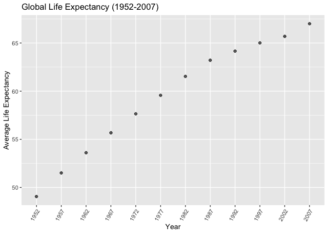
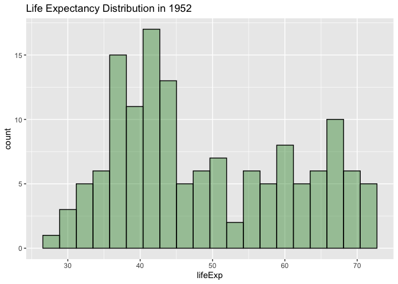
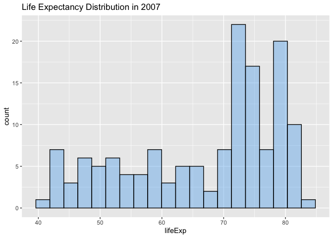
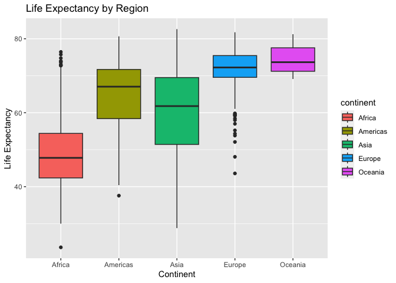
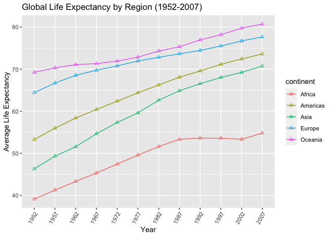
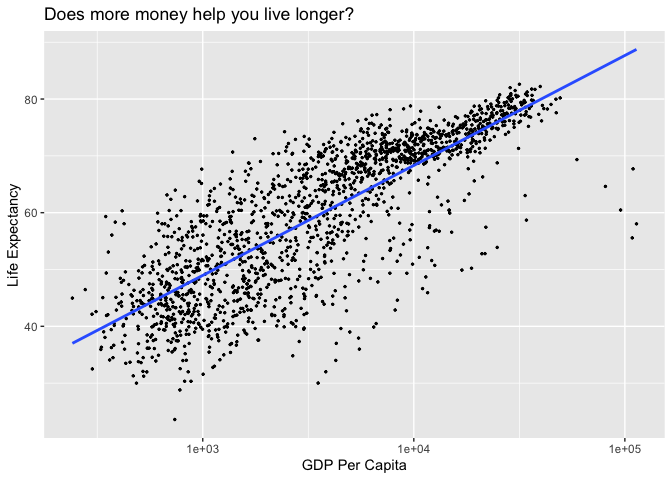
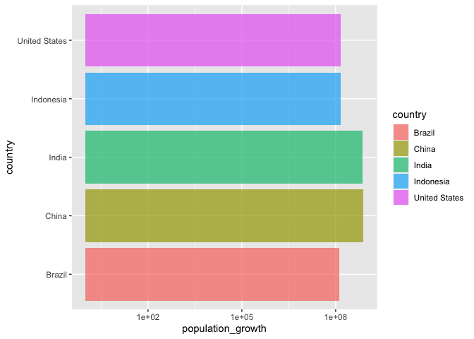
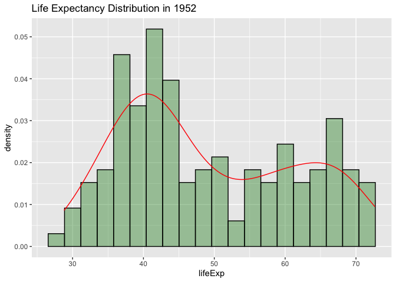

## Instructions
Answer the following questions and complete the exercises in RMarkdown. Please embed all of your code and push your final work to your repository. Your final lab report should be organized, clean, and run free from errors. Remember, you must remove the `#` for the included code chunks to run. Be sure to add your name to the author header above. For any included plots, make sure they are clearly labeled. You are free to use any plot type that you feel best communicates the results of your analysis.  

**In this homework, you should make use of the aesthetics you have learned. It's OK to be flashy!**

Make sure to use the formatting conventions of RMarkdown to make your report neat and clean!  

## Load the libraries

```r
library(tidyverse)
library(janitor)
library(here)
library(naniar)
```

## Resources
The idea for this assignment came from [Rebecca Barter's](http://www.rebeccabarter.com/blog/2017-11-17-ggplot2_tutorial/) ggplot tutorial so if you get stuck this is a good place to have a look.  

## Gapminder
For this assignment, we are going to use the dataset [gapminder](https://cran.r-project.org/web/packages/gapminder/index.html). Gapminder includes information about economics, population, and life expectancy from countries all over the world. You will need to install it before use. This is the same data that we will use for midterm 2 so this is good practice.

```r
#install.packages("gapminder")
library("gapminder")
```

## Questions
The questions below are open-ended and have many possible solutions. Your approach should, where appropriate, include numerical summaries and visuals. Be creative; assume you are building an analysis that you would ultimately present to an audience of stakeholders. Feel free to try out different `geoms` if they more clearly present your results.  

**1. Use the function(s) of your choice to get an idea of the overall structure of the data frame, including its dimensions, column names, variable classes, etc. As part of this, determine how NA's are treated in the data.** 

```r
gapminder
```

```
## # A tibble: 1,704 × 6
##    country     continent  year lifeExp      pop gdpPercap
##    <fct>       <fct>     <int>   <dbl>    <int>     <dbl>
##  1 Afghanistan Asia       1952    28.8  8425333      779.
##  2 Afghanistan Asia       1957    30.3  9240934      821.
##  3 Afghanistan Asia       1962    32.0 10267083      853.
##  4 Afghanistan Asia       1967    34.0 11537966      836.
##  5 Afghanistan Asia       1972    36.1 13079460      740.
##  6 Afghanistan Asia       1977    38.4 14880372      786.
##  7 Afghanistan Asia       1982    39.9 12881816      978.
##  8 Afghanistan Asia       1987    40.8 13867957      852.
##  9 Afghanistan Asia       1992    41.7 16317921      649.
## 10 Afghanistan Asia       1997    41.8 22227415      635.
## # … with 1,694 more rows
```


```r
miss_var_summary(gapminder)
```

```
## # A tibble: 6 × 3
##   variable  n_miss pct_miss
##   <chr>      <int>    <dbl>
## 1 country        0        0
## 2 continent      0        0
## 3 year           0        0
## 4 lifeExp        0        0
## 5 pop            0        0
## 6 gdpPercap      0        0
```


```r
glimpse(gapminder)
```

```
## Rows: 1,704
## Columns: 6
## $ country   <fct> "Afghanistan", "Afghanistan", "Afghanistan", "Afghanistan", …
## $ continent <fct> Asia, Asia, Asia, Asia, Asia, Asia, Asia, Asia, Asia, Asia, …
## $ year      <int> 1952, 1957, 1962, 1967, 1972, 1977, 1982, 1987, 1992, 1997, …
## $ lifeExp   <dbl> 28.801, 30.332, 31.997, 34.020, 36.088, 38.438, 39.854, 40.8…
## $ pop       <int> 8425333, 9240934, 10267083, 11537966, 13079460, 14880372, 12…
## $ gdpPercap <dbl> 779.4453, 820.8530, 853.1007, 836.1971, 739.9811, 786.1134, …
```


There are no NAs and none of the numbers seem to be an NA. 


**2. Among the interesting variables in gapminder is life expectancy. How has global life expectancy changed between 1952 and 2007?**


```r
gapminder %>% 
  group_by(year) %>% 
  summarize("mean_life_exp"=mean(lifeExp, .groups='keep')) %>% 
  arrange(year)
```

```
## # A tibble: 12 × 2
##     year mean_life_exp
##    <int>         <dbl>
##  1  1952          49.1
##  2  1957          51.5
##  3  1962          53.6
##  4  1967          55.7
##  5  1972          57.6
##  6  1977          59.6
##  7  1982          61.5
##  8  1987          63.2
##  9  1992          64.2
## 10  1997          65.0
## 11  2002          65.7
## 12  2007          67.0
```


```r
gapminder2<-gapminder %>% 
    mutate("year"=as_factor(year))
```


```r
gapminder2 %>% 
  group_by(year) %>% 
  summarize("mean_life_exp"=mean(lifeExp, .groups='keep')) %>%
  arrange(year) %>% 
  ggplot(aes(x=year,y=mean_life_exp))+
  geom_line()+
  geom_point(shape = 10)+
  theme(axis.text.x = element_text(angle=60,hjust=1))+
  labs(title="Global Life Expectancy (1952-2007)",
       x="Year",
       y="Average Life Expectancy")
```

```
## `geom_line()`: Each group consists of only one observation.
## ℹ Do you need to adjust the group aesthetic?
```

<!-- -->

**3. How do the distributions of life expectancy compare for the years 1952 and 2007?**


```r
summary(gapminder$lifeExp)
```

```
##    Min. 1st Qu.  Median    Mean 3rd Qu.    Max. 
##   23.60   48.20   60.71   59.47   70.85   82.60
```


```r
gapminder %>% 
  filter(year=="1952") %>% 
  ggplot(aes(x = lifeExp)) +
  geom_histogram(alpha = 0.4,color = "black", fill ="forestgreen", bins=20)+
  labs(title = "Life Expectancy Distribution in 1952")
```

<!-- -->


```r
gapminder %>% 
  filter(year=="2007") %>% 
  ggplot(aes(x = lifeExp, )) +
  geom_histogram(alpha = 0.4,color = "black", fill ="steelblue2", bins=20)+
  labs(title = "Life Expectancy Distribution in 2007")
```

<!-- -->


**4. Your answer above doesn't tell the whole story since life expectancy varies by region. Make a summary that shows the min, mean, and max life expectancy by continent for all years represented in the data.**


```r
gapminder %>% 
  group_by(continent) %>% 
  summarize("min_life_exp"=min(lifeExp),
            "max_life_exp"=max(lifeExp),
            "mean_life_exp"=mean(lifeExp))
```

```
## # A tibble: 5 × 4
##   continent min_life_exp max_life_exp mean_life_exp
##   <fct>            <dbl>        <dbl>         <dbl>
## 1 Africa            23.6         76.4          48.9
## 2 Americas          37.6         80.7          64.7
## 3 Asia              28.8         82.6          60.1
## 4 Europe            43.6         81.8          71.9
## 5 Oceania           69.1         81.2          74.3
```


```r
c<-gapminder %>% 
  ggplot(aes(x=continent,fill=continent,y=lifeExp))+
  geom_boxplot()+
  labs(title="Life Expectancy by Region",
       x="Continent",
       y="Life Expectancy")
c
```

<!-- -->


**5. How has life expectancy changed between 1952-2007 for each continent?**


```r
gapminder2 %>% 
  group_by(year,continent) %>% 
  summarize("mean_life_exp"=mean(lifeExp, .groups='keep')) %>%
  arrange(year)
```

```
## `summarise()` has grouped output by 'year'. You can override using the
## `.groups` argument.
```

```
## # A tibble: 60 × 3
## # Groups:   year [12]
##    year  continent mean_life_exp
##    <fct> <fct>             <dbl>
##  1 1952  Africa             39.1
##  2 1952  Americas           53.3
##  3 1952  Asia               46.3
##  4 1952  Europe             64.4
##  5 1952  Oceania            69.3
##  6 1957  Africa             41.3
##  7 1957  Americas           56.0
##  8 1957  Asia               49.3
##  9 1957  Europe             66.7
## 10 1957  Oceania            70.3
## # … with 50 more rows
```


```r
gapminder2 %>% 
  group_by(year,continent) %>% 
  summarize("mean_life_exp"=mean(lifeExp, .groups='keep')) %>%
  arrange(year) %>% 
  ggplot(aes(x=year,y=mean_life_exp,group=continent,color=continent))+
  geom_line()+
  geom_point(shape = 2)+
  theme(axis.text.x = element_text(angle=60,hjust=1))+
  labs(title="Global Life Expectancy by Region (1952-2007)",
       x="Year",
       y="Average Life Expectancy")
```

```
## `summarise()` has grouped output by 'year'. You can override using the
## `.groups` argument.
```

<!-- -->

**6. We are interested in the relationship between per capita GDP and life expectancy; i.e. does having more money help you live longer?**
geom_point


```r
gapminder %>% 
  ggplot(aes(x=gdpPercap,y=lifeExp))+
  geom_jitter(size=0.5)+
  geom_smooth(method=lm,se=F)+
  scale_x_log10()+
  labs(title="Does more money help you live longer?",
       x="GDP Per Capita",
       y="Life Expectancy")
```

```
## `geom_smooth()` using formula = 'y ~ x'
```

<!-- -->


**7. Which countries have had the largest population growth since 1952?**
2007 population - 1952 population
group_by(countries)
arrange(-)
summarize("max_population"=max(pop),
            )


```r
gapminder %>% 
  group_by(country) %>% 
  summarize("population_growth"=max(pop)-min(pop)) %>% 
  arrange(-population_growth) %>% 
  head(n=10)
```

```
## # A tibble: 10 × 2
##    country       population_growth
##    <fct>                     <int>
##  1 China                 762419569
##  2 India                 738396331
##  3 United States         143586947
##  4 Indonesia             141495000
##  5 Brazil                133408087
##  6 Pakistan              127924057
##  7 Bangladesh            103561480
##  8 Nigeria               101912068
##  9 Mexico                 78556574
## 10 Philippines            68638596
```


**8. Use your results from the question above to plot population growth for the top five countries since 1952.**

```r
gapminder %>% 
  group_by(country) %>% 
  summarize("population_growth"=max(pop)-min(pop)) %>% 
  arrange(-population_growth) %>% 
  head(n=5) %>% 
  ggplot(aes(x=country,fill=country,y=population_growth))+
  geom_col(alpha=0.7)+
  scale_y_log10()+
  coord_flip()
```

<!-- -->
**9. How does per-capita GDP growth compare between these same five countries?**


```r
gapminder2 %>% 
  filter(country=="Brazil"|country=="China"|country=="India"|country=="Indonesia|"|country=="United States") %>% 
  group_by(year,country) %>% 
  summarize("mean_gdp_per_capita"=mean(gdpPercap, .groups='keep'))
```

```
## `summarise()` has grouped output by 'year'. You can override using the
## `.groups` argument.
```

```
## # A tibble: 48 × 3
## # Groups:   year [12]
##    year  country       mean_gdp_per_capita
##    <fct> <fct>                       <dbl>
##  1 1952  Brazil                      2109.
##  2 1952  China                        400.
##  3 1952  India                        547.
##  4 1952  United States              13990.
##  5 1957  Brazil                      2487.
##  6 1957  China                        576.
##  7 1957  India                        590.
##  8 1957  United States              14847.
##  9 1962  Brazil                      3337.
## 10 1962  China                        488.
## # … with 38 more rows
```


```r
gapminder3<- gapminder2 %>% 
   filter(country=="Brazil"|country=="China"|country=="India"|country=="Indonesia"|country=="United States") %>% 
   group_by(country) %>% 
   summarize("mean_gdp_per_capita"=mean(gdpPercap,keep='group'))
gapminder3
```

```
## # A tibble: 5 × 2
##   country       mean_gdp_per_capita
##   <fct>                       <dbl>
## 1 Brazil                      5829.
## 2 China                       1488.
## 3 India                       1057.
## 4 Indonesia                   1741.
## 5 United States              26261.
```


```r
 gapminder3 %>% 
  ggplot(aes(x=country,y=mean_gdp_per_capita,fill=country))+
  geom_col(position = "dodge")+
  scale_y_log10()+
  theme(axis.text.x = element_text(angle=60,hjust=1))+
  labs(title="Per-Capita GDP in Countries with Largest Population",
       x="Year",
       y="Average GDP per Capita")
```

<!-- -->


**10. Make one plot of your choice that uses faceting!**

```r
gapminder %>% 
  filter(year=="1952") %>% 
  ggplot(aes(x = lifeExp)) +
  geom_histogram(aes(y = ..density..),alpha = 0.4,color = "black", fill ="forestgreen", bins=20)+
  geom_density(color="red")+
  labs(title = "Life Expectancy Distribution in 1952")
```

```
## Warning: The dot-dot notation (`..density..`) was deprecated in ggplot2 3.4.0.
## ℹ Please use `after_stat(density)` instead.
```

<!-- -->


## Push your final code to GitHub!
Please be sure that you check the `keep md` file in the knit preferences. 
