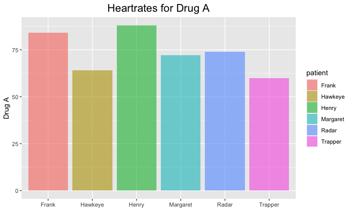
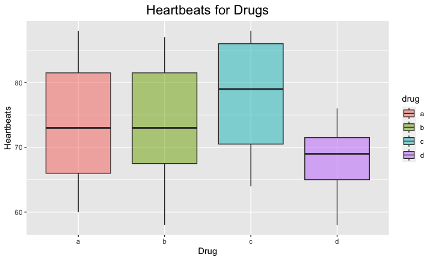

## Seating & Set-up
1. Please make sure that you sit next to your group members for the rest of the quarter.
2. Please set-up your computer as normal.

## Warm-up
For this warm-up, please use the `heartrate` data. Be sure to label your plots!

```
## ── Attaching packages ─────────────────────────────────────── tidyverse 1.3.2 ──
## ✔ ggplot2 3.4.0      ✔ purrr   1.0.0 
## ✔ tibble  3.1.8      ✔ dplyr   1.0.10
## ✔ tidyr   1.2.1      ✔ stringr 1.5.0 
## ✔ readr   2.1.3      ✔ forcats 0.5.2 
## ── Conflicts ────────────────────────────────────────── tidyverse_conflicts() ──
## ✖ dplyr::filter() masks stats::filter()
## ✖ dplyr::lag()    masks stats::lag()
## 
## Attaching package: 'janitor'
## 
## 
## The following objects are masked from 'package:stats':
## 
##     chisq.test, fisher.test
## 
## 
## here() starts at /Users/smalchan/Desktop/BIS15W2023_tchan
```

```
## Rows: 6 Columns: 5
## ── Column specification ────────────────────────────────────────────────────────
## Delimiter: ","
## chr (1): patient
## dbl (4): a, b, c, d
## 
## ℹ Use `spec()` to retrieve the full column specification for this data.
## ℹ Specify the column types or set `show_col_types = FALSE` to quiet this message.
```

```
## # A tibble: 6 × 5
##   patient      a     b     c     d
##   <chr>    <dbl> <dbl> <dbl> <dbl>
## 1 Margaret    72    74    80    68
## 2 Frank       84    84    88    76
## 3 Hawkeye     64    66    68    64
## 4 Trapper     60    58    64    58
## 5 Radar       74    72    78    70
## 6 Henry       88    87    88    72
```

```
## Rows: 6
## Columns: 5
## $ patient <chr> "Margaret", "Frank", "Hawkeye", "Trapper", "Radar", "Henry"
## $ a       <dbl> 72, 84, 64, 60, 74, 88
## $ b       <dbl> 74, 84, 66, 58, 72, 87
## $ c       <dbl> 80, 88, 68, 64, 78, 88
## $ d       <dbl> 68, 76, 64, 58, 70, 72
```

1. Make a plot that compares the heartrate of patients for drug a.
<!-- -->

2. Make a plot that compares heartrate (as a range) for each drug.


```
## # A tibble: 24 × 3
##    patient  drug  heartbeats
##    <chr>    <chr>      <dbl>
##  1 Margaret a             72
##  2 Margaret b             74
##  3 Margaret c             80
##  4 Margaret d             68
##  5 Frank    a             84
##  6 Frank    b             84
##  7 Frank    c             88
##  8 Frank    d             76
##  9 Hawkeye  a             64
## 10 Hawkeye  b             66
## # … with 14 more rows
```

<!-- -->

