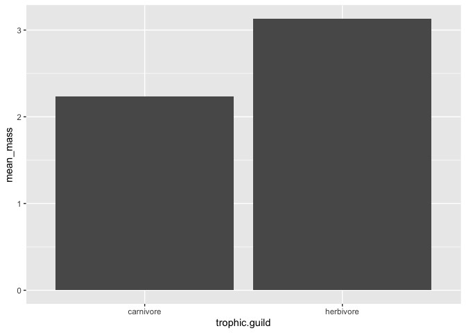

## Learning Goals
*At the end of this exercise, you will be able to:*    
1. Produce boxplots using `ggplot.`  
2. Customize labels on axes using `labs` and `themes`.  
3. Use `color`, `fill`, and `group` to customize plots and improve overall aesthetics.  

##Resources  
- [ggplot2 cheatsheet](https://www.rstudio.com/wp-content/uploads/2015/03/ggplot2-cheatsheet.pdf)  
- [`ggplot` themes](https://ggplot2.tidyverse.org/reference/ggtheme.html)  
- [Rebecca Barter `ggplot` Tutorial](http://www.rebeccabarter.com/blog/2017-11-17-ggplot2_tutorial/)  

## Load the libraries

```r
library(tidyverse)
library(skimr)
library(janitor)
library(here)
library(palmerpenguins)
```

## Review
Now that you have been introduced to `ggplot`, let's practice a few more plot types. Remember that plots are built in layers: **plot= data + geom_ + aesthetics**. We have to specify each of these in order for a plot to be produced. If you get stuck, it is often helpful to stop and make a quick sketch of what you want or expect to see on a piece of scratch paper.  

Let's review using the `penguins` data. First, get an idea of the structure: Are the data tidy? Are there NA's? Are the variables discrete, categorical, or continuous?

```r
penguins
```

```
## # A tibble: 344 × 8
##    species island    bill_length_mm bill_depth_mm flipper_…¹ body_…² sex    year
##    <fct>   <fct>              <dbl>         <dbl>      <int>   <int> <fct> <int>
##  1 Adelie  Torgersen           39.1          18.7        181    3750 male   2007
##  2 Adelie  Torgersen           39.5          17.4        186    3800 fema…  2007
##  3 Adelie  Torgersen           40.3          18          195    3250 fema…  2007
##  4 Adelie  Torgersen           NA            NA           NA      NA <NA>   2007
##  5 Adelie  Torgersen           36.7          19.3        193    3450 fema…  2007
##  6 Adelie  Torgersen           39.3          20.6        190    3650 male   2007
##  7 Adelie  Torgersen           38.9          17.8        181    3625 fema…  2007
##  8 Adelie  Torgersen           39.2          19.6        195    4675 male   2007
##  9 Adelie  Torgersen           34.1          18.1        193    3475 <NA>   2007
## 10 Adelie  Torgersen           42            20.2        190    4250 <NA>   2007
## # … with 334 more rows, and abbreviated variable names ¹​flipper_length_mm,
## #   ²​body_mass_g
```

In a previous lab, we asked how many penguins were measured on each island.

```r
penguins %>% count(island)
```

```
## # A tibble: 3 × 2
##   island        n
##   <fct>     <int>
## 1 Biscoe      168
## 2 Dream       124
## 3 Torgersen    52
```

Make this output more visual by adding a plot...

```r
penguins %>% 
  ggplot(aes(x=island))+
  geom_bar()
```

<!-- -->

What if we wanted a plot that showed the number of measured penguins for each species?

```r
penguins %>% count(species)
```

```
## # A tibble: 3 × 2
##   species       n
##   <fct>     <int>
## 1 Adelie      152
## 2 Chinstrap    68
## 3 Gentoo      124
```


```r
penguins %>% 
  ggplot(aes(x=species))+ 
  geom_bar()
```

<!-- -->

How about average bill length by sex?

```r
sex_penguins<-penguins %>% 
  filter(sex!="NA") %>% 
  group_by(sex) %>% 
  summarise(ave_bill_length=mean(bill_length_mm))
sex_penguins
```

```
## # A tibble: 2 × 2
##   sex    ave_bill_length
##   <fct>            <dbl>
## 1 female            42.1
## 2 male              45.9
```


```r
sex_penguins %>% 
  ggplot(aes(x=sex,y=ave_bill_length))+geom_col()
```

<!-- -->

## Box Plots
For the next series of examples, we will use the `homerange` data.  **Database of vertebrate home range sizes.**   

Reference: Tamburello N, Cote IM, Dulvy NK (2015) Energy and the scaling of animal space use. The American Naturalist 186(2):196-211. http://dx.doi.org/10.1086/682070.  
Data: http://datadryad.org/resource/doi:10.5061/dryad.q5j65/1  


```r
homerange <- read_csv(here("lab9", "data", "Tamburelloetal_HomeRangeDatabase.csv"))
homerange
```

```
## # A tibble: 569 × 24
##    taxon  commo…¹ class order family genus species prima…² N     mean.…³ log10…⁴
##    <chr>  <chr>   <chr> <chr> <chr>  <chr> <chr>   <chr>   <chr>   <dbl>   <dbl>
##  1 lake … americ… acti… angu… angui… angu… rostra… teleme… 16       887    2.95 
##  2 river… blackt… acti… cypr… catos… moxo… poecil… mark-r… <NA>     562    2.75 
##  3 river… centra… acti… cypr… cypri… camp… anomal… mark-r… 20        34    1.53 
##  4 river… rosysi… acti… cypr… cypri… clin… fundul… mark-r… 26         4    0.602
##  5 river… longno… acti… cypr… cypri… rhin… catara… mark-r… 17         4    0.602
##  6 river… muskel… acti… esoc… esoci… esox  masqui… teleme… 5       3525    3.55 
##  7 marin… pollack acti… gadi… gadid… poll… pollac… teleme… 2        737.   2.87 
##  8 marin… saithe  acti… gadi… gadid… poll… virens  teleme… 2        449.   2.65 
##  9 marin… lined … acti… perc… acant… acan… lineat… direct… <NA>     109.   2.04 
## 10 marin… orange… acti… perc… acant… naso  litura… teleme… 8        772.   2.89 
## # … with 559 more rows, 13 more variables: alternative.mass.reference <chr>,
## #   mean.hra.m2 <dbl>, log10.hra <dbl>, hra.reference <chr>, realm <chr>,
## #   thermoregulation <chr>, locomotion <chr>, trophic.guild <chr>,
## #   dimension <dbl>, preymass <dbl>, log10.preymass <dbl>, PPMR <dbl>,
## #   prey.size.reference <chr>, and abbreviated variable names ¹​common.name,
## #   ²​primarymethod, ³​mean.mass.g, ⁴​log10.mass
```

Boxplots help us visualize a range of values. So, on the x-axis we typically have something categorical and the y-axis is the range. In the case below, we are plotting `log10.mass` by taxonomic class in the `homerange` data. `geom_boxplot()` is the geom type for a standard box plot. The center line in each box represents the median, not the mean.

Let's look at the variable `log10.mass` grouped by taxonomic class.

```r
homerange_boxplot<-homerange %>% 
  group_by(class) %>% 
  summarize(min_log10.mass=min(log10.mass),
            max_log10.mass=max(log10.mass),
            median_log10.mass=median(log10.mass))
homerange_boxplot
```

```
## # A tibble: 4 × 4
##   class          min_log10.mass max_log10.mass median_log10.mass
##   <chr>                   <dbl>          <dbl>             <dbl>
## 1 actinopterygii         -0.658           3.55              2.08
## 2 aves                    0.712           4.95              1.82
## 3 mammalia                0.620           6.60              3.33
## 4 reptilia                0.539           4.03              2.51
```

Make this output more visual by making a plot...

```r
homerange %>% 
  ggplot(aes(x=class,y=log10.mass))+geom_boxplot()
```

<!-- -->

## Practice
1. There are more herbivores than carnivores in the homerange data, but how do their masses compare? Make a summary and boxplot that compares their masses. Use `log10.mass`.


```r
homerange %>% 
  group_by(trophic.guild) %>% 
  summarize(mean_mass=mean(log10.mass))
```

```
## # A tibble: 2 × 2
##   trophic.guild mean_mass
##   <chr>             <dbl>
## 1 carnivore          2.24
## 2 herbivore          3.13
```


```r
homerange %>% 
  group_by(trophic.guild) %>% 
  summarize(mean_mass=mean(log10.mass)) %>% 
  ggplot(aes(x=trophic.guild,y=mean_mass))+geom_col()
```

<!-- -->


2. Have a closer look at carnivorous mammals. Summarize the range of log10.mass by family.

```r
homerange %>% 
  filter(trophic.guild=="carnivore") %>% 
  group_by(family) %>% 
  summarize(min_mass_range=round(min(log10.mass),3),
            max_mass_range=round(max(log10.mass),3)
            ) %>% 
  unite("mass_range",
        -family,
        sep="-",
        remove=T)
```

```
## # A tibble: 94 × 2
##    family         mass_range 
##    <chr>          <chr>      
##  1 accipitridae   2.149-3.477
##  2 acrocephalisae 1.041-1.041
##  3 aegithalidae   0.903-0.903
##  4 alaudidae      1.477-1.477
##  5 anguillidae    2.948-2.948
##  6 apterygidae    3.365-3.365
##  7 ardeidae       1.826-2.954
##  8 canidae        3.32-4.443 
##  9 caprimulgidae  1.681-1.681
## 10 carangidae     2.861-2.861
## # … with 84 more rows
```


3. Now use a boxplot to visualize the range of log10.mass by family of mammalian carnivore.


## That's it, let's take a break!   

-->[Home](https://jmledford3115.github.io/datascibiol/)
