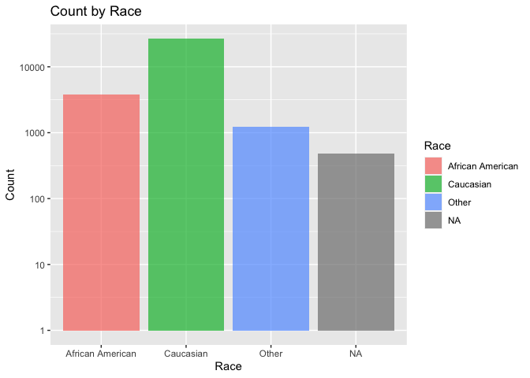
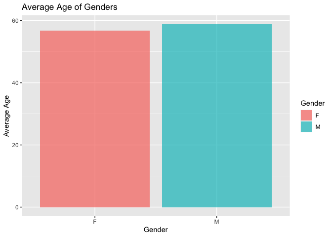
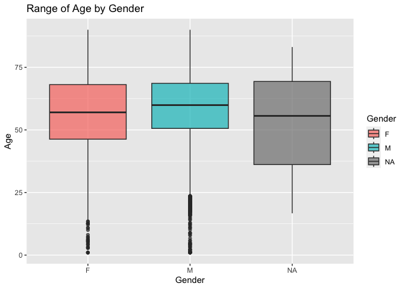
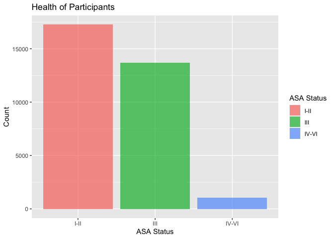
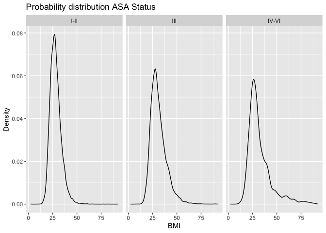
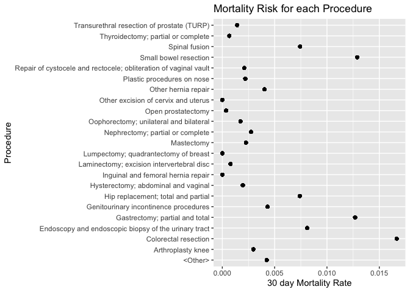
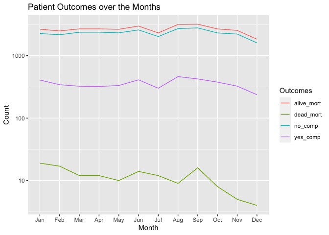

## Instructions
Answer the following questions and complete the exercises in RMarkdown. Please embed all of your code and push your final work to your repository. Your code should be organized, clean, and run free from errors. Remember, you must remove the `#` for any included code chunks to run. Be sure to add your name to the author header above.  

After the first 50 minutes, please upload your code (5 points). During the second 50 minutes, you may get help from each other- but no copy/paste. Upload the last version at the end of this time, but be sure to indicate it as final. If you finish early, you are free to leave.

Make sure to use the formatting conventions of RMarkdown to make your report neat and clean! Use the tidyverse and pipes unless otherwise indicated. To receive full credit, all plots must have clearly labeled axes, a title, and consistent aesthetics. This exam is worth a total of 35 points. 

Please load the following libraries.

```r
library("tidyverse")
library("janitor")
library("naniar")
```

## Data
These data are from a study on surgical residents. The study was originally published by Sessier et al. “Operation Timing and 30-Day Mortality After Elective General Surgery”. Anesth Analg 2011; 113: 1423-8. The data were cleaned for instructional use by Amy S. Nowacki, “Surgery Timing Dataset”, TSHS Resources Portal (2016). Available at https://www.causeweb.org/tshs/surgery-timing/.

Descriptions of the variables and the study are included as pdf's in the data folder.  

Please run the following chunk to import the data.

```r
surgery <- read_csv("data/surgery.csv")
```

1. (2 points) Use the summary function(s) of your choice to explore the data and get an idea of its structure. Please also check for NA's.

```r
glimpse(surgery)
```

```
## Rows: 32,001
## Columns: 25
## $ ahrq_ccs            <chr> "<Other>", "<Other>", "<Other>", "<Other>", "<Othe…
## $ age                 <dbl> 67.8, 39.5, 56.5, 71.0, 56.3, 57.7, 56.6, 64.2, 66…
## $ gender              <chr> "M", "F", "F", "M", "M", "F", "M", "F", "M", "F", …
## $ race                <chr> "Caucasian", "Caucasian", "Caucasian", "Caucasian"…
## $ asa_status          <chr> "I-II", "I-II", "I-II", "III", "I-II", "I-II", "IV…
## $ bmi                 <dbl> 28.04, 37.85, 19.56, 32.22, 24.32, 40.30, 64.57, 4…
## $ baseline_cancer     <chr> "No", "No", "No", "No", "Yes", "No", "No", "No", "…
## $ baseline_cvd        <chr> "Yes", "Yes", "No", "Yes", "No", "Yes", "Yes", "Ye…
## $ baseline_dementia   <chr> "No", "No", "No", "No", "No", "No", "No", "No", "N…
## $ baseline_diabetes   <chr> "No", "No", "No", "No", "No", "No", "Yes", "No", "…
## $ baseline_digestive  <chr> "Yes", "No", "No", "No", "No", "No", "No", "No", "…
## $ baseline_osteoart   <chr> "No", "No", "No", "No", "No", "No", "No", "No", "N…
## $ baseline_psych      <chr> "No", "No", "No", "No", "No", "Yes", "No", "No", "…
## $ baseline_pulmonary  <chr> "No", "No", "No", "No", "No", "No", "No", "No", "N…
## $ baseline_charlson   <dbl> 0, 0, 0, 0, 0, 0, 2, 0, 1, 2, 0, 1, 0, 0, 0, 0, 0,…
## $ mortality_rsi       <dbl> -0.63, -0.63, -0.49, -1.38, 0.00, -0.77, -0.36, -0…
## $ complication_rsi    <dbl> -0.26, -0.26, 0.00, -1.15, 0.00, -0.84, -1.34, 0.0…
## $ ccsmort30rate       <dbl> 0.0042508, 0.0042508, 0.0042508, 0.0042508, 0.0042…
## $ ccscomplicationrate <dbl> 0.07226355, 0.07226355, 0.07226355, 0.07226355, 0.…
## $ hour                <dbl> 9.03, 18.48, 7.88, 8.80, 12.20, 7.67, 9.53, 7.52, …
## $ dow                 <chr> "Mon", "Wed", "Fri", "Wed", "Thu", "Thu", "Tue", "…
## $ month               <chr> "Nov", "Sep", "Aug", "Jun", "Aug", "Dec", "Apr", "…
## $ moonphase           <chr> "Full Moon", "New Moon", "Full Moon", "Last Quarte…
## $ mort30              <chr> "No", "No", "No", "No", "No", "No", "No", "No", "N…
## $ complication        <chr> "No", "No", "No", "No", "No", "No", "No", "Yes", "…
```


```r
anyNA(surgery)
```

```
## [1] TRUE
```

2. (3 points) Let's explore the participants in the study. Show a count of participants by race AND make a plot that visually represents your output.

```r
surgery %>% 
  count(race)
```

```
## # A tibble: 4 × 2
##   race                 n
##   <chr>            <int>
## 1 African American  3790
## 2 Caucasian        26488
## 3 Other             1243
## 4 <NA>               480
```

```r
surgery %>% 
  ggplot(aes(x=race,fill=race))+
  geom_bar(alpha=0.7)+
  labs(title = "Count by Race",
       x = "Race",
       y = "Count",
       fill = "Race")+
  scale_y_log10()
```

<!-- -->

3. (2 points) What is the mean age of participants by gender? (hint: please provide a number for each) Since only three participants do not have gender indicated, remove these participants from the data.

```r
surgery %>% 
  filter(gender!="NA") %>% 
  group_by(gender) %>% 
  summarize("mean_age_gender"=mean(age, na.rm=T))
```

```
## # A tibble: 2 × 2
##   gender mean_age_gender
##   <chr>            <dbl>
## 1 F                 56.7
## 2 M                 58.8
```

```r
surgery %>% 
  filter(gender!="NA") %>% 
  group_by(gender) %>% 
  summarize("mean_age_gender"=mean(age, na.rm=T)) %>% 
  ggplot(aes(x=gender,y=mean_age_gender, fill=gender))+
  geom_col(alpha=0.7)+
    labs(title = "Average Age of Genders",
       x = "Gender",
       y = "Average Age",
       fill = "Gender")
```

<!-- -->

4. (3 points) Make a plot that shows the range of age associated with gender.

```r
surgery %>% 
  ggplot(aes(x=gender,y=age,fill=gender))+
  geom_boxplot(alpha=0.7)+
    labs(title = "Range of Age by Gender",
       x = "Gender",
       y = "Age",
       fill = "Gender")
```

```
## Warning: Removed 2 rows containing non-finite values (`stat_boxplot()`).
```

<!-- -->

5. (2 points) How healthy are the participants? The variable `asa_status` is an evaluation of patient physical status prior to surgery. Lower numbers indicate fewer comorbidities (presence of two or more diseases or medical conditions in a patient). Make a plot that compares the number of `asa_status` I-II, III, and IV-V.

```r
surgery %>% 
  filter(asa_status!="NA") %>% 
  ggplot(aes(x=asa_status,fill=asa_status))+
  geom_bar(alpha=0.7)+
      labs(title = "Health of Participants",
       x = "ASA Status",
       y = "Count",
       fill = "ASA Status")
```

<!-- -->

6. (3 points) Create a plot that displays the distribution of body mass index for each `asa_status` as a probability distribution- not a histogram. (hint: use faceting!)

```r
surgery %>% 
  filter(asa_status!="NA") %>% 
  ggplot(aes(x=bmi))+
  geom_density()+
  facet_wrap(~asa_status)+
  labs(title = "Probability distribution ASA Status",
       x = "BMI",
       y = "Density",
       fill = "ASA Status")
```

```
## Warning: Removed 3289 rows containing non-finite values (`stat_density()`).
```

<!-- -->

The variable `ccsmort30rate` is a measure of the overall 30-day mortality rate associated with each type of operation. The variable `ccscomplicationrate` is a measure of the 30-day in-hospital complication rate. The variable `ahrq_ccs` lists each type of operation.  

7. (4 points) What are the 5 procedures associated with highest risk of 30-day mortality AND how do they compare with the 5 procedures with highest risk of complication? (hint: no need for a plot here)

```r
surgery %>% 
  select(ahrq_ccs,ccsmort30rate,ccscomplicationrate) %>% 
  group_by(ahrq_ccs) %>% 
  summarize("mort_risk"=mean(ccsmort30rate)) %>% 
  arrange(-mort_risk) %>% 
  head(n=5)
```

```
## # A tibble: 5 × 2
##   ahrq_ccs                                             mort_risk
##   <chr>                                                    <dbl>
## 1 Colorectal resection                                   0.0167 
## 2 Small bowel resection                                  0.0129 
## 3 Gastrectomy; partial and total                         0.0127 
## 4 Endoscopy and endoscopic biopsy of the urinary tract   0.00811
## 5 Spinal fusion                                          0.00742
```

```r
surgery %>% 
  select(ahrq_ccs,ccsmort30rate,ccscomplicationrate) %>% 
  group_by(ahrq_ccs) %>% 
  summarize("comp_risk"=mean(ccscomplicationrate)) %>% 
  arrange(-comp_risk) %>% 
  head(n=5)
```

```
## # A tibble: 5 × 2
##   ahrq_ccs                         comp_risk
##   <chr>                                <dbl>
## 1 Small bowel resection                0.466
## 2 Colorectal resection                 0.312
## 3 Nephrectomy; partial or complete     0.197
## 4 Gastrectomy; partial and total       0.190
## 5 Spinal fusion                        0.183
```


The difference between the top 5 procedures of complication risk and mortality risk are the procedures: Endoscopy and endoscopic biopsy of the urinary tract and Nephrectomy; partial or complete


8. (3 points) Make a plot that compares the `ccsmort30rate` for all listed `ahrq_ccs` procedures.


```r
surgery %>% 
  ggplot(aes(x=ahrq_ccs,y=ccsmort30rate))+
  geom_point(alpha=0.7)+
  coord_flip()+
  labs(title = "Mortality Risk for each Procedure",
       x = "Procedure",
       y = "30 day Mortality Rate")
```

<!-- -->

9. (4 points) When is the best month to have surgery? Make a chart that shows the 30-day mortality and complications for the patients by month. `mort30` is the variable that shows whether or not a patient survived 30 days post-operation.

```r
n_mortality<-surgery %>% 
  group_by(month) %>% 
  summarize("dead_mort"=sum(str_count(mort30, "Yes")),
            "alive_mort"= sum(str_count(mort30, "No")),
            "yes_comp"=sum(str_count(complication, "Yes")),
            "no_comp"=sum(str_count(complication, "No")))
n_mortality
```

```
## # A tibble: 12 × 5
##    month dead_mort alive_mort yes_comp no_comp
##    <chr>     <int>      <int>    <int>   <int>
##  1 Apr          12       2686      321    2377
##  2 Aug           9       3168      462    2715
##  3 Dec           4       1835      237    1602
##  4 Feb          17       2489      343    2163
##  5 Jan          19       2651      407    2263
##  6 Jul          12       2313      301    2024
##  7 Jun          14       2980      410    2584
##  8 Mar          12       2685      324    2373
##  9 May          10       2644      333    2321
## 10 Nov           5       2539      325    2219
## 11 Oct           8       2681      377    2312
## 12 Sep          16       3192      424    2784
```


10. (4 points) Make a plot that visualizes the chart from question #9. Make sure that the months are on the x-axis. Do a search online and figure out how to order the months Jan-Dec.


```r
n_mortality2<- n_mortality %>% 
  pivot_longer(-month,
               names_to="outcomes",
               values_to = "n")
n_mortality2
```

```
## # A tibble: 48 × 3
##    month outcomes       n
##    <chr> <chr>      <int>
##  1 Apr   dead_mort     12
##  2 Apr   alive_mort  2686
##  3 Apr   yes_comp     321
##  4 Apr   no_comp     2377
##  5 Aug   dead_mort      9
##  6 Aug   alive_mort  3168
##  7 Aug   yes_comp     462
##  8 Aug   no_comp     2715
##  9 Dec   dead_mort      4
## 10 Dec   alive_mort  1835
## # … with 38 more rows
```


```r
n_mortality2 %>% 
  ggplot(aes(x=month,y=n, group=outcomes, color=outcomes))+
  geom_line()+
  scale_x_discrete(limits=month.abb)+
  scale_y_log10()+
  labs(title="Patient Outcomes over the Months",
       x="Month",
       y="Count",
       color="Outcomes")
```

<!-- -->

Please provide the names of the students you have worked with with during the exam:
 Chloe
 
Please be 100% sure your exam is saved, knitted, and pushed to your github repository. No need to submit a link on canvas, we will find your exam in your repository.
